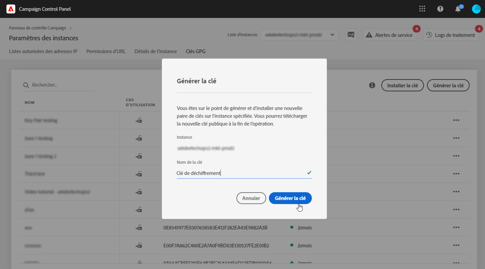
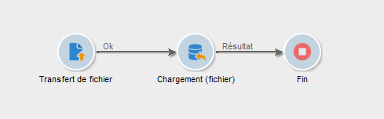
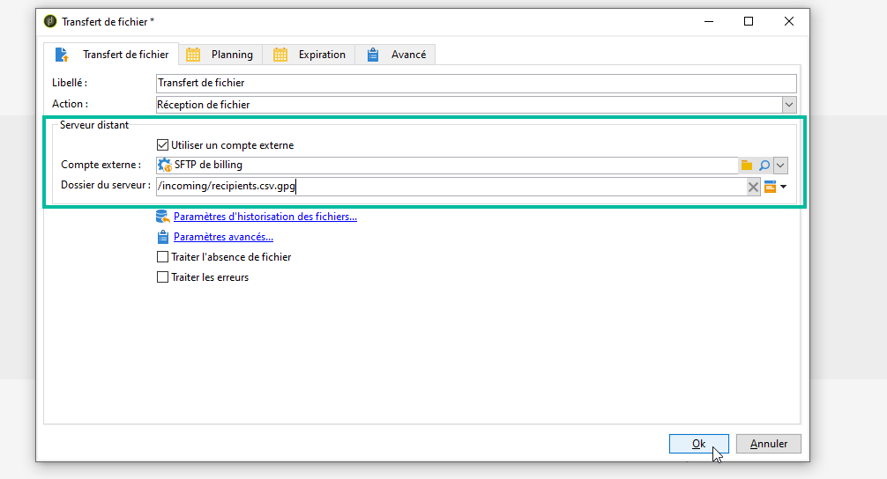
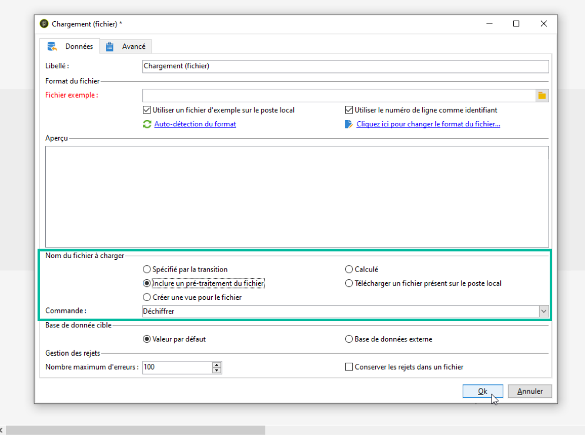
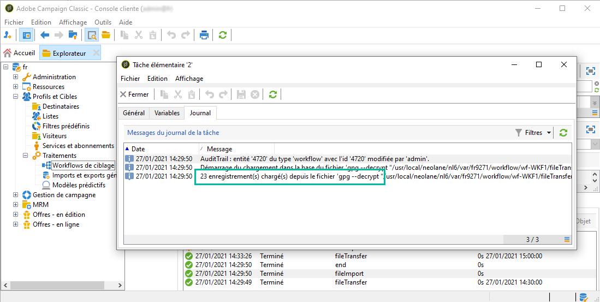

# Décompresser ou déchiffrer un fichier {#unzipping-or-decrypting-a-file-before-processing}

Adobe Campaign permet d&#39;importer des fichiers compressés ou chiffrés. Avant qu&#39;un fichier ne puisse être lu dans une activité [Chargement (fichier)](../../workflow/using/data-loading--file-.md), vous pouvez définir une étape de prétraitement pour le décompresser ou le déchiffrer.

Pour ce faire :

1. Utilisez le [panneau de Contrôle](https://experienceleague.adobe.com/docs/control-panel/using/instances-settings/gpg-keys-management.html?lang=fr#decrypting-data) pour générer une paire de clés publique/privée.

   >[!NOTE]
   >
   >Le Panneau de contrôle est accessible à tous les utilisateurs administrateurs. Les étapes permettant d&#39;octroyer un accès administrateur à un utilisateur sont présentées sur [cette page](https://experienceleague.adobe.com/docs/control-panel/using/discover-control-panel/managing-permissions.html?lang=fr#discover-control-panel).
   >
   >Notez que votre instance doit être hébergée sur AWS et mise à niveau avec la [dernière build GA](../../rn/using/rn-overview.md). Découvrez comment vérifier votre version dans [cette section](../../platform/using/launching-adobe-campaign.md#getting-your-campaign-version). Pour vérifier si votre instance est hébergée sur AWS, suivez les étapes présentées sur [cette page](https://experienceleague.adobe.com/docs/control-panel/using/faq.html?lang=fr).

1. Si votre installation d&#39;Adobe Campaign est hébergée par Adobe, contactez l&#39;[Assistance clientèle d&#39;Adobe](https://helpx.adobe.com/fr/enterprise/admin-guide.html/enterprise/using/support-for-experience-cloud.ug.html) afin que les utilitaires nécessaires soient installés sur le serveur.
1. S&#39;il s&#39;agit d&#39;une installation on-premise, installez l&#39;utilitaire que vous souhaitez utiliser (GPG ou GZIP, par exemple) ainsi que les clés (clé de chiffrement) nécessaires sur le serveur applicatif.

Vous pouvez ensuite utiliser les commandes de pré-traitement de votre choix dans les workflows :

1. Ajoutez et configurez une activité **[!UICONTROL Transfert de fichier]** dans le workflow.
1. Ajoutez une activité **[!UICONTROL Chargement (fichier)]** et définissez le format de fichier.
1. Cochez l&#39;option **[!UICONTROL Inclure un pré-traitement du fichier]**.
1. Spécifiez la commande de pré-traitement à appliquer.
1. Ajoutez d&#39;autres activités pour gérer les données provenant du fichier.
1. Enregistrez et exécutez le workflow.

Le cas pratique ci-dessous présente un exemple.

**Rubriques connexes :**

* [Activité Chargement (fichier)](../../workflow/using/data-loading--file-.md).
* [Compresser ou chiffrer un fichier](../../workflow/using/how-to-use-workflow-data.md#zipping-or-encrypting-a-file).

## Cas pratique : import de données chiffrées à l&#39;aide d&#39;une clé générée par le Panneau de contrôle {#use-case-gpg-decrypt}

Dans ce cas pratique, nous allons créer un workflow afin d&#39;importer des données chiffrées dans un système externe, à l&#39;aide d&#39;une clé générée dans le Panneau de contrôle.

 [Découvrez cette fonctionnalité en vidéo](#video)

Les étapes pour traiter ce cas pratique sont les suivantes :

1. Utilisez le Panneau de contrôle pour générer une paire de clés (publique/privée). Les étapes détaillées sont disponibles dans la [documentation du Panneau de contrôle](https://experienceleague.adobe.com/docs/control-panel/using/instances-settings/gpg-keys-management.html?lang=fr#decrypting-data).

   * La clé publique sera partagée avec le système externe. Ce dernier l&#39;utilisera pour chiffrer les données à envoyer à Campaign.
   * Campaign Classic utilisera la clé privée pour déchiffrer les données chiffrées entrantes.

   

1. Dans le système externe, utilisez la clé publique téléchargée à l’aide du Panneau de contrôle pour chiffrer les données à importer dans Campaign Classic.

1. Dans Campaign Classic, créez un workflow pour importer les données chiffrées et les déchiffrer à l’aide de la clé privée installée via le Panneau de contrôle. Pour ce faire, nous allons créer un workflow comme suit :

   

   * Activité **[!UICONTROL Transfert de fichier]** : transfère le fichier d&#39;une source externe vers Campaign Classic. Dans cet exemple, nous voulons transférer le fichier depuis un serveur SFTP.
   * Activité **[!UICONTROL Chargement (fichier)]** : charge les données du fichier dans la base de données et le déchiffre à l’aide de la clé privée générée dans le Panneau de contrôle.

1. Ouvrez l’activité **[!UICONTROL Transfert de fichier]**, puis spécifiez le compte externe à partir duquel vous souhaitez importer le fichier .gpg chiffré.

   

   Les concepts généraux de configuration de l&#39;activité sont présentés dans [cette section](../../workflow/using/file-transfer.md).

1. Ouvrez l&#39;activité **[!UICONTROL Chargement (fichier)]**, puis configurez-la selon vos besoins. Les concepts généraux de paramétrage de l&#39;activité sont présentés dans [cette section](../../workflow/using/data-loading--file-.md).

   Ajoutez une étape de prétraitement à l’activité pour déchiffrer les données entrantes. Pour ce faire, sélectionnez l&#39;option **[!UICONTROL Inclure un pré-traitement du fichier]**, puis copiez-collez cette commande de déchiffrage dans le champ **[!UICONTROL Commande]** :

   `gpg --batch --passphrase passphrase --decrypt <%=vars.filename%>`

   

   >[!CAUTION]
   >
   >Dans cet exemple, nous employons la phrase secrète utilisée par défaut par le Panneau de contrôle, qui est « passphrase ».
   >
   >Si des clés GPG ont déjà été installées sur votre instance par le biais d&#39;une demande du service d&#39;Assistance clientèle, la phrase secrète peut avoir été modifiée et être différente de celle par défaut.

1. Cliquez sur **[!UICONTROL OK]** pour valider la configuration de l&#39;activité.

1. Vous pouvez maintenant exécuter le workflow. Une fois exécuté, vous pouvez vérifier dans les logs de workflow que le déchiffrement a été effectué et que les données du fichier ont été importées.

   

## Tutoriel vidéo {#video}

Cette vidéo montre comment utiliser une clé GPG pour déchiffrer des données.

>[!VIDEO](https://video.tv.adobe.com/v/36482?quality=12)

D&#39;autres vidéos pratiques sur Campaign Classic sont disponibles [ici](https://experienceleague.adobe.com/docs/campaign-classic-learn/tutorials/overview.html?lang=fr).
