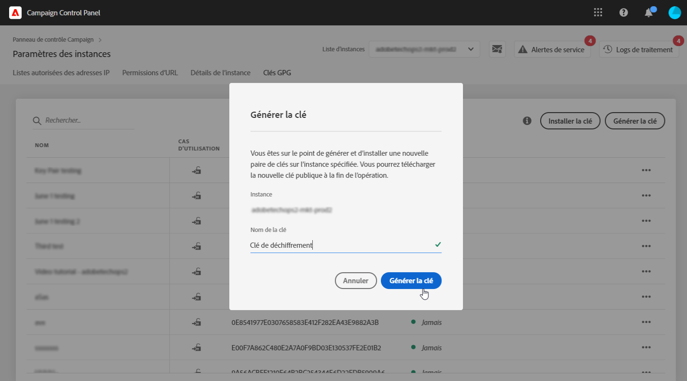
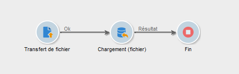
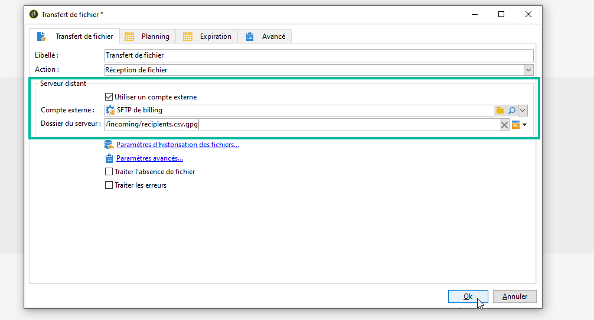
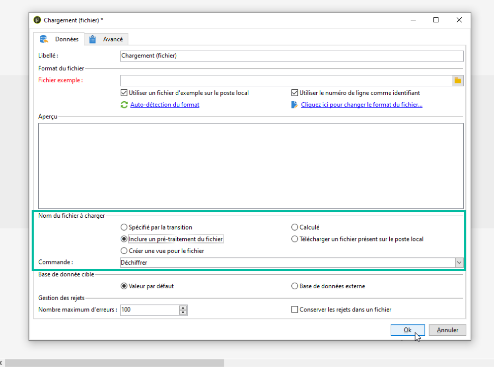
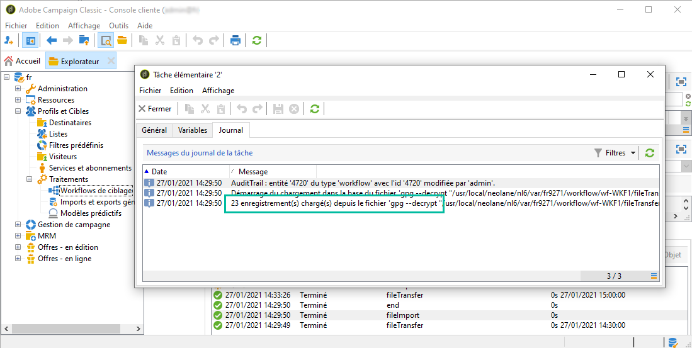

# Décompresser ou déchiffrer un fichier {#unzipping-or-decrypting-a-file-before-processing}

Adobe Campaign permet d’importer des fichiers compressés ou chiffrés. Avant qu’un fichier puisse être lu dans une activité [Chargement de données (fichier)](https://experienceleague.adobe.com/docs/campaign/automation/workflows/wf-activities/action-activities/data-loading-file.html?lang=fr){target="_blank"}, vous pouvez définir une étape de prétraitement pour le décompresser ou le déchiffrer.

>[!IMPORTANT]
>
>Vous ne pouvez pas décompresser les fichiers compressés d’une taille supérieure à 4 Go.

Pour ce faire :

1. Utilisez le [Panneau de contrôle](https://experienceleague.adobe.com/docs/control-panel/using/instances-settings/gpg-keys-management.html?lang=fr#decrypting-data) pour générer une paire de clés publique/privée afin d’autoriser le déchiffrement des fichiers.

   >[!NOTE]
   >
   >Le Panneau de contrôle est accessible à tous les utilisateurs administrateurs. Les étapes permettant d&#39;octroyer un accès administrateur à un utilisateur sont présentées sur [cette page](https://experienceleague.adobe.com/docs/control-panel/using/discover-control-panel/managing-permissions.html?lang=fr#discover-control-panel).
   >
   >Notez que votre instance doit être hébergée sur AWS et mise à niveau avec la [dernière build GA](../../rn/using/rn-overview.md). Découvrez comment vérifier votre version dans [cette section](../../platform/using/launching-adobe-campaign.md#getting-your-campaign-version). Pour vérifier si votre instance est hébergée sur AWS, suivez les étapes présentées sur [cette page](https://experienceleague.adobe.com/docs/control-panel/using/faq.html?lang=fr).

1. S&#39;il s&#39;agit d&#39;une installation on-premise, installez l&#39;utilitaire que vous souhaitez utiliser (GPG ou GZIP, par exemple) ainsi que les clés (clé de chiffrement) nécessaires sur le serveur applicatif.

   Si votre installation d’Adobe Campaign est hébergée par Adobe, contactez l’[Assistance clientèle d’Adobe](https://helpx.adobe.com/fr/enterprise/admin-guide.html/enterprise/using/support-for-experience-cloud.ug.html) afin que les utilitaires nécessaires soient installés sur le serveur.

Vous pouvez ensuite utiliser les commandes de pré-traitement de votre choix dans les workflows :

1. Ajoutez et configurez une activité **[!UICONTROL Transfert de fichier]** dans le workflow.
1. Ajoutez une activité **[!UICONTROL Chargement (fichier)]** et définissez le format de fichier.
1. Cochez l&#39;option **[!UICONTROL Inclure un pré-traitement du fichier]**.
1. Sélectionnez la commande de prétraitement à appliquer.
1. Ajoutez d&#39;autres activités pour gérer les données provenant du fichier.
1. Enregistrez et exécutez le workflow.

Le cas pratique ci-dessous présente un exemple.

**Rubriques connexes :**

* [Activité Chargement (fichier)](https://experienceleague.adobe.com/docs/campaign/automation/workflows/wf-activities/action-activities/data-loading-file.html?lang=fr){target="_blank"}.
* [Compresser ou chiffrer un fichier](https://experienceleague.adobe.com/fr/docs/campaign/automation/workflows/wf-activities/action-activities/extraction-file.html?lang=fr){target="_blank"}.

## Cas d’utilisation : import de données chiffrées à l’aide d’une clé générée par le Panneau de contrôle {#use-case-gpg-decrypt}

Dans ce cas d’utilisation, nous allons créer un workflow afin d’importer des données chiffrées dans un système externe, à l’aide d’une clé générée dans le Panneau de contrôle.

 [Découvrez cette fonctionnalité en vidéo](#video)

Les étapes pour traiter ce cas pratique sont les suivantes :

1. Utilisez le Panneau de contrôle pour générer une paire de clés (publique/privée). Les étapes détaillées sont disponibles dans la [documentation du Panneau de contrôle](https://experienceleague.adobe.com/docs/control-panel/using/instances-settings/gpg-keys-management.html?lang=fr#decrypting-data).

   * La clé publique sera partagée avec le système externe. Ce dernier l&#39;utilisera pour chiffrer les données à envoyer à Campaign.
   * Campaign Classic utilisera la clé privée pour déchiffrer les données chiffrées entrantes.

   

1. Dans le système externe, utilisez la clé publique téléchargée à l’aide du Panneau de contrôle pour chiffrer les données à importer dans Campaign Classic.

1. Dans Campaign Classic, créez un workflow pour importer les données chiffrées et les déchiffrer à l’aide de la clé privée installée via le Panneau de contrôle. Pour ce faire, nous allons créer un workflow comme suit :

   

   * Activité **[!UICONTROL Transfert de fichier]** : transfère le fichier d&#39;une source externe vers Campaign Classic. Dans cet exemple, nous voulons transférer le fichier depuis un serveur SFTP.
   * Activité **[!UICONTROL Chargement (fichier)]** : charge les données du fichier dans la base de données et le déchiffre à l’aide de la clé privée générée dans le Panneau de contrôle.

1. Ouvrez l’activité **[!UICONTROL Transfert de fichier]**, puis spécifiez le compte externe à partir duquel vous souhaitez importer le fichier .gpg chiffré.

   

   Les concepts généraux de configuration de l’activité sont présentés dans la [documentation de Campaign v8](https://experienceleague.adobe.com/fr/docs/campaign/automation/workflows/wf-activities/event-activities/file-transfer.html?lang=fr){target="_blank"}.

1. Ouvrez l’activité **[!UICONTROL Chargement de données (fichier)]**, puis configurez-la selon vos besoins. Les concepts généraux de configuration de l’activité sont présentés dans la [documentation de Campaign v8](https://experienceleague.adobe.com/docs/campaign/automation/workflows/wf-activities/action-activities/data-loading-file.html?lang=fr){target="_blank"}.

   Ajoutez une étape de prétraitement à l’activité pour déchiffrer les données entrantes. Pour ce faire, sélectionnez l’option **[!UICONTROL Inclure un pré-traitement du fichier]**, puis sélectionnez **[!UICONTROL Déchiffrer]** de la liste déroulante **[!UICONTROL Commande]** :

   

   >[!NOTE]
   >
   >Si des modifications sont nécessaires au niveau des commandes disponibles, vous pouvez accéder à [l’assistance clientèle d’Adobe](https://helpx.adobe.com/fr/enterprise/admin-guide.html/enterprise/using/support-for-experience-cloud.ug.html) pour ajuster les paramètres preProcessCommand.
   >
   >Si vous utilisez un déploiement hybride, vous pouvez configurer ces commandes directement à partir du fichier de configuration du serveur (serverConf.xml). [Découvrir comment configurer les commandes de prétraitement dans le fichier de configuration du serveur](../../installation/using/the-server-configuration-file.md#preprocesscommand)

1. Cliquez sur **[!UICONTROL OK]** pour valider la configuration de l&#39;activité.

1. Vous pouvez maintenant exécuter le workflow. Une fois exécuté, vous pouvez vérifier dans les logs de workflow que le déchiffrement a été effectué et que les données du fichier ont été importées.

   

## Tutoriel vidéo {#video}

Cette vidéo montre comment utiliser une clé GPG pour déchiffrer des données.

>[!VIDEO](https://video.tv.adobe.com/v/41358?captions=fre_fr&quality=12)

D&#39;autres vidéos pratiques sur Campaign Classic sont disponibles [ici](https://experienceleague.adobe.com/docs/campaign-classic-learn/tutorials/overview.html?lang=fr).
