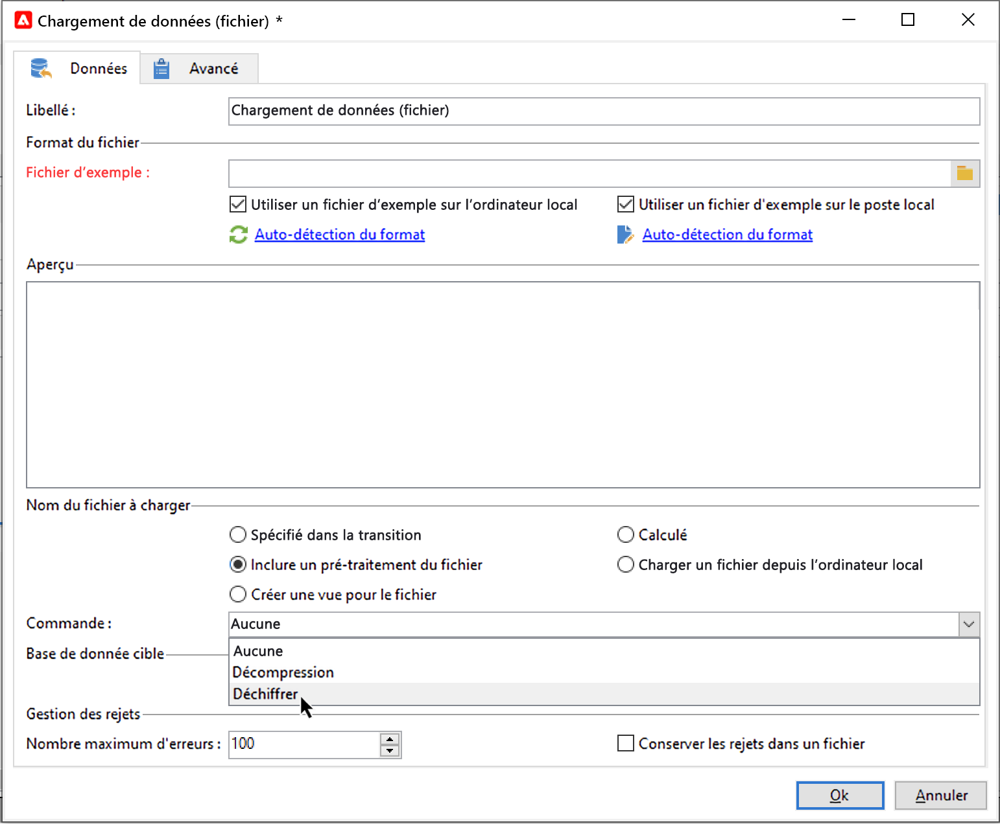

# Décompresser ou déchiffrer un fichier {#unzipping-or-decrypting-a-file-before-processing}

Adobe Campaign permet d&#39;importer des fichiers compressés ou chiffrés. Avant qu&#39;un fichier ne puisse être lu dans une activité [Chargement (fichier)](../../workflow/using/data-loading--file-.md), vous pouvez définir une étape de prétraitement pour le décompresser ou le déchiffrer.

Pour ce faire :

1. Utilisez le [panneau de Contrôle](https://docs.adobe.com/content/help/fr-FR/control-panel/using/instances-settings/gpg-keys-management.html#decrypting-data) pour générer une paire de clés publique/privée.

   >[!NOTE]
   >
   >Le panneau de contrôle est disponible pour tous les clients hébergés sur AWS (à l’exception de ceux qui hébergent leurs instances marketing on-premise).

1. Si votre installation d’Adobe Campaign est hébergée par Adobe, contactez le [service à la clientèle de l’Adobe](https://helpx.adobe.com/fr/enterprise/admin-guide.html/enterprise/using/support-for-experience-cloud.ug.html) pour que les utilitaires nécessaires soient installés sur le serveur.
1. S&#39;il s&#39;agit d&#39;une installation on-premise, installez l&#39;utilitaire que vous souhaitez utiliser (GPG ou GZIP, par exemple) ainsi que les clés (clé de cryptage) nécessaires sur le serveur applicatif.

Vous pouvez ensuite utiliser les commandes de pré-traitement de votre choix dans les workflows :

1. Ajoutez et configurez une activité **[!UICONTROL Transfert de fichier]** dans le workflow.
1. Ajoutez une activité **[!UICONTROL Chargement (fichier)]** et définissez le format de fichier.
1. Cochez l&#39;option **[!UICONTROL Inclure un pré-traitement du fichier]**.
1. Spécifiez la commande de pré-traitement à appliquer.
1. Ajoutez d&#39;autres activités pour gérer les données provenant du fichier.
1. Enregistrez et exécutez le workflow.

Le cas pratique ci-dessous présente un exemple.

**Rubriques connexes :**

* [Activité Chargement (fichier)](../../workflow/using/data-loading--file-.md).
* [Compresser ou crypter un fichier](../../workflow/using/how-to-use-workflow-data.md#zipping-or-encrypting-a-file).

## Cas pratique : import de données cryptées à l’aide d’une clé générée par le panneau de contrôle {#use-case-gpg-decrypt}

Dans ce cas pratique, nous allons créer un workflow afin d’importer des données cryptées dans un système externe, à l’aide d’une clé générée dans le panneau de contrôle.

 [Découvrez cette fonctionnalité en vidéo](#video)

Les étapes pour traiter ce cas pratique sont les suivantes :

1. Utilisez le panneau de contrôle pour générer une paire de clés (publique/privée). Les étapes détaillées sont disponibles dans la [documentation du panneau de contrôle](https://docs.adobe.com/content/help/en/control-panel/using/instances-settings/gpg-keys-management.html#decrypting-data).

   * La clé publique sera partagée avec le système externe. Ce dernier l’utilisera pour crypter les données à envoyer à Campaign.
   * Campaign Classic utilisera la clé privée pour décrypter les données cryptées entrantes.

   

1. Dans le système externe, utilisez la clé publique téléchargée à l’aide du panneau de contrôle pour crypter les données à importer dans Campaign Classic.

1. Dans Campaign Classic, créez un workflow pour importer les données cryptées et les décrypter à l’aide de la clé privée installée via le panneau de contrôle. Pour ce faire, nous allons créer un workflow comme suit :

   

   * Activité **[!UICONTROL Transfert de fichier]** : transfère le fichier d’une source externe vers Campaign Classic. Dans cet exemple, nous voulons transférer le fichier depuis un serveur SFTP.
   * Activité **[!UICONTROL Chargement (fichier)]** : charge les données du fichier dans la base de données et le décrypte à l’aide de la clé privée générée dans le panneau de contrôle.

1. Ouvrez l’activité **[!UICONTROL Transfert de fichier]**, puis spécifiez le compte externe à partir duquel vous souhaitez importer le fichier .gpg crypté.

   

   Les concepts généraux de configuration de l’activité sont présentés dans [cette section](../../workflow/using/file-transfer.md).

1. Ouvrez l’activité **[!UICONTROL Chargement (fichier)]**, puis configurez-la selon vos besoins. Les concepts généraux de configuration de l’activité sont présentés dans [cette section](../../workflow/using/data-loading--file-.md).

   Ajoutez une étape de prétraitement à l’activité pour décrypter les données entrantes. Pour ce faire, sélectionnez l’option **[!UICONTROL Inclure un pré-traitement du fichier]**, puis copiez-collez cette commande de décryptage dans le champ **[!UICONTROL Commande]** :

   `gpg --batch --passphrase passphrase --decrypt <%=vars.filename%>`

   

   >[!CAUTION]
   >
   >Dans cet exemple, nous employons la phrase secrète utilisée par défaut par le panneau de contrôle, qui est « passphrase ».
   >
   >Si des clés GPG ont déjà été installées sur votre instance par le biais d’une demande du service d’Assistance clientèle, la phrase secrète peut avoir été modifiée et être différente de celle par défaut.

1. Cliquez sur **[!UICONTROL OK]** pour valider la configuration de l’activité.

1. Vous pouvez maintenant exécuter le workflow. Une fois exécuté, vous pouvez vérifier dans les logs de workflow que le décryptage a été effectué et que les données du fichier ont été importées.

   

## Tutoriel vidéo {#video}

Cette vidéo montre comment utiliser une clé GPG pour déchiffrer des données.

>[!VIDEO](https://video.tv.adobe.com/v/36482?quality=12)

D’autres vidéos pratiques sur Campaign Classic sont disponibles [ici](https://experienceleague.adobe.com/docs/campaign-classic-learn/tutorials/overview.html?lang=fr).
