# Mise à jour de données{#updating-data}

Les informations attachées au profil d’un destinataire peuvent être mises à jour manuellement ou automatiquement.

## Configurer une mise à jour automatique {#setting-up-an-automatic-update}

Une mise à jour automatique peut être configurée via un workflow. Voir à ce propos [cette section](../../workflow/using/update-data.md).

## Réaliser une mise à jour en masse {#performing-a-mass-update}

Les mises à jour manuelles sont commandées à partir du menu contextuel **[!UICONTROL Actions]** affiché à partir du bouton droit de la souris sur le ou les destinataires sélectionnés, ou à partir de l&#39;icône **[!UICONTROL Actions]**.

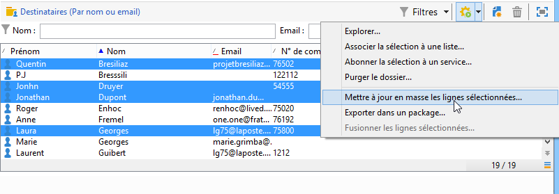

Deux types de mises à jour sont possibles : mise à jour en masse pour un ensemble de destinataires et fusion d&#39;informations entre deux profils. Pour chaque action, un assistant vous permet de paramétrer la mise à jour.

### Mise à jour en masse {#mass-update}

Pour une mise à jour en masse, utilisez l&#39;option **[!UICONTROL Action > Mettre à jour en masse les lignes sélectionnées...]**. Un assistant vous permet de paramétrer et de lancer la mise à jour.

La première étape de l&#39;assistant permet de spécifier le ou les champs sur lesquels porte la mise à jour.

La section gauche de l&#39;assistant propose la liste des champs disponibles. Utilisez le champ **[!UICONTROL Rechercher]** pour lancer une recherche parmi ces champs. Utilisez la touche **Entrée** du clavier pour parcourir la liste : les libellés des champs qui correspondent à votre saisie apparaissent en gras, comme dans l&#39;exemple ci-dessous.

Double-cliquez sur le ou les champs à mettre à jour afin de les afficher dans la section droite de l&#39;assistant.

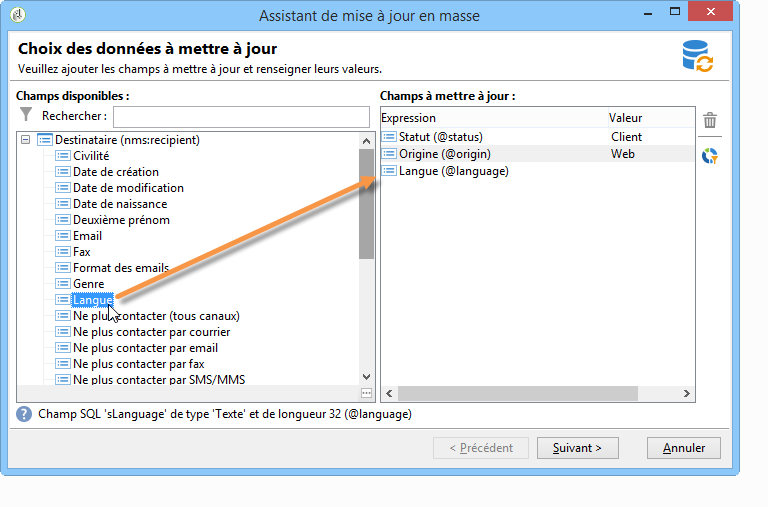

En cas d&#39;erreur, utilisez le bouton **[!UICONTROL Supprimer]** pour supprimer un champ de la liste des champs à mettre à jour.

Sélectionnez ou saisissez les valeurs à appliquer aux profils à mettre à jour.

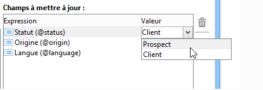

Vous pouvez cliquer sur le bouton **[!UICONTROL Répartition des valeurs]** pour visualiser la répartition des valeurs du champ sélectionné pour les destinataires présents dans le dossier courant (et non pas seulement pour les destinataires visés par la mise à jour).

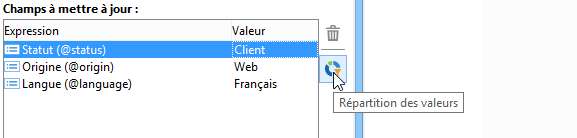

Vous pouvez définir des filtres pour l&#39;affichage dans cette fenêtre de répartition des valeurs ou modifier le dossier courant afin de visualiser la répartition des valeurs dans un autre dossier. Ces actions ne sont que consultatives : elles n&#39;affectent pas le paramétrage de la mise à jour en cours de définition.

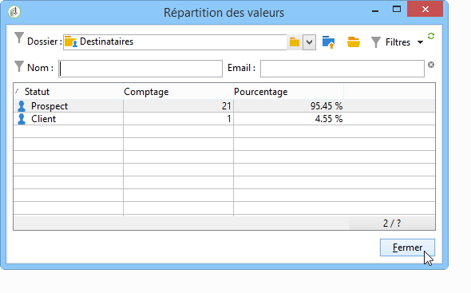

Fermez cette fenêtre et cliquez sur le bouton **[!UICONTROL Suivant]** pour afficher la seconde étape de l&#39;assistant de mise à jour. Cette étape permet de lancer la mise à jour à partir du bouton **[!UICONTROL Démarrer]**.

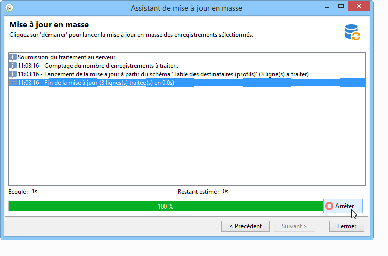

Les informations relatives à l&#39;exécution de la mise à jour sont affichées dans la section supérieure de l&#39;assistant.

Le bouton **[!UICONTROL Arrêter]** permet d&#39;annuler la mise à jour. Toutefois, certains enregistrements peuvent avoir été mis à jour : l&#39;arrêt du traitement n&#39;annulera pas ces mises à jour. La barre de progression indique l&#39;avancement de l&#39;opération.

### Fusion de données {#merge-data}

L&#39;option **[!UICONTROL Fusionner les lignes sélectionnées...]** permet de lancer la fusion de deux profils de destinataires. Les deux profils à fusionner doivent être sélectionnés avant de choisir l&#39;option. Un assistant vous permet de paramétrer et de lancer la fusion.

L&#39;assistant permet de visualiser les valeurs qui seront récupérées pour chaque champ renseigné dans l&#39;un ou l&#39;autre des profils sources. Si un ou plusieurs champs sont renseignés dans les deux profils à fusionner avec des valeurs différentes, ils sont affichés dans la section **[!UICONTROL Liste des conflits]**. Vous pouvez alors choisir le profil par défaut en utilisant les boutons radio situés sous cette liste, comme dans l&#39;exemple suivant :

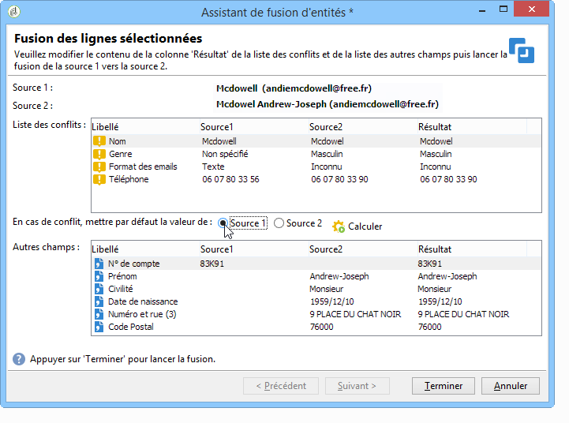

Cliquez sur le bouton **[!UICONTROL Calculer]** pour visualiser le résultat de votre choix.

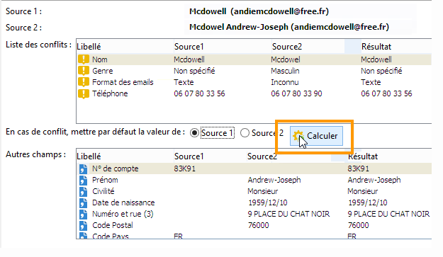

Vérifiez les colonnes **[!UICONTROL Résultat]** des deux sections de la fenêtre et cliquez sur le bouton **[!UICONTROL Terminer]** pour lancer la fusion.

## Exporter des données {#exporting-data}

Le contenu d&#39;une liste peut être exporté. Pour configurer et lancer l&#39;export :

1. Sélectionnez les enregistrements à exporter.
1. Cliquez avec le bouton droit et sélectionnez **[!UICONTROL Exporter...]**.

   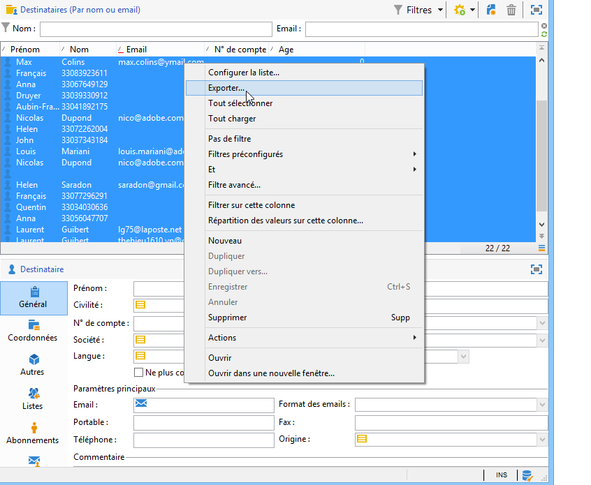

1. Sélectionnez ensuite les données à extraire. Par défaut, toutes les colonnes affichées sont ajoutées parmi les colonnes de sortie.

   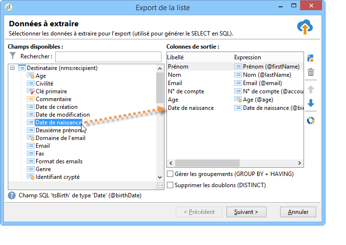

   Pour en savoir plus sur le paramétrage de l&#39;assistant d&#39;export, consultez [cette section](../../platform/using/executing-export-jobs.md).

## S’abonner à un service {#subscribing-to-a-service}

Dans la plupart des cas, les destinataires s&#39;abonnent à une newsletter par le biais d&#39;une landing page dédiée, comme expliqué dans [cette section](../../delivery/using/managing-subscriptions.md). Toutefois, les profils de destinataires filtrés peuvent être abonnés manuellement à un service (Newsletter ou Service viral). Pour cela :

1. Sélectionnez les destinataires à abonner et cliquez avec le bouton droit de la souris.
1. Sélectionnez **[!UICONTROL Actions > Abonner la sélection à un service]**.

   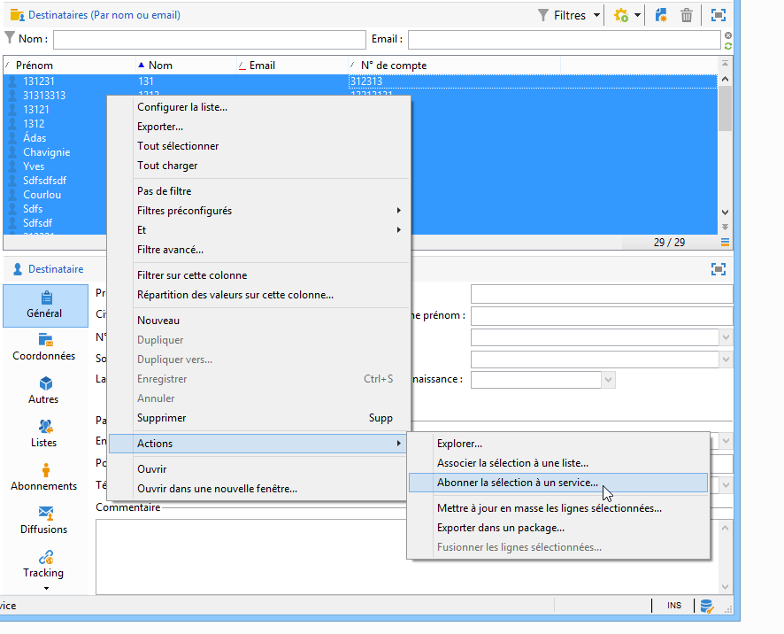

1. Sélectionnez le service visé et cliquez sur **[!UICONTROL Suivant]** :

   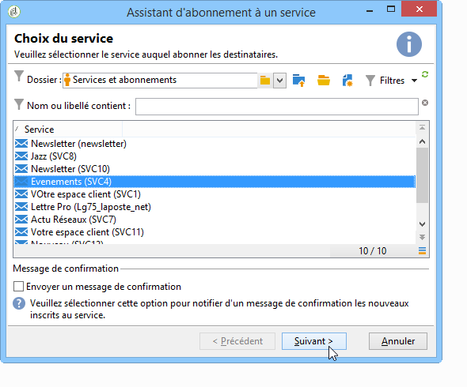

   >[!NOTE]
   >
   >Depuis cet éditeur, vous pouvez créer un nouveau service. Pour cela cliquez sur le bouton **[!UICONTROL Créer]**.

1. Vous pouvez choisir d&#39;**[!UICONTROL Envoyer un message de confirmation]** aux destinataires. Le contenu de ce message est paramétré dans le scénario d&#39;inscription associé au service sélectionné.
1. Cliquez sur le bouton **[!UICONTROL Démarrer]** pour lancer l&#39;abonnement.

   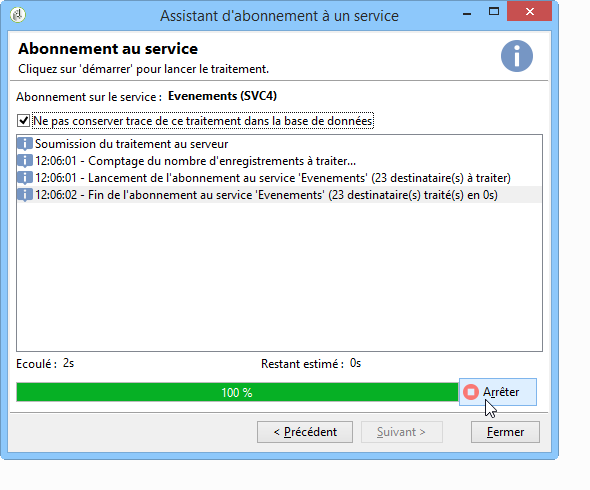

La section supérieure de la fenêtre vous permet de suivre l&#39;exécution. Le bouton **[!UICONTROL Arrêter]** vous permet de stopper l&#39;opération. Les destinataires ayant déjà été traités seront toutefois abonnés.

Si vous décochez l&#39;option **[!UICONTROL Ne pas conserver trace de ce traitement dans la base de données]** vous pouvez sélectionner (ou créer) le dossier d&#39;exécution où seront stockées les informations relatives à ce traitement.

Vous pouvez vérifier le traitement depuis l&#39;onglet **[!UICONTROL Abonnements]** du profil des destinataires concernés par cette opération, ou depuis l&#39;onglet **[!UICONTROL Abonnements]** accessible depuis le noeud **[!UICONTROL Profils et Cibles > Services et Abonnements]**.

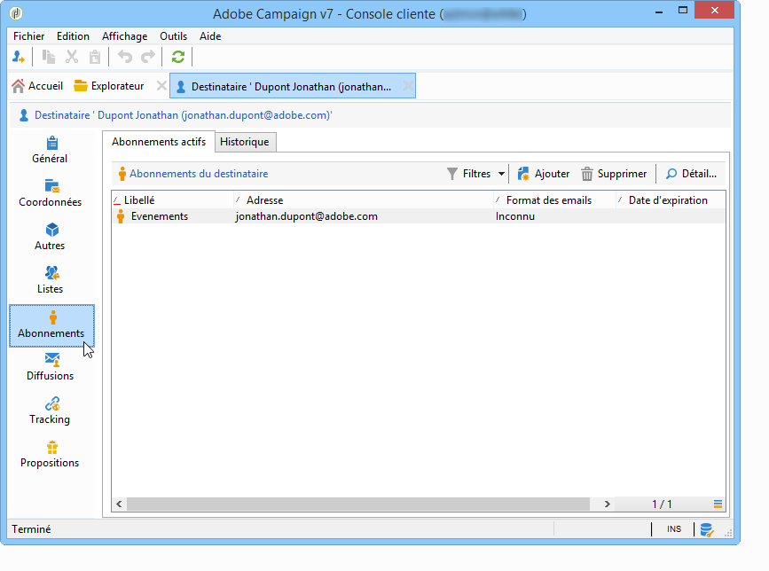

>[!NOTE]
>
>Pour plus d&#39;informations sur la création et le paramétrage des services, consultez [cette page](../../delivery/using/managing-subscriptions.md).
