# Mise à jour de données{#updating-data}

>[!NOTE]
>
>Cette page ne s’applique qu’aux opérateurs et aux opératrices qui se connectent à Campaign avec une authentification native.

Les informations attachées au profil d’un destinataire peuvent être mises à jour manuellement ou automatiquement.

## Configurer une mise à jour automatique {#setting-up-an-automatic-update}

Une mise à jour automatique peut être configurée via un workflow. Pour en savoir plus, consultez la [documentation de Campaign v8](https://experienceleague.adobe.com/docs/campaign/automation/workflows/wf-activities/targeting-activities/update-data.html?lang=fr){target="_blank"}.

## Réaliser une mise à jour en masse {#performing-a-mass-update}

Pour effectuer des mises à jour manuelles, cliquez avec le bouton droit sur les personnes destinataires sélectionnées pour utiliser le menu de raccourci **[!UICONTROL Actions]** ou utilisez l’icône **[!UICONTROL Actions]**.

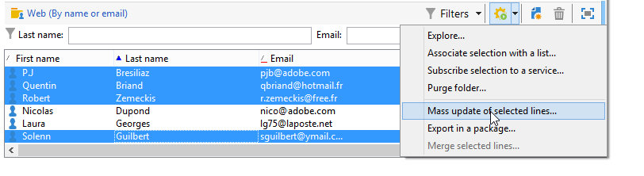

Deux types de mises à jour sont possibles : mise à jour en masse pour un ensemble de destinataires et fusion d&#39;informations entre deux profils. Pour chaque action, un assistant vous permet de configurer la mise à jour.

### Mise à jour en masse {#mass-update}

Pour la mise à jour en masse, utilisez **[!UICONTROL Action > Mise à jour en masse des lignes sélectionnées...]**. L’assistant vous aide à configurer et à exécuter la mise à jour.

La première étape de l’assistant spéficie le ou les champs sur lesquels porte la mise à jour.

La section gauche de l’assistant affiche la liste des champs disponibles. Utilisez le champ **[!UICONTROL Rechercher]** pour lancer une recherche parmi ces champs. Appuyez sur la touche **Entrée** pour parcourir la liste. Les noms de champ qui correspondent à votre saisie apparaissent en gras, comme dans l&#39;exemple ci-dessous.

Double-cliquez sur le ou les champs à mettre à jour afin de les afficher dans la section droite de l’assistant.

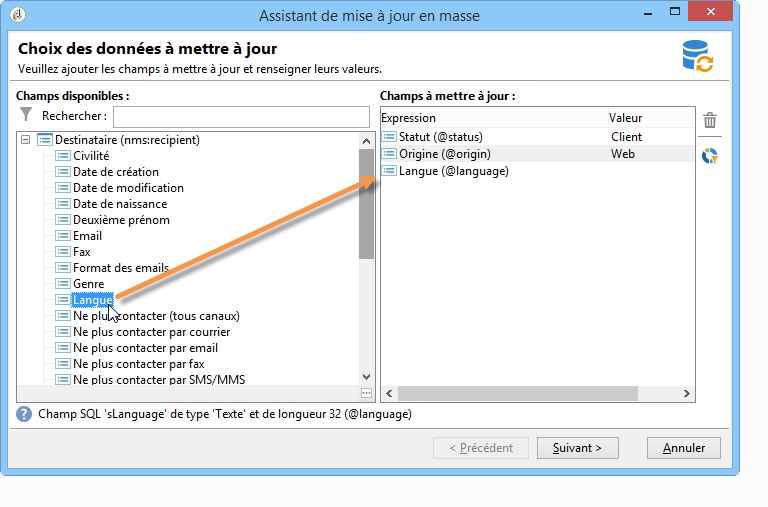

En cas d&#39;erreur, utilisez le bouton **[!UICONTROL Supprimer]** pour supprimer un champ de la liste des champs à mettre à jour.

Sélectionnez ou saisissez les valeurs à appliquer aux profils à mettre à jour.

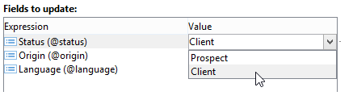

Vous pouvez cliquer sur le bouton **[!UICONTROL Répartition des valeurs]** pour visualiser la répartition des valeurs du champ sélectionné pour les destinataires présents dans le dossier courant (et non pas seulement pour les destinataires visés par la mise à jour).

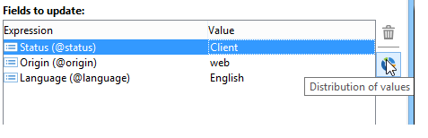

Vous pouvez définir des filtres pour afficher la répartition des valeurs dans cette fenêtre ou modifier le dossier courant pour afficher la répartition des valeurs dans un autre dossier. Il s’agit d’actions en lecture seule qui n’affectent pas la configuration de la mise à jour en cours de définition.

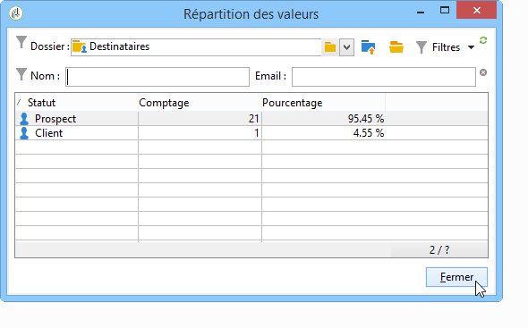

Fermez cette fenêtre et cliquez sur **[!UICONTROL Suivant]** pour afficher la seconde étape de l’assistant de mise à jour. Cette étape permet de lancer la mise à jour à partir du bouton **[!UICONTROL Démarrer]**.

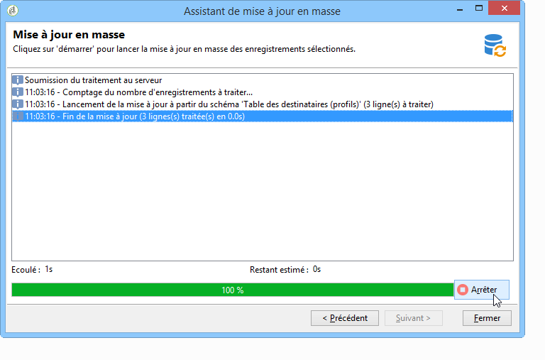

Les informations relatives à l’exécution de la mise à jour sont affichées dans la section supérieure de l’assistant.

Le **[!UICONTROL Arrêter]** vous permet d&#39;annuler la mise à jour, mais certains enregistrements peuvent avoir été mis à jour, et l&#39;arrêt du processus n&#39;annulera pas ces mises à jour. La barre de progression indique l’avancement de l’opération.

### Fusion de données {#merge-data}

Sélectionnez **[!UICONTROL Fusionner les lignes sélectionnées...]** pour lancer la fusion de deux profils de destinataires. Les profils à fusionner doivent être sélectionnés avant de sélectionner l’option. La fusion est configurée et lancée à l’aide d’un assistant.

L’assistant affiche les valeurs à récupérer pour chaque champ renseigné dans l’un ou l’autre des profils source. Si un ou plusieurs champs sont renseignés dans les deux profils à fusionner avec des valeurs différentes, ils sont affichés dans la section **[!UICONTROL Liste des conflits]**. Vous pouvez alors choisir le profil par défaut en utilisant les boutons radio situés sous cette liste, comme dans l&#39;exemple suivant :

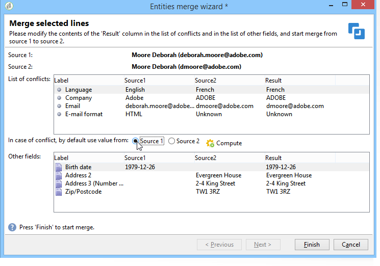

Cliquez sur le bouton **[!UICONTROL Calculer]** pour visualiser le résultat de votre choix.

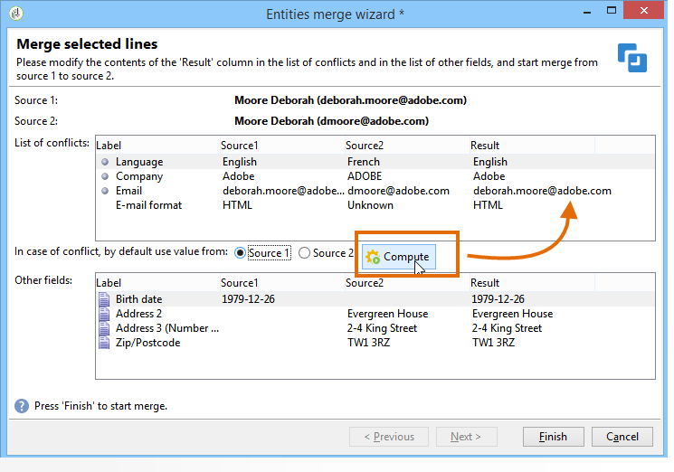

Vérifiez les colonnes **[!UICONTROL Résultat]** des deux sections de la fenêtre et cliquez sur le bouton **[!UICONTROL Terminer]** pour lancer la fusion.

## Exporter des données {#exporting-data}

Le contenu d’une liste peut être exporté. Pour configurer et exécuter l’exportation :

1. Sélectionnez les enregistrements à exporter.
1. Cliquez avec le bouton droit et sélectionnez **[!UICONTROL Exporter...]**.

   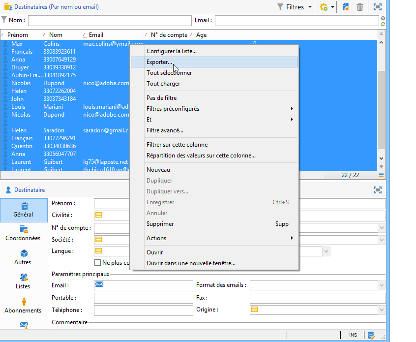

1. Sélectionnez ensuite les données à extraire. Par défaut, toutes les colonnes affichées sont ajoutées aux colonnes de sortie.

   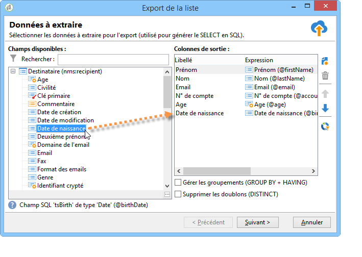

   Pour en savoir plus sur la configuration de l’assistant d’export, consultez [cette section](../../platform/using/executing-export-jobs.md).

## S’abonner à un service {#subscribing-to-a-service}

Dans la plupart des cas, les destinataires s’abonnent à une newsletter par le biais d’une page de destination dédiée, comme expliqué dans [cette section](../../delivery/using/managing-subscriptions.md). Cependant, les profils des destinataires filtrés peuvent être abonnés manuellement à un service (Newsletter ou Service viral). Pour cela :

1. Sélectionnez les destinataires à abonner et cliquez avec le bouton droit de la souris.
1. Sélectionnez **[!UICONTROL Actions > Abonner la sélection à un service]**.

   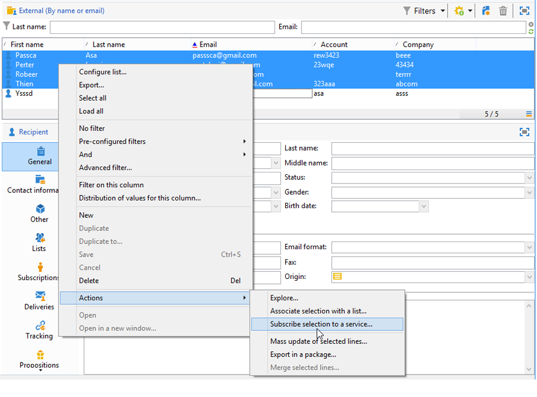

1. Sélectionnez le service visé et cliquez sur **[!UICONTROL Suivant]** :

   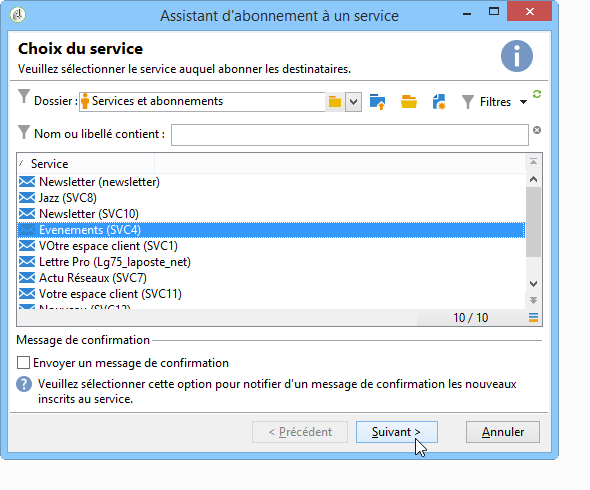

   >[!NOTE]
   >
   >Depuis cet éditeur, vous pouvez créer un nouveau service. Pour cela cliquez sur le bouton **[!UICONTROL Créer]**.

1. Vous pouvez **[!UICONTROL Envoyer un message de confirmation]** aux destinataires. Le contenu de ce message peut être paramétré dans le scénario d&#39;abonnement associé au service sélectionné.
1. Cliquez sur le bouton **[!UICONTROL Démarrer]** pour lancer l&#39;abonnement.

   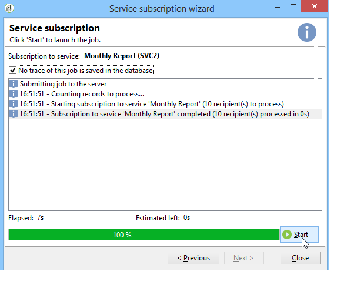

La section supérieure de la fenêtre vous permet de suivre l&#39;exécution. Le bouton **[!UICONTROL Arrêter]** vous permet d’arrêter le traitement. Les destinataires ayant déjà été traités seront toutefois abonnés.

Si vous décochez l&#39;option **[!UICONTROL Ne pas conserver trace de ce traitement dans la base de données]** vous pouvez sélectionner (ou créer) le dossier d&#39;exécution où seront stockées les informations relatives à ce traitement.

Vous pouvez vérifier le traitement depuis l&#39;onglet **[!UICONTROL Abonnements]** du profil des destinataires concernés par cette opération, ou depuis l&#39;onglet **[!UICONTROL Abonnements]** accessible depuis le noeud **[!UICONTROL Profils et Cibles > Services et Abonnements]**.

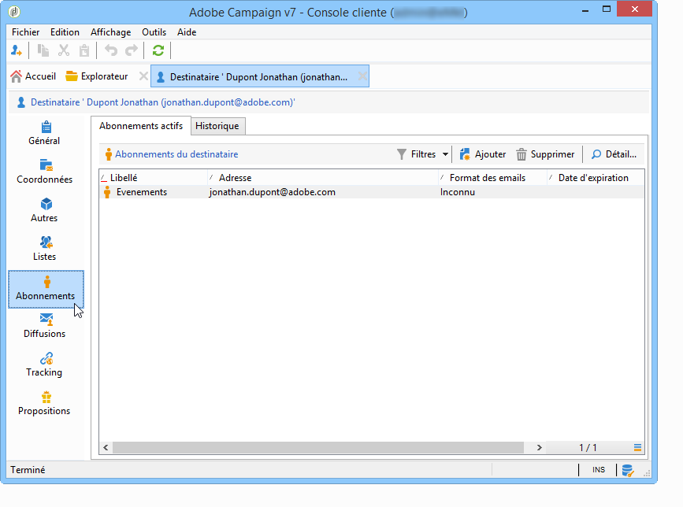

>[!NOTE]
>
>Pour plus d&#39;informations sur la création et le paramétrage des services, consultez [cette page](../../delivery/using/managing-subscriptions.md).
