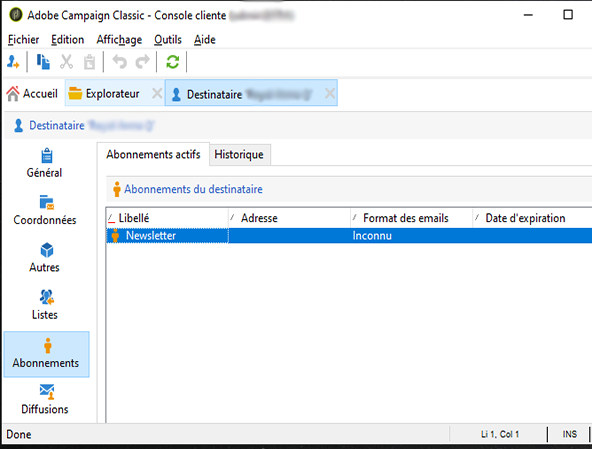

# Mettre à jour les données{#updating-data}

Les informations attachées au profil d&#39;un destinataire peuvent être mises à jour manuellement ou automatiquement.

## Configurer une mise à jour automatique {#setting-up-an-automatic-update}

Une mise à jour automatique peut être configurée via un workflow. Voir à ce propos [cette section](../../workflow/using/update-data.md).

## Réaliser une mise à jour en masse {#performing-a-mass-update}

Les mises à jour manuelles sont commandées à partir du menu contextuel **[!UICONTROL Actions]** affiché à partir du bouton droit de la souris sur le ou les destinataires sélectionnés, ou à partir de l&#39;icône **[!UICONTROL Actions]**.

Deux types de mises à jour sont possibles : mise à jour en masse pour un ensemble de destinataires et fusion d&#39;informations entre deux profils. Pour chaque action, un assistant vous permet de paramétrer la mise à jour.

### Mise à jour en masse {#mass-update}

Pour une mise à jour en masse, utilisez **[!UICONTROL Action > Mass update of selected lines...]**. L’assistant vous aide à configurer et à exécuter la mise à jour.

La première étape de l&#39;assistant permet de spécifier le ou les champs sur lesquels porte la mise à jour.

La section de gauche de l’assistant affiche la liste des champs disponibles. Utilisez le **[!UICONTROL Find]** champ pour lancer une recherche dans ces champs. Appuyez sur la touche **Entrée** pour parcourir la liste. Les noms de champ correspondant à votre entrée apparaissent en gras, comme illustré ci-dessous.

Double-cliquez sur le ou les champs à mettre à jour afin de les afficher dans la section droite de l&#39;assistant.

In the event of an error, use the **[!UICONTROL Delete]** button to delete a field from the list of fields to be updated.

Sélectionnez ou saisissez les valeurs à appliquer aux profils à mettre à jour.

You can click **[!UICONTROL Distribution of values]** to display the distribution of values of the selected field for the recipients present in the current folder (not only the recipients affected by the update).

Vous pouvez définir des filtres pour l&#39;affichage dans cette fenêtre de répartition des valeurs ou modifier le dossier courant afin de visualiser la répartition des valeurs dans un autre dossier. Ces actions ne sont que consultatives : elles n&#39;affectent pas le paramétrage de la mise à jour en cours de définition.

Fermez cette fenêtre et cliquez sur **[!UICONTROL Next]** pour afficher la deuxième étape de l&#39;assistant de mise à jour. Dans cette étape, vous pouvez lancer la mise à jour en cliquant sur **[!UICONTROL Start]**.

Les informations relatives à l&#39;exécution de la mise à jour sont affichées dans la section supérieure de l&#39;assistant.

Le **[!UICONTROL Stop]** permet d’annuler la mise à jour, mais certains enregistrements ont peut-être été mis à jour et l’arrêt du processus n’annule pas ces mises à jour. La barre de progression indique la progression de l’opération.

### Fusion de données {#merge-data}

Sélectionnez **[!UICONTROL Merge selected lines...]** pour lancer la fusion de deux profils de destinataires. Les profils à fusionner doivent être sélectionnés avant de sélectionner l’option. La fusion est configurée et lancée à l’aide d’un assistant.

L’assistant affiche les valeurs à récupérer pour chaque champ rempli dans l’un ou l’autre des profils source. Si un ou plusieurs champs des profils à fusionner ont des valeurs différentes, ils sont affichés dans la **[!UICONTROL List of conflicts]** section. Vous pouvez ensuite sélectionner le profil par défaut à l’aide des boutons radio situés sous la liste, comme dans l’exemple suivant :

Click **[!UICONTROL Compute]** to display the result of your choice.

Check the **[!UICONTROL Result]** columns of both sections of the window, and click **[!UICONTROL Finish]** to run the merge.

## export des données {#exporting-data}

Le contenu d&#39;une liste peut être exporté. Pour configurer et lancer l&#39;export :

1. Sélectionnez les enregistrements à exporter.
1. Right-click and select **[!UICONTROL Export...]**.

   

1. Sélectionnez ensuite les données à extraire. Par défaut, toutes les colonnes affichées sont ajoutées parmi les colonnes de sortie.

   

   For more on how to configure the export wizard, refer to [Export wizard](../../platform/using/exporting-data.md#export-wizard).

## Abonner à un service {#subscribing-to-a-service}

Dans la plupart des cas, les destinataires s&#39;abonnent à une newsletter par le biais d&#39;une landing page dédiée, comme expliqué dans [cette section](../../delivery/using/managing-subscriptions.md). Toutefois, les profils de destinataires filtrés peuvent être abonnés manuellement à un service (Newsletter ou Service viral). Pour cela :

1. Sélectionnez les destinataires à abonner et cliquez avec le bouton droit de la souris.
1. Sélectionner **[!UICONTROL Actions > Subscribe selection to a service]**.

   

1. Select the desired service and click **[!UICONTROL Next]**:

   

   >[!NOTE]
   >
   >This editor lets you create a new service: click the **[!UICONTROL Create]** button.

1. Vous pouvez **[!UICONTROL Send a confirmation message]** contacter des destinataires. Le contenu de ce message peut être configuré dans le scénario d’abonnement lié au service sélectionné.
1. Click the **[!UICONTROL Start]** button to run the subscription process.

   

La section supérieure de la fenêtre vous permet de surveiller le processus d’exécution. Le **[!UICONTROL Stop]** bouton permet d’arrêter le processus. Toutefois, les destinataires déjà traités seront abonnés.

Si vous désélectionnez l’ **[!UICONTROL Do not keep a trace of this job in the database]** option, vous pouvez sélectionner (ou créer) le dossier d’exécution dans lequel les informations sur ce processus seront stockées.

To check on the process, go to the **[!UICONTROL Subscriptions]** tab on the profiles of the recipients concerned by this operation, or to the **[!UICONTROL Subscriptions]** tab accessed via the **[!UICONTROL Profiles and Targets > Services and Subscriptions]** node.

>[!NOTE]
>
>Pour plus d&#39;informations sur la création et le paramétrage des services, consultez [cette page](../../delivery/using/managing-subscriptions.md).

