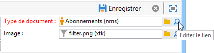
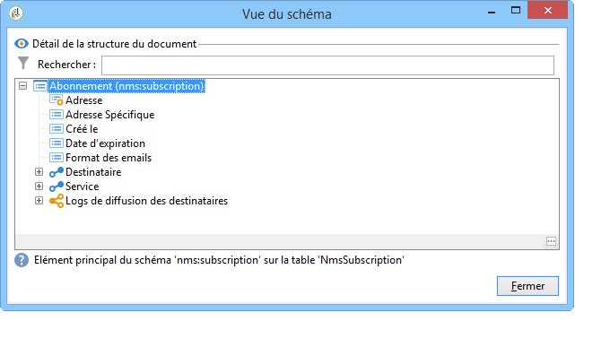
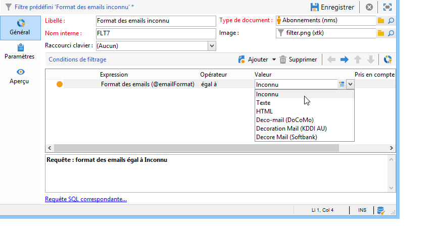
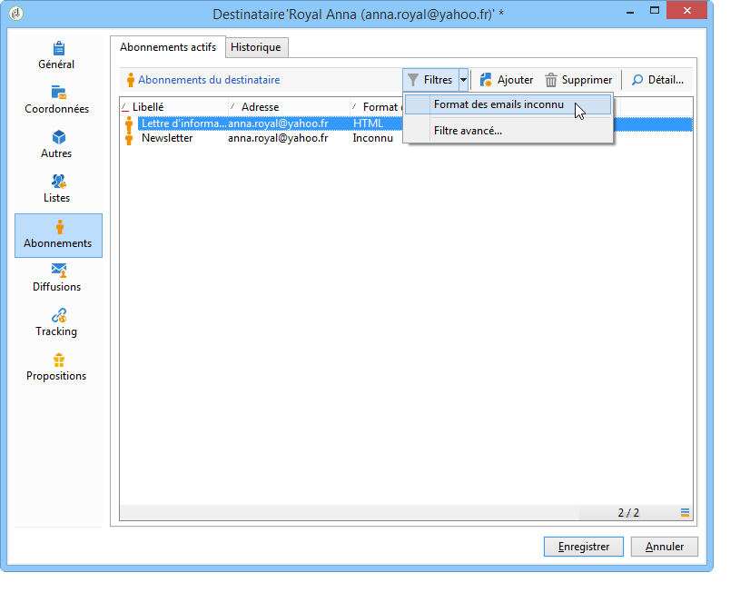
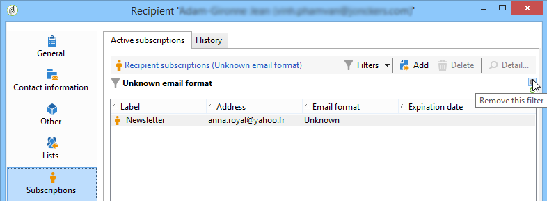

# Cas d&#39;utilisation{#use-case}

## Créer un filtre sur le format des emails des abonnés {#creating-a-filter-on-the-email-format-of-subscribers}

Dans le ce cas pratique, nous allons créer un filtre afin de trier les abonnement à des newsletters en fonction du format d&#39;email renseigné par les destinataires.

Pour cela, il est nécessaire d&#39;utiliser un filtre prédéfini : ces filtres sont associés à un type de document et sont accessibles à partir du nœud **[!UICONTROL Administration > Paramétrage > Filtres prédéfinis]**. Ces filtres de données peuvent être utilisés pour chaque type d’éditeur (ou de document) dans l’application.

Le mode de création des filtres sur les données est le même que celui des filtres prédéfinis. Toutefois, un champ supplémentaire vous permet de sélectionner le type de document auquel le filtre sera appliqué.

Les étapes sont les suivantes :

1. Créez un nouveau filtre à partir du noeud **[!UICONTROL Administration > Paramétrage > Filtres prédéfinis]**.
1. Cliquez sur l&#39;icône **[!UICONTROL Choisir le lien]** pour sélectionner le document concerné :

   

1. Sélectionnez le schéma des abonnements (nms:subscription) et cliquez sur **[!UICONTROL OK]**.

   

1. Cliquez sur l&#39;icône **[!UICONTROL Editer le lien]** pour visualiser les champs du document sélectionné.

   

   Vous pouvez alors consulter le contenu du document sélectionné :

   

   Vous pouvez accéder à ces champs pour définir des conditions de filtrage dans le corps de l’éditeur de filtres. Un filtre d’application est défini exactement de la même manière qu’un filtre avancé. Pour plus d’informations sur les filtres, consultez la [documentation de Campaign v8 (console)](https://experienceleague.adobe.com/fr/docs/campaign/campaign-v8/audience/create-filters){target=_blank}.

1. Créez un nouveau filtre sur les abonnements afin de n&#39;afficher que les abonnements pour lequel aucun format des email n&#39;a été défini :

   

1. Cliquez sur **[!UICONTROL Enregistrer]** pour ajouter le filtre aux filtres prédéfinis pour ce type de liste.
1. Vous pouvez désormais utiliser ce filtre dans l’onglet **[!UICONTROL Abonnements]** du profil d’un destinataire. Le filtre « Format d’e-mail inconnu » est accessible en cliquant sur le bouton **[!UICONTROL Filtres]**.

   

   Le nom du filtre courant est affiché au-dessus de la liste. Pour annuler ce filtre, cliquez sur l’icône **[!UICONTROL Supprimer ce filtre]**.

   
