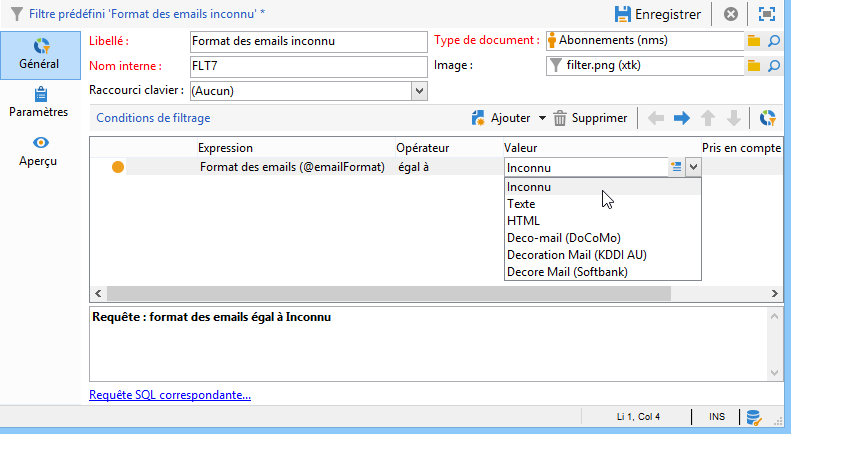

# Cas d&#39;utilisation{#use-case}

## Créer un filtre sur le format des emails des abonnés {#creating-a-filter-on-the-email-format-of-subscribers}

Dans le ce cas pratique, nous allons créer un filtre afin de trier les abonnement à des newsletters en fonction du format d&#39;email renseigné par les destinataires.

Pour cela, nous allons utiliser un filtre prédéfini : associés à un type de document, ces filtres sont accessibles depuis le nœud **[!UICONTROL Administration > Paramétrage > Filtres prédéfinis]**. Ces filtres sur les données peuvent être utilisés pour chaque type d&#39;éditeurs (ou documents) de l&#39;application.

Le mode de création des filtres sur les données est le même que celui des filtres prédéfinis. Toutefois, un champ supplémentaire vous permet de sélectionner le type de document auquel le filtre sera appliqué.

Les étapes sont les suivantes :

1. Créez un nouveau filtre à partir du noeud **[!UICONTROL Administration > Paramétrage > Filtres prédéfinis]**.
1. Cliquez sur l&#39;icône **[!UICONTROL Choisir le lien]** pour sélectionner le document concerné :

   

1. Sélectionnez le schéma des abonnements (nms:subscription) et cliquez sur **[!UICONTROL OK]**.

   

1. Cliquez sur l&#39;icône **[!UICONTROL Editer le lien]** pour visualiser les champs du document sélectionné.

   

   Vous pouvez alors consulter le contenu du document sélectionné :

   

   Ces champs seront accessibles pour la définition des conditions de filtrage dans le corps de l&#39;éditeur de filtres. Le mode de définition d&#39;un filtre applicatif est identique à celui d&#39;un filtre avancé. Pour plus d&#39;informations, consultez la section [Créer un filtre avancé](../../platform/using/creating-filters.md#creating-an-advanced-filter).

1. Créez un nouveau filtre sur les abonnements afin de n&#39;afficher que les abonnements pour lequel aucun format des email n&#39;a été défini :

   

1. Cliquez sur **[!UICONTROL Enregistrer]** pour ajouter le filtre aux filtres prédéfinis pour ce type de liste.
1. Vous pouvez désormais utiliser ce filtre dans l’onglet **[!UICONTROL Abonnements]** du profil d’un destinataire. Le filtre « Format d’e-mail inconnu » est accessible en cliquant sur le bouton **[!UICONTROL Filtres]**.

   

   Le nom du filtre courant est affiché au-dessus de la liste. Pour annuler le filtre, cliquez sur le bouton **[!UICONTROL Supprimer ce filtre]** Icône

   
