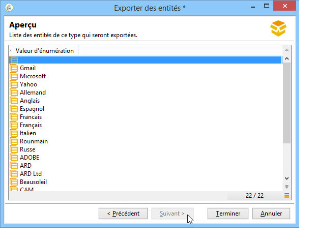
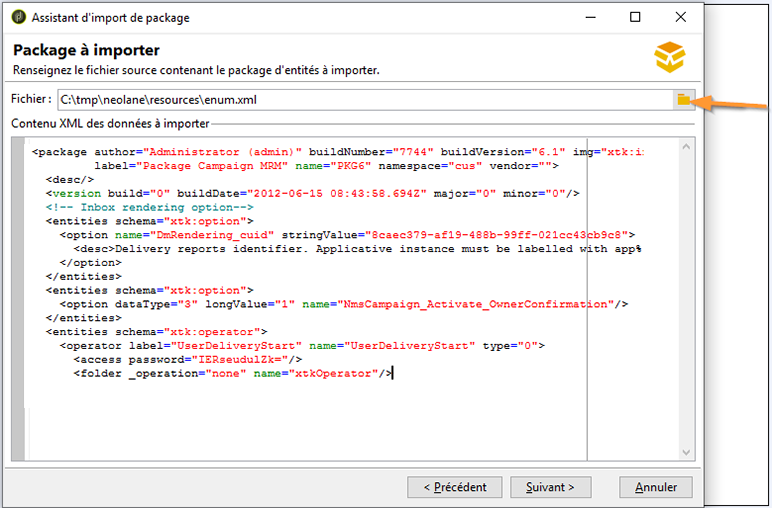

# Utiliser les packages de données{#working-with-data-packages}

## A propos des packages de données {#about-data-packages}

Adobe Campaign vous permet d&#39;exporter ou d&#39;importer la configuration et les données de la plate-forme grâce à un système de packages. Les packages peuvent contenir différents types de configurations et d&#39;éléments, filtrés ou non.

Les packages de données permettent l&#39;échange des entités de la base Adobe Campaign au travers de fichiers au format XML. Chaque entité contenue dans un package est représentée avec toutes ses données.

Le principe des **packages de données** consiste à exporter un paramétrage de données puis l&#39;intégrer dans un autre système Adobe Campaign. Pour plus d&#39;informations sur la gestion d&#39;un ensemble cohérent de packages de données, reportez-vous à cette [technote](https://docs.campaign.adobe.com/doc/AC/en/technicalResources/Technotes/AdobeCampaign_How_to_maintain_a_consistent_set_of_data_packages.pdf).

### Types de packages {#types-of-packages}

Il existe trois types de packages exportables : les packages utilisateur, les packages plate-forme et les packages admin.

* **Package utilisateur** : il permet de choisir la liste des entités à exporter. Ce type de package gère les dépendances et vérifie les erreurs.
* **Package plate-forme** : il regroupe toutes les ressources techniques ajoutées (non livrées d&#39;usine) : schémas, code JavaScript...

   

* **Package admin** : il regroupe tous les modèles et objets métiers ajoutés (non livrés d&#39;usine) : modèles, librairies...

   

>[!CAUTION]
>
>Les types **plate-forme** et **admin** contiennent une liste prédéfinie d&#39;entités à exporter. A chaque entité exportable sont associées des conditions de filtrage permettant d&#39;écarter les ressources livrées d&#39;usine du package créé.

## Structure des données {#data-structure}

La description d&#39;un package de données est un document XML structuré respectant la grammaire du schéma de données **xrk:navtree**.

Exemple de package de données :

```
<package>
  <entities schema="nms:recipient">
    <recipient email="john.smith@adobe.com" lastName="Smith" firstName="John">      
      <folder _operation="none" name="nmsRootFolder"/>      
      <company _operation="none" name="Adobe"/>
    </recipient>
  </entities>
  <entities schema="sfa:company">
    <company name="Adobe">
      location city="London" zipCode="W11 2BQ"/>
    </company>
  </entities>
</package>
```

Le document XML doit commencer et se terminer par l’ **`<package>`** élément. Les **`<entities>`** éléments suivants répartissent les données par type de document.

An **`<entities>`** element contains the data of the package in the format of the data schema entered in the **schema** attribute.

Les données d&#39;un package ne doivent pas contenir de clés internes non compatibles entre les bases, comme les clés auto-générées (option **autopk**).

Dans notre exemple, les jointures sur les liens &quot;folder&quot; et &quot;company&quot; ont été remplacées par les clés dites de &quot;haut niveau&quot; sur les tables destinations :

```
<recipient>
  <folder _operation="none" name="nmsRootFolder"/>
  <company _operation="none" name="Adobe"/>
</recipient>
```

The **`operation`** attribute with the value &quot;none&quot; defines a reconciliation link.

Un package de données peut être construit à la main à partir de n&#39;importe quel éditeur texte. Il suffit que la structure du document XML soit conforme au schéma de données &quot;xtk:navtree&quot;. La console Adobe Campaign est pourvue d&#39;un module d&#39;export et d&#39;import de package de données.

## Export de packages {#exporting-packages}

### A propos de l&#39;export de packages {#about-package-export}

Les packages peuvent être exportés de trois manières différentes :

* L’Assistant **[!UICONTROL d’exportation de]** package vous permet d’exporter un ensemble d’objets dans un seul package. Pour plus d’informations, voir [Exportation d’un ensemble d’objets dans un package.](#exporting-a-set-of-objects-in-a-package)
* Un **objet unique** peut être directement exporté dans un package en cliquant dessus avec le bouton droit de la souris et en sélectionnant **[!UICONTROL Actions > Exporter dans un package]**.
* **Les définitions** de package vous permettent de créer une structure de package dans laquelle vous ajoutez des objets qui seront exportés ultérieurement dans un package. Pour plus d’informations, reportez-vous à la section [Gestion des définitions de package.](#managing-package-definitions)

Une fois un package exporté, vous pourrez l&#39;importer ainsi que toutes les entités ajoutées dans une autre instance Campaign.

### Exporter un ensemble d&#39;objets dans un package {#exporting-a-set-of-objects-in-a-package}

L&#39;assistant d&#39;export de package est accessible à partir du menu principal **[!UICONTROL Outils > Avancé > Export de package...]** de la console cliente Adobe Campaign.


Pour les trois types de package, l&#39;assistant propose les étapes suivantes :

1. Indiquez la liste des entités à exporter, par type de document :

   

   >[!CAUTION]
   >
   >Si vous exportez un dossier de type **[!UICONTROL Catégorie d&#39;offres]**, **[!UICONTROL Environnement d&#39;offres]**, **[!UICONTROL Programme]** ou **[!UICONTROL Plan]**, ne sélectionnez en aucun cas l&#39;entité **xtk:folder** au risque de perdre une partie des données. Sélectionnez l&#39;entité correspondant au dossier : **nms:offerCategory** pour les catégories d&#39;offres, **nms:offerEnv** pour les environnements d&#39;offres, **nms:program** pour les programmes et **nms:plan** pour les plans.

   La gestion de la liste permet l&#39;ajout ou la suppression de la configuration des entités à exporter. Cliquez sur **[!UICONTROL Ajouter]** pour sélectionner une nouvelle entité.

   Le bouton **[!UICONTROL Détail]** édite la configuration sélectionnée.

   >[!NOTE]
   >
   >Le mécanisme de dépendance contrôle la séquence d’exportation d’entité. For more on this, refer to [Managing dependencies](#managing-dependencies).

1. L&#39;écran de configuration des entités définit la requête de filtrage sur le type de document à extraire.

   Vous devez paramétrer la clause de filtrage pour l&#39;extraction des données.

   

   >[!NOTE]
   >
   >L&#39;éditeur de requêtes est présenté dans [cette section](../../platform/using/about-queries-in-campaign.md).

1. Cliquez sur **[!UICONTROL Suivant]** et sélectionnez les colonnes de tri pour ordonnancer les données lors de l&#39;extraction :

   

1. Visualisez un aperçu des données à extraire avant de démarrer l&#39;export.

   

1. La dernière étape de l&#39;assistant d&#39;export de package permet de démarrer l&#39;export. Les données seront stockées dans le fichier indiqué dans le champ **[!UICONTROL Fichier]**.

   

### Gestion des dépendances {#managing-dependencies}

Le mécanisme d&#39;export permet à Adobe Campaign de suivre les liens entre les éléments exportés.

Deux règles définissent le mécanisme :

* les objets liés avec un lien ayant une intégrité de type **own** ou **owncopy** sont exportés dans le même package que l&#39;objet exporté.
* les objets liés avec un lien ayant une intégrité de type **neutral** ou **define** (lien défini) doivent être exportés indépendamment.

>[!NOTE]
>
>Les types d&#39;intégrité liés aux éléments de schéma sont définis dans [cette section](../../configuration/using/database-mapping.md#links--relation-between-tables).

#### Exporter une campagne {#exporting-a-campaign}

Voici un exemple d&#39;export de campagne. La campagne marketing à exporter contient une tâche (libellé : &quot;MyTask&quot;) et un workflow (libellé : &quot;CampaignWorkflow&quot;) dans un dossier &quot;MyWorkflow&quot; (nœud : Administration / Exploitation / Workflows Techniques / Processus de campagne / MyWorkflow).

La tâche et le workflow sont exportés dans le même package que la campagne car les schémas correspondant sont reliés par des liens ayant une intégrité de type &quot;own&quot;.

Contenu de package :

```
<?xml version='1.0'?>
<package author="Administrator (admin)" buildNumber="7974" buildVersion="6.1" img=""
label="" name="" namespace="" vendor="">
 <desc></desc>
 <version buildDate="2013-01-09 10:30:18.954Z"/>
 <entities schema="nms:operation">
  <operation duration="432000" end="2013-01-14" internalName="OP1" label="MyCampaign"
  modelName="opEmpty" start="2013-01-09">
   <controlGroup>
    <where filteringSchema=""/>
   </controlGroup>
   <seedList>
    <where filteringSchema="nms:seedMember"></where>
    <seedMember internalName="SDM1"></seedMember>
   </seedList>
   <parameter useAsset="1" useBudget="1" useControlGroup="1" useDeliveryOutline="1"
   useDocument="1" useFCPValidation="0" useSeedMember="1" useTask="1"
   useValidation="1" useWorkflow="1"></parameter>
   <fcpSeed>
    <where filteringSchema="nms:seedMember"></where>
   </fcpSeed>
   <owner _operation="none" name="admin" type="0"/>
   <program _operation="none" name="nmsOperations"/>
   <task end="2013-01-17 10:07:51.000Z" label="MyTask" name="TSK2" start="2013-01-16 10:07:51.000Z"
   status="1">
    <owner _operation="none" name="admin" type="0"/>
    <operation _operation="none" internalName="OP1"/>
    <folder _operation="none" name="nmsTask"/>
   </task>
   <workflow internalName="WKF12" label="CampaignWorkflow" modelName="newOpEmpty"
   order="8982" scenario-cs="Notification of the workflow supervisor (notifySupervisor)"
   schema="nms:recipient">
    <scenario internalName="notifySupervisor"/>
    <desc></desc>
    <folder _operation="none" name="Folder4"/>
    <operation _operation="none" internalName="OP1"/>
   </workflow>
  </operation>
 </entities>
</package>   
```

L&#39;appartenance à un type de package est défini dans un schéma avec l&#39;attribut **@pkgAdmin et @pkgPlatform**. Ces deux attributs reçoivent une expression XTK définissant les conditions d&#39;appartenance au package.

```
<element name="offerEnv" img="nms:offerEnv.png" 
template="xtk:folder" pkgAdmin="@id != 0">
```

Enfin, l&#39;attribut **@pkgStatus** permet de définir les règles d&#39;export sur les éléments ou attributs. Selon la valeur de l&#39;attribut, l&#39;élément ou l&#39;attribut sera présent dans le package exporté. Les trois valeurs possibles pour cet attribut sont :

* **never** : n&#39;exporte pas le champ / lien
* **always** : force l&#39;export de ce champ
* **preCreate** : autorise la création de l&#39;entité liée

>[!NOTE]
>
>La valeur **preCreate** est admise uniquement sur les éléments de type lien. Elle autorise à créer ou à pointer vers une entité qui n&#39;est pas encore chargée dans le package exportée.

## Gérer les définitions de packages {#managing-package-definitions}

### A propos des définitions de packages {#about-package-definitions}

Les définitions de packages vous permettent de créer une structure de package dans laquelle vous ajoutez les entités qui seront exportées ultérieurement dans un même package. Vous pourrez ensuite importer ce package et toutes les entités ajoutées dans une autre instance Campaign.

**Rubriques connexes :**

* [Créer une définition de package](#creating-a-package-definition)
* [Ajouter des entités à une définition de package](#adding-entities-to-a-package-definition)
* [Paramétrer la génération des définitions de packages](#configuring-package-definitions-generation)
* [Exporter des packages à partir d&#39;une définition de package](#exporting-packages-from-a-package-definition)

### Créer une définition de package {#creating-a-package-definition}

Les définitions de packages sont accessibles à partir du menu **[!UICONTROL Administration > Paramétrage > Gestion des packages > Définitions de packages]**.

Pour créer une définition de package, cliquez sur le bouton **[!UICONTROL Nouveau]**, puis remplissez les informations générales de la définition de package.


Vous pouvez ensuite ajouter des entités à la définition de package et l&#39;exporter dans un package de fichier XML.

**Rubriques connexes :**

* [Ajouter des entités à une définition de package](#adding-entities-to-a-package-definition)
* [Paramétrer la génération des définitions de packages](#configuring-package-definitions-generation)
* [Exporter des packages à partir d&#39;une définition de package](#exporting-packages-from-a-package-definition)

### Ajouter des entités à une définition de package {#adding-entities-to-a-package-definition}

Dans l’onglet **[!UICONTROL Contenu]** , cliquez sur le bouton **[!UICONTROL Ajouter]** pour sélectionner les entités à exporter avec le package. Les bonnes pratiques lors de la sélection d’entités sont présentées dans la section [Exportation d’un ensemble d’objets dans un package](#exporting-a-set-of-objects-in-a-package) .


Les entités peuvent être ajoutées directement à une définition de package à partir de leur emplacement dans l&#39;instance. Pour ce faire, suivez les étapes ci-dessous :

1. Cliquez avec le bouton droit de la souris sur l&#39;entité désirée, puis sélectionnez **[!UICONTROL Actions > Exporter dans un package]**.

   

1. Sélectionnez **[!UICONTROL Ajout dans une définition de package]**, puis sélectionnez la définition de package dans laquelle vous voulez ajouter l&#39;entité.

   

1. L&#39;entité est ajoutée à la définition de package, elle sera exportée avec le package (voir [Exportation de packages à partir d&#39;une définition](#exporting-packages-from-a-package-definition)de package).

   

### Paramétrer la génération des définitions de packages {#configuring-package-definitions-generation}

La génération de packages peut être paramétrée à partir de l&#39;onglet **[!UICONTROL Contenu]** de définition de package. Pour ce faire, cliquez sur le lien **[!UICONTROL Paramètres de génération]**.


* **[!UICONTROL Inclure la définition]** : inclut la définition actuellement utilisée dans la définition de package.
* **[!UICONTROL Inclure un script d&#39;installation]** : vous permet d&#39;ajouter un script JavaScript à exécuter à l&#39;importation du package. S&#39;il est sélectionné, un onglet **[!UICONTROL Script]** est ajouté à l&#39;écran de définition de package.
* **[!UICONTROL Inclure les valeurs par défaut]** : ajoute au package les valeurs de tous les attributs des entités.

   Cette option n’est pas sélectionnée par défaut de manière à éviter les exports de longueur importante. Cela signifie que les attributs des entités avec des valeurs par défaut (&#39;chaîne vide&#39;, &#39;0&#39; et &#39;faux&#39; si elles ne sont pas définies d’une autre façon dans le schéma) ne seront pas ajoutés dans le package et ne seront donc pas exportés.

   >[!CAUTION]
   >
   >La désélection de cette option peut entraîner une fusion des versions locales et importées.
   >
   >Si l&#39;instance où le package est importé contient des entités identiques à celles du package (par exemple, avec le même ID externe), leurs attributs ne seront pas mis à jour. Cela se produit si les attributs d&#39;une instance précédente possèdent des valeurs par défaut, car ils ne sont pas inclus dans le package.
   >
   >Dans ce cas, la sélection de l’option **[!UICONTROL Inclure les valeurs par défaut]** empêcherait la fusion des versions, car tous les attributs de l’instance précédente seraient exportés avec le package.

### Exporter des packages à partir d&#39;une définition de package {#exporting-packages-from-a-package-definition}

Pour exporter un package à partir d&#39;une définition de package, suivez les étapes ci-dessous :

1. Sélectionnez la définition de package à exporter, puis cliquez sur le bouton **[!UICONTROL Actions]** et sélectionnez **[!UICONTROL Exporter le package]**.
1. Un fichier XML correspondant au package exporté est sélectionné par défaut. Il est nommé en fonction de l&#39;espace de nommage et du nom de la définition de package.
1. Une fois le nom de package et l&#39;emplacement définis, cliquez sur le bouton **[!UICONTROL Démarrer]** pour lancer l&#39;exportation.

   

## Importer des packages {#importing-packages}

### A propos de l&#39;import de packages {#about-package-import}

L&#39;assistant d&#39;import de package est accessible à partir du menu principal **[!UICONTROL Outils > Avancé > Import de package...]** de la console cliente Adobe Campaign.

Vous pouvez importer le package d&#39;un export réalisé antérieurement, par exemple à partir d&#39;une autre instance Adobe Campaign, ou un package standard, selon les conditions de votre licence.


### Installer un package depuis un fichier {#installing-a-package-from-a-file}

Pour importer un package de données existant, sélectionnez le fichier XML et cliquez sur **[!UICONTROL Ouvrir]**.



Le contenu du package à importer est alors affiché dans la section centrale de l&#39;éditeur.

Cliquez sur **[!UICONTROL Suivant]** puis sur **[!UICONTROL Démarrer]** pour lancer l&#39;import.


### Installer un package standard {#installing-a-standard-package}

Les packages standard sont installés lors de la configuration d’Adobe Campaign. Selon vos permissions et votre modèle de déploiement, vous pouvez importer de nouveaux packages standard si vous achetez de nouvelles options ou de nouveaux modules complémentaires, ou si vous passez à une offre supérieure.

Reportez-vous à votre contrat de licence pour savoir quels packages peuvent être installés.

Pour plus d&#39;informations sur les packages standard, consultez [cette page](../../installation/using/installing-campaign-standard-packages.md).
