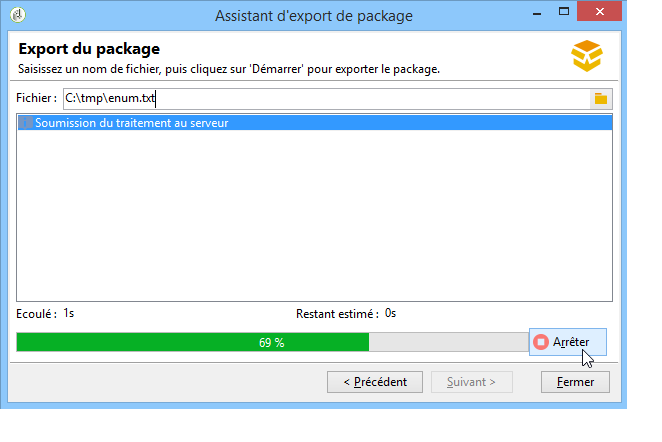

# Utiliser les packages de données{#working-with-data-packages}


## À propos des packages de données {#about-data-packages}

Adobe Campaign vous permet d&#39;exporter ou d&#39;importer la configuration et les données de la plateforme grâce à un système de packages. Les packages peuvent contenir différents types de configurations et d&#39;éléments, filtrés ou non.

Les packages de données permettent l&#39;échange des entités de la base Adobe Campaign au travers de fichiers au format XML. Chaque entité contenue dans un package est représentée avec toutes ses données.

Le principe des packages de données ou **data package** consiste à exporter un paramétrage de données puis l’intégrer dans un autre système Adobe Campaign. Découvrez comment conserver un ensemble cohérent de packages de données dans cette [section](#data-package-best-practices).

### Types de packages {#types-of-packages}

Il existe trois types de packages exportables : les packages utilisateur, les packages plateforme et les packages admin.

* **Package utilisateur** : il permet de choisir la liste des entités à exporter. Ce type de package gère les dépendances et vérifie les erreurs.
* **Package plateforme** : il regroupe toutes les ressources techniques ajoutées (non livrées d&#39;usine) : schémas, code JavaScript, etc.

  

* **Package admin** : il regroupe tous les modèles et objets métiers ajoutés (non livrés d’usine) : modèles, librairies, etc.

  

>[!CAUTION]
>
>Les types **plateforme** et **admin** contiennent une liste prédéfinie d&#39;entités à exporter. A chaque entité exportable sont associées des conditions de filtrage permettant d&#39;écarter les ressources livrées d&#39;usine du package créé.

## Structure des données {#data-structure}

La description d&#39;un package de données est un document XML structuré respectant la grammaire du schéma de données **xrk:navtree**.

Exemple de package de données :

```
<package>
  <entities schema="nms:recipient">
    <recipient email="john.smith@adobe.com" lastName="Smith" firstName="John">      
      <folder _operation="none" name="nmsRootFolder"/>      
      <company _operation="none" name="Adobe"/>
    </recipient>
  </entities>
  <entities schema="sfa:company">
    <company name="Adobe">
      location city="London" zipCode="W11 2BQ"/>
    </company>
  </entities>
</package>
```

Le document XML doit commencer et se terminer par l&#39;élément **`<package>`**. Les éléments **`<entities>`** suivants répartissent les données par type de document.

Un élément **`<entities>`** contient les données du package au format du schéma de données renseigné dans l&#39;attribut **schema**.

Les données d&#39;un package ne doivent pas contenir de clés internes non compatibles entre les bases, comme les clés auto-générées (option **autopk**).

Dans notre exemple, les jointures sur les liens &quot;folder&quot; et &quot;company&quot; ont été remplacées par les clés dites de &quot;haut niveau&quot; sur les tables destinations :

```
<recipient>
  <folder _operation="none" name="nmsRootFolder"/>
  <company _operation="none" name="Adobe"/>
</recipient>
```

L&#39;attribut **`operation`** avec la valeur &quot;none&quot; définit un lien de réconciliation.

Un package de données peut être construit à la main à partir de n&#39;importe quel éditeur texte. Il suffit que la structure du document XML soit conforme au schéma de données &quot;xtk:navtree&quot;. La console Adobe Campaign est pourvue d&#39;un module d&#39;export et d&#39;import de package de données.

## Export de packages {#exporting-packages}

### À propos de l&#39;export de packages {#about-package-export}

Les packages peuvent être exportés de trois manières différentes :

* L’ **[!UICONTROL assistant d’exportation de packages]** vous permet d’exporter un ensemble d’objets dans un seul package. Pour plus d&#39;informations, consultez la section [Exporter un ensemble d’objets dans un package](#exporting-a-set-of-objects-in-a-package)
* Un **objet unique** peut être directement exporté dans un package en cliquant dessus avec le bouton droit de la souris et en sélectionnant **[!UICONTROL Actions > Exporter dans un package]**.
* Les **définitions de packages** vous permettent de créer une structure de package dans laquelle vous ajoutez des objets qui seront exportés ultérieurement dans un package. Voir à ce sujet la section [Gérer les définitions de packages](#managing-package-definitions).

Une fois un package exporté, vous pourrez l&#39;importer ainsi que toutes les entités ajoutées dans une autre instance Campaign.

### Exporter un ensemble d&#39;objets dans un package {#exporting-a-set-of-objects-in-a-package}

L&#39;assistant d&#39;export de package est accessible à partir du menu **[!UICONTROL Outils > Avancé > Exporter le package..]** de la console cliente Adobe Campaign.


Pour les trois types de forfaits, l&#39;assistant propose les étapes suivantes :

1. Indiquez la liste des entités à exporter, par type de document :

   

   >[!CAUTION]
   >
   >Si vous exportez un dossier de type **[!UICONTROL Catégorie d’offre]**, **[!UICONTROL Environnement d’offre]**, **[!UICONTROL Programme]** ou **[!UICONTROL Plan]**, ne sélectionnez en aucun cas l’entité **xtk:folder** au risque de perdre une partie des données. Sélectionnez l&#39;entité correspondant au dossier : **nms:offerCategory** pour les catégories d&#39;offres, **nms:offerEnv** pour les environnements d&#39;offres, **nms:program** pour les programmes et **nms:plan** pour les plans.

   La gestion de la liste permet l&#39;ajout ou la suppression de la configuration des entités à exporter. Cliquez sur **[!UICONTROL Ajouter]** pour sélectionner une nouvelle entité.

   Le bouton **[!UICONTROL Détail]** édite la configuration sélectionnée.

   >[!NOTE]
   >
   >Le mécanisme de dépendance contrôle la séquence d&#39;exportation des entités. Pour plus d&#39;informations, consultez la section [Gestion des dépendances](#managing-dependencies).

1. L&#39;écran de configuration des entités définit la requête de filtrage sur le type de document à extraire.

   Vous devez paramétrer la clause de filtrage pour l&#39;extraction des données.

   

   >[!NOTE]
   >
   >Le requêteur est présenté dans [cette section](../../platform/using/about-queries-in-campaign.md).

1. Cliquez sur **[!UICONTROL Suivant]** et sélectionnez les colonnes de tri pour ordonnancer les données lors de l&#39;extraction :

   

1. Visualisez un aperçu des données à extraire avant de démarrer l&#39;export.

   

1. La dernière étape de l’assistant d’export de package permet de démarrer l’export. Les données seront stockées dans le fichier indiqué dans le champ **[!UICONTROL Fichier]**.

   

### Gérer les dépendances {#managing-dependencies}

Le mécanisme d&#39;export permet à Adobe Campaign de suivre les liens entre les éléments exportés.

Deux règles définissent le mécanisme :

* les objets liés avec un lien ayant une intégrité de type **own** ou **owncopy** sont exportés dans le même package que l&#39;objet exporté.
* les objets liés avec un lien ayant une intégrité de type **neutral** ou **define** (lien défini) doivent être exportés indépendamment.

>[!NOTE]
>
>Les types d&#39;intégrité liés aux éléments de schéma sont définis dans [cette section](../../configuration/using/database-mapping.md#links--relation-between-tables).

#### Exporter une campagne {#exporting-a-campaign}

Voici un exemple d&#39;export de campagne. La campagne marketing à exporter contient une tâche (libellé : &quot;MyTask&quot;) et un workflow (libellé : &quot;CampaignWorkflow&quot;) dans un dossier &quot;MyWorkflow&quot; (nœud : Administration / Exploitation / Workflows Techniques / Processus de campagne / MyWorkflow).

La tâche et le workflow sont exportés dans le même package que la campagne car les schémas correspondant sont reliés par des liens ayant une intégrité de type &quot;own&quot;.

Contenu de package :

```
<?xml version='1.0'?>
<package author="Administrator (admin)" buildNumber="7974" buildVersion="7.1" img=""
label="" name="" namespace="" vendor="">
 <desc></desc>
 <version buildDate="2013-01-09 10:30:18.954Z"/>
 <entities schema="nms:operation">
  <operation duration="432000" end="2013-01-14" internalName="OP1" label="MyCampaign"
  modelName="opEmpty" start="2013-01-09">
   <controlGroup>
    <where filteringSchema=""/>
   </controlGroup>
   <seedList>
    <where filteringSchema="nms:seedMember"></where>
    <seedMember internalName="SDM1"></seedMember>
   </seedList>
   <parameter useAsset="1" useBudget="1" useControlGroup="1" useDeliveryOutline="1"
   useDocument="1" useFCPValidation="0" useSeedMember="1" useTask="1"
   useValidation="1" useWorkflow="1"></parameter>
   <fcpSeed>
    <where filteringSchema="nms:seedMember"></where>
   </fcpSeed>
   <owner _operation="none" name="admin" type="0"/>
   <program _operation="none" name="nmsOperations"/>
   <task end="2013-01-17 10:07:51.000Z" label="MyTask" name="TSK2" start="2013-01-16 10:07:51.000Z"
   status="1">
    <owner _operation="none" name="admin" type="0"/>
    <operation _operation="none" internalName="OP1"/>
    <folder _operation="none" name="nmsTask"/>
   </task>
   <workflow internalName="WKF12" label="CampaignWorkflow" modelName="newOpEmpty"
   order="8982" scenario-cs="Notification of the workflow supervisor (notifySupervisor)"
   schema="nms:recipient">
    <scenario internalName="notifySupervisor"/>
    <desc></desc>
    <folder _operation="none" name="Folder4"/>
    <operation _operation="none" internalName="OP1"/>
   </workflow>
  </operation>
 </entities>
</package>   
```

L&#39;appartenance à un type de package est défini dans un schéma avec l&#39;attribut **@pkgAdmin et @pkgPlatform**. Ces deux attributs reçoivent une expression XTK définissant les conditions d&#39;appartenance au package.

```
<element name="offerEnv" img="nms:offerEnv.png" 
template="xtk:folder" pkgAdmin="@id != 0">
```

Enfin, l&#39;attribut **@pkgStatus** permet de définir les règles d&#39;export sur les éléments ou attributs. Selon la valeur de l&#39;attribut, l&#39;élément ou l&#39;attribut sera présent dans le package exporté. Les trois valeurs possibles pour cet attribut sont :

* **never** : n&#39;exporte pas le champ / lien
* **always** : force l&#39;export de ce champ
* **preCreate** : autorise la création de l&#39;entité liée

>[!NOTE]
>
>La valeur **preCreate** est admise uniquement sur les éléments de type lien. Elle autorise à créer ou à pointer vers une entité qui n&#39;est pas encore chargée dans le package exportée.

## Gérer les définitions de packages {#managing-package-definitions}

Les définitions de packages vous permettent de créer une structure de package dans laquelle vous ajoutez les entités qui seront exportées ultérieurement dans un même package. Vous pourrez ensuite importer ce package et toutes les entités ajoutées dans une autre instance Campaign.

**Rubriques connexes :**

* [Créer une définition de package](#creating-a-package-definition)
* [Ajouter des entités à une définition de package](#adding-entities-to-a-package-definition)
* [Paramétrer la génération des définitions de packages](#configuring-package-definitions-generation)
* [Exporter des packages à partir d&#39;une définition de package](#exporting-packages-from-a-package-definition)

### Créer une définition de package {#creating-a-package-definition}

Les définitions de packages sont accessibles à partir du menu **[!UICONTROL Administration > Paramétrage > Gestion des packages > Définitions de packages]**.

Pour créer une définition de package, cliquez sur le bouton **[!UICONTROL Nouveau]**, puis remplissez les informations générales de la définition de package.


Vous pouvez ensuite ajouter des entités à la définition de package et l&#39;exporter dans un package de fichier XML.

**Rubriques connexes :**

* [Ajouter des entités à une définition de package](#adding-entities-to-a-package-definition)
* [Paramétrer la génération des définitions de packages](#configuring-package-definitions-generation)
* [Exporter des packages à partir d&#39;une définition de package](#exporting-packages-from-a-package-definition)

### Ajouter des entités à une définition de package {#adding-entities-to-a-package-definition}

Dans l’onglet **[!UICONTROL Contenu]**, cliquez sur le bouton **[!UICONTROL Ajouter]** pour sélectionner les entités à exporter avec le package. Les meilleures pratiques lors de la sélection des entités sont présentées dans [cette section](#exporting-a-set-of-objects-in-a-package).


Les entités peuvent être ajoutées directement à une définition de package à partir de leur emplacement dans l&#39;instance. Pour ce faire, suivez les étapes ci-dessous :

1. Cliquez avec le bouton droit de la souris sur l&#39;entité désirée, puis sélectionnez **[!UICONTROL Actions > Exporter dans un package]**.

   

1. Sélectionnez **[!UICONTROL Ajout dans une définition de package]**, puis sélectionnez la définition de package dans laquelle vous voulez ajouter l&#39;entité.

   

1. L&#39;entité est ajoutée dans la définition de package, elle sera exportée avec le package (voir [cette section](#exporting-packages-from-a-package-definition)).

   

### Paramétrer la génération des définitions de packages {#configuring-package-definitions-generation}

La génération de packages peut être paramétrée à partir de l&#39;onglet **[!UICONTROL Contenu]** de définition de package. Pour ce faire, cliquez sur le lien **[!UICONTROL Paramètres de génération]**.


* **[!UICONTROL Inclure la définition]** : inclut la définition actuellement utilisée dans la définition de package.
* **[!UICONTROL Inclure un script d&#39;installation]** : vous permet d&#39;ajouter un script JavaScript à exécuter à l&#39;importation du package. S’il est sélectionné, un onglet **[!UICONTROL Script]** est ajouté à l’écran de définition de package.
* **[!UICONTROL Inclure les valeurs par défaut]** : ajoute au package les valeurs de tous les attributs des entités.

  Cette option n&#39;est pas sélectionnée par défaut de manière à éviter les exports de longueur importante. Cela signifie que les attributs des entités avec des valeurs par défaut (&#39;chaîne vide&#39;, &#39;0&#39; et &#39;faux&#39; si elles ne sont pas définies d&#39;une autre façon dans le schéma) ne seront pas ajoutés dans le package et ne seront donc pas exportés.

  >[!CAUTION]
  >
  >La désélection de cette option peut entraîner une fusion des versions locales et importées.
  >
  >Si l&#39;instance où le package est importé contient des entités identiques à celles du package (par exemple, avec le même ID externe), leurs attributs ne seront pas mis à jour. Cela se produit si les attributs d&#39;une instance précédente possèdent des valeurs par défaut, car ils ne sont pas inclus dans le package.
  >
  >Dans ce cas, la sélection de l’option **[!UICONTROL Inclure les valeurs par défaut]** empêcherait la fusion des versions, car tous les attributs de l’instance précédente seraient exportés avec le package.

### Exporter des packages à partir d&#39;une définition de package {#exporting-packages-from-a-package-definition}

Pour exporter un package à partir d’une définition de package, suivez les étapes ci-dessous :

1. Sélectionnez la définition de package à exporter, puis cliquez sur le bouton **[!UICONTROL Actions]** et sélectionnez **[!UICONTROL Exporter le package]**.
1. Un fichier XML correspondant au package exporté est sélectionné par défaut. Il est nommé en fonction de l&#39;espace de noms et du nom de la définition de package.
1. Une fois le nom de package et l&#39;emplacement définis, cliquez sur le bouton **[!UICONTROL Démarrer]** pour lancer l&#39;exportation.

   

## Importer des packages {#importing-packages}

L’assistant d’import de package est accessible à partir du menu principal **[!UICONTROL Outils > Avancé > Import de package]** de la console cliente Adobe Campaign.

Vous pouvez importer le package d’un export réalisé antérieurement, par exemple à partir d’une autre instance Adobe Campaign, ou un [package intégré](../../installation/using/installing-campaign-standard-packages.md), selon les conditions de votre licence.


### Installer un package depuis un fichier {#installing-a-package-from-a-file}

Pour importer un package de données existant, sélectionnez le fichier XML et cliquez sur **[!UICONTROL Ouvrir]**.


Le contenu du package à importer est alors affiché dans la section centrale de l&#39;éditeur.

Cliquez sur **[!UICONTROL Suivant]** puis sur **[!UICONTROL Démarrer]** pour lancer l&#39;import.


### Installer un package natif {#installing-a-standard-package}

Les packages standard sont des packages natifs, installés lors de la configuration d’Adobe Campaign. Selon vos autorisations et votre modèle de déploiement, vous pouvez importer de nouveaux packages standard si vous acquérez de nouvelles options ou de nouveaux modules complémentaires ou si vous effectuez une mise à niveau vers une nouvelle offre.

Reportez-vous à votre contrat de licence pour savoir quels packages peuvent être installés.

Pour plus d&#39;informations sur les packages natifs, consultez [cette page](../../installation/using/installing-campaign-standard-packages.md).

## Bonnes pratiques relatives aux packages de données {#data-package-best-practices}

Cette section décrit comment organiser les packages de données de façon cohérente tout au long de la vie du projet.

Les packages peuvent contenir différents types de configurations et d&#39;éléments, filtrés ou non. S&#39;il manque certains éléments ou si vous n&#39;importez pas les éléments/les packages dans l&#39;ordre approprié, il est possible que la configuration de la plateforme soit interrompue.

De plus, si plusieurs personnes travaillent sur la même plateforme avec de nombreuses fonctionnalités différentes, le dossier contenant les spécifications des packages peut rapidement devenir complexe.

Bien que son utilisation ne soit pas obligatoire, cette section propose une solution afin de mieux organiser et utiliser des packages dans Adobe Campaign pour des projets de grande envergure.

Les principales contraintes sont les suivantes :
* Organiser les packages et suivre les modifications et les dates
* Si une configuration est mise à jour, minimiser le risque de détériorer un élément qui n&#39;est pas directement lié à la mise à jour.

>[!NOTE]
>
>Pour plus d&#39;informations sur la configuration d&#39;un workflow d&#39;export automatique de packages, voir [cette page](https://helpx.adobe.com/fr/campaign/kb/export-packages-automatically.html).

### Recommandations {#data-package-recommendations}

Effectuez toujours l&#39;import dans la même version de la plateforme. Vous devez vérifier que vous déployez vos packages entre deux instances associées au même build. Ne forcez jamais l&#39;import et mettez toujours la plateforme à jour en premier (si le build est différent).

>[!IMPORTANT]
>
>L&#39;import entre différentes versions n&#39;est pas pris en charge par Adobe.
<!--This is not allowed. Importing from 6.02 to 6.1, for example, is prohibited. If you do so, R&D won’t be able to help you resolve any issues you encounter.-->

Accordez de l&#39;attention à la structure du schéma et de la base de données. L&#39;import de packages avec schéma doit être suivie de la génération des schémas.

### Solution {#data-package-solution}

#### Types de packages {#package-types}

Commencez par définir différents types de packages. Quatre types seulement seront utilisés :

**Entités**
* Tous les éléments spécifiques &quot;xtk&quot; et &quot;nms&quot; d’Adobe Campaign, tels que les schémas, les formulaires, les dossiers, les modèles de diffusion, etc.
* Vous pouvez considérer une entité à la fois comme un élément &quot;admin&quot; et comme un élément &quot;plateforme&quot;.
* Vous ne devez pas inclure plus d&#39;une entité dans un package lorsque vous le chargez sur une instance Campaign.

<!--Nothing “works” alone. An entity package does not have a specific role or objective.-->

Si vous devez déployer votre configuration sur une nouvelle instance, vous pouvez importer tous vos packages d&#39;entités.

**Fonctionnalités**

Ce type de package a les avantages suivants :
* Répond à une exigence/spécification du client.
* Contient une ou plusieurs fonctionnalités.
* Doit contenir toutes les dépendances pour pouvoir exécuter la fonctionnalité sans aucun autre package.

**Campagnes**

Ce package n&#39;est pas obligatoire. Il est parfois utile de créer un type spécifique pour toutes les campagnes, même si une campagne peut être considérée comme une fonctionnalité.

**Mises à jour**

Une fois configurée, une fonctionnalité peut être exportée dans un autre environnement. Par exemple, le package peut être exporté d&#39;un environnement de développement vers un environnement de test. Dans ce test, un défaut est mis en évidence. Il doit être tout d&#39;abord corrigé dans l&#39;environnement de développement. Ensuite, le correctif doit être appliqué à la plateforme de test.

La première solution consisterait à réexporter l&#39;ensemble de la fonctionnalité. Cependant, pour éviter tout risque (comme la mise à jour d&#39;éléments indésirables), il est plus sûr d&#39;avoir un package ne contenant que la correction.

Nous vous recommandons donc de créer un package de « mise à jour » contenant un seul type d&#39;entité pour la fonctionnalité.

Une mise à jour peut non seulement être constituée d&#39;un correctif, mais aussi d&#39;un nouvel élément de votre package d&#39;entité/de fonctionnalité/de campagne. Pour éviter de déployer l&#39;ensemble du package, vous pouvez exporter un package de mise à jour.

### Conventions de dénomination {#data-package-naming}

Les types étant définis, nous devons spécifier une convention de dénomination. Adobe Campaign ne permettant pas de créer des sous-dossiers pour les spécifications de package, les nombres constituent la meilleure solution pour assurer l’organisation. Les nombres servent de préfixes pour les noms de packages. Vous pouvez utiliser la convention suivante :

* Entité : de 1 à 99
* Fonctionnalité : de 100 à 199
* Campagne : de 200 à 299
* Mise à jour : de 5000 à 5999

### Packages   {#data-packages}

>[!NOTE]
>
>Il est préférable de définit des règles pour fixer le nombre correct de packages.

#### Ordre des packages d&#39;entité {#entity-packages-order}

Pour faciliter l&#39;import, les packages d&#39;entités doivent être classés au fur et à mesure de leur importation. Par exemple :
* 001 – Schéma
* 002 – Formulaire
* 003 – Images
* etc.

>[!NOTE]
>
>Les formulaires ne doivent être importés qu&#39;après les mises à jour de schémas.

#### Package 200 {#package-200}

Le numéro de package « 200 » ne doit pas être utilisé pour une campagne spécifique : il sera utilisé pour mettre à jour une information qui concerne toutes les campagnes.

#### Mettre à jour le package {#update-package}

Le dernier point concerne la numérotation des packages de mise à jour. Il s&#39;agit du numéro de package (entité, fonctionnalité ou campagne) avec un préfixe « 5 ». Par exemple :
* 5001 pour mettre à jour un schéma
* 5200 pour mettre à jour toutes les campagnes
* 5101 pour mettre à jour la fonctionnalité 101

Le package de mise à jour ne doit contenir qu&#39;une seule entité spécifique pour être facilement réutilisable. Pour le fractionner, ajoutez un nouveau nombre (en commençant par 1). Il n&#39;existe pas de règles d&#39;ordre spécifiques pour ces packages. Pour mieux comprendre, imaginez que nous ayons une fonctionnalité 101, pour une application de réseaux sociaux :
* elle contient une application webApp et un compte externe.
   * Le libellé du package est : 101 - Application de réseaux sociaux (socialApplication).
* Un dysfonctionnement se produit dans la webApp.
   * Le fichier wepApp est corrigé.
   * Un package de correctifs doit être créé avec le nom suivant : 5101 - 1 - Application de réseaux sociaux webApp (socialApplication_webApp).
* Un nouveau compte externe doit être ajouté pour la fonction de réseaux sociaux.
   * Le compte externe est créé.
   * Le nouveau package est : 5101 - 2 - compte externe de l&#39;application de réseaux sociaux (socialApplication_extAccount).
   * En parallèle, le package 101 est mis à jour pour être ajouté au compte externe, mais sans être déployé.
     

#### Documentation du package {#package-documentation}

Lorsque vous mettez à jour un package, vous devez toujours insérer un commentaire dans le champ de description pour donner des informations détaillées sur les modifications et les motifs (par exemple, « ajouter un nouveau schéma » ou « corriger un défaut »).


Vous devez également dater le commentaire. Signalez toujours au « parent » le commentaire relatif à un package de mise à jour (package sans préfixe 5).

>[!IMPORTANT]
>
>Le champ de description peut contenir 2 000 caractères au maximum.
