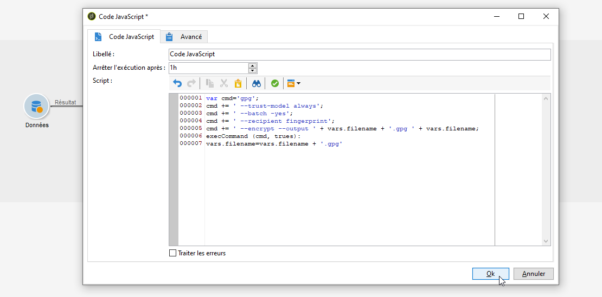

# Compresser ou chiffrer un fichier {#zipping-or-encrypting-a-file}


Adobe Campaign permet d&#39;exporter des fichiers compressés ou chiffrés. Lors de la définition d&#39;un export par le biais d&#39;une activité **[!UICONTROL Extraction (fichier)]**, vous pouvez définir une étape de post-traitement pour le compresser ou le chiffrer.

Pour ce faire :

1. Installez une paire de clés GPG pour votre instance à l’aide du [Panneau de contrôle](https://experienceleague.adobe.com/docs/control-panel/using/instances-settings/gpg-keys-management.html?lang=fr#encrypting-data).

   >[!NOTE]
   >
   >Le Panneau de contrôle est restreint aux utilisateurs administrateurs et est disponible uniquement pour certaines versions de Campaign. [En savoir plus](https://experienceleague.adobe.com/docs/control-panel/using/discover-control-panel/key-features.html?lang=fr)

1. Si votre installation d&#39;Adobe Campaign est hébergée par Adobe, contactez l&#39;[Assistance clientèle d&#39;Adobe](https://helpx.adobe.com/fr/enterprise/admin-guide.html/enterprise/using/support-for-experience-cloud.ug.html) afin que les utilitaires nécessaires soient installés sur le serveur.
1. S&#39;il s&#39;agit d&#39;une installation on-premise, installez l&#39;utilitaire que vous souhaitez utiliser (GPG ou GZIP, par exemple) ainsi que les clés (clé de chiffrement) nécessaires sur le serveur applicatif.

Vous pouvez ensuite utiliser des commandes ou du code dans l&#39;onglet **[!UICONTROL Script]** de l&#39;activité ou dans une activité **[!UICONTROL Code JavaScript]**. Le cas pratique ci-dessous présente un exemple.

**Rubriques connexes :**

* [Décompression ou déchiffrement d&#39;un fichier avant traitement](../../platform/using/unzip-decrypt.md)
* [Activité Extraction (fichier)](../../workflow/using/extraction--file-.md).

## Cas pratique : chiffrage et export de données à l’aide d’une clé installée sur le Panneau de contrôle {#use-case-gpg-encrypt}

Dans ce cas pratique, nous allons créer un workflow pour chiffrer et exporter des données à l&#39;aide d&#39;une clé installée sur le Panneau de contrôle.

 [Découvrez cette fonctionnalité en vidéo](#video)

Les étapes pour traiter ce cas pratique sont les suivantes :

1. Générez une paire de clés GPG (publique/privée) à l’aide d’un utilitaire GPG, puis installez la clé publique sur le Panneau de contrôle. Les étapes détaillées sont disponibles dans la [documentation du Panneau de contrôle](https://experienceleague.adobe.com/docs/control-panel/using/instances-settings/gpg-keys-management.html?lang=fr#encrypting-data).

1. Dans Campaign Classic, créez un workflow pour exporter les données et les chiffrer à l’aide de la clé privée installée à l’aide du Panneau de contrôle. Pour ce faire, nous allons créer un workflow comme suit :

   

   * Activité **[!UICONTROL Requête]** : dans cet exemple, nous voulons exécuter une requête pour cibler les données de la base de données que nous voulons exporter.
   * Activité **[!UICONTROL Extraction (fichier)]** : extrait les données dans un fichier.
   * Activité **[!UICONTROL Code JavaScript]** : chiffre les données à extraire.
   * Activité **[!UICONTROL Transfert de fichier]** : envoie les données à une source externe (dans cet exemple, un serveur SFTP).

1. Configurez l&#39;activité **[!UICONTROL Requête]** pour qu&#39;elle cible les données de votre choix dans la base de données. Voir à ce propos [cette section](../../workflow/using/query.md).

1. Ouvrez l&#39;activité **[!UICONTROL Extraction des données (fichier)]** puis configurez-la selon vos besoins. Les concepts généraux de configuration de l&#39;activité sont présentés dans [cette section](../../workflow/using/extraction--file-.md).

   

1. Ouvrez l&#39;activité **[!UICONTROL Code JavaScript]**, puis copiez-collez la commande ci-dessous pour chiffrer les données à extraire.

   >[!IMPORTANT]
   >
   >Veillez à remplacer la valeur d&#39;**empreinte** de la commande par l&#39;empreinte de la clé publique installée sur le Panneau de contrôle.

   ```
   var cmd='gpg ';
   cmd += ' --trust-model always';
   cmd += ' --batch --yes';
   cmd += ' --recipient fingerprint';
   cmd += ' --encrypt --output ' + vars.filename + '.gpg ' + vars.filename;
   execCommand(cmd,true);
   vars.filename=vars.filename + '.gpg'
   ```

   

1. Ouvrez l’activité **[!UICONTROL Transfert de fichier]**, puis spécifiez le serveur SFTP auquel vous souhaitez envoyer le fichier. Les concepts généraux de configuration de l&#39;activité sont présentés dans [cette section](../../workflow/using/file-transfer.md).

   

1. Vous pouvez maintenant exécuter le workflow. Une fois exécuté, les données ciblées par la requête sont exportées vers le serveur SFTP dans un fichier .gpg chiffré.

## Tutoriel vidéo {#video}

Cette vidéo montre comment utiliser une clé GPG pour chiffrer des données. Elle est également disponible dans

>[!VIDEO](https://video.tv.adobe.com/v/36399?quality=12)

D&#39;autres vidéos pratiques sur Campaign Classic sont disponibles [ici](https://experienceleague.adobe.com/docs/campaign-classic-learn/tutorials/overview.html?lang=fr).
