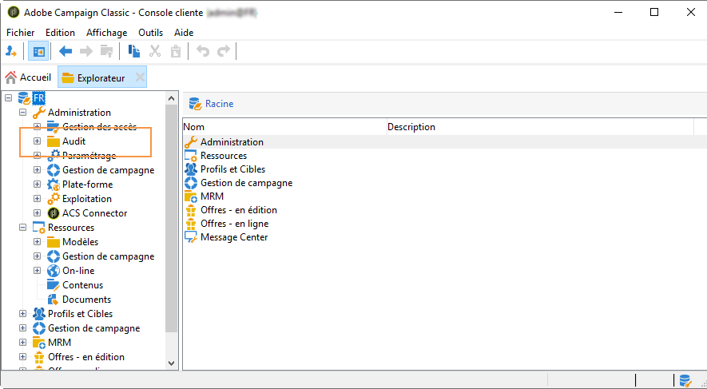
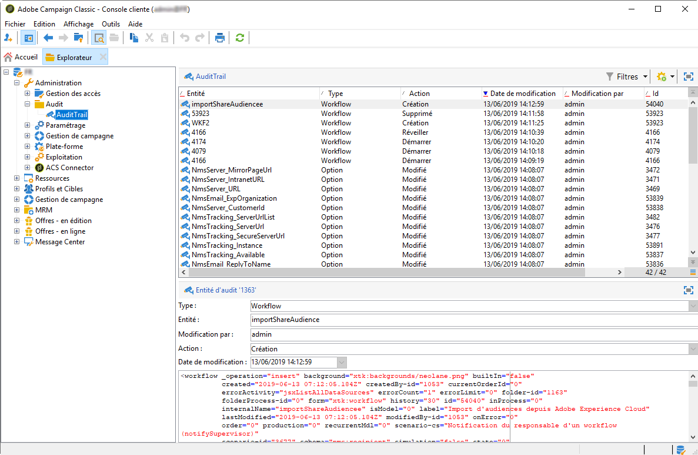
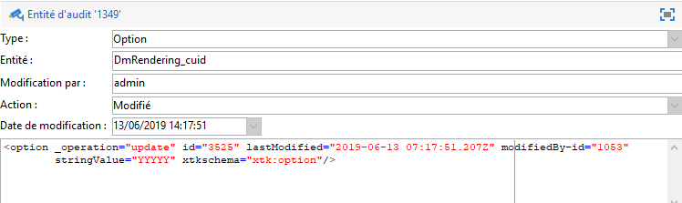
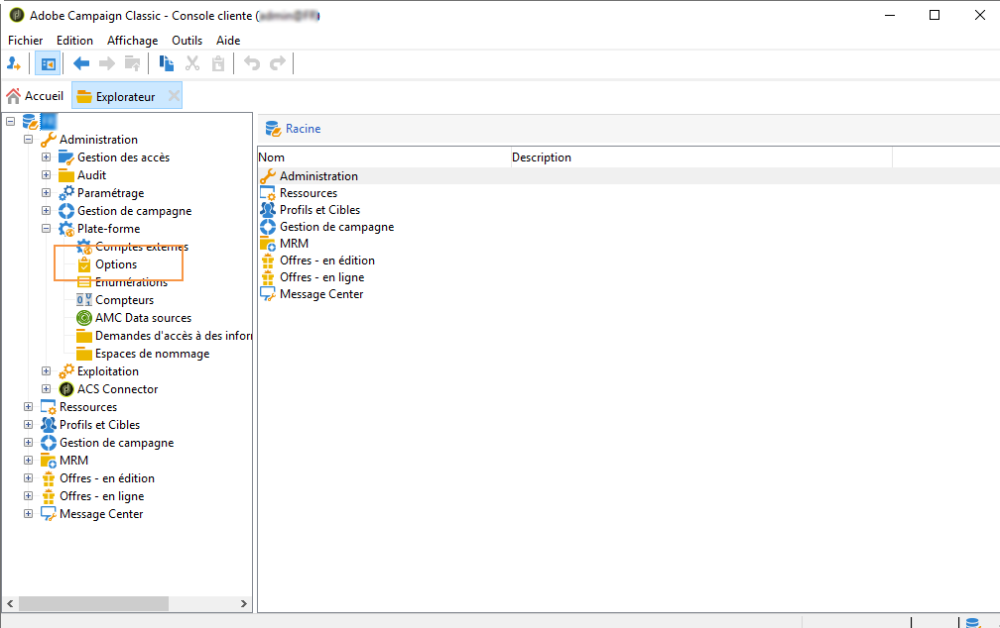
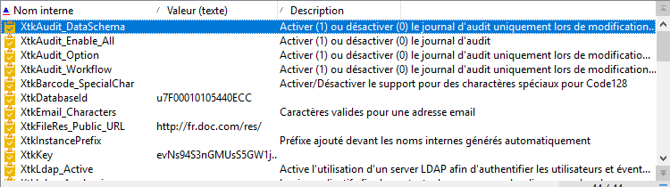
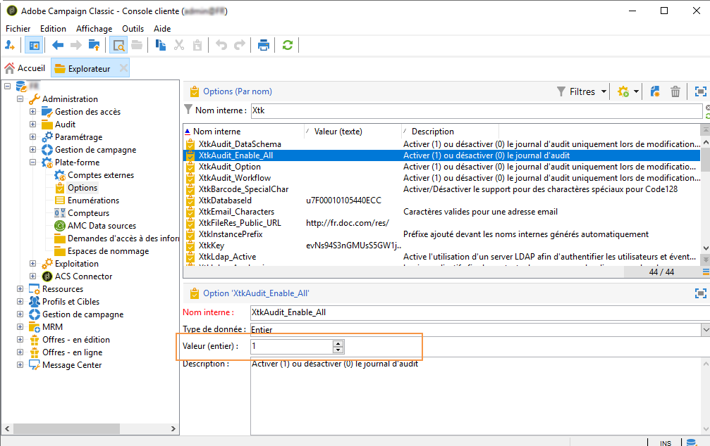

# Journal d’audit{#audit-trail}

Dans Adobe Campaign, le **[!UICONTROL Suivi]** vous donne accès à l’historique complet des modifications apportées à votre instance.

Le **[!UICONTROL Suivi]** capture en temps réel la liste complète des actions et des événements qui se produisent au sein de votre instance Adobe Campaign. Il vous permet d’accéder à un historique de données en libre-service afin de vous aider à répondre à des questions portant notamment sur ce qui arrivé à vos workflows, les personnes qui les ont mis à jour pour la dernière fois et ce qu’ont fait vos utilisateurs dans l’instance.

>[!NOTE]
>
>Adobe Campaign n’effectue pas le suivi des modifications apportées aux droits des utilisateurs, aux modèles, aux personnalisations ni aux campagnes.\
>Le Suivi peut uniquement être géré par les administrateurs de l’instance.

Le Suivi comprend trois composants :

* **Suivi Schéma** : consultez les activités et les dernières modifications apportées à vos schémas.

   Pour plus d’informations sur les schémas, consultez [cette page](../../configuration/using/data-schemas.md).

* **Suivi Workflow** : consultez les activités et les dernières modifications apportées aux workflows, ainsi que l’état de vos workflows, tel que :

   * Démarrer
   * Pause
   * Arrêter
   * Redémarrer
   * Nettoyer qui correspond à l’action Purge de l’historique
   * Simuler qui correspond à l’action Démarrer en mode simulation
   * Réveiller qui correspond à l’action Traitement anticipé des tâches en attente
   * Arrêt inconditionnel

   Pour plus d’informations sur les workflows, consultez [cette page](../../workflow/using/about-workflows.md).

   Pour plus d’informations sur la surveillance des workflows, consultez la [section dédiée](../../workflow/using/monitoring-workflow-execution.md).

* **Suivi Option** : consultez les activités et les dernières modifications apportées à vos options.

   Pour plus d’informations sur les options, consultez [cette page](../../installation/using/configuring-campaign-options.md).

## Accéder au Suivi {#accessing-audit-trail}

Pour accéder au **[!UICONTROL Suivi]** de votre instance :

1. Accédez au menu **[!UICONTROL Explorateur]** de votre instance.
1. Sous le menu **[!UICONTROL Administration]**, sélectionnez **[!UICONTROL Suivi]** .

   

1. La fenêtre **[!UICONTROL Suivi]** s’ouvre avec la liste de vos entités. Adobe Campaign effectuera le suivi des actions de création, d’édition et de suppression pour les workflows, les options et les schémas.

   Sélectionnez l’une des entités pour en savoir plus sur les dernières modifications.

   

1. La fenêtre **[!UICONTROL Entité d’audit]** vous donne des informations plus détaillées sur l’entité choisie, telles que :

   * **[!UICONTROL Type]** : Workflow, Options ou Schémas.
   * **[!UICONTROL Entité]** : nom interne de vos activités.
   * **[!UICONTROL Modifié par]** : nom d’utilisateur de la dernière personne à avoir modifié cette entité.
   * **[!UICONTROL Action]** : dernière action réalisée sur cette entité (création, édition ou suppression).
   * **[!UICONTROL Date de modification]** : date de la dernière action effectuée sur cette entité.

   Ce bloc de code vous donne davantage d’informations sur ce qui a été modifié dans votre entité.

   

>[!NOTE]
>
>Par défaut, la période de conservation est définie sur 180 jours pour les **[!UICONTROL Logs d’audit]**. Pour plus d’informations sur la façon de la modifier, consultez [cette page](../../production/using/database-cleanup-workflow.md#deployment-wizard).

## Activer/désactiver le Suivi {#enable-disable-audit-trail}

Le Suivi peut être facilement activé ou désactivé pour une activité spécifique, par exemple si vous voulez économiser de l’espace sur la base de données.

Pour ce faire :

1. Accédez au menu **[!UICONTROL Explorateur]** de votre instance.
1. Sous le menu **[!UICONTROL Administration]**, sélectionnez **[!UICONTROL Plateforme]** puis **[!UICONTROL Options]** .

   

1. Sélectionnez l’une des options suivantes selon l’entité que vous voulez activer/désactiver :

   * Pour un workflow : **[!UICONTROL XtkAudit_Workflows]**
   * Pour un schéma : **[!UICONTROL XtkAudit_DataSchema]**
   * Pour une option : **[!UICONTROL XtkAudit_Option]**
   * Pour chaque entité : **[!UICONTROL XtkAudit_Enable_All]**

   

1. Définissez la **[!UICONTROL Valeur]** sur 1 si vous voulez activer l’entité, ou sur 0 si vous voulez la désactiver.

   

1. Cliquez sur **[!UICONTROL Enregistrer]** .
