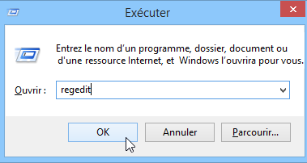
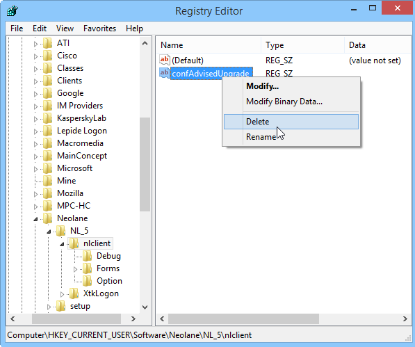

# Mise à jour de la console{#console-update}

Si vous avez coché l&#39;option **[!UICONTROL Ne pas demander la mise à jour de la console]** et que vous souhaitez réactiver la demande de mise à jour, la procédure est la suivante :

1. Ouvrez l’éditeur de la base de registre via la commande **regedit** depuis le menu **[!UICONTROL Démarrer > Exécuter]** de Windows.

   

1. Dans l’arborescence, affichez les options du nœud **[!UICONTROL HKEY_CURRENT_USERSoftwareneolaneNL_6nlclient]**.
1. Supprimez l&#39;entrée **[!UICONTROL confAdvisedUpgrade]** et fermez l&#39;éditeur de base de registre.

   
