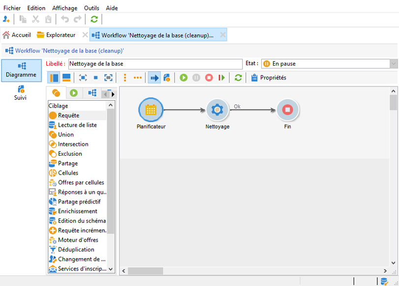
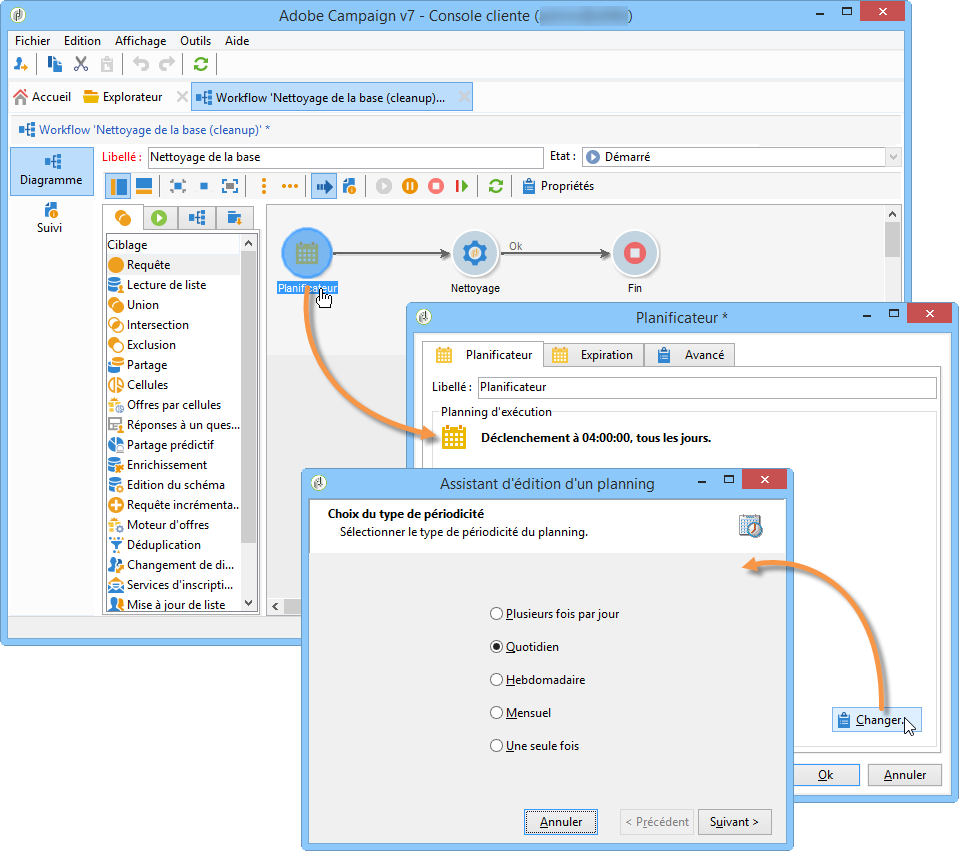
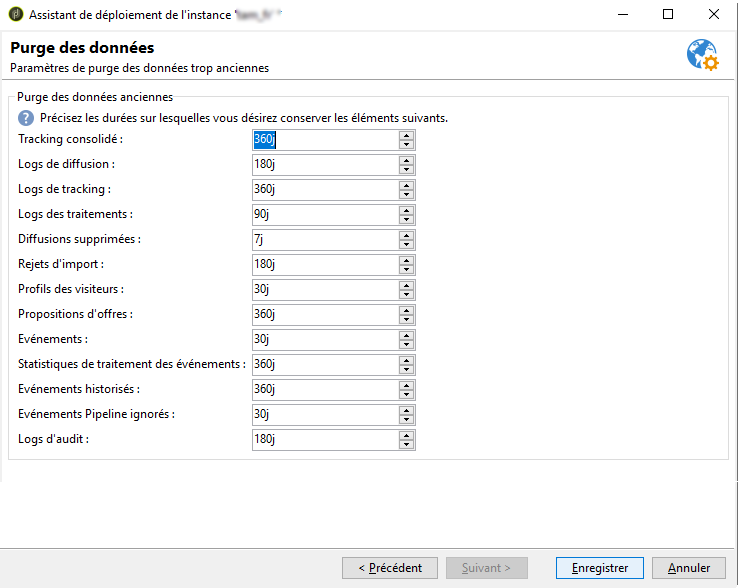

# Workflow de nettoyage de la base de données{#database-cleanup-workflow}


## Introduction {#introduction}

Le workflow **[!UICONTROL Nettoyage de la base]** (cleanup), accessible à partir du noeud **[!UICONTROL Administration > Exploitation > Workflows techniques]**, permet de supprimer les données obsolètes afin d&#39;éviter une croissance exponentielle de la base. Le workflow se déclenche de manière automatique sans intervention de l&#39;utilisateur.



## Configuration  {#configuration}

Le paramétrage du nettoyage de la base s&#39;effectue à deux niveaux : dans le planificateur du workflow et dans l&#39;assistant de déploiement.

### Planificateur de workflow {#the-scheduler}

>[!NOTE]
>
>Pour plus d’informations sur le planificateur, reportez-vous à [cette section](../../workflow/using/scheduler.md).

Par défaut, le workflow **[!UICONTROL Nettoyage de la base]** est paramétré pour se déclencher tous les jours, à 4 heures du matin. Le planificateur vous permet de modifier la fréquence de déclenchement du workflow. Les fréquences disponibles sont les suivantes :

* **[!UICONTROL Plusieurs fois par jour]**
* **[!UICONTROL Quotidien]**
* **[!UICONTROL Hebdomadaire]**
* **[!UICONTROL Une seule fois]**



>[!IMPORTANT]
>
>Pour que le processus **[!UICONTROL Nettoyage de la base de données]** démarre à la date et à l’heure définies dans le planificateur, le moteur de workflow (wfserver) doit être démarré.

### L’assistant de déploiement {#deployment-wizard}

L&#39;**[!UICONTROL Assistant de déploiement]**, accessible à partir du menu **[!UICONTROL Outils > Avancé]**, vous permet de paramétrer la durée pendant laquelle certaines données sont conservées. Les valeurs sont exprimées en jours. Si ces valeurs ne sont pas modifiées, le workflow utilisera les valeurs par défaut.



Les champs de la fenêtre **[!UICONTROL Purge des données]** correspondent aux options suivantes. Ces options sont utilisées par certaines des tâches exécutées par le workflow **[!UICONTROL Nettoyage de la base]** :

* Tracking consolidé : **NmsCleanup_TrackingStatPurgeDelay** (voir [Nettoyage des logs de tracking](#cleanup-of-tracking-logs))
* Logs de diffusion : **NmsCleanup_BroadLogPurgeDelay** (voir [Nettoyage des logs de diffusion](#cleanup-of-delivery-logs))
* Logs de tracking : **NmsCleanup_TrackingLogPurgeDelay** (voir [Nettoyage des logs de tracking](#cleanup-of-tracking-logs))
* Diffusions supprimées : **NmsCleanup_RecycledDeliveryPurgeDelay** (voir [Nettoyage des diffusions à supprimer ou à recycler](#cleanup-of-deliveries-to-be-deleted-or-recycled))
* Rejets d’import : **NmsCleanup_RejectsPurgeDelay** (voir [Nettoyage des rejets générés par les imports](#cleanup-of-rejects-generated-by-imports-))
* Profils des visiteurs : **NmsCleanup_VisitorPurgeDelay** (voir [Nettoyage des visiteurs](#cleanup-of-visitors))
* Propositions d’offres : **NmsCleanup_PropositionPurgeDelay** (voir [Nettoyage des propositions](#cleanup-of-propositions))

   >[!NOTE]
   >
   >Le champ **[!UICONTROL Propositions d&#39;offres]** est uniquement disponible si le module **Interaction** est installé.

* Événements : **NmsCleanup_EventPurgeDelay** (voir [Nettoyage des événements expirés](#cleansing-expired-events))
* Événements historisés : **NmsCleanup_EventHistoPurgeDelay** (voir [Nettoyage des événements expirés](#cleansing-expired-events))

   >[!NOTE]
   >
   >Les champs **[!UICONTROL Evénements]** et **[!UICONTROL Evénements historisés]** sont uniquement disponibles si le module **Message Center** est installé.

* Journal d’audit : **XtkCleanup_AuditTrailPurgeDelay** (voir [Nettoyage du journal d’audit](#cleanup-of-audit-trail))

L&#39;ensemble des tâches exécutées par le workflow **[!UICONTROL Nettoyage de la base]** sont décrites dans la section qui suit.

## Tâches effectuées par le workflow Nettoyage de la base {#tasks-carried-out-by-the-database-cleanup-workflow}

À la date et à l’heure définies dans le planificateur de workflow (voir [Le planificateur](#the-scheduler)), le moteur de workflow lance le processus de nettoyage de la base. Le Nettoyage de la base se connecte à la base de données et exécute les tâches dans l’ordre indiqué ci-dessous.

>[!IMPORTANT]
>
>Si l’une de ces tâches échoue, les tâches suivantes ne seront pas exécutées.
>
>Les requêtes SQL comportant un attribut **LIMIT** sont exécutées de façon répétée jusqu’à ce que toutes les informations aient été traitées.


### Nettoyage des listes à supprimer {#lists-to-delete-cleanup}

La première tâche exécutée par le workflow **[!UICONTROL Nettoyage de la base]** supprime tous les groupes avec l’attribut **deleteStatus != 0** du **NmsGroup**. Les enregistrements liés à ces groupes et qui existent dans d’autres tables sont également supprimés.

1. Les listes à supprimer sont récupérées à l&#39;aide de la requête SQL suivante :

   ```sql
   SELECT iGroupId, sLabel, iType FROM NmsGroup WHERE iDeleteStatus <> 0 OR tsExpirationDate <= GetDate() 
   ```

1. Chaque liste possède plusieurs liens vers d&#39;autres tables. Tous ces liens sont supprimés en masse à l&#39;aide de la requête suivante :

   ```sql
   DELETE FROM $(relatedTable) WHERE iGroupId=$(l) IN (SELECT iGroupId FROM $(relatedTable) WHERE iGroupId=$(l) LIMIT 5000) 
   ```

   où `$(relatedTable)` est un tableau associé à **NmsGroup** et `$(l)` est l’identifiant de la liste.

1. Lorsque la liste est de type &#39;Liste&#39;, la table associée est supprimée à l&#39;aide de la requête suivante :

   ```sql
   DROP TABLE grp$(l)
   ```

1. Chaque liste récupérée par l&#39;opération de type **Select** est supprimée à l&#39;aide de la requête suivante :

   ```sql
   DELETE FROM NmsGroup WHERE iGroupId=$(l) 
   ```

   où `$(l)` est l’identifiant de la liste

### Nettoyage des diffusions à supprimer ou à recycler {#cleanup-of-deliveries-to-be-deleted-or-recycled}

Cette tâche purge toutes les diffusions à supprimer ou à recycler.

1. Le workflow **[!UICONTROL Nettoyage de la base]** sélectionne toutes les diffusions pour lesquelles le champ **deleteStatus** a la valeur **[!UICONTROL Oui]** ou **[!UICONTROL Recyclé]** et dont la date de suppression est antérieure à la période définie dans le champ **[!UICONTROL Diffusions supprimées]** (**NmsCleanup_RecycledDeliveryPurgeDelay)** de l’assistant de déploiement. Pour plus d’informations, consultez [Assistant de déploiement](#deployment-wizard). Cette période est calculée par rapport à la date actuelle du serveur.
1. La tâche sélectionne ensuite, pour chaque serveur de mid-sourcing, la liste des diffusions à supprimer.
1. Le workflow **[!UICONTROL Nettoyage de la base]** supprime les logs de diffusion, les pièces jointes, les informations de pages miroir et toute autre donnée associée.
1. Avant la suppression définitive de la diffusion, le workflow purge les informations associées dans les tables suivantes :

   * Dans la table des exclusions de diffusion (**NmsDlvExclusion**), la requête suivante est utilisée :

      ```sql
      DELETE FROM NmsDlvExclusion WHERE iDeliveryId=$(l)
      ```

      où **$(l)** est l’identifiant de la diffusion.

   * Dans la table des coupons (**NmsCouponValue**), la requête suivante est utilisée (avec des suppressions en masse) :

      ```sql
      DELETE FROM NmsCouponValue WHERE iMessageId IN (SELECT iMessageId FROM NmsCouponValue WHERE EXISTS (SELECT B.iBroadLogId FROM $(BroadLogTableName) B WHERE B.iDeliveryId = $(l) AND B.iBroadLogId = iMessageId ) LIMIT 5000)
      ```

      où `$(l)` est l’identifiant de la diffusion.

   * Dans les tables de logs de diffusion (**NmsBroadlogXxx**), les suppressions en masse sont exécutées par groupes de 20 000 enregistrements.
   * Dans les tables de propositions d’offres (**NmsPropositionXxx**), les suppressions en masse sont exécutées par groupes de 20 000 enregistrements.
   * Dans les tables de logs de tracking (**NmsTrackinglogXxx**), les suppressions en masse sont exécutées par groupes de 20 000 enregistrements.
   * Dans la table de fragments de diffusion (**NmsDeliveryPart**), les suppressions en masse sont exécutées par groupes de 500 000 enregistrements. Cette table contient des informations de personnalisation relatives aux messages restants à diffuser.
   * Dans la table des fragments de données des pages miroir (**NmsMirrorPageInfo**), les suppressions en masse sont exécutées par groupes de 20 000 enregistrements pour les fragments de diffusion arrivés à expiration, mais aussi terminés ou annulés. Cette table contient des informations de personnalisation relatives à tous les messages utilisés pour générer les pages miroir.
   * Dans la table de recherche des pages miroir (**NmsMirrorPageSearch**), les suppressions en masse sont exécutées par groupes de 20 000 enregistrements. Cette table est un index de recherche qui donne accès aux informations de personnalisation stockées dans la table **NmsMirrorPageInfo**.
   * Dans la table de log de traitement par lot (**XtkJobLog**), les suppressions en masse sont exécutées par lots de 20 000 enregistrements. Cette table contient le log des diffusions à supprimer.
   * Dans le tableau de tracking des URL d’une diffusion (**NmsTrackingUrl**), la requête suivante est utilisée :

      ```sql
      DELETE FROM NmsTrackingUrl WHERE iDeliveryId=$(l)
      ```

      où `$(l)` est l’identifiant de la diffusion.

      Cette table contient les URL présentes dans les diffusions à supprimer afin de permettre leur tracking.

1. La diffusion est ensuite supprimée de la table des diffusions (**NmsDelivery**) :

   ```sql
   DELETE FROM NmsDelivery WHERE iDeliveryId = $(l)
   ```

   où `$(l)` est l’identifiant de la diffusion.

#### Diffusions utilisant le mid-sourcing {#deliveries-using-mid-sourcing}

Le workflow **[!UICONTROL Nettoyage de la base]** supprime également les diffusions sur le(s) serveur(s) de mid-sourcing.

1. Pour cela, le workflow vérifie que chaque diffusion est inactive (en se basant sur son état). Si une diffusion est active, elle sera interrompue avant d&#39;être supprimée. La vérification est effectuée en exécutant la requête suivante :

   ```sql
   SELECT iState FROM NmsDelivery WHERE iDeliveryId = $(l) AND iState <> 100;
   ```

   où **$(l)** est l’identifiant de la diffusion.

1. Si l&#39;état a pour valeur **[!UICONTROL Démarrage en attente]**, **[!UICONTROL En cours]**, **[!UICONTROL Reprise en attente]**, **[!UICONTROL Reprise en cours]**, **[!UICONTROL Pause demandée]**, **[!UICONTROL Pause en cours]**, ou **[!UICONTROL En pause]** (valeurs 51, 55, 61, 62, 71, 72, 75), la diffusion est alors stoppée et la tâche procède à la purge des informations associées.

### Nettoyage des diffusions ayant expiré {#cleanup-of-expired-deliveries}

Cette tâche interrompt les diffusions dont la période de validité a expiré.

1. Le workflow **[!UICONTROL Nettoyage de la base]** crée la liste des diffusions ayant expiré. Cette liste inclut toutes les diffusions ayant expiré dont l&#39;état est différent de **[!UICONTROL Terminé]**, ainsi que les diffusions récemment arrêtées avec plus de 10000 messages non traités. La requête suivante est utilisée :

   ```sql
   SELECT iDeliveryId, iState FROM NmsDelivery WHERE iDeleteStatus=0 AND iIsModel=0 AND iDeliveryMode=1 AND ( (iState >= 51 AND iState < 85 AND tsValidity IS NOT NULL AND tsValidity < $(currentDate) ) OR (iState = 85 AND DateMinusDays(15) < tsLastModified AND iToDeliver - iProcessed >= 10000 ))
   ```

   où `delivery mode 1` correspond au mode **[!UICONTROL Envoi en masse]**, `state 51` correspond à l’état **[!UICONTROL Démarrage en attente]**, `state 85` correspond à l’état **[!UICONTROL Arrêté]**, et le nombre maximum de logs de diffusion mis à jour en masse sur le serveur de diffusion est de 10 000.

1. Le workflow inclut ensuite la liste des diffusions qui ont récemment expiré et qui utilisent le mid-sourcing. Les diffusions pour lesquelles les logs de diffusion n&#39;ont pas encore été récupérés depuis serveur de mid-sourcing ne sont pas incluses.

   La requête suivante est utilisée :

   ```sql
   SELECT iDeliveryId, tsValidity, iMidRemoteId, mData FROM NmsDelivery WHERE (iDeliveryMode = 4 AND (iState = 85 OR iState = 95) AND tsValidity IS NOT NULL AND (tsValidity < SubDays(GetDate() , 15) OR tsValidity < $(DateOfLastLogPullUp)) AND tsLastModified > SubDays(GetDate() , 15))
   ```

1. La requête suivante est utilisée pour détecter si le compte externe est toujours actif, afin de pouvoir filtrer les diffusions selon la date :

   ```sql
   SELECT iExtAccountId FROM NmsExtAccount WHERE iActive<>0 AND sName=$(providerName)
   ```

1. Dans la liste de diffusions ayant expiré, les logs de diffusion dont le statut est **[!UICONTROL En attente]** passent au statut **[!UICONTROL Envoi annulé]**, et toutes les diffusions de cette liste passent au statut **[!UICONTROL Terminé]** .

   Les requêtes utilisées sont les suivantes :

   ```sql
   UPDATE $(BroadLogTableName) SET tsLastModified=$(curdate), iStatus=7, iMsgId=$(bl) WHERE iDeliveryId=$(dl) AND iStatus=6
   ```

   où `$(curdate)` est la date courante du serveur de la base de données, `$(bl)` est l’identifiant du message des logs de diffusion, `$(dl)` est l’identifiant de la diffusion, `delivery status 6` correspond au statut **[!UICONTROL En attente]** et `delivery status 7` correspond au statut **[!UICONTROL Envoie annulé]**.

   ```sql
   UPDATE NmsDelivery SET iState = 95, tsLastModified = $(curdate), tsBroadEnd = tsValidity WHERE iDeliveryId = $(dl)
   ```

   où `delivery state 95` correspond au statut **[!UICONTROL Terminé]** et `$(dl)` est l’identifiant de la diffusion.

1. Tous les fragments (**deliveryParts**) des diffusions obsolètes sont supprimés et tous les fragments obsolètes des diffusions de notification toujours en cours sont supprimés. Une suppression en masse est utilisée pour ces deux tâches.

   Les requêtes utilisées sont les suivantes :

   ```sql
   DELETE FROM NmsDeliveryPart WHERE iDeliveryPartId IN (SELECT iDeliveryPartId FROM NmsDeliveryPart WHERE iDeliveryId IN (SELECT iDeliveryId FROM NmsDelivery WHERE iState=95 OR iState=85) LIMIT 5000)
   ```

   ```sql
   DELETE FROM NmsDeliveryPart WHERE iDeliveryPartId IN (SELECT iDeliveryPartId FROM NmsDeliveryPart WHERE tsValidity < $(curDate) LIMIT 500000)
   ```

   où `delivery state 95` correspond au statut **[!UICONTROL Terminé]**, `delivery state 85` correspond au statut **[!UICONTROL Arrêté]** et `$(curDate)` est la date courante du serveur.

### Nettoyage des pages miroir {#cleanup-of-mirror-pages}

Cette tâche supprime les ressources web (pages miroir) utilisées par les diffusions.

1. Tout d&#39;abord, la liste des diffusions à purger est récupérée à l&#39;aide de la requête suivante :

   ```sql
   SELECT iDeliveryId, iNeedMirrorPage FROM NmsDelivery WHERE iWebResPurged = 0 AND tsWebValidity IS NOT NULL AND tsWebValidity < $(curdate)
   ```

   où `$(curDate)` est la date actuelle du serveur.

1. Le tableau **NmsMirrorPageInfo** est ensuite purgé, si nécessaire, à l’aide de l’identifiant de la diffusion récupéré précédemment. Une suppression en masse est utilisée pour générer les requêtes suivantes :

   ```sql
   DELETE FROM NmsMirrorPageInfo WHERE iMirrorPageInfoId IN (SELECT iMirrorPageInfoId FROM NmsMirrorPageInfo WHERE iDeliveryId = $(dl)) LIMIT 5000
   ```

   ```sql
   DELETE FROM NmsMirrorPageSearch WHERE iMessageId IN (SELECT iMessageId FROM NmsMirrorPageSearch WHERE iDeliveryId = $(dl)) LIMIT 5000
   ```

   où `$(dl)` est l’identifiant de la diffusion.

1. Un log est ensuite ajouté au journal de la diffusion.
1. Les diffusions purgées sont ensuite identifiées afin de ne pas avoir à les retraiter par la suite. La requête suivante est exécutée :

   ```sql
   UPDATE NmsDelivery SET iWebResPurged = 1 WHERE iDeliveryId IN ($(strIn))
   ```

   où `$(strIn)` est la liste des identifiants de diffusion.

### Nettoyage des tables de travail {#cleanup-of-work-tables}

Cette tâche supprime, dans la base de données, les tables de travail correspondant aux diffusions dont l&#39;état est **[!UICONTROL En édition]**, **[!UICONTROL Stoppé]** ou **[!UICONTROL Supprimée]** .

1. La liste des tables dont le nom commence par **wkDlv_** est récupérée en premier lieu avec la requête suivante (postgresql) :

   ```sql
   SELECT relname FROM pg_class WHERE relname LIKE Lower('wkDlv_') ESCAPE E'\\' AND relkind IN ('r','v') AND pg_get_userbyid(relowner)<>'postgres'
   ```

1. Les tables utilisées par des workflows en cours sont ensuite exclues. Pour cela, la liste des diffusions en cours est récupérée à l&#39;aide de la requête suivante :

   ```sql
   SELECT iDeliveryId FROM NmsDelivery WHERE iDeliveryId<>0 AND iDeleteStatus=0 AND iState NOT IN (0,85,100);
   ```

   où `0` est la valeur correspondant au statut de diffusion **[!UICONTROL En édition]**, `85` correspond au statut **[!UICONTROL Arrêté]** et `100` correspond au statut **[!UICONTROL Supprimé]**.

1. Les tableaux qui ne sont plus utilisés sont supprimés à l’aide de la requête suivante :

   ```sql
   DROP TABLE wkDlv_15487_1;
   ```

### Nettoyage des rejets générés par les imports {#cleanup-of-rejects-generated-by-imports-}

Cette étape permet de supprimer les enregistrements dont les données n&#39;ont pas été toutes traitées par l&#39;import.

1. Une suppression en masse est exécutée sur la table **XtkReject** avec la requête suivante :

   ```sql
   DELETE FROM XtkReject WHERE iRejectId IN (SELECT iRejectId FROM XtkReject WHERE tsLog < $(curDate)) LIMIT $(l)
   ```

   où `$(curDate)` est la date actuelle du serveur à laquelle est soustraite la période définie pour l’option **NmsCleanup_RejectsPurgeDelay** (voir [Assistant de déploiement](#deployment-wizard)) et `$(l)` est le nombre maximum d’enregistrements à supprimer en masse.

1. Tous les rejets orphelins sont alors supprimés à l’aide de la requête suivante :

   ```sql
   DELETE FROM XtkReject WHERE iJobId NOT IN (SELECT iJobId FROM XtkJob)
   ```

### Nettoyage des instances de workflow {#cleanup-of-workflow-instances}

Cette tâche purge chaque instance de workflow à l’aide de son identifiant (**lWorkflowId**) et de son historique (**lHistory**). Elle supprime les tables inactives en exécutant à nouveau la tâche de nettoyage de la table de travail. Le nettoyage supprime également toutes les tables de travail orphelines (wkf% et wkfhisto%) des workflows supprimés.

>[!NOTE]
>
>La périodicité de la purge de l’historique est définie pour chaque workflow dans le champ **Jours d’historique** (valeur par défaut de 30 jours). Ce champ se situe sur l’onglet **Exécution** des propriétés du workflow. Voir à ce sujet [cette section](../../workflow/using/workflow-properties.md#execution).

1. Pour récupérer la liste des workflows à supprimer, la requête suivante est utilisée :

   ```sql
   SELECT iWorkflowId, iHistory FROM XtkWorkflow WHERE iWorkflowId<>0
   ```

1. Cette requête génère la liste des workflows qui seront utilisés pour supprimer tous les logs associés, les tâches terminées et les évènements terminés, à l&#39;aide des requêtes suivantes :

   ```sql
   DELETE FROM XtkWorkflowLog WHERE iWorkflowId=$(lworkflow) AND tsLog < DateMinusDays($(lhistory))
   ```

   ```sql
   DELETE FROM XtkWorkflowTask WHERE iWorkflowId=$(lworkflow) AND iStatus<>0 AND tsCompletion < DateMinusDays($(lhistory)) 
   ```

   ```sql
   DELETE FROM XtkWorkflowEvent WHERE iWorkflowId=$(l) AND iStatus>2 AND tsProcessing < DateMinusDays($(lHistory))
   ```

   où `$(lworkflow)` est l’identifiant du workflow et `$(lhistory)` est l’identifiant de l’historique.

1. Toutes les tables inutilisées sont alors supprimées. Pour cela, toutes les tables sont collectées à l&#39;aide d&#39;un masque de type **wkf%** utilisant la requête suivante (postgresql) :

   ```sql
   SELECT relname FROM pg_class WHERE relname LIKE Lower('wkf%') ESCAPE E'\\' AND relkind IN ('r','v') AND pg_get_userbyid(relowner)<>'postgres'
   ```

1. Puis, toutes les tables utilisées par une instance de workflow en cours sont exclues. La liste des workflows actifs est récupérée à l&#39;aide de la requête suivante :

   ```sql
   SELECT iWorkflowId FROM XtkWorkflow WHERE iWorkflowId<>0 AND iState<>20
   ```

1. Chaque identifiant de workflow est ensuite récupéré afin de trouver le nom des tables utilisées par des workflows en cours. Ces noms sont exclus de la liste de tables récupérée précédemment.
1. Les tables d&#39;historique des activités de type &quot;requête incrémentale&quot; sont exclues, à l&#39;aide des requêtes suivantes :

   ```sql
   SELECT relname FROM pg_class WHERE relname LIKE Lower('wkfhisto%') ESCAPE E'\\' AND relkind IN ('r','v') AND pg_get_userbyid(relowner)<>'postgres'
   ```

   ```sql
   SELECT iWorkflowId FROM XtkWorkflow WHERE iWorkflowId IN ($(strCondition))
   ```

   où `$(strcondition)` est la liste des tableaux correspondant au masque **wkfhisto%**.

1. Les tableaux restants sont supprimés à l’aide de la requête suivante :

   ```sql
   DROP TABLE wkf15487_12;
   ```

### Nettoyage des logins de workflows {#cleanup-of-workflow-logins}

Cette tâche supprime les logins de workflows à l&#39;aide de la requête suivante :

```sql
DELETE FROM XtkWorkflowLogin WHERE iWorkflowId NOT IN (SELECT iWorkflowId FROM XtkWorkflow)
```

### Nettoyage des tables de travail orphelines {#cleanup-of-orphan-work-tables}

Cette tâche supprime les tables de travail orphelines liées à des groupes. La table **NmsGroup** stocke les groupes à nettoyer (ceux dont le type est différent de 0). Le nom des tables de travail a pour préfixe **grp**. Pour identifier les groupes à nettoyer, la requête suivante est utilisée :

```sql
SELECT iGroupId FROM NmsGroup WHERE iType>0"
```

### Nettoyage des visiteurs {#cleanup-of-visitors}

Cette tâche supprime les enregistrements obsolètes de la table des visiteurs à l’aide de la suppression en masse. Les enregistrements obsolètes sont ceux pour lesquels la dernière modification est antérieure à la période de conservation définie dans l’assistant de déploiement (voir [Assistant de déploiement](#deployment-wizard)). La requête suivante est utilisée :

```sql
DELETE FROM NmsVisitor WHERE iVisitorId IN (SELECT iVisitorId FROM NmsVisitor WHERE iRecipientId = 0 AND tsLastModified < AddDays(GetDate(), -30) AND iOrigin = 0 LIMIT 20000)
```

où `$(tsDate)` est la date actuelle du serveur à laquelle est soustraite la période définie pour l’option **NmsCleanup_VisitorPurgeDelay**.

### Nettoyage des NPAI {#cleanup-of-npai}

Cette tâche permet la suppression, dans le tableau **NmsAddress**, des enregistrements correspondant à des adresses valides. La requête suivante est utilisée pour effectuer une suppression en masse :

```sql
DELETE FROM NmsAddress WHERE iAddressId IN (SELECT iAddressId FROM NmsAddress WHERE iStatus=2 AND tsLastModified < $(tsDate1) AND tsLastModified >= $(tsDate2) LIMIT 5000)
```

où `status 2` correspond au statut **[!UICONTROL Valide]**, `$(tsDate1)` est la date actuelle du serveur et `$(tsDate2)` correspond à l’option **NmsCleanup_LastCleanup**.

### Nettoyage des abonnements {#cleanup-of-subscriptions-}

Cette tâche purge, dans la table **NmsSubscription**, les abonnements qui ont été supprimés par l&#39;utilisateur, à l&#39;aide d&#39;une suppression en masse. La requête suivante est utilisée :

```sql
DELETE FROM NmsSubscription WHERE iDeleteStatus <>0
```

### Nettoyage des logs de tracking {#cleanup-of-tracking-logs}

Cette tâche supprime les enregistrements obsolètes du tracking et des tables de log de tracking web. Les enregistrements obsolètes sont ceux qui sont antérieurs à la période de conservation définie dans l’assistant de déploiement (voir [Assistant de déploiement](#deployment-wizard)).

1. Tout d&#39;abord, la liste des tables de logs de tracking est récupérée à l&#39;aide de la requête suivante :

   ```sql
   SELECT distinct(sTrackingLogSchema) FROM NmsDeliveryMapping WHERE sTrackingLogSchema IS NOT NULL;
   ```

1. Une suppression en masse est utilisée pour purger toutes les tables dans la liste des tables récupérées précédemment. La requête utilisée est la suivante :

   ```sql
   DELETE FROM NmsTrackingLogRcp WHERE iTrackingLogId IN (SELECT iTrackingLogId FROM NmsTrackingLogRcp WHERE tsLog < $(tsDate) LIMIT 5000) 
   ```

   où `$(tsDate)` est la date actuelle du serveur à laquelle est soustraite la période définie pour l’option **NmsCleanup_TrackingLogPurgeDelay**.

1. Le tableau des statistiques de tracking est purgé à l’aide d’une suppression en masse. La requête suivante est utilisée :

   ```sql
   DELETE FROM NmsTrackingStats WHERE iTrackingStatsId IN (SELECT iTrackingStatsId FROM NmsTrackingStats WHERE tsStart < $(tsDate) LIMIT 5000) 
   ```

   où `$(tsDate)` est la date actuelle du serveur à laquelle est soustraite la période définie pour l’option **NmsCleanup_TrackingStatPurgeDelay**.

### Nettoyage des logs de diffusion {#cleanup-of-delivery-logs}

Cette tâche permet de purger les logs de diffusion stockés dans différentes tables.

1. Pour cela, la liste des schémas de logs de diffusion est récupérée à l&#39;aide de la requête suivante :

   ```sql
   SELECT distinct(sBroadLogSchema) FROM NmsDeliveryMapping WHERE sBroadLogSchema IS NOT NULL UNION SELECT distinct(sBroadLogExclSchema) FROM NmsDeliveryMapping WHERE sBroadLogExclSchema IS NOT NULL
   ```

1. Dans le cas de l&#39;utilisation du mid-sourcing, la table **NmsBroadLogMid** n&#39;est pas référencée dans les mappings de diffusion. Le schéma **nms:broadLogMid** est alors ajouté à la liste récupérée par la requête précédente.
1. Le workflow **Nettoyage de la base** procède ensuite à la purge des enregistrements obsolètes dans les tables récupérées précédemment. La requête suivante est utilisée :

   ```sql
   DELETE FROM $(tableName) WHERE iBroadLogId IN (SELECT iBroadLogId FROM $(tableName) WHERE tsLastModified < $(option) LIMIT 5000) 
   ```

   où `$(tableName)` est le nom de chaque tableau dans la liste de schémas, et `$(option)` est la date définie pour l’option **NmsCleanup_BroadLogPurgeDelay** (voir [Assistant de déploiement](#deployment-wizard)).

1. Le workflow vérifie enfin si la table **NmsProviderMsgId** existe. Si c&#39;est le cas, tous ses enregistrements obsolètes sont supprimés à l’aide de la requête suivante :

   ```sql
   DELETE FROM NmsProviderMsgId WHERE iBroadLogId IN (SELECT iBroadLogId FROM NmsProviderMsgId WHERE tsCreated < $(option) LIMIT 5000)
   ```

   où `$(option)` correspond à la date définie pour l’option **NmsCleanup_BroadLogPurgeDelay** (voir [Assistant de déploiement](#deployment-wizard)).

### Nettoyage de la table NmsEmailErrorStat {#cleanup-of-the-nmsemailerrorstat-table-}

Cette tâche nettoie la table **NmsEmailErrorStat**. Le programme principal (**coalesceErrors**) définit deux dates :

* **Date de début :** date du prochain traitement correspondant à l&#39;option **NmsLastErrorStatCoalesce** ou correspondant à la date la plus récente dans la table.
* **Date de fin :** date courante du serveur.

Si la date de début est supérieure ou égale à la date de fin, aucun traitement n&#39;a lieu. Le message **coalesceUpToDate** apparaît alors.

Si la date de début est inférieure à la date de fin, la table **NmsEmailErrorStat** est nettoyée.

Le nombre total d&#39;erreurs dans la table **NmsEmailErrorStat**, entre les dates de début et de fin, est récupéré à l&#39;aide de la requête suivante :

```sql
SELECT COUNT(*) FROM NmsEmailErrorStat WHERE tsDate>= $(start) AND tsDate< $(end)
```

où `$end` et `$start` sont les dates de début et de fin définies précédemment.

Si le total est supérieur à 0 :

1. La requête suivante est exécutée afin de ne conserver que les erreurs situées au-delà d&#39;un certain seuil (égal à 20) :

   ```sql
   SELECT iMXIP, iPublicId, SUM(iTotalConnections), SUM(iTotalErrors), SUM(iMessageErrors), SUM(iAbortedConnections), SUM(iFailedConnections), SUM(iRefusedConnections), SUM(iTimeoutConnections) FROM NmsEmailErrorStat WHERE tsDate>=$(start ) AND tsDate<$(end ) GROUP BY iMXIP, iPublicId HAVING SUM(iTotalErrors) >= 20
   ```

1. Le message **coalescingErrors** apparaît.
1. Une nouvelle connexion est créée pour supprimer toutes les erreurs survenues entre les dates de début et de fin. La requête suivante est utilisée :

   ```sql
   DELETE FROM NmsEmailErrorStat WHERE tsDate>=$(start) AND tsDate<$(end)
   ```

1. Chaque erreur est enregistrée dans la table **NmsEmailErrorStat** à l&#39;aide de la requête suivante :

   ```sql
   INSERT INTO NmsEmailErrorStat(iMXIP, iPublicId, tsDate, iTotalConnections, iTotalErrors, iTimeoutConnections, iRefusedConnections, iAbortedConnections, iFailedConnections, iMessageErrors) VALUES($(lmxip ), $(lpublicId ), $(tsstart ), $(lconnections ), $(lconnectionErrors ),$(ltimeoutConnections ), $(lrefusedConnections ), $(labortedConnections ), $(lfailedConnections ), $(lmessageErrors))
   ```

   où chaque variable correspond à une valeur récupérée par la requête précédente.

1. La variable **start** est mise à jour avec les valeurs de la date du traitement précédent afin de terminer la boucle.

La boucle et la tâche s&#39;arrêtent.

Deux tâches sont ensuite exécutées : le nettoyage des tables **NmsEmailError** et **cleanupNmsMxDomain**.

### Nettoyage de la table NmsEmailError {#cleanup-of-the-nmsemailerror-table-}

La requête suivante est utilisée :

```sql
DELETE FROM NmsEmailError WHERE iMXIP NOT IN (SELECT DISTINCT iMXIP FROM NmsEmailErrorStat)
```

Cette requête supprime, dans la table **NmsEmailError**, toutes les lignes n&#39;ayant aucun enregistrement associé dans la table **NmsEmailErrorStat**.

### Nettoyage de la table NmsMxDomain {#cleanup-of-the-nmsmxdomain-table-}

La requête suivante est utilisée :

```sql
DELETE FROM NmsMxDomain WHERE iMXIP NOT IN (SELECT DISTINCT iMXIP FROM NmsEmailErrorStat)
```

Cette requête supprime, dans la table **NmsMxDomain**, toutes les lignes n&#39;ayant aucun enregistrement associé dans la table **NmsEmailErrorStat**.

### Nettoyage des propositions {#cleanup-of-propositions}

Si le module **Interaction** est installé, cette tâche est exécutée afin de purger les tables **NmsPropositionXxx**.

La liste des tables de propositions est récupérée et une suppression en masse est exécutée sur chacune d&#39;entre elles, à l&#39;aide de la requête suivante :

```sql
DELETE FROM NmsPropositionXxx WHERE iPropositionId IN (SELECT iPropositionId FROM NmsPropositionXxx WHERE tsLastModified < $(option) LIMIT 5000) 
```

où `$(option)` est la date définie pour l’option **NmsCleanup_PropositionPurgeDelay** (voir [Assistant de déploiement](#deployment-wizard)).

### Nettoyage des tables de simulation {#cleanup-of-simulation-tables}

Cette tâche nettoie les tables de simulation orphelines (qui ne sont plus associées à une simulation d&#39;offre ou une simulation de diffusion).

1. Pour récupérer la liste des simulations à nettoyer, la requête suivante est utilisée :

   ```sql
   SELECT iSimulationId FROM NmsSimulation WHERE iSimulationId<>0
   ```

1. Le nom des tables à supprimer est composé du préfixe **wkSimu_** suivi de l&#39;identifiant de la simulation (par exemple : **wkSimu_456831_aggr**). La requête suivante est utilisée :

   ```sql
   DROP TABLE wkSimu_456831_aggr
   ```

### Nettoyer le Suivi {#cleanup-of-audit-trail}

La requête suivante est utilisée :

```sql
DELETE FROM XtkAudit WHERE tsChanged < $(tsDate)
```

où **$(tsDate)** correspond à la date actuelle du serveur à laquelle est soustraite la période définie pour l’option **XtkCleanup_AuditTrailPurgeDelay**.

### Nettoyer Nmsaddress {#cleanup-of-nmsaddress}

La requête suivante est utilisée :

```sql
DELETE FROM NmsAddress WHERE iAddressId IN (SELECT iAddressId FROM NmsAddress WHERE iStatus=STATUS_QUARANTINE AND tsLastModified < $(NmsCleanup_AppSubscriptionRcpPurgeDelay + 5d) AND iType IN (MESSAGETYPE_IOS, MESSAGETYPE_ANDROID ) LIMIT 5000)
```

Cette requête supprime toutes les entrées relatives à iOS et Android.

### Mise à jour des statistiques et optimisation du stockage {#statistics-update}

L’option **XtkCleanup_NoStats** permet de contrôler le comportement de l’étape d’optimisation du stockage du workflow de nettoyage.

Si l’option **XtkCleanup_NoStats** n’existe pas ou a pour valeur 0, l’optimisation du stockage est exécutée en mode verbose (VACUUM VERBOSE ANALYZE) sur PostgreSQL et les statistiques sont mises à jour sur toutes les autres bases de données. Pour vous assurer que cette commande est exécutée, vérifiez les logs PostgreSQL. VACUUM génère des lignes au format suivant : `INFO: vacuuming "public.nmsactivecontact"` et ANALYZE génèrent des lignes au format suivant : `INFO: analyzing "public.nmsactivecontact"`.

Si la valeur de l’option est 1, la mise à jour des statistiques n’est exécutée sur aucune base de données. La ligne de log suivante apparaît dans les logs des workflows : `Option 'XtkCleanup_NoStats' is set to '1'`.

Si la valeur de l’option est 2, l’analyse du stockage en mode verbose (ANALYZE VERBOSE) sera exécutée sur PostgreSQL et les statistiques seront mises à jour sur toutes les autres bases de données. Pour vous assurer que cette commande est exécutée, vérifiez les logs PostgreSQL. ANALYZE génère des lignes au format suivant : `INFO: analyzing "public.nmsactivecontact"`.

### Nettoyage des abonnements (NMAC) {#subscription-cleanup--nmac-}

Cette tâche supprime les abonnements liés à des services ou à des applications mobiles supprimés.

Pour récupérer la liste des schémas des broadlogs, la requête suivante est utilisée :

```sql
SELECT distinct(sBroadLogSchema) FROM NmsDeliveryMapping WHERE sBroadLogSchema IS NOT NULL
```

La tâche récupère ensuite les noms des tables associées au lien **appSubscription** et supprime ces tables.

Ce processus de nettoyage supprime également toutes les entrées pour lesquelles idisabled = 1 n’a pas été mis à jour depuis l’heure définie dans l’option **NmsCleanup_AppSubscriptionRcpPurgeDelay**.

### Nettoyage des informations de session {#cleansing-session-information}

Cette tâche nettoie les informations de la table **sessionInfo**, la requête suivante est utilisée :

```sql
DELETE FROM XtkSessionInfo WHERE tsexpiration < $(curdate) 
```

### Nettoyage des événements ayant expiré {#cleansing-expired-events}

Cette tâche nettoie les événements reçus et stockés sur les instances d&#39;exécution et les événements historisés sur une instance de pilotage.

### Nettoyage des réactions {#cleansing-reactions}

Cette tâche nettoie les réactions (table **NmsRemaMatchRcp**) dont les hypothèses ont été supprimées sont elles-mêmes supprimées.
