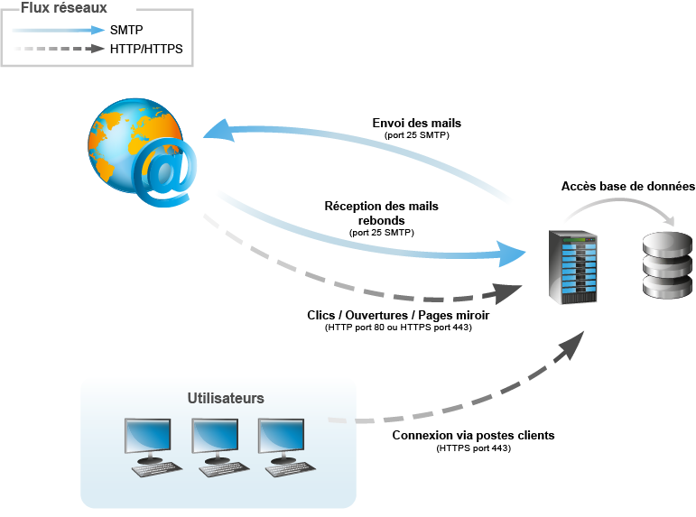
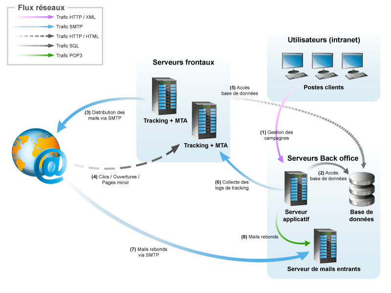

# Architecture générale{#general-architecture}

## Architecture minimale {#minimum-architecture}

Dans une configuration minimale, Adobe Campaign fonctionne avec :

* le serveur applicatif Adobe Campaign,
* la base de données.

  

Ce schéma montre que les seuls flux utilisés dans le cadre d&#39;une architecture minimale sont :

1. du protocole HTTP vers le serveur Adobe Campaign depuis Internet,
1. du protocole SMTP de et vers le serveur Adobe Campaign depuis Internet.

## Architecture répartie {#distributed-architecture}

Adobe Campaign est composé de multiples modules qui peuvent être répartis entre plusieurs machines. Ce mode de fonctionnement présente plusieurs intérêts :

* répartition de la charge,
* mise en place de la redondance de modules,
* construction d&#39;une architecture répartie sur plusieurs prestataires (segmentation des services fournis).

La répartition des modules sur plusieurs machines offre une grande souplesse d&#39;utilisation et une meilleure adaptabilité.

>[!NOTE]
>
>Pour plus d’informations sur les différentes architectures, reportez-vous à [cette section](../../installation/using/general-architecture.md).

## Liste des ports ouverts {#list-of-open-ports}

| Numéro de port | Module Adobe Campaign ou application concerné | Paramétrable |
|---|---|---|
| 443/tcp ou 80/tcp | Serveurs Web (Apache/IIS) | OUI |
| 6666/udp (local) | Adobe Campaign : Syslogd | OUI |
| 8005/tcp (local) | Adobe Campaign : module web | OUI |
| 8080/tcp | Adobe Campaign : module web (tomcat) | OUI |
| 7777 | Serveur de statistiques (stat server) | OUI |
