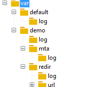

# Fichiers de log{#log-files}

L&#39;arborescence des fichiers de log est la suivante :

Chaque module **nlserver** génère un fichier journal enregistré dans le répertoire suivant : **`<installation directory>`/var/`<instance>`/log/`<module>`.log**.

La variable **nlserver syslogd** module enregistre les journaux sur le disque. Ce module est similaire au Unix **daemon syslog**, mais a été adapté à des fins de compatibilité entre Unix et Windows. Les autres modules Adobe Campaign n’enregistrent pas leurs logs sur le disque ; ils délèguent cette tâche au **syslogd** en lui envoyant des paquets UDP.

Par défaut, le module **syslogd** est installé sur la plateforme Adobe Campaign, mais il est possible d’utiliser un autre **daemon syslog**. Ce module crée les fichiers journaux dans le répertoire des **logs**.

Les journaux des modules multi-instances sont stockés dans le répertoire suivant : **`<installation directory>`/var/default/log/**. Le même fichier journal est partagé par toutes les instances (**web.log**, par exemple).

Les logs des autres modules sont stockés dans un sous-dossier du nom de l&#39;instance. Chaque instance possède ses propres fichiers de log.

Les fichiers de log multi-instances sont listés dans le tableau suivant :

| Fichier | Description |
|---|---|
| web.log | Logs du module web (console cliente, rapports, API SOAP, etc.) |
| webmdl.log | Logs provenant du module de redirection |
| watchdog.log | Logs du module de surveillance des processus Adobe Campaign |
| trackinglogd.log | Tracking logs |

Les fichiers de log mono-instance sont listés dans le tableau suivant :

| Fichier | Description |
|---|---|
| mta.log | Logs du module mta |
| mtachild.log | Logs de traitement de diffusion des messages |
| wfserver.log | Logs du module serveur de workflow |
| runwf.log | Logs de l&#39;exécution d&#39;un workflow |
| inMail.log | Logs du module des mails rebond |
| logins.log | Logs de toutes les tentatives de connexion à Adobe Campaign (réussies ou non) |

>[!IMPORTANT]
>
>Le répertoire **redir** existe uniquement sur les serveurs de redirection. Le sous-répertoire **url** contient les correspondances des URL à rediriger et le **journal** du sous-répertoire contient les logs de tracking. Pour générer des logs de tracking, le module **trackinglogd** doit être en cours d’exécution.

Pour optimiser les performances et le stockage, le fichier logins.log est divisé en plusieurs fichiers, un par jour (logins.aa-mm-jj.log) avec un maximum de 365 fichiers conservés. Le nombre de jours peut être modifié dans le fichier serverConf.xml, sous syslogd (option **maxNumberOfLoginsFiles**). Consultez la documentation relative au [fichier de configuration du serveur](../../installation/using/the-server-configuration-file.md#syslogd).

Par défaut, les journaux sont limités à deux fichiers de 10 Mo par module et par instance. Le second fichier est appelé : **`<modulename>`_2.log**. La taille des journaux est donc limitée à 2&#42;10 Mo par module et par instance.

Vous pouvez toutefois conserver des fichiers plus volumineux. Pour activer cette fonction, modifiez la valeur du paramètre **maxFileSizeMb=&quot;10&quot;** dans le nœud **syslogd** du fichier **conf/serverConf.xml**. Cette valeur représente la taille maximale en Mo d’un fichier de log.

Si vous souhaitez un niveau de logs plus élevé, vous pouvez lancer les modules Adobe Campaign avec le paramètre **-verbose** :

**nlserver start `<MODULE>`@`<INSTANCE>` -verbose**
