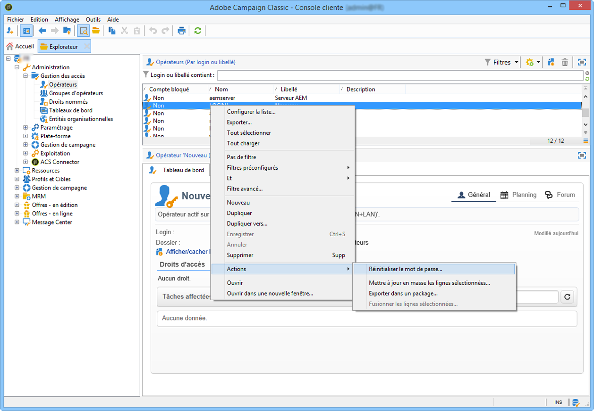

# Perte de mot de passe{#lost-password}


Il est possible de changer ou de récupérer un mot de passe perdu.
Deux cas sont possibles :

* [Perte du mot de passe d&#39;un opérateur Adobe Campaign](#password-lost-by-campaign-operator)
* [Perte du mot de passe interne](#internal-password-lost) (clients on-premise uniquement)

## Mot de passe perdu par un opérateur Campaign {#password-lost-by-campaign-operator}

Si un opérateur Adobe Campaign perd son mot de passe, vous pouvez le modifier.

>[!NOTE]
>
>Cette procédure ne s&#39;applique qu&#39;aux opérateurs se connectant à Campaign avec une authentification native. Pour l&#39;authentification Adobe IMS, voir [cette documentation](https://helpx.adobe.com/ie/manage-account/using/change-or-reset-password.html){target="_blank"}.

Pour réinitialiser un mot de passe Campaign, procédez comme suit :

1. Connectez-vous via un opérateur disposant des droits d’administrateur.
1. Cliquez avec le bouton droit sur un opérateur.
1. Sélectionnez **[!UICONTROL Actions]** > **[!UICONTROL Réinitialiser le mot de passe]**.

   

1. Définissez le nouveau mot de passe de l’opérateur. Nous recommandons aux opérateurs de modifier leur mot de passe lorsqu’ils se reconnectent pour la première fois.

## Mot de passe interne perdu {#internal-password-lost}

>[!NOTE]
>
>Cette section ne s&#39;applique qu&#39;aux clients on-premise.

Si le mot de passe interne est perdu, vous devez le réinitialiser.

Pour cela, respectez la procédure suivante :

1. Modifiez le fichier **/usr/local/neolane/nl6/conf/serverConf.xml**.

1. Positionnez-vous sur la ligne **internalPassword**.

   ```xml
   <!-- XTK authentication mode internalPassword : Password of internal account -->
   <xtk internalPassword="myPassword"/>
   ```

1. Supprimez la chaîne entre guillemets, dans ce cas : `myPassword`. Vous obtenez la ligne suivante :

   ```xml
   <!-- XTK authentication mode internalPassword : Password of internal account -->
   <xtk internalPassword=""/>
   ```

1. Enregistrez les modifications et fermez le fichier.

1. Arrêtez le `nlserver` processus.

1. Paramétrez ensuite le nouveau mot de passe. Pour cela, saisissez les commandes suivantes :

   ```javascript
   nlserver config -internalpassword
   HH:MM:SS > Application server for Adobe Campaign Classic (7.X YY.R build XXX@SHA1) of DD/MM/YYYY
   Enter current password.
   Password: (empty)
   Enter the new password.
   Password: 
   Confirmation 
   ```

1. Démarrez le `nlserver` processus.

1. Vous pouvez maintenant vous connecter en **Internal** avec votre nouveau mot de passe.
