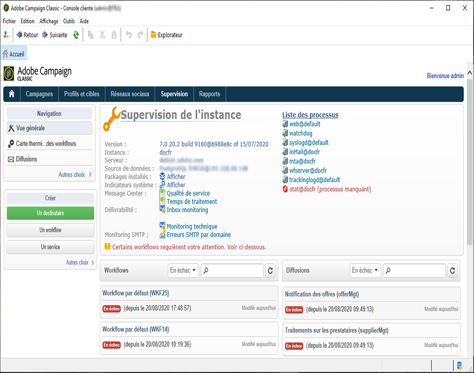

# Instructions de surveillance {#monitoring-guidelines}

## Tableau de bord de supervision de l’instance {#instance-monitoring-dashboard}

L’onglet **[!UICONTROL Surveillance]**, accessible à partir de la page d’accueil de Campaign Classic, est le principal point d’entrée pour vous aider à surveiller votre instance.

Il fournit un tableau de bord de ce qui se produit sur votre instance : son statut (version de build, packages installés, etc.), les indicateurs système, les logs, les workflows en cours d’exécution, l’état des dernières diffusions envoyées, etc.

Des informations détaillées sont disponibles [ici](../../production/using/monitoring-processes.md).

## Surveillance des processus Campaign Classic {#monitoring-campaign-classic-processes}

<table>
<tr><td>
<a href="#monitoring-instance">Surveiller votre instance</a>
</td>
<td>
<a href="#monitoring-workflows">Surveiller les workflows</a>
</td>
<td>
<a href="#monitoring-deliveries">Surveiller les diffusions</a>
</td>
<td>
<a href="#monitoring-database">Surveiller la base de données</a>
</td></tr>
</table>

D’autres méthodes de surveillance des différents processus de Campaign sont disponibles. Elles offrent plusieurs moyens de surveiller vos instances pour s’assurer que votre système est intègre et de résoudre les problèmes éventuels qui peuvent se produire lors de la configuration des workflows, de l’envoi des diffusions, etc.

### Surveillance de votre instance {#monitoring-instance}

**Outils de surveillance automatique**

Plusieurs méthodes automatiques sont disponibles. pour vous aider à surveiller votre instance. Vous pouvez, par exemple, configurer des rapports par email avec les anomalies détectées, récupérer une liste d’indicateurs au format XML, etc. [Cliquez ici](../../production/using/monitoring-processes.md#automatic-monitoring) pour plus d’informations.

**Journal d’audit**

Le journal d’audit vous permet de visualiser l’historique complet des modifications liées aux options, workflows et schémas de votre instance. [Cliquez ici](../../production/using/audit-trail.md) pour plus d’informations.

**Panneau de contrôle**

Le Panneau de contrôle vous permet de gérer plusieurs paramètres de votre instance : gérer les autorisations d’URL, vérifier les détails de votre instance tels que les versions de build de vos serveurs, etc. Il vous permet également de surveiller l’espace disponible sur les serveurs SFTP connectés à votre instance. [Cliquez ici](https://experienceleague.adobe.com/docs/control-panel/using/control-panel-home.html?lang=fr) pour plus d’informations.

>[!NOTE]
>
>Le Panneau de contrôle est accessible à tous les utilisateurs administrateurs. Les étapes permettant d&#39;octroyer un accès administrateur à un utilisateur sont présentées sur [cette page](https://experienceleague.adobe.com/docs/control-panel/using/discover-control-panel/managing-permissions.html?lang=fr#discover-control-panel).
>
>Notez que votre instance doit être hébergée sur AWS et mise à niveau avec la [dernière build GA](../../rn/using/rn-overview.md). Découvrez comment vérifier votre version dans [cette section](../../platform/using/launching-adobe-campaign.md#getting-your-campaign-version). Pour vérifier si votre instance est hébergée sur AWS, suivez les étapes présentées sur [cette page](https://experienceleague.adobe.com/docs/control-panel/using/faq.html?lang=fr).

### Surveillance des workflows {#monitoring-workflows}

**Carte thermique des workflows**

La carte thermique des workflows fournit une représentation visuelle de tous les workflows exécutés sur votre instance. Elle vous permet de surveiller facilement la charge sur l’instance et de planifier les workflows en conséquence. [Cliquez ici](../../workflow/using/heatmap.md) pour plus d’informations.

**Journal d’audit**

Le journal d’audit vous permet de visualiser toutes les modifications apportées aux workflows, ainsi que leur état actuel. [Cliquez ici](../../production/using/audit-trail.md).

**Résolution des problèmes liés aux workflows**

Des actions spécifiques peuvent être exécutées en cas de problème lié à l’exécution d’un workflow. [Cliquez ici](../../production/using/workflow-execution.md) pour plus d’informations.

**Surveillance de l’état d’un workflow**

De plus, vous pouvez créer un processus qui vous permettra de surveiller l’état d’un ensemble de workflows et d’envoyer des messages récurrents aux superviseurs. [Cliquez ici](../../workflow/using/supervising-workflows.md) pour plus d’informations.

**Directives générales**

Suivez les directives et les bonnes pratiques relatives à l’utilisation de workflows pour améliorer les performances. Pour plus d’informations, consultez les sections suivantes :
* [Bonnes pratiques relatives à l’utilisation des workflows](../../workflow/using/workflow-best-practices.md)
* [Surveiller l&#39;exécution des workflows](../../workflow/using/monitoring-workflow-execution.md)

### Surveillance des diffusions {#monitoring-deliveries}

**Rapports SMTP**

Les rapports SMTP affichent les statistiques de diffusion et les erreurs SMTP par domaine. [En savoir plus](../../production/using/monitoring-processes.md)

**Bonnes pratiques**

[Les bonnes pratiques d’envoi et de conception de diffusions](../../delivery/using/delivery-best-practices.md) peuvent vous aider à améliorer leurs performances.

**Résolution des problèmes liés aux diffusions**
Des actions spécifiques peuvent être effectuées en cas de problème avec des diffusions :
* [Problèmes de délivrabilité](../../production/using/performance-and-throughput-issues.md#deliverability_issues)
* [Problèmes liés à l&#39;affichage des images](../../production/using/image-display-issues.md)
* [Problèmes de performances des diffusions](../../delivery/using/delivery-performances.md)
* [Problèmes de fichiers temporaires](../../production/using/temporary-files.md) - *sur les modèles d’hébergement on-Premise uniquement*

### Surveillance de la base de données {#monitoring-database}

**Workflow de nettoyage de la base de données**

Le workflow de nettoyage de la base de données vous permet de supprimer les données obsolètes de votre base de données. Il est recommandé d’éviter une croissance exponentielle de la base de données. [Cliquez ici](../../production/using/database-cleanup-workflow.md) pour plus d’informations.

**Résolution des problèmes de performances de la base de données**

Des actions spécifiques peuvent être effectuées en cas de problème lié aux performances de la base de données. [Cliquez ici](../../production/using/database-performances.md) pour plus d’informations.

**Maintenance de la base de données**

*modèles d’hébergement on-premise et hybrides uniquement*

Nous vous recommandons d’effectuer régulièrement la maintenance des bases de données afin d’éviter une surconsommation d’espace disque affectant l’accès à la base de données. [Cliquez ici](../../production/using/recommendations.md) pour plus d’informations.

**Sauvegarde et restauration**

*modèles d’hébergement on-premise et hybrides uniquement*

La sauvegarde est une opération primordiale permettant d’éviter la perte de données en cas de problème (physique ou système) sur une machine. [Cliquez ici](../../production/using/backup.md) pour plus d’informations. La procédure de restauration est décrite dans [cette section](../../production/using/restoration.md).

## Principes techniques Campaign Classic {#campaign-classic-technical-principles}

Des ressources techniques sont disponibles dans la documentation Campaign Classic. Nous vous recommandons de vous familiariser avec ces sujets avant d’effectuer toute opération technique sur votre instance.

**Modèles d’hébergement et fonctionnalités**

* [Modèles d’hébergement Campaign Classic](../../installation/using/hosting-models.md)
* [Fonctionnalités des modèles d’hébergement](../../installation/using/capability-matrix.md)

**Configuration du serveur**

*Modèles d’hébergement on-premise et hybrides uniquement*

* [Configurations du serveur](../../installation/using/configuring-campaign-server.md)
* [Configuration du fichier serverconf.xml](../../installation/using/the-server-configuration-file.md)
* [Configuration du serveur pour la délivrabilité](../../installation/using/email-deliverability.md)
* [Lignes de commande pour créer une instance et déclarer une base de données](../../installation/using/command-lines.md)

**Principes généraux**

* [Architecture Campaign Classic](../../production/using/general-architecture.md)
* [Modules Campaign Classic](../../production/using/operating-principle.md)
* [Options Campaign Classic](../../installation/using/configuring-campaign-options.md)
* [Configuration du démarrage automatique des modules](../../production/using/administration.md)
* [Principe de configuration de Campaign](../../production/using/configuration-principle.md)
* [Procédures de dépannage](../../production/using/performance-and-throughput-issues.md)
