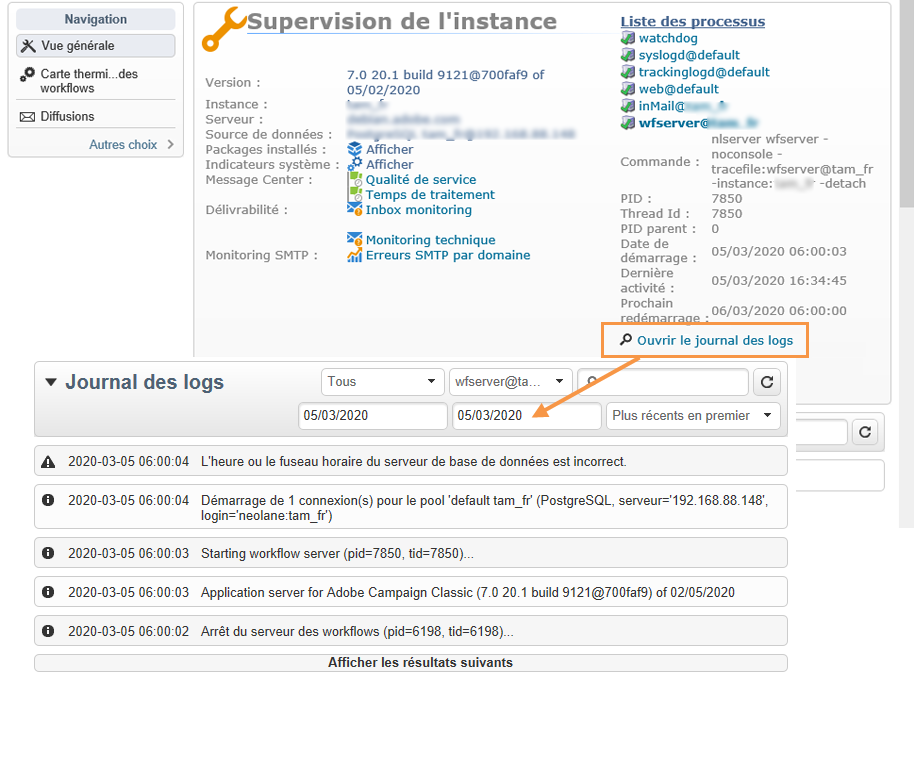
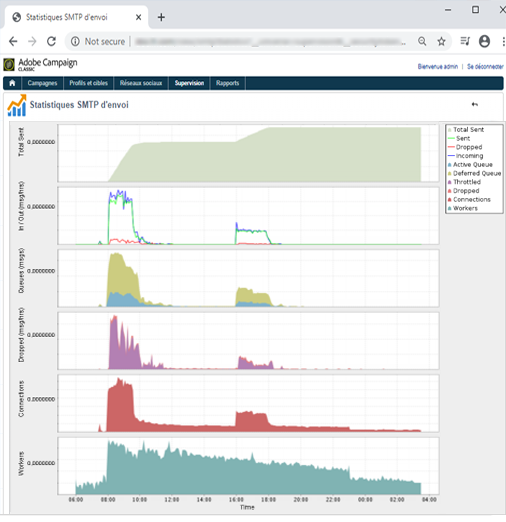

# Surveillance des processus{#monitoring-processes}


La surveillance du serveur applicatif et du serveur de redirection (**tracking**) peut être manuelle ou automatique.

## Surveillance manuelle {#manual-monitoring}

Accédez à **[!UICONTROL Supervision]**, puis cliquez sur le lien **[!UICONTROL Vue générale]** pour afficher la page de supervision des processus Adobe Campaign.


La page qui s&#39;affiche permet de visualiser l&#39;état de l&#39;instance connectée à savoir :

* les informations relatives à l&#39;instance : version, nom, moteur de base de données, packages installés, indicateurs système du serveur,
* la liste des processus manquants et les informations d&#39;exécution (date de démarrage, PID, etc.),
* une vue des workflows et des diffusions.

D’autres méthodes de surveillance des différents processus de Campaign sont présentées dans [cette page](../../production/using/monitoring-guidelines.md).

### Journal des logs {#log-journal}

Il est possible d&#39;afficher le journal des logs relatif à un processus. Pour cela, cliquez sur un processus, par exemple **mta**, puis sur **[!UICONTROL Ouvrir le journal des logs]** .



### Indicateurs système {#system-indicators}

La liste des indicateurs système permet d&#39;afficher des informations concernant la machine comme la mémoire physique et virtuelle de la machine, les processus en cours d&#39;activité ou son espace disque. Les indicateurs sont différents selon que le serveur est installé sur une machine utilisant un système d&#39;exploitation Linux ou Windows. Dans la page **[!UICONTROL Supervision de l&#39;instance]**, cliquez sur le lien **[!UICONTROL Afficher]** pour dérouler la liste des indicateurs.

#### Windows {#in-windows}

* **[!UICONTROL Pending events queued]** : indicateur propre à **Message Center**. Reportez-vous à [cette section](../../message-center/using/additional-configurations.md#monitoring-thresholds) pour plus d&#39;informations.

* **[!UICONTROL Memory]** : informations relatives à la mémoire physique (RAM).

   **[!UICONTROL Current value]** : consommation réelle de mémoire.

   **[!UICONTROL Max Value]** : quantité totale de mémoire installée.

   **[!UICONTROL Available]** : quantité de mémoire disponible.

   **[!UICONTROL Warning]** : cet indicateur s&#39;affiche lorsque la consommation de la mémoire atteint les 80% de la quantité totale.

   **[!UICONTROL Alert]** : cet indicateur s&#39;affiche lorsque la consommation de la mémoire atteint les 90% de la quantité totale.

   Lorsque les indicateurs **[!UICONTROL Warning]** et **[!UICONTROL Alert]** s&#39;affichent, vous pouvez remédier au problème en ajoutant de la RAM à la machine sur laquelle est installé le serveur Adobe Campaign. Vous pouvez également choisir d&#39;installer le serveur Adobe Campaign sur une machine dédiée.

* **[!UICONTROL Swap Memory]** : informations relatives à la mémoire virtuelle qui correspond à un fichier d&#39;échange, soit une zone du disque que Windows utilise comme s&#39;il s&#39;agissait de mémoire vive.

   **[!UICONTROL Current value]** : consommation réelle de mémoire.

   **[!UICONTROL Max Value]** : quantité totale de mémoire.

   **[!UICONTROL Available]** : quantité de mémoire disponible.

   **[!UICONTROL Warning]** : cet indicateur s&#39;affiche lorsque la consommation de la mémoire atteint les 80% de la quantité totale.

   **[!UICONTROL Alert]** : cet indicateur s&#39;affiche lorsque la consommation de la mémoire atteint les 90% de la quantité totale.

   Lorsque les indicateurs **[!UICONTROL Warning]** et **[!UICONTROL Alert]** s&#39;affichent, vous pouvez remédier au problème en augmentant la taille du fichier d&#39;échange dans les paramètres avancés de Windows.

* **[!UICONTROL Disk XXX]** : informations relatives aux lecteurs de la machine.

   **[!UICONTROL Current value]** : espace du disque réellement utilisé.

   **[!UICONTROL Max Value]** : capacité totale du disque.

   **[!UICONTROL Available]** : espace libre du disque

   **[!UICONTROL Used]** : taux d&#39;utilisation du disque en pourcentage.

   **[!UICONTROL Warning]** : cet indicateur s&#39;affiche lorsque l&#39;espace disque disponible atteint les 80% de la capacité totale.

   **[!UICONTROL Alert]** : cet indicateur s&#39;affiche lorsque l&#39;espace disque disponible atteint les 90% de la capacité totale.

* **[!UICONTROL Number of processes too old]** : informations relatives aux processus Adobe Campaign en cours depuis plus d&#39;une journée.

   **[!UICONTROL Current value]** : nombre de processus actuellement en cours.

   **[!UICONTROL Max Value]** : nombre maximal de processus autorisés (1).

   **[!UICONTROL Alert]** : cet indicateur s&#39;affiche lorsque le nombre de processus est à 1.

   Lorsque l&#39;indicateur **[!UICONTROL Alert]** s&#39;affiche, une des causes possible peut-être que le processus en question est verrouillé par le moteur de base de données SQL ou qu&#39;il est en boucle infinie. Le processus **watchdog** fourni par Adobe Campaign relance automatiquement la totalité des processus chaque jour et permet de remédier au problème. Vous pouvez cependant interrompre le processus concerné vous-même afin de forcer son redémarrage.

#### Linux {#in-linux}


* **[!UICONTROL Événements en attente dans la file]** : indicateur propre à **Message Center**. Reportez-vous à [cette section](../../message-center/using/additional-configurations.md#monitoring-thresholds) pour en savoir plus.

* **[!UICONTROL Moyenne de charge (1/5/15 minutes)]** : informations relatives à la charge, soit le taux d’utilisation du processeur par les processus de la machine au cours de la dernière minute, des cinq dernières minutes ou du dernier quart d’heure.

   **[!UICONTROL Current value]** : charge actuelle de la machine.

   **[!UICONTROL Max value]** : charge maximale d&#39;utilisation du ou des processeurs de la machine.

   **[!UICONTROL Warning]** : cet indicateur s&#39;affiche lorsque la charge atteint 80% de la valeur maximale autorisée au cours de la dernière minute, ou des cinq ou quinze dernières minutes.

   **[!UICONTROL Alert]** : cet indicateur s&#39;affiche lorsque la charge atteint 90% de la valeur maximale autorisée au cours de la dernière minute, ou des cinq ou quinze dernières minutes.

* **[!UICONTROL Memory]** : informations relatives à la mémoire physique (RAM).

   **[!UICONTROL Current value]** : consommation réelle de mémoire.

   **[!UICONTROL Max Value]** : quantité totale de mémoire installée.

   **[!UICONTROL Available]** : quantité de mémoire disponible.

   **[!UICONTROL Warning]** : cet indicateur s&#39;affiche lorsque la consommation de la mémoire atteint les 80% de la quantité totale.

   **[!UICONTROL Alert]** : cet indicateur s&#39;affiche lorsque la consommation de la mémoire atteint les 90% de la quantité totale.

   Lorsque les indicateurs **[!UICONTROL Warning]** et **[!UICONTROL Alert]** s&#39;affichent, vous pouvez remédier au problème en ajoutant de la RAM à la machine sur laquelle est installé le serveur Adobe Campaign. Vous pouvez également choisir d&#39;installer le serveur Adobe Campaign sur une machine dédiée.

* **[!UICONTROL Swap Memory]** : informations relatives à la mémoire virtuelle qui correspond à un fichier d&#39;échange, soit une zone du disque que Windows utilise comme s&#39;il s&#39;agissait de mémoire vive.

   **[!UICONTROL Current value]** : consommation réelle de mémoire.

   **[!UICONTROL Max Value]** : quantité totale de mémoire.

   **[!UICONTROL Available]** : quantité de mémoire disponible.

   **[!UICONTROL Warning]** : cet indicateur s&#39;affiche lorsque la consommation de la mémoire atteint les 80% de la quantité totale.

   **[!UICONTROL Alert]** : cet indicateur s&#39;affiche lorsque la consommation de la mémoire atteint les 90% de la quantité totale.

   Lorsque les indicateurs **[!UICONTROL Warning]** et **[!UICONTROL Alert]** s&#39;affichent, vous pouvez remédier au problème en augmentant la taille du fichier d&#39;échange.

* **[!UICONTROL Core Files]** : informations relatives aux fichiers générés suite au crash d&#39;un processus Adobe Campaign. Ces fichiers permettent de diagnostiquer les raisons du crash.

   **[!UICONTROL Current Value]** : nombre de fichiers existants.

   **[!UICONTROL Max Value]** : nombre maximal de fichiers autorisé (1).

   **[!UICONTROL Warning]** : cet indicateur s&#39;affiche lorsque le nombre de fichiers s&#39;approche de 1.

   **[!UICONTROL Alert]** : cet indicateur s&#39;affiche lorsque le nombre de fichiers est à 1.

   Lorsqu&#39;un processus est manquant suite à un crash, il apparaît en rouge dans la liste des processus et est relancé automatiquement par le processus **watchdog** fourni par Adobe Campaign.

* **[!UICONTROL Number of shared memory segments]** : informations relatives aux segments de mémoire partagée par tous les processus Adobe Campaign.

   **[!UICONTROL Current value]** : nombre de segments de mémoire actuellement utilisés.

   **[!UICONTROL Max Value]** : nombre maximal de segments de mémoire autorisé (2).

   **[!UICONTROL Warning]** : cet indicateur s&#39;affiche lorsque le nombre de segments de mémoire atteint 1.

   **[!UICONTROL Alert]** : cet indicateur s&#39;affiche lorsque le nombre de segments de mémoire atteint 2.

* **[!UICONTROL Number of processes too old]** : informations relatives aux processus en cours depuis plus d&#39;une journée.

   **[!UICONTROL Current value]** : nombre de processus actuellement en cours.

   **[!UICONTROL Max Value]** : nombre maximal de processus autorisés.

   **[!UICONTROL Warning]** : cet indicateur s&#39;affiche lorsque le nombre de processus est à 80% de la limite autorisée.

   **[!UICONTROL Alert]** : cet indicateur s&#39;affiche lorsque le nombre de processus est à 90% de la limite autorisée.

* **[!UICONTROL File Handles]** : informations relatives aux descripteurs de fichier, soit le nombre de fichiers ouverts par processus.

   **[!UICONTROL Current value]** : nombre actuel de descripteurs de fichiers.

   **[!UICONTROL Max Value]** : nombre maximal de descripteurs de fichiers autorisé par le système d&#39;exploitation.

   **[!UICONTROL Warning]** : cet indicateur s&#39;affiche lorsque le nombre de descripteurs de fichiers autorisé atteint le seuil de 80%.

   **[!UICONTROL Alert]** : cet indicateur s&#39;affiche lorsque le nombre de descripteurs de fichiers autorisé atteint le seuil de 90%.

* **[!UICONTROL Processes]** : informations relatives aux processus de la machine.

   **[!UICONTROL Current value]** : nombre de processus actuellement en cours.

   **[!UICONTROL Max Value]** : nombre maximal de processus autorisés.

   **[!UICONTROL Active Processes]**: nombre de processus actifs.

   **[!UICONTROL Inactive Processes]** : nombre de processus inactifs.

   **[!UICONTROL Warning]** : cet indicateur s&#39;affiche lorsque le nombre de processus autorisé atteint le seuil de 80% de la valeur maximale autorisée.

   **[!UICONTROL Alert]** : cet indicateur s&#39;affiche lorsque le nombre de processus autorisé atteint le seuil de 90% de la valeur maximale autorisée.

* **[!UICONTROL Zombie Processes]** : informations relatives aux processus qui se sont arrêtés, mais qui disposent toujours d&#39;un identifiant de processus (PID) et restent visibles dans la table des processus.

   **[!UICONTROL Current value]** : nombre de processus zombie actuellement en cours.

   **[!UICONTROL Max Value]** : nombre maximal de processus zombie autorisés (2).

   **[!UICONTROL Warning]** : cet indicateur s&#39;affiche lorsque le nombre de processus zombie s&#39;approche de 2.

   **[!UICONTROL Alert]** : cet indicateur s&#39;affiche lorsque le nombre de processus zombie atteint 2.

#### Indicateurs personnalisés {#customized-indicators}

Adobe Campaign vous permet de personnaliser les indicateurs. Pour ce faire :

1. Créez un fichier **.sh** et nommez-le **[!UICONTROL cust_indicators.sh]** .
1. Ajoutez vos indicateurs personnalisés dans ce fichier. Par exemple :

   ```
   #!/bin/bash 
   echo "<indicator name='Zombie Processes'>  
   <current label='Current Value' value='0' display=''/>  
   <warning value='2'/>  <alert value='2'/>  
   <max label='Max Value' value='2'/>
   </indicator>"
   ```

   ou

   ```
   #!/bin/bash 
   echo "<indicator name='Availability'>  
   <current label='Last update of data' display='2012-09-03 10:00'/>  
   <current label='Availability last month' display='100.00%'/>  
   <current label='Availability this month' display='100.00%'/> 
   <current label='Recent downtime periods' display='2012-07-04 11:10:00 - 11:19:59'/>
   </indicator>"
   ```

1. Placez ce fichier dans le dossier **[!UICONTROL usr/local/neolane/nl6]**.

Ce fichier sera appelé par Adobe Campaign.

## Rapports SMTP {#smtp-reports}

Les rapports de monitoring sur les envois SMTP sont intégrés dans la plateforme Adobe Campaign. Ils sont accessibles via la console ou un accès Web.

Ces rapports affichent les statistiques SMTP d&#39;envoi et les erreurs SMTP par domaine.

Pour y accéder, les droits d&#39;Administration doivent être associés à l&#39;opérateur.

Ils sont regroupés dans **Supervision** > &#39;Monitoring SMTP&#39;.


>[!IMPORTANT]
>
>* Les informations liées au Monitoring SMTP ne sont disponibles que si le canal email a été activé.
>* Le rapport **[!UICONTROL Statistiques SMTP d&#39;envoi]** n&#39;est proposé que si le serveur de statistiques est démarré sur l&#39;instance.
>


### Statistiques SMTP d&#39;envoi {#smtp-sending-statistics}

Le rapport **[!UICONTROL Statistiques SMTP d&#39;envoi]** permet de contrôler l&#39;activité des serveurs. Il affiche une synthèse de chacun des mtachilds.



La liste des indicateurs de ce rapport est proposée sous le graphique.

1. Nombre total de messages envoyés.
1. Représente les messages entrants/sortants :

   * Ligne bleue : messages prêts à l&#39;envoi arrivant dans le Shaper, i.e. dernière étape avant l&#39;envoi SMTP (correspond à ce qui entre).

   * Ligne verte : messages envoyés avec succès (correspond à ce qui sort).

   * Ligne rouge : messages abandonnés par le Shaper, rendus au **mta** (correspond à ce qui est rejeté sur cette reprise).

   Ces valeurs sont exprimées en nombre de messages par heure.

1. Représente symboliquement deux files du Shaper :

   * Courbe bleue : la file des messages actifs. Ces messages seront envoyés dès que possible.

   * Courbe kaki : la file &#39;deferred&#39;. Ces messages ne peuvent pas être envoyés dans l&#39;immédiat pour cause de limitation du serveur de statistiques (throttling) ou parce qu&#39;aucune connexion vers la cible n&#39;est disponible. L&#39;envoi de ces messages sera tenté toutes les 5s, 10s, 20s, 40s, ..., 2min, etc., pendant la durée maximum **MaxAgeSec** définie, avant d&#39;être abandonnés.

1. Ce graphique présente un détail des messages abandonnés (courbe rouge sur le 2e graphe) : il montre la part des messages abandonnés sans avoir essayé de les envoyer (en mauve) par rapport aux messages dont l&#39;envoi a échoué (en rouge). Il permet donc de voir la part des messages qui ne passent pas dans le délai imparti à cause de limitations par le serveur de statistiques (throttling) ou à cause de l&#39;indisponibilité de serveurs distants.
1. Connexions SMTP ouvertes ou en cours d&#39;ouverture.
1. Nombre approximatif de **mtachild**.

>[!NOTE]
>
>Ce rapport est relatif à l&#39;état du composant Email Traffic Shaper.

### Erreurs SMTP par domaine {#smtp-errors-per-domain}

Ce rapport permet de visualiser les erreurs d&#39;envoi, par période, réparties par domaine.

>[!NOTE]
>
>Les options **minConnectionsToLog**, **minErrorsToLog** et **minMessagesToLog** du fichier **serverConf.xml** définissent les seuils au-delà desquels les statistiques de connexion sont prises en compte.


La liste des indicateurs de ce rapport est proposée sous le tableau.

* La colonne **Domaine** contient les noms des domaines vers lesquels les messages sont envoyés (ou le nom du domaine possédant le domaine réel, par exemple yahoo.com pour yahoo.fr),
* La colonne **Cnx** affiche le nombre de connexions SMTP ouvertes pour ce domaine,
* La colonne **Envoyés** correspond au nombre de messages envoyés vers ce domaine,
* La colonne **Volume** affiche le volume de messages pour lesquels un envoi a été tenté vers ce domaine (valeur approximative),
* La colonne **Erreurs** affiche une représentation du volume des erreurs sur ce domaine pour la période,
* La colonne **Dernière réponse** affiche le message de la dernière réponse SMTP reçue pour ce domaine,
* La colonne **Date** affiche la date de la dernière réponse SMTP reçue pour ce domaine.

>[!NOTE]
>
>Les valeurs affichées dans les colonnes **Cnx**, **Envoyés** et **Volume** sont calculées par rapport à la période sélectionnées dans le champ **[!UICONTROL Période]**.

Cliquez sur un nom de domaine pour en visualiser les erreurs.

Elles sont classées par PublicId : cet identifiant correspond à une adresse IP partagée par plusieurs mta Adobe Campaign derrière un routeur. Le serveur de statistiques utilise cet identifiant pour mémoriser les statistiques de connexions et d&#39;envois entre ce point de départ et le serveur cible.


Le champ **[!UICONTROL Propriétaire du domaine]** permet de regrouper plusieurs noms de domaine sous un même libellé. Dans la vue initiale du rapport, tous les MX de ces domaines seront associés à ce propriétaire.

Cliquez sur un identifiant PublicId pour en visualiser le détail.


>[!NOTE]
>
>Le pourcentage d&#39;erreurs est représenté par deux graphiques. Le premier est une barre de progression horizontale sur fond noir. Le second graphique est chronologique. La période sélectionnée est divisée en douze intervalles de temps, chacun représenté par une barre de progression verticale. Dans les deux représentations, si aucune erreur n&#39;a été détectée, la barre est noire. La couleur de la barre varie en fonction du pourcentage d&#39;erreurs (jaune, puis orange, et enfin rouge). La couleur grise signifie qu&#39;aucun volume de données significatif n&#39;a été remonté. Il est possible d&#39;afficher le pourcentage exact d&#39;erreurs en positionnant le curseur de la souris sur un graphique.

>[!NOTE]
>
>Pour plus d&#39;informations sur les erreurs SMTP et leur gestion dans Adobe Campaign, consultez [cette section](../../installation/using/email-deliverability.md).

## Rapport de billing {#billing-report}

Le workflow technique **[!UICONTROL Facturation]** envoie par email le rapport d&#39;activité du système à l&#39;opérateur &#39;billing&#39;. Il est déclenché par défaut le 25 de chaque mois sur l&#39;instance Marketing.

Ce workflow technique se trouve dans un sous-dossier du nœud suivant : **Administration** > **Production** > **Workflows techniques**.


Une fois le workflow démarré tous les 25 du mois, votre opérateur de facturation reçoit le rapport suivant dans sa boîte de réception.


Les mesures suivantes sont disponibles pour effectuer le suivi de vos diffusions :

* **[!UICONTROL Date de démarrage]** : date de démarrage de la diffusion. Notez qu’elle ne peut pas être antérieure à la date indiquée dans le champ « à partir du » du rapport.
* **[!UICONTROL Libellé]** : libellé de la diffusion. Les diffusions comportant moins de 100 messages à envoyer sont considérées trop petites et sont donc agrégées par date de démarrage, auquel cas le libellé indique le nombre d’agrégats, par exemple, [Agrégation de 3 petites diffusions].
* **[!UICONTROL Volume total]** : volume total d’octets transférés pour la diffusion.
* **[!UICONTROL Volume moyen]** : volume moyen d’octets transférés. Il s’agit du résultat de la formule suivante **(volume total/messages)**, qui est la base de calcul de la mesure **[!UICONTROL Multiplicateur]**.
* **[!UICONTROL Messages]** : nombre de messages envoyés, incluant à la fois les messages envoyés avec succès et les reprises (suite à la réception d’un message rebond de la part du serveur contacté).
* **[!UICONTROL Multiplicateur (x)]** : la valeur du multiplicateur est déduite du volume moyen des messages.
* **[!UICONTROL Total]** : résultat de la multiplication des messages et du multiplicateur.

## Surveillance automatique {#automatic-monitoring}

Adobe Campaign propose plusieurs techniques de monitoring automatique. Elles sont présentées ci-dessous.

### La ligne de commande {#command-line}

La commande

**nlserver monitor**

permet de lister un ensemble d&#39;indicateurs sur le système et les modules Adobe Campaign.

Elle génère une sortie au format XML qui peut être traitée facilement.

De plus, cette commande peut être lancée avec le paramètre **-missing** qui liste les processus manquants sur cette instance alors que, selon les fichiers de configuration, ils devraient se trouver en cours d&#39;exécution.

```
nlserver monitor -missing
HH:MM:SS > Application server for Adobe Campaign Classic (7.X YY.R build XXX@SHA1) of DD/MM/YYYY
mta@prod
stat@prod
wfserver@prod
```

### Les informations publiées par le serveur {#information-published-by-the-server}

#### Le /r/test {#r-test}

La page **http(s)://`<application>`/r/test** est utilisée pour tester le serveur de redirection. Nous vous recommandons d’utiliser la même méthode pour tester les serveurs frontaux utilisés pour le suivi. Cette page peut également être utilisée pour tester un répartiteur de charge.

Elle affiche une ligne au format XML du type :

```
<redir status='OK' date='YYYY-MM-DD HH:MM:SS.112Z' build='XXXX' host='<hostname>' localHost='<servername>'/>
```

**Fréquence** : il s&#39;agit d&#39;un test ne sollicitant pas de charge, il peut donc être lancé très régulièrement (toutes les secondes, par exemple).

#### Le /nl/jsp/ping.jsp {#nl-jsp-ping-jsp}

Cette page **http(s)://`<Application server url>`/nl/jsp/ping.jsp** fonctionne de la même manière que sa contrepartie réseau : elle teste une requête complète qui passe par apache/tomcat/module web/base de données et qui est téléchargée vers le client. Si tout fonctionne correctement, elle renvoie « OK ». Nous vous recommandons d&#39;exécuter ce test sur les machines ayant accès aux bases de données (mtas et questionnaires, par exemple).

**Utilisation** : il faut mettre en argument un token de session associé au login d&#39;un opérateur qui permet de se connecter à l&#39;instance (voir l&#39;astuce dans la section [Surveillance automatique via les scripts d&#39;Adobe Campaign](#automatic-monitoring-via-adobe-campaign-scripts)).

Par exemple :


L&#39;opérateur et son login doivent avoir été préalablement configurés dans la console cliente Adobe Campaign avec les droits sur les données de la base.


**Fréquence** : il s&#39;agit d&#39;un test sollicitant peu de charge, il peut donc être lancé assez souvent, mais pas plus d&#39;une fois par minute.

#### Le /nl/jsp/monitor.jsp {#nl-jsp-monitor-jsp}

Ce test permet de vérifier qu’un opérateur peut accéder au serveur Adobe Campaign via une page web. Il s’agit de la même page que celle accessible via les menus de la console cliente. Vous pouvez l’appeler à partir de vos outils de surveillance (Tivoli, Nagios, etc.).


**Utilisation** : il faut mettre en argument un token de session associé au login d&#39;un opérateur qui permet de se connecter à l&#39;instance (voir l&#39;astuce dans la section [Surveillance automatique via les scripts d&#39;Adobe Campaign](#automatic-monitoring-via-adobe-campaign-scripts)).

L&#39;opérateur et son login doivent avoir été préalablement configurés dans la console cliente Adobe Campaign avec les droits et les restrictions sur les données de la base.

**Fréquence** : il s&#39;agit d&#39;un test complet de tout le serveur, il n&#39;a pas à être lancé fréquemment (on peut l&#39;effectuer par exemple toutes les dix minutes).

#### Le /nl/jsp/soaprouter.jsp {#nl-jsp-soaprouter-jsp}

Ce **jsp** représente le point d&#39;entrée des API de l&#39;application Adobe Campaign. Il peut donc servir de monitoring fin de l&#39;application. Il peut également être utilisé pour surveiller les services web Adobe Campaign. Il est utilisé dans nos scripts de surveillance, néanmoins, il est réservé à des utilisateurs experts.

### Surveillance selon les types de déploiements {#monitoring-based-on-deployment-types}

Adobe Campaign permet différentes configurations de déploiement (voir [cette section](../../installation/using/hosting-models.md) à ce sujet). Dans cette section, sont détaillées les différentes techniques de monitoring automatique à appliquer selon le type d&#39;installation dont vous disposez.

<table> 
 <thead> 
  <tr> 
   <th> Type de déploiement </th> 
   <th> Contrôle  </th> 
  </tr> 
 </thead> 
 <tbody> 
  <tr> 
   <td> Stand-alone </td> 
   <td> 
    <ul> 
     <li><p> <span class="uicontrol">/r/test</span> et <span class="uicontrol">/nl/jsp/monitor.jsp</span> sur le serveur Adobe Campaign</p> </li> 
    </ul> </td> 
  </tr> 
  <tr> 
   <td> Standard </td> 
   <td> 
    <ul> 
     <li><p> <span class="uicontrol">/r/test</span> et <span class="uicontrol">/nl/jsp/ping.jsp</span> sur les serveurs frontaux</p> </li> 
     <li><p> <span class="uicontrol">/nl/jsp/monitor.jsp</span> sur le serveur applicatif</p> </li> 
    </ul> </td> 
  </tr> 
  <tr> 
   <td> Entreprise </td> 
   <td> 
    <ul> 
     <li><p> <span class="uicontrol">/r/test</span> et <span class="uicontrol">/nl/jsp/ping.jsp</span> sur les serveurs frontaux</p> </li> 
     <li><p> <span class="uicontrol">/r/test</span> et <span class="uicontrol">/nl/jsp/monitor.jsp</span> sur le serveur applicatif</p> </li> 
    </ul> </td> 
  </tr> 
  <tr> 
   <td> Mid-sourcing </td> 
   <td> 
    <ul> 
     <li><p> <span class="uicontrol">/nl/jsp/monitor.jsp</span> sur le serveur applicatif</p> </li> 
    </ul> </td> 
  </tr> 
 </tbody> 
</table>

## Surveillance automatique via les scripts d&#39;Adobe Campaign {#automatic-monitoring-via-adobe-campaign-scripts}

Adobe Campaign peut vous fournir un outil de surveillance des instances (netreport) qui permet d&#39;envoyer un rapport par e-mail sur les anomalies détectées.


>[!IMPORTANT]
>
>Cet outil peut être utilisé pour surveiller votre instance mais il n&#39;est pas pris en charge par Adobe Campaign. Contactez votre administrateur de Campaign pour plus d&#39;informations.

### Eléments requis {#required-elements}

Pour une surveillance automatique, les précautions suivantes sont requises avant installation :

* Vous devez avoir les fichiers **netreport.tgz** (installation sous Linux) ou **netreport.zip** (installation sous Windows),
* il est fortement conseillé de ne pas installer le monitoring sur la machine à surveiller,
* il est indispensable que la machine sur laquelle il sera installé possède un JRE ou un JDK,
* sous Linux, la machine à surveiller doit posséder le package **bc**. Voir à ce sujet [cette section](../../installation/using/installing-packages-with-linux.md#distribution-based-on-rpm--packages).

### Procédure d&#39;installation {#installation-procedure}

La procédure d&#39;installation est la suivante :

1. Dans la console, créez, si besoin, un nouvel opérateur (l&#39;utilisateur &#39;monitoring&#39; existe déjà), sans lui attribuer de droits.
1. Lancez l&#39;extraction de l&#39;archive.
1. Consultez le fichier **readme**.
1. Mettez à jour le fichier de configuration **netconf.xml**.
1. Mettez à jour le fichier **netreport.bat** (Windows) ou **netreport.sh** (Linux).

### Configuration du fichier netconf.xml {#configuring-the-netconf-xml-file}

Le fichier XML de configuration contient les éléments suivants :

* [Elément &#39;properties&#39;](#properties--element)
* [Elément &#39;instance&#39;](#instance--element)
* [Elément &#39;host&#39;](#host--element)
* [Les sous-éléments](#sub-elements)

Voici un exemple de configuration :

```
<?xml version="1.0" encoding="ISO-8859-1"?>
<netconf>
  <properties mailServer="mail.adobe.net" mailFrom="mail@adobe.com" recipientList="recipient@adobe.com">
    <nightMode start="00:00 am" end="07:00 am"/>
    <buildRange minimum="7829" maximum="8180"/>
    <buildRange minimum="8300" maximum="8400"/>
    <sla/>
  </properties>

  <instance name="dev" recipientList="mail@mail.com,mail2@mail.com">
                <host name="devrd.domain.com" alias="devrd" sessiontoken="monitoring" criticalLevel="1" filter="wkf;new">
                                <ncs instance="devrd" url="/nl/jsp/soaprouter.jsp" includeDead="false" isSecure="false"/>
                                <redir url="/r/test"/>
                                <http url="/nl/jsp/ping.jsp"/>
                </host>
                <host name="devtrk.domain.com" alias="devtrk" sessiontoken="monitoring" criticalLevel="0" filter="wkf;new">
                                <ncs instance="devrd" url="/nl/jsp/soaprouter.jsp" includeDead="true" isSecure="false"/>
                </host>
  </instance>
  <host name="dev-test" alias="dev-test" sessiontoken="monitoring" criticalLevel="2">
                <ncs instance="dev" url="/nl/jsp/soaprouter.jsp" includeDead="false"/>
  </host>
</netconf>
```

>[!NOTE]
>
>Vous pouvez spécifier différentes configurations en ajoutant un suffixe au fichier **netconf.xml**, par exemple **netconf-dev.xml**, **netconf-prod.xml**, etc. Spécifiez ensuite la configuration à utiliser pour exécuter le netreport dans les fichiers **netreport.bat** ou **netreport.sh** en ajoutant **$JAVA_HOME/bin/java netreport dev** ou **@%JAVA_HOME%binjava netreport prod** par exemple.

>[!IMPORTANT]
>
>Pour que la connexion à l&#39;opérateur **monitoring** fonctionne, la machine sur laquelle le netreport est exécuté doit être dans une zone de sécurité en mode **sessionTokenOnly**. Si aucun masque IP de confiance n&#39;a été défini pour cet opérateur, la zone de sécurité doit être également en mode **allowEmptyPassword** et **allowUserPassword**.

#### Elément &#39;properties&#39; {#properties--element}

Cet élément permet de renseigner le paramétrage des mails, soit :

* **mailServer** : serveur MTP utilisé pour envoyer les emails (ex : smtp.domain.net).
* **mailFrom** : adresse email de l&#39;expéditeur du rapport (ex : monitoring@domain.net).
* **recipientList** : liste des adresses email des destinataires du contrôle. Les adresses doivent être séparées par des virgules (sans espaces).
* Le mode « **nuit** » (facultatif) permet d’éviter d’envoyer des emails entre les heures spécifiées. Les données sont alors consolidées et un email concernant l’activité nocturne est envoyé après l’heure de fin (7 h par défaut).
* Le sous-élément **buildRange** (facultatif) vous permet de spécifier un nombre de build minimal et maximal. Une erreur sera générée pour toutes les machines dont le numéro de build ne tombe pas dans cette plage.

   ```
   <buildRange minimum="0000" maximum="9999"/>
   ```

* Vous pouvez ajouter un sous-élément **`<sla>`** (facultatif) dans l’élément **Propriétés**. Un fichier journal est généré chaque fois que le netreport est exécuté. Le nom du fichier contient le nom de configuration et la date et l’heure, par exemple **dev_06_12_13_16_47_05.tmp**. Le fichier contient les informations suivantes : nom d’instance, nom de la machine, niveau de gravité, (0 à 3, du moins critique au plus critique), date (format d’horodatage), délai écoulé (en millisecondes) entre la requête et la réponse, service utilisé (http, ncs, ncsex, redir). Ces informations sont séparées par des marques de tabulation et des sauts de ligne à la fin de chaque service.

>[!NOTE]
>
>L’attribut **persistHtmlFile** avec la valeur &quot;true&quot; sur l’élément **`<property>`** sert à enregistrer le dernier état de surveillance dans le fichier **netreport.md**. Ce fichier est enregistré dans le répertoire d’installation.

#### Elément &#39;instance&#39; {#instance--element}

Cet élément permet de regrouper plusieurs machines (hosts) sous une même instance. Les noms d&#39;instances apparaissent dans la première partie de l&#39;e-mail de monitoring. Vous pouvez cliquer sur le nom d&#39;une instance pour accéder au détail de chacune des machines.

```
instance name="instance-name" recipientList="mail@mail.com,mail2@mail.com">
                <host name="devcamp.domain.com" ...>
                       ...
                </host>
                <host name="devtrack.domain.com" ...>
                       ...
                </host>
</instance
```

* **name** : nom de l&#39;instance qui apparaitra dans la première partie de l&#39;e-mail.
* **recipientList** (optionnel) : vous permet d&#39;envoyer par email un rapport de monitoring concernant une instance en particulier.

#### Elément &#39;host&#39; {#host--element}

Cet élément paramètre la surveillance sur l&#39;host d&#39;un serveur donné, soit :

* **name** : nom de la machine à surveiller.
* **alias** (optionnel) : nom sous lequel apparaîtra la machine surveillée dans le rapport.
* **sessionToken** : permet de s&#39;authentifier sous la forme d&#39;un jeton de session autorisé.

   Pour paramétrer le token de session, sélectionnez l&#39;opérateur **monitoring** dans la console Adobe Campaign. Dans l&#39;onglet **Droit d&#39;accès**, indiquez les adresses IP des machines autorisées à surveiller cette instance. Depuis ces machines, vous pourrez alors vous connecter à la page de monitoring avec l&#39;identifiant **monitoring** sans avoir besoin de spécifier de mot de passe.

   

* **criticalLevel** (optionnel) : permet de trier les erreurs à afficher par niveau de gravité. Les valeurs possibles sont &quot;0&quot; (tous les niveaux affichés), &quot;1&quot; (seules les erreurs graves et élevées sont affichées) et &quot;2&quot; (seules les erreurs critiques sont affichées). Si cet attribut n’est pas fourni, tous les niveaux d’erreur s’affichent.
* **filter** (optionnel) : vous permet d’exclure certaines erreurs de workflow, par exemple **filter=&quot;wkf;wkf1&quot;**. Les libellés de workflow doivent être séparés par des points-virgules.

#### Les sous-éléments {#sub-elements}

* **tcp** : vérifie si le serveur est en marche ou en panne. Vous devez saisir un numéro de port.
* **http** : vérifie l&#39;existence du serveur web (bon fonctionnement du serveur applicatif).
* **ncs**: vérifie les processus sur l’instance saisie dans l’attribut &quot;instance&quot; (erreurs de workflow, utilisation de la mémoire, etc.). L’attribut **inclus** (obligatoire) vous donne la possibilité d’afficher les processus défunts (valeurs « true » ou « false »).
* **redir** : vérifie le suivi.

Dans la plupart des cas, on peut ne conserver que les sous-éléments **ncs** et **redir**.

Dans tous les cas, on peut surcharger certains nœuds dans les sous-éléments (par exemple le nœud **port=75** pour surcharger le port utilisé pour la connexion http, ncs ou redir) :

```
<ncs instance="clap40" url="/nl/jsp/soaprouter.jsp" includeDead="false" port="80"/>
```

Dans les sous-éléments **ncs**, **redir** et **http**, vous pouvez ajouter l’attribut **isSecure** (optionnel) pour choisir d’utiliser ou non le protocole https (valeurs &quot;true&quot; ou &quot;false&quot;). Si cet attribut n’est pas fourni, le protocole http est utilisé.

### Configuration du fichier netreport.bat ou netreport.sh {#configuring-the-netreport-bat-or-netreport-sh--file}

Pour le configurer, modifiez ce fichier et indiquez le répertoire dans lequel a été installé la JRE ou le JDK.

### Lancement du monitoring {#launching-monitoring}

Pour lancer la surveillance, exécutez le fichier **netreport.bat** ou **netreport.sh** à intervalles réguliers via un script. Un rapport est envoyé après la première exécution, puis uniquement en cas de changement de statut.

### Test du monitoring {#testing-monitoring}

Pour tester la surveillance, exécutez le fichier **netreport.bat** ou **netreport.sh**.

Un email est envoyé aux destinataires spécifiés dans le **recipientList** du fichier **netconf.xml**.
