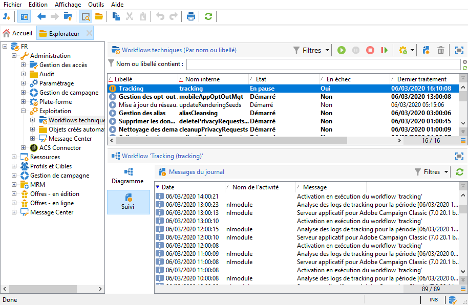

# Problèmes relatifs aux logs de tracking{#tracking-logs-issues}

Lorsque les logs de tracking ne remontent pas, les causes peuvent être multiples. Nous vous recommandons de vérifier les informations suivantes :

* **Le workflow** Tracking **est-il en erreur ?**

Reportez-vous à la documentation de [Campaign v8](https://experienceleague.adobe.com/docs/campaign/automation/workflows/monitoring-workflows/monitor-technical-workflows.html?lang=fr){target="_blank"}.

* **Le module** trackinglogd **est-il démarré sur le serveur ?**

  Consultez [Fichiers de log](../../production/using/log-files.md).

* **Des modifications ont-elles été apportées ?**

  Elles peuvent provoquer la perte de connexion aux serveurs en utilisant l&#39;alias de tracking.
