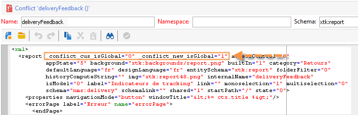
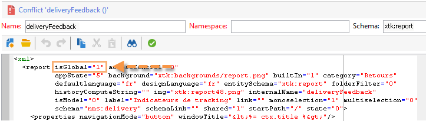

# Mise à jour de version{#upgrading}

Avant de commencer la mise à jour, déterminez et confirmez la version d&#39;Adobe Campaign vers laquelle s&#39;effectue la mise à jour et consultez les [notes de mises à jour](https://docs.campaign.adobe.com/doc/AC/en/RN.html).

>[!CAUTION]
>
>Nous vous recommandons vivement d’effectuer une sauvegarde de base de données sur chaque instance avant de procéder à la mise à jour. For more information, refer to [Backup](../../production/using/backup.md).\
>Pour effectuer une mise à jour, vérifiez que vous avez la possibilité et les permissions d&#39;accéder aux instances et aux logs.

>[!NOTE]
>
>Reportez-vous également au [guide d&#39;installation](../../installation/using/general-architecture.md) et au guide de prise en main sur l&#39;[upgrade de build](https://docs.campaign.adobe.com/doc/AC/getting_started/EN/buildUpgrade.html).

## Sous Windows {#in-windows}

Pour mettre à jour Adobe Campaign dans une nouvelle version lors de la livraison d&#39;un nouveau build, la procédure sous Windows est la suivante :

* [Arrêter les services](#shut-down-services),
* [Mettez à niveau l’application](#upgrade-the-adobe-campaign-server-application)serveur Adobe Campaign,
* [synchroniser les ressources](#synchronize-resources),
* [Redémarrer les services](#restart-services).

Pour connaître la procédure de mise à jour de la console cliente, reportez-vous à [cette section](../../installation/using/client-console-availability-for-windows.md).

### Arrêter les services {#shut-down-services}

Il est nécessaire d&#39;arrêter toutes les instances du service nlserver afin de pouvoir remplacer tous les fichiers avec la nouvelle version.

1. Arrêtez les services suivants :

   * services Web (IIS) :

      **iisreset /stop**

   * service Adobe Campaign : **net stop nlserver6**
   >[!CAUTION]
   >
   >You also need to make sure the redirection server (webmdl) is stopped, so that the **nlsrvmod.dll** file used by IIS can be replaced with the new version.

1. Vérifiez qu’aucune tâche n’est active en exécutant la commande **nlserver pdump** . Voici ce qui devrait apparaître :

   ```
   C:<installation path>Adobe Campaign v7bin>nlserver pdump
   HH:MM:SS > Application Server for Adobe Campaign Classic (7.X YY.R build XXX@SHA1) of DD/MM/YYYY
   No tasks
   ```

   Vous pouvez éventuellement utiliser le Gestionnaire de tâches de Windows afin de vous assurer que tous les processus sont inactifs.

### mettre à niveau l&#39;application serveur Adobe Campaign,{#upgrade-the-adobe-campaign-server-application}

Pour exécuter le fichier de mise à jour, respectez les étapes suivantes :

1. Exécutez **setup.exe**.

   Ce fichier peut être téléchargé depuis la page du support Adobe Campaign ([https://support.neolane.net/](https://support.neolane.net/)) en cliquant sur le lien **Centre de téléchargement**.

1. Sélectionnez le mode d&#39;installation : choisissez **[!UICONTROL Mise à jour ou réparation]**
1. Cliquez sur **[!UICONTROL Suivant]** .
1. Cliquez sur **[!UICONTROL Terminer]** .

   Le programme d&#39;installation copie alors les nouveaux fichiers.

1. Lorsque l&#39;opération est terminée, cliquez sur **[!UICONTROL Terminer]** .

### synchroniser les ressources,{#synchronize-resources}

Utilisez la commande:

**nlserver config -postupgrade -allinstances**

Vous pourrez ainsi effectuer les opérations suivantes :

* synchroniser les ressources,
* mettre à jour les schémas,
* mettre à jour la base de données.

>[!NOTE]
>
>Cette opération n&#39;est à effectuer qu&#39;une seule fois et uniquement sur un serveur applicatif (**nlserver web**).

Vérifiez ensuite si la synchronisation a généré des erreurs ou des avertissements. Pour plus d’informations, reportez-vous à la section [Résolution des conflits](#resolving-upgrade-conflicts)de mise à niveau.

### Redémarrer les services {#restart-services}

Les services à redémarrer sont :

* services Web (IIS) :

   **iisreset /start**

* service Adobe Campaign : **net start nlserver6**

## Sous Linux {#in-linux}

Pour mettre à jour Adobe Campaign dans une nouvelle version lors de la livraison d&#39;un nouveau build, la procédure sous Linux est la suivante :

* [Obtenir les packages à jour](#obtain-updated-packages),
* [Effectuer la mise à jour](#perform-an-update),
* [Redémarrer le serveur web](#reboot-the-web-server).

Pour connaître la procédure de mise à jour de la console cliente, reportez-vous à [cette section](../../installation/using/client-console-availability-for-linux.md).

>[!NOTE]
>
>A partir du build 8757, la bibliothèque tierce n&#39;est plus nécessaire.

### Obtenir les packages à jour {#obtain-updated-packages}

Commencez par récupérer les deux packages mis à jour d&#39;Adobe Campaign : accédez à la page du support Adobe Campaign ([https://support.neolane.net/](https://support.neolane.net/)) via le lien du **Centre de téléchargement**.

Le fichier est **nlserver6-v7-XXX.rpm**

### Effectuer la mise à jour {#perform-an-update}

* Distribution basée sur RPM (RedHat, SuSe)

   Pour les installer, exécutez en tant que root :

   ```
   $rpm -Uvh nlserver6-v7-XXXX.rpm
   ```

   où XXX correspond à la version du fichier.

   Le fichier rpm possède des dépendances dans les packages des distributions CentOS/Red Hat. Si vous ne souhaitez pas employer certaines de ces dépendances, vous devrez peut-être utiliser l&#39;option &quot;nodeps&quot; du fichier rpm :

   ```
   rpm --nodeps -Uvh nlserver6-v7-XXXX-0.x86_64.rpm
   ```

* Distribution basée sur DEB (Debian)

   Pour les installer, exécutez en tant que root :

   ```
   dpkg -i nlserver6-v7-XXXX-amd64_debX.deb
   ```

>[!NOTE]
>
>Full installation procedures are detailed in [this section](../../installation/using/installing-campaign-standard-packages.md). Resources are synchronized automatically, however you need to make sure no errors occurred. Pour plus d’informations, reportez-vous à la section [Résolution des conflits](#resolving-upgrade-conflicts)de mise à niveau.

### Redémarrer le serveur web {#reboot-the-web-server}

Vous devez arrêter Apache afin que la nouvelle librairie soit prise en compte.

Pour cela exécutez la commande :

```
/etc/init.d/apache stop
```

>[!CAUTION]
>
>* Il est possible que votre script porte le nom **httpd** plutôt que **apache**.
>* Vous DEVEZ impérativement exécuter cette commande jusqu&#39;à obtenir la réponse suivante :
   >Cette opération est nécessaire afin qu&#39;Apache prenne en compte la nouvelle librairie.
>


Puis redémarrez Apache :

```
/etc/init.d/apache start
```

## Résoudre les conflits de mise à jour {#resolving-upgrade-conflicts}

During resource synchronization, the **postupgrade** command enables you to detect whether synchronization has generated errors or warnings.

### Consulter le résultat de la synchronisation {#view-the-synchronization-result}

Le résultat de la synchronisation peut être consulté de deux manières :

* Depuis l&#39;invite de commandes, les erreurs sont matérialisées par un triple chevron **>>>** et la synchronisation s&#39;interrompt immédiatement. Les avertissements sont signalés par un double chevron **>>** et doivent être résolus lorsque le processus de synchronisation est terminé. A la fin du postupgrade, un résumé est affiché dans l&#39;invite de commande. Par exemple :

   ```
   2013-04-09 07:48:39.749Z 00002E7A 1 info log =========Summary of the update==========
   2013-04-09 07:48:39.749Z 00002E7A 1 info log <instance name> instance, 6 warning(s) and 0 error(s) during the update.
   2013-04-09 07:48:39.749Z 00002E7A 1 warning log The document with identifier 'mobileAppDeliveryFeedback' and type 'xtk:report' is in conflict with the new version.
   2013-04-09 07:48:39.749Z 00002E7A 1 warning log The document with identifier 'opensByUserAgent' and type 'xtk:report' is in conflict with the new version.
   2013-04-09 07:48:39.750Z 00002E7A 1 warning log The document with identifier 'deliveryValidation' and type 'nms:webApp' is in conflict with the new version.
   2013-04-09 07:48:39.750Z 00002E7A 1 warning log Document of identifier 'nms:includeView' and type 'xtk:srcSchema' updated in the database and found in the file system. You will have to merge the two versions manually.
   ```

   Si l&#39;avertissement concerne un conflit de ressources, il requiert l&#39;intervention de l&#39;utilisateur pour être résolu.

* Le fichier journal **post-upgrade_`<server version number>_<time of postupgrade>`.log** contient le résultat de la synchronisation. Il est disponible par défaut dans le répertoire suivant : **`<installation directory>/var/<instance/postupgrade`**. Les erreurs et les avertissements sont indiqués par les attributs d’erreur et d’avertissement.

### Résoudre un conflit {#resolving-conflicts}

Pour résoudre un conflit, procédez de la manière suivante :

1. Dans l&#39;arborescence d&#39;Adobe Campaign, positionnez-vous dans **[!UICONTROL Administration > Paramétrage > Gestion des packages > Edition des conflits]** .
1. Sélectionnez le conflit que vous souhaitez résoudre dans la liste.

Il existe trois possibilités de résoudre un conflit :

* **[!UICONTROL Déclarer comme résolu]** : requiert une intervention de l&#39;utilisateur au préalable.
* **[!UICONTROL Accepter la nouvelle version]** : recommandé si les ressources livrées avec Adobe Campaign n&#39;ont pas été modifiées par l&#39;utilisateur.
* **[!UICONTROL Conserver la version actuelle]** : a pour conséquence de refuser la mise à jour de la version.

   >[!CAUTION]
   >
   >Si vous sélectionnez ce mode de résolution, vous risquez de perdre des correctifs inclus dans la nouvelle version.

Si vous choisissez de résoudre le conflit manuellement, procédez comme suit :

1. In the lower section of the window, search for the **_conflict_** string to locate the entities with conflicts. The entity installed with the new version contains the **new** argument, the entity that matches the previous version contains the **cus** argument.

   

1. Delete the version you don&#39;t want to keep. Delete the **_conflict_argument_** string of the entity you are keeping.

   

1. Positionnez-vous sur le conflit que vous venez de résoudre. Cliquez sur l&#39;icône **[!UICONTROL Actions]** et sélectionnez **[!UICONTROL Déclarer comme résolu]** .
1. Enregistrez vos modifications : le conflit est désormais résolu.

### Bonnes pratiques {#best-practices}

L&#39;échec d&#39;une mise à jour peut être lié à la configuration de la base de données. Vérifiez que les paramétrages réalisés par l&#39;administrateur technique et l&#39;administrateur de base de données sont compatibles.

Par exemple, une base de données unicode ne doit pas autoriser uniquement le stockage de données en LATIN1, etc.

## Notifier les postes clients de la disponibilité de la mise à jour {#warn-the-client-consoles-of-the-available-update}

### Sous Windows {#in-windows-1}

On the machine where the (**nlserver web**) Adobe Campaign application server is installed, download and copy the file

**setup-client-6.** XXXX **.exe**

dans **[chemin de l’application]**datakitnlengjsp

Ainsi, à la prochaine connexion des postes clients, une fenêtre indiquera aux utilisateurs la disponibilité d&#39;une mise à jour et leur proposera de la télécharger et de l&#39;installer.

>[!NOTE]
>
>Assurez-vous que l&#39;utilisateur IIS_WPG a bien les droits d&#39;accès en lecture à ce fichier d&#39;installation et reportez-vous au [guide d&#39;installation](../../installation/using/general-architecture.md) pour plus d&#39;informations.

### Sous Linux {#in-linux-1}

On the machine where the Adobe Campaign application server (**nlserver web**) is installed, retrieve the following package:

**setup-client-6.** XXXX **.exe**

et copiez-le sous **/usr/local/neolane/nl6/datakit/nl/eng/jsp** :

```
 cp setup-client-6.XXXX.exe /usr/local/neolane/nl6/datakit/nl/eng/jsp
```

Ainsi, à la prochaine connexion des postes clients, une fenêtre indiquera aux utilisateurs la disponibilité d&#39;une mise à jour et leur proposera de la télécharger et de l&#39;installer.

>[!NOTE]
>
>Assurez-vous que l&#39;utilisateur Apache a bien les droits d&#39;accès en lecture à ce fichier d&#39;installation et reportez-vous au [guide d&#39;installation](../../installation/using/general-architecture.md) pour plus d&#39;informations.

