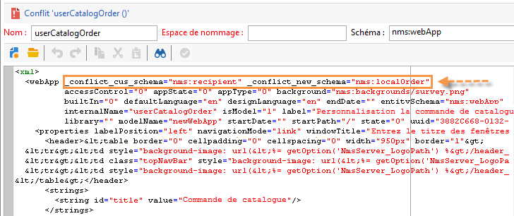

# Upgrade vers un nouveau build (On-Premise){#upgrading}


Avant de commencer la mise à jour, déterminez et confirmez la version d’Adobe Campaign vers laquelle elle s’effectue et consultez les [notes de mises à jour](../../rn/using/latest-release.md) 

>[!IMPORTANT]
>
>* Adobe recommande vivement d’effectuer une sauvegarde de base de données sur chaque instance avant de procéder à la mise à jour. Pour plus d’informations, consultez [cette section](../../production/using/backup.md).
>* Pour effectuer une mise à niveau, vérifiez que vous avez la possibilité et les autorisations d’accéder aux instances et aux logs.
>* Lisez [cette section](../../installation/using/general-architecture.md) et le chapitre [Upgrade de build](https://helpx.adobe.com/fr/campaign/kb/acc-build-upgrade.html) avant de commencer.
>

## Windows {#in-windows}

Dans un environnement Windows, procédez comme suit pour mettre à jour Adobe Campaign vers un nouveau build :

* [Arrêter les services](#shut-down-services),
* [Mettre à niveau le serveur d’applications](#upgrade-the-adobe-campaign-server-application),
* [synchroniser les ressources](#synchronize-resources),
* [Redémarrer les services](#restart-services).

Pour connaître la procédure de mise à jour de la console cliente, reportez-vous à [cette section](../../installation/using/client-console-availability-for-windows.md).

### Arrêter les services {#shut-down-services}

Il est nécessaire d&#39;arrêter toutes les instances du service nlserver afin de pouvoir remplacer tous les fichiers avec la nouvelle version.

1. Arrêtez les services suivants :

   * services Web (IIS) :

     **iisreset /stop**

   * service Adobe Campaign : **net stop nlserver6**

   >[!IMPORTANT]
   >
   >Vous devez également vous assurer que le serveur de redirection (webmdl) est arrêté afin que le fichier **nlsrvmod.dll**, qui est utilisé par IIS, puisse être remplacé par la nouvelle version.

1. Vérifiez qu’aucune tâche n’est active en exécutant la commande **nlserver pdump**. Voici ce qui devrait apparaître :

   ```
   C:<installation path>Adobe Campaign v7bin>nlserver pdump
   HH:MM:SS > Application Server for Adobe Campaign Classic (7.X YY.R build XXX@SHA1) of DD/MM/YYYY
   No tasks
   ```

   Vous pouvez éventuellement utiliser le Gestionnaire de tâches de Windows afin de vous assurer que tous les processus sont inactifs.

### mettre à niveau l&#39;application serveur Adobe Campaign, {#upgrade-the-adobe-campaign-server-application}

Pour exécuter le fichier de mise à niveau, respectez les étapes suivantes :

1. Exécutez **setup.exe**.

   Pour télécharger ce fichier, connectez-vous au [portail de distribution de logiciels](https://experience.adobe.com/#/downloads/content/software-distribution/fr/campaign.html) à l’aide de vos informations d’identification d’utilisateur. En savoir plus sur la distribution des logiciels sur [cette page](https://experienceleague.adobe.com/docs/experience-cloud/software-distribution/home.html?lang=fr).

1. Sélectionnez le mode d&#39;installation : choisissez **[!UICONTROL Mise à jour ou réparation]**
1. Cliquez sur **[!UICONTROL Suivant]** .
1. Cliquez sur **[!UICONTROL Terminer]** .

   Le programme d&#39;installation copie alors les nouveaux fichiers.

1. Lorsque l&#39;opération est terminée, cliquez sur **[!UICONTROL Terminer]** .

### Synchroniser les ressources {#synchronize-resources}

Utilisez la commande :

**nlserver config -postupgrade -allinstances**

Vous pourrez ainsi effectuer les opérations suivantes :

* synchroniser les ressources,
* mettre à jour les schémas,
* mettre à jour la base de données

>[!NOTE]
>
>Cette opération n&#39;est à effectuer qu&#39;une seule fois et uniquement sur un serveur applicatif (**nlserver web**).

Vérifiez ensuite si la synchronisation a généré des erreurs ou des avertissements. Voir à ce sujet la section [Résoudre les conflits de mise à jour](#resolving-upgrade-conflicts).

### Redémarrer les services {#restart-services}

Les services à redémarrer sont :

* services Web (IIS) :

  **iisreset /start**

* service Adobe Campaign : **net start nlserver6**

## Linux {#in-linux}

Dans un environnement Linux, procédez comme suit pour mettre à jour Adobe Campaign vers un nouveau build :

* [Télécharger les packages mis à jour](#obtain-updated-packages),
* [Effectuer la mise à jour](#perform-an-update),
* [Redémarrer le serveur Web](#reboot-the-web-server).

[En savoir plus sur la disponibilité de la console client](../../installation/using/client-console-availability-for-windows.md).

>[!NOTE]
>
>À partir du build 8757, la bibliothèque tierce n’est plus nécessaire.

### Obtenir les packages à jour {#obtain-updated-packages}

Commencez par récupérer les deux packages d’Adobe Campaign mis à jour : connectez-vous au [portail de distribution de logiciels](https://experience.adobe.com/#/downloads/content/software-distribution/fr/campaign.html) à l&#39;aide de vos informations d&#39;identification d&#39;utilisateur. En savoir plus sur la distribution de logiciels dans [cette page](https://experienceleague.adobe.com/docs/experience-cloud/software-distribution/home.html?lang=fr).

Le fichier est **nlserver6-v7-XXX.rpm**

### Effectuer la mise à jour {#perform-an-update}

* Distribution basée sur RPM (RedHat, SuSe)

  Pour les installer, exécutez en tant que root :

  ```
  $rpm -Uvh nlserver6-v7-XXXX.rpm
  ```

  où XXX correspond à la version du fichier.

  Le fichier rpm possède des dépendances dans les packages des distributions CentOS/Red Hat. Si vous ne souhaitez pas employer certaines de ces dépendances, vous devrez peut-être utiliser l&#39;option &quot;nodeps&quot; du fichier rpm :

  ```
  rpm --nodeps -Uvh nlserver6-v7-XXXX-0.x86_64.rpm
  ```

* Distribution basée sur DEB (Debian)

  Pour les installer, exécutez en tant que root :

  ```
  dpkg -i nlserver6-v7-XXXX-amd64_debX.deb
  ```

>[!NOTE]
>
>Les procédures complètes d’installation sont décrites dans [cette section](../../installation/using/installing-campaign-standard-packages.md). La synchronisation des ressources se fait automatiquement. En revanche, vous devez vérifier qu’elle s’est déroulée sans erreur. Voir à ce sujet la section [Résoudre les conflits d’upgrade](#resolving-upgrade-conflicts).

### Redémarrer le serveur Web {#reboot-the-web-server}

Vous devez arrêter Apache afin que la nouvelle bibliothèque soit prise en compte.

Pour cela exécutez la commande :

```
/etc/init.d/apache stop
```

>[!IMPORTANT]
>
>* Il est possible que votre script porte le nom **httpd** plutôt que **apache**.
>* Vous DEVEZ impérativement exécuter cette commande jusqu&#39;à obtenir la réponse suivante :
>
>   Cette opération est nécessaire afin qu&#39;Apache prenne en compte la nouvelle bibliothèque.

Puis redémarrez Apache :

```
/etc/init.d/apache start
```

## Résoudre les conflits d’upgrade {#resolving-upgrade-conflicts}

Lors de la synchronisation des ressources, la commande **postupgrade** permet de détecter si la synchronisation génère des erreurs ou des avertissements.

### Consulter le résultat de la synchronisation {#view-the-synchronization-result}

Le résultat de la synchronisation peut être consulté de deux manières :

* Depuis l&#39;invite de commandes, les erreurs sont matérialisées par un triple chevron **>>>** et la synchronisation s&#39;interrompt immédiatement. Les avertissements sont signalés par un double chevron **>>** et doivent être résolus lorsque le processus de synchronisation est terminé. A la fin du postupgrade, un résumé est affiché dans l&#39;invite de commande. Par exemple :

  ```
  2013-04-09 07:48:39.749Z 00002E7A 1 info log =========Summary of the update==========
  2013-04-09 07:48:39.749Z 00002E7A 1 info log <instance name> instance, 6 warning(s) and 0 error(s) during the update.
  2013-04-09 07:48:39.749Z 00002E7A 1 warning log The document with identifier 'mobileAppDeliveryFeedback' and type 'xtk:report' is in conflict with the new version.
  2013-04-09 07:48:39.749Z 00002E7A 1 warning log The document with identifier 'opensByUserAgent' and type 'xtk:report' is in conflict with the new version.
  2013-04-09 07:48:39.750Z 00002E7A 1 warning log The document with identifier 'deliveryValidation' and type 'nms:webApp' is in conflict with the new version.
  2013-04-09 07:48:39.750Z 00002E7A 1 warning log Document of identifier 'nms:includeView' and type 'xtk:srcSchema' updated in the database and found in the file system. You will have to merge the two versions manually.
  ```

  Si l&#39;avertissement concerne un conflit de ressources, il requiert l&#39;intervention de l&#39;utilisateur pour être résolu.

* Le fichier de log **post-upgrade_`<server version number>_<time of postupgrade>`.log** contient le résultat de la synchronisation. Il est disponible par défaut dans le répertoire suivant : **`<installation directory>/var/<instance/postupgrade`**. Les erreurs et les avertissements sont indiqués par les attributs d’erreur et d’avertissement.

### Résoudre les conflits {#resolving-conflicts}

Pour résoudre un conflit, procédez de la manière suivante :

1. Dans l&#39;arborescence d&#39;Adobe Campaign, positionnez-vous dans **[!UICONTROL Administration > Paramétrage > Gestion des packages > Edition des conflits]** .
1. Sélectionnez le conflit que vous souhaitez résoudre dans la liste.

Il existe trois possibilités de résoudre un conflit :

* **[!UICONTROL Déclarer comme résolu]** : requiert une intervention de l&#39;utilisateur au préalable.
* **[!UICONTROL Accepter la nouvelle version]** : recommandé si les ressources livrées avec Adobe Campaign n&#39;ont pas été modifiées par l&#39;utilisateur.
* **[!UICONTROL Conserver la version actuelle]** : a pour conséquence de refuser la mise à jour de la version.

  >[!IMPORTANT]
  >
  >Si vous sélectionnez ce mode de résolution, vous risquez de perdre des correctifs inclus dans la nouvelle version.

Si vous choisissez de résoudre le conflit manuellement, procédez comme suit :

1. Dans la partie inférieure de la fenêtre, effectuez une recherche sur la chaîne **_conflit_** pour localiser les entités en conflit. L’entité installée avec la nouvelle version contient l’argument **new**, l’entité correspondant à la version précédente contient l’argument **cus**.

   

1. Supprimez la version que vous ne souhaitez pas conserver. Effacez la chaîne **_conflict_argument_** de l’entité que vous gardez.

   

1. Positionnez-vous sur le conflit que vous venez de résoudre. Cliquez sur l&#39;icône **[!UICONTROL Actions]** et sélectionnez **[!UICONTROL Déclarer comme résolu]** .
1. Enregistrez vos modifications : le conflit est désormais résolu.

### Bonnes pratiques {#best-practices}

L’échec d’une mise à jour peut être lié à la configuration de la base de données. Assurez-vous que les configurations effectuées par l’administrateur technique et l’administrateur de la base de données sont compatibles.

Par exemple, une base de données unicode ne doit pas autoriser uniquement le stockage de données en LATIN1, etc.

## Notifier les postes clients de la disponibilité de la mise à jour {#warn-the-client-consoles-of-the-available-update}

### Windows {#in-windows-1}

Sur l’ordinateur sur lequel est installé le serveur d’applications Adobe Campaign (**nlserver web**), téléchargez et copiez le fichier **setup-client-6.XXXX.exe** dans le **[chemin d’accès de l’application]/datakit/nl/eng/jsp**.

Ainsi, à la prochaine connexion des postes clients, une fenêtre indiquera aux utilisateurs la disponibilité d&#39;une mise à jour et leur proposera de la télécharger et de l&#39;installer.

>[!NOTE]
>
>Assurez-vous que l&#39;utilisateur IIS_WPG a bien les droits d&#39;accès en lecture à ce fichier d&#39;installation et reportez-vous au [guide d&#39;installation](../../installation/using/general-architecture.md) pour plus d&#39;informations.

### Linux {#in-linux-1}

Sur l’ordinateur sur lequel est installé le serveur d’applications Adobe Campaign (**nlserver web**), récupérez le package **setup-client-6.XXXX.exe**, copiez-le et enregistrez-le dans **/usr/local/neolane/nl6/datakit/nl/eng/jsp** :

```
 cp setup-client-6.XXXX.exe /usr/local/neolane/nl6/datakit/nl/eng/jsp
```

Ainsi, à la prochaine connexion des postes clients, une fenêtre indiquera aux utilisateurs la disponibilité d&#39;une mise à jour et leur proposera de la télécharger et de l&#39;installer.

>[!NOTE]
>
>Assurez-vous que l&#39;utilisateur Apache a bien les droits d&#39;accès en lecture à ce fichier d&#39;installation et reportez-vous au [guide d&#39;installation](../../installation/using/general-architecture.md) pour plus d&#39;informations.
