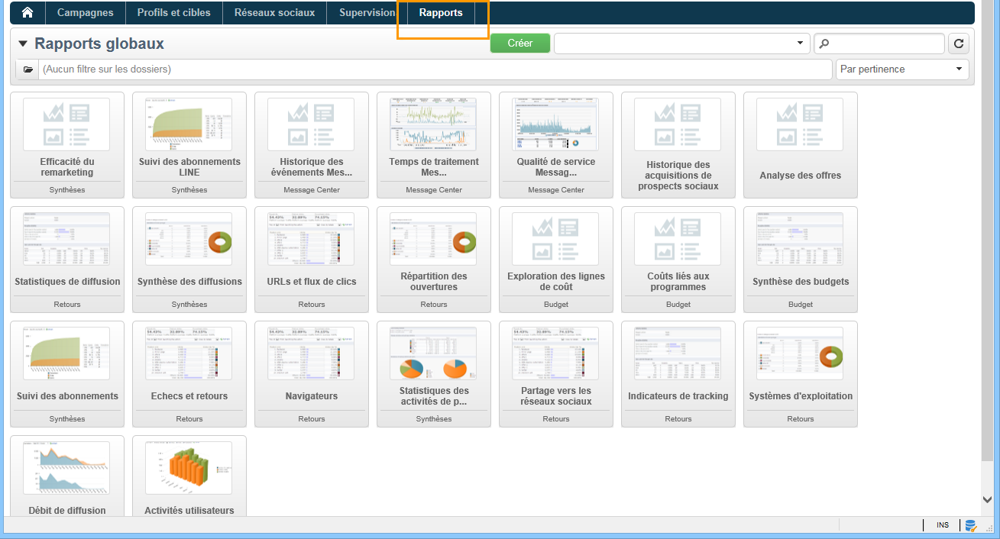
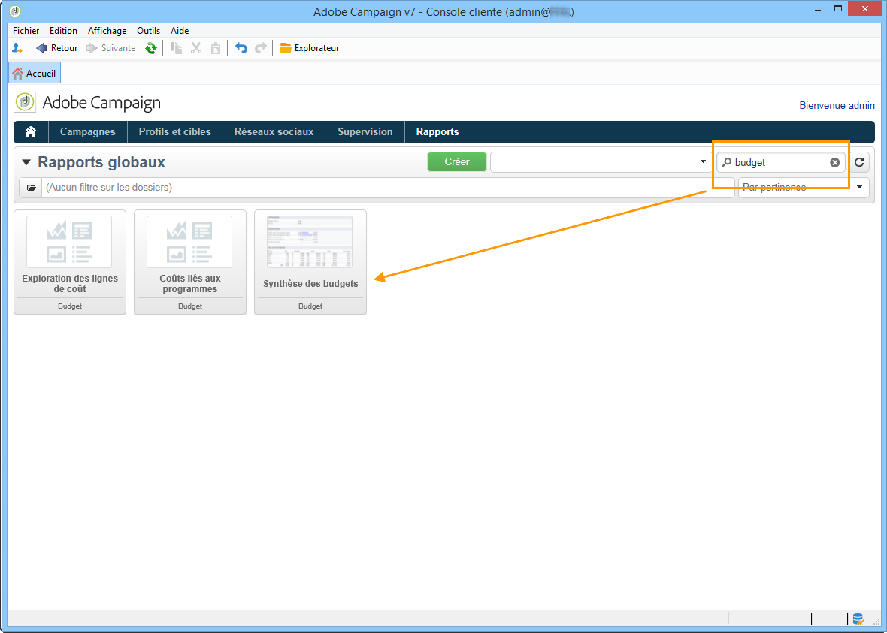
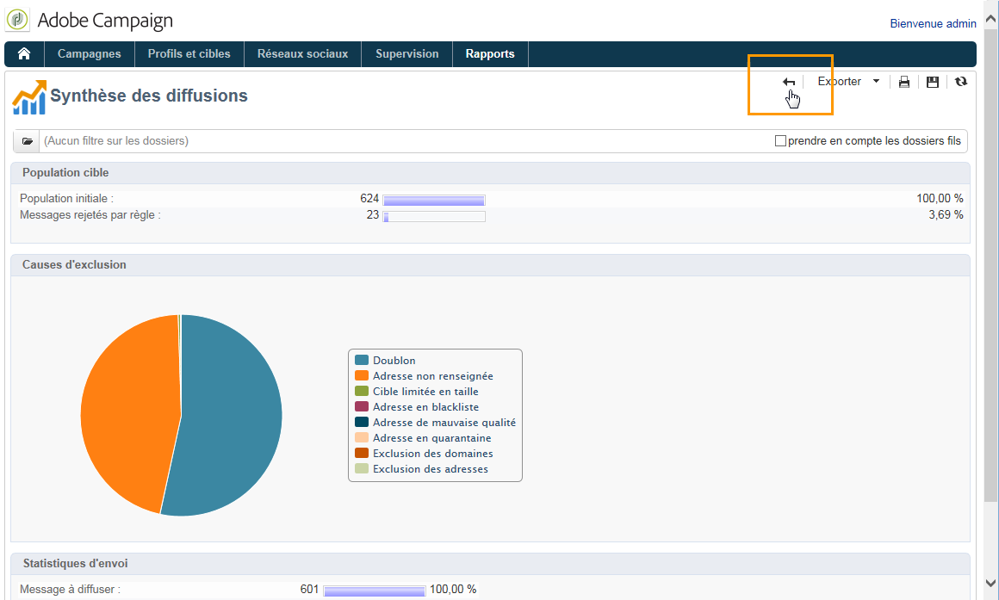
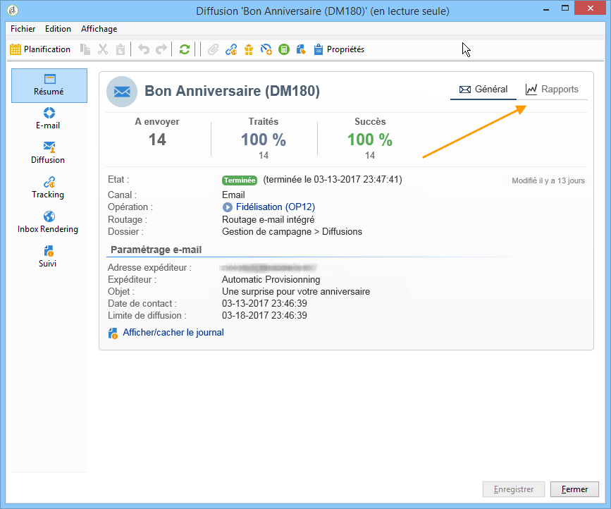
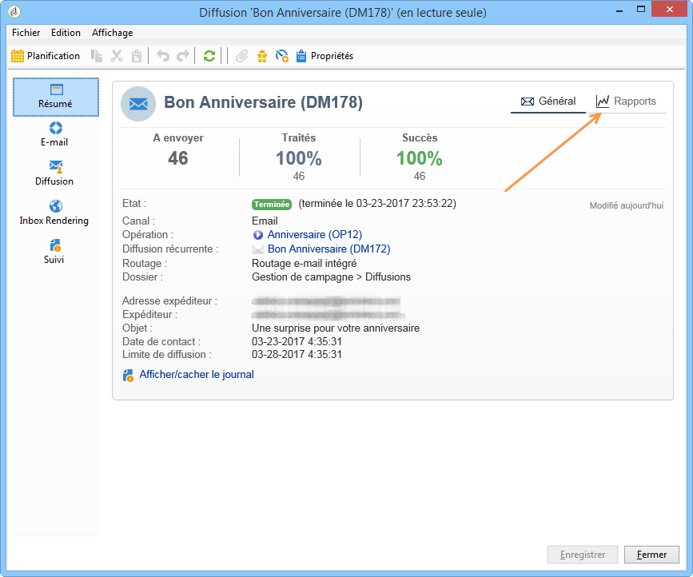

# À propos des rapports natifs de Campaign{#about-campaign-built-in-reports}

Ce chapitre propose la liste des rapports intégrés d&#39;Adobe Campaign, leur contenu et leur contexte d&#39;affichage. Les informations proposées ci-dessous vous permettront d&#39;éviter de créer des rapports déjà proposés dans la plateforme.

>[!NOTE]
>
>Vous pouvez également apprendre à ajouter vos propres rapports à l&#39;onglet **[!UICONTROL Rapports]**. Pour plus d&#39;informations, consultez cette [page](../../reporting/using/configuring-access-to-the-report.md#defining-the-filtering-options).

Ces rapports et leur contenu sont décrits dans les documents relatifs aux fonctionnalités auxquelles ils se rapportent.

Adobe Campaign propose plusieurs types de rapports, accessibles depuis la console cliente ou depuis un navigateur internet.

Les types de rapports disponibles sont les suivants :

* Rapports concernant l&#39;ensemble de la plateforme, voir la section [Rapports globaux](../../reporting/using/global-reports.md).
* Rapports de diffusion, voir la section [Rapports de diffusion](../../reporting/using/delivery-reports.md).
* Rapports cumulés, voir la section [Rapports cumulés](../../reporting/using/cumulative-reports.md).

Vous pouvez accéder aux rapports depuis la page d’accueil de la console cliente, le tableau de bord des rapports ou la liste des diffusions. Le mode d’affichage d’un rapport dépend de son contexte. La liste des principaux rapports est disponible sur la page d’accueil et permet d’accéder rapidement aux données des diffusions. Cette liste peut être modifiée selon vos besoins. Pour plus d’informations, consultez [cette section](../../reporting/using/about-reports-creation-in-campaign.md).

Pour accéder aux rapports natifs de Campaign :

1. Sélectionnez l&#39;onglet **[!UICONTROL Rapports]** de l&#39;interface Adobe Campaign.

   

1. Utilisez les champs de recherche pour filtrer les rapports affichés.

1. Cliquez ensuite sur le rapport souhaité pour l&#39;afficher.

   

1. Cliquez sur le lien **[!UICONTROL Retour]** situé en haut de l&#39;écran pour revenir à la liste des rapports.

   

Les autres actions possibles sur un rapport en cours d&#39;édition sont présentées dans [cette page](../../reporting/using/actions-on-reports.md).

Les rapports spécifiques à une opération ou à une diffusion sont accessibles à partir de leur tableau de bord respectif.

Le principe est le même pour les listes, les services, les offres, etc., comme dans l&#39;exemple ci-dessous :

