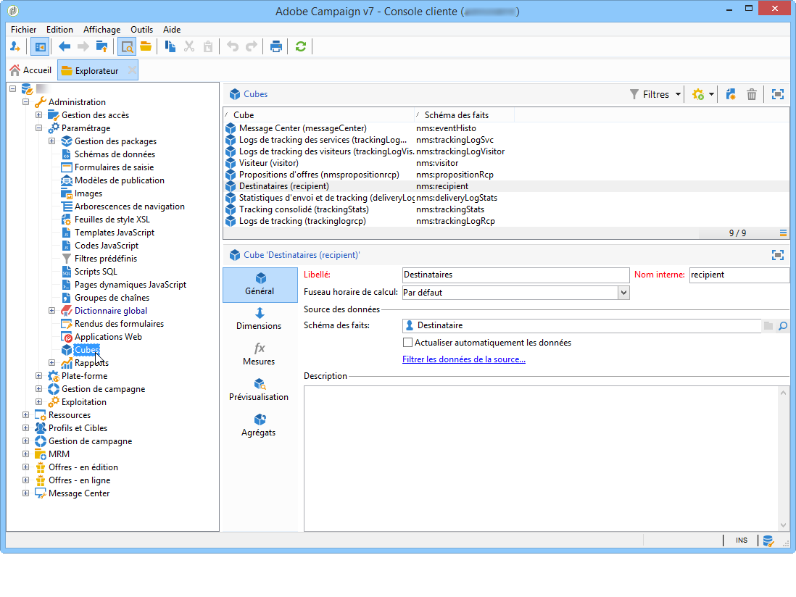
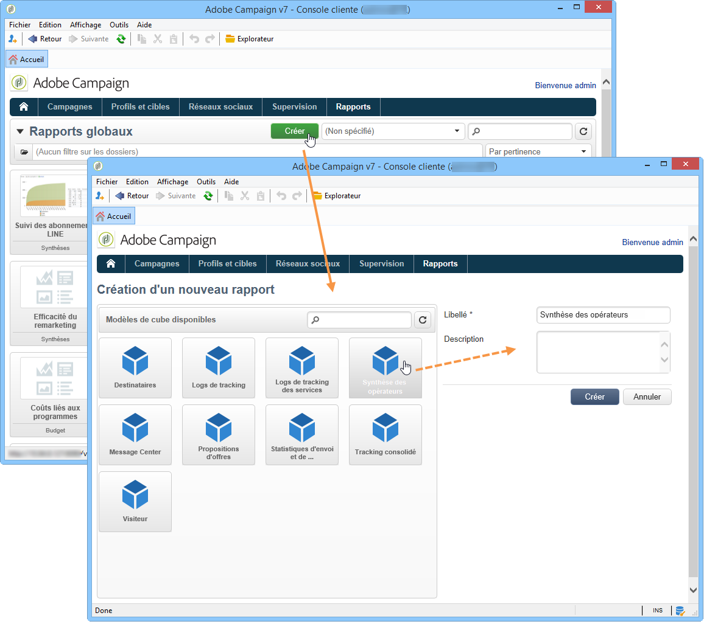
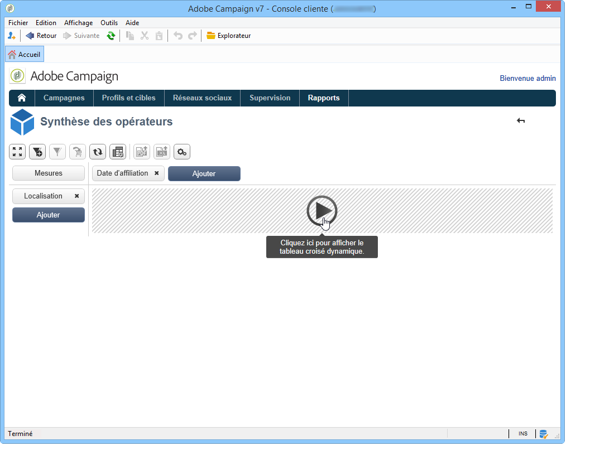
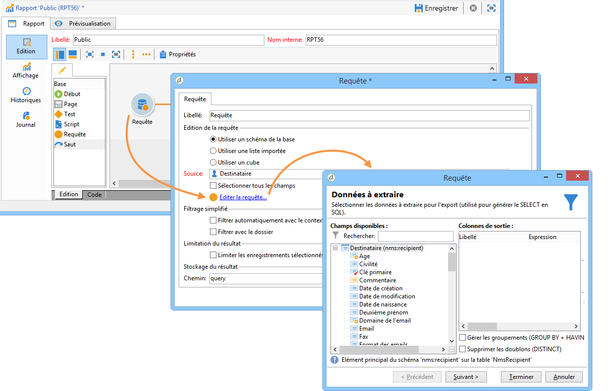
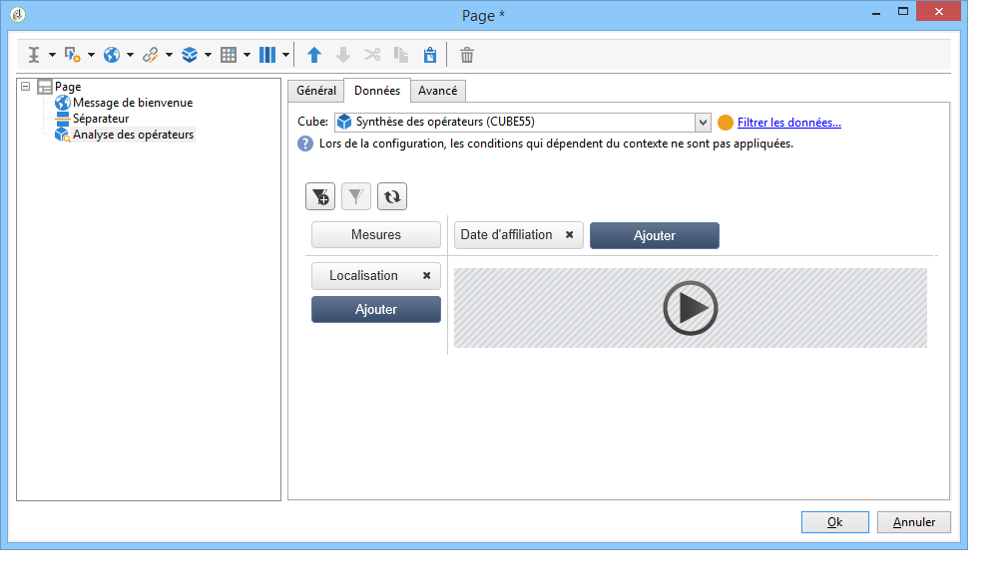

# Comencer avec les cubes{#about-cubes}

## Terminologie {#terminology}

Les cubes emploient une terminologie spécifique, consultez les termes utilisés ci-dessous.

* **Cube** : un cube est une représentation dʼinformations multidimensionnelles, il met à disposition des utilisateurs finaux des structures conçues pour des analyses interactives des données.

* **Table/schéma des faits** : la table des faits (ou le schéma des faits) contient les données brutes ou élémentaires sur lesquelles vont être construites les analyses. Il s’agit principalement de tables à gros volume (avec éventuellement des tables liées) et sur lesquelles les calculs peuvent être longs. Par exemple, une table des faits peut être : la table des broadlogs, la table des achats, etc.

* **Dimension** : les dimensions permettent de segmenter les données en groupes. Une fois créées, elles font office dʼaxes dʼanalyse. Dans la plupart des cas, pour une même dimension, plusieurs niveaux seront définis. Par exemple, pour une dimension temporelle, les niveaux seront les mois, jours, heures, minutes, etc. Cet ensemble de niveaux représente la hiérarchie de la dimension et permet dʼanalyser plus ou moins finement les données.

* **Mise en classe** : pour certains champs, vous pouvez définir une mise en classe afin de regrouper les valeurs et faciliter la lisibilité des informations. Les mises en classe sʼappliquent à des niveaux. Il est recommandé de définir une mise en classe lorsque les valeurs distinctes peuvent être nombreuses.

* **Mesure** : les mesures courantes sont la somme, la moyenne, le maximum, le minimum, lʼécart-type, etc. Les mesures peuvent être calculées, par exemple le taux dʼacceptation dʼune offre sera le rapport entre le nombre de fois où une offre a été présentée et le nombre de fois où elle a été acceptée.

## Espace de travail des cubes {#cube-workspace}

Les cubes sont localisés sous le noeud **[!UICONTROL Administration > Paramétrage > Cubes]**.

Les principaux contextes d&#39;utilisation des cubes sont les suivants :

* Les exports de données peuvent être réalisés directement dans un rapport, conçu à partir de l’onglet **[!UICONTROL Rapports]** de la plateforme Adobe Campaign.

  Pour cela, créez un nouveau rapport et sélectionnez le cube à utiliser.

  

  Les cubes apparaissent comme des modèles à partir desquels sont créés les rapports. Une fois le modèle sélectionné, cliquez sur le bouton **[!UICONTROL Créer]** pour paramétrer et visualiser le rapport correspondant.

  Vous pouvez alors adapter les mesures, modifier le mode d&#39;affichage ou configurer le tableau, puis afficher le rapport à partir du bouton central.

  

* Vous pouvez également référencer un cube dans la boîte de **[!UICONTROL Requête]** d&#39;un rapport afin d&#39;en utiliser les indicateurs, comme dans l&#39;exemple ci-dessous :

  

* Vous pouvez également insérer un tableau croisé dynamique basé sur un cube dans n&#39;importe quelle page d&#39;un rapport. Pour cela, référencez le cube à utiliser dans l&#39;onglet **[!UICONTROL Données]** du tableau croisé dynamique de la page concernée.

  

  Pour plus dʼinformations, consultez la section [Exploration des données dans un rapport](../../reporting/using/using-cubes-to-explore-data.md#exploring-the-data-in-a-report).
