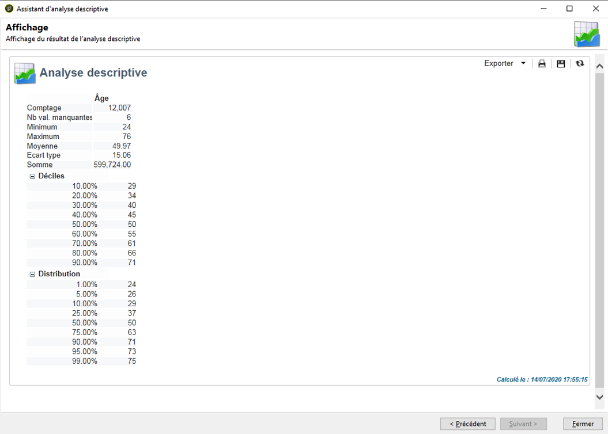

# Prise en main de l’analyse descriptive{#about-descriptive-analysis}

Afin de produire des statistiques sur les données de la base, créez des rapports d&#39;analyse descriptive à l&#39;aide de l&#39;assistant dédié et adaptez leur contenu et leur présentation selon vos besoins.

Ces rapports portent sur des populations et sont réservés à l&#39;analyse d&#39;un faible volume de données.

Vous pouvez générer des rapports d&#39;analyse quantitative ou qualitative. L&#39;analyse qualitative permet de représenter les données par exemple sous les formats suivants :

* Tableau et histogramme :

  

* Valeurs empilées, sans le tableau :

  

* Répartition par secteur

  

L&#39;analyse quantitative permet quant à elle de fournir des statistiques globales sur des données numériques de la sélection, comme dans l&#39;exemple suivant :

Ces rapports sont créés à partir de l&#39;assistant d&#39;analyse descriptive qui propose différentes étapes afin de choisir le type de rapport à créer ainsi que les données et leur mise en page. Le rapport est affiché dans sa dernière étape. Au besoin, le rapport peut être publié et ainsi partagé avec les autres opérateurs, imprimé ou exporté au format Excel, PDF ou OpenDocument.

Les rapports d&#39;analyse descriptive n&#39;offrent pas la puissance des rapports d&#39;Adobe Campaign mais permettent de visualiser rapidement le contenu de la base ou les données d&#39;une sélection.

>[!CAUTION]
>
>L&#39;analyse descriptive ne permet pas d&#39;explorer un volume de données important.
