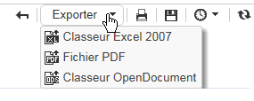

# Agir sur les rapports{#actions-on-reports}

Lorsque vous visualisez un rapport, la barre d&#39;outils vous permet d&#39;effectuer certaines actions. Elles sont présentées ci-après.


La barre d&#39;outils vous permet d&#39;exporter, imprimer, créer un historique ou afficher le rapport dans un navigateur web par exemple.


## Exporter un rapport {#exporting-a-report}

Choisissez le format vers lequel vous souhaitez exporter votre rapport dans la liste déroulante (.xls, .pdf ou .ods).



Lorsqu&#39;un rapport contient plusieurs pages, vous devez répéter l&#39;opération pour chacune des pages.

Vous pouvez paramétrer votre rapport en vue de son export au format PDF, Excel ou OpenOffice. Ouvrez l&#39;explorateur Adobe Campaign et sélectionnez le rapport concerné.

Export options are accessed via the **[!UICONTROL Page]** activities of the report, in the **[!UICONTROL Advanced]** tab.

Modifiez les paramètres de **[!UICONTROL Paper]** et **[!UICONTROL Margins]** selon vos besoins. Vous pouvez également autoriser l’exportation d’une page au format PDF uniquement. Pour ce faire, désélectionnez l’ **[!UICONTROL Activate OpenOffice/Microsoft Excel export]** option.


### Exporter dans Microsoft Excel {#exporting-into-microsoft-excel}

For **[!UICONTROL List with group]** type reports destined to be exported into Excel, the following recommendations and limitations apply:

* Ces rapports ne doivent pas contenir de ligne vide.

   

* La légende de la liste doit être cachée.

   

* Les rapports n’ont pas besoin d’utiliser une mise en forme spécifique définie au niveau de la cellule. Il est préférable d’utiliser **[!UICONTROL Form rendering]** pour définir le format des cellules du tableau. On **[!UICONTROL Form rendering]** peut y accéder par **[!UICONTROL Administration > Configuration > Form rendering]**.
* Il est recommandé de ne pas insérer de contenu HTML.
* Lorsqu&#39;un rapport contient plusieurs éléments de type tableaux, graphiques, etc., ils seront exportés les uns en-dessous des autres.
* Vous pouvez forcer le retour chariot dans les cellules : cette configuration sera conservée dans Excel. Pour plus d’informations, reportez-vous à ce document [Définition du format](../../reporting/using/creating-a-table.md#defining-cell-format)de cellule.

### Retarder l&#39;export {#postpone-the-export}

Vous pouvez retarder l&#39;export d&#39;un rapport, par exemple pour attendre des appels asynchrones. Pour cela, saisissez le paramètre suivant dans le script d&#39;initialisation de la page :

```
document.nl_waitBeforeRender = true;
```

Pour activer l&#39;export et lancer la conversion en PDF, utilisez la fonction **document.nl_renderToPdf()** sans paramètre.

### Allocation de mémoire {#memory-allocation}

Lors de l&#39;export de certains rapports volumineux, il peut se produire des erreurs d&#39;allocation de mémoire.

Dans certaines instances, la valeur par défaut **maxMB** (**SKMS** pour les instances hébergées) du JavaScript indiquée dans le fichier de configuration **serverConf.xml** est fixée à 64 MB. Si vous rencontrez des erreurs de mémoire insuffisante quand vous exportez un rapport, il peut être recommandé d&#39;augmenter ce chiffre à 512 MB :

```
<javaScript maxMB="512" stackSizeKB="8"/>
```

Pour appliquer les changements apportés à la configuration, un redémarrage du service **nlserver** est nécessaire.

Pour en savoir plus sur le fichier **serverConf.xml**, consultez [cette section](../../production/using/configuration-principle.md).

Pour en savoir plus sur le fichier **nlserver**, consultez [cette section](../../production/using/administration.md).

## Imprimer un rapport {#printing-a-report}

Vous pouvez imprimer votre rapport : pour cela, cliquez sur l&#39;icône d&#39;impression. La boîte de dialogue d&#39;impression s&#39;ouvre.

Pour un meilleur résultat, modifiez les options d’impression d’Internet Explorer et sélectionnez **[!UICONTROL Print background colors and images]**.


## Créer des historiques de rapports {#creating-report-archives}

L&#39;historisation d&#39;un rapport vous permet de créer une vue du rapport à différentes périodes. Cela peut être pour faire apparaître des statistiques à un instant donné.

Pour créer un historique, ouvrez le rapport concerné puis cliquez sur l&#39;icône de création d&#39;historique.


Vous pouvez masquer ou afficher les historiques existants en cliquant sur l&#39;icône d&#39;affichage/dissimulation.


La ou les dates d&#39;historiques s&#39;affichent sous l&#39;icône d&#39;affichage/dissimulation. Cliquez sur un historique pour le visualiser.


Il est possible de supprimer une archive de rapport. Pour ce faire, accédez au noeud Adobe Campaign où sont stockés vos rapports. Cliquez sur l’ **[!UICONTROL Archives]** onglet, sélectionnez celui que vous souhaitez supprimer, puis cliquez sur **[!UICONTROL Delete]**.


