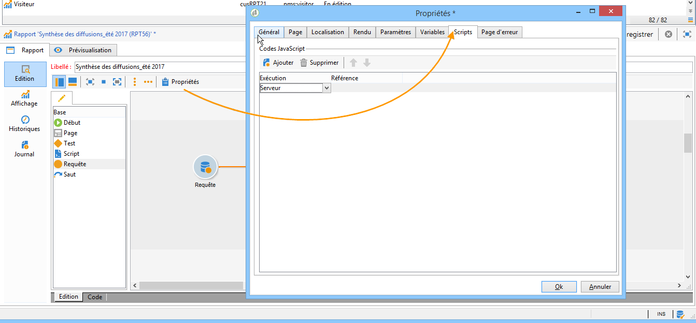
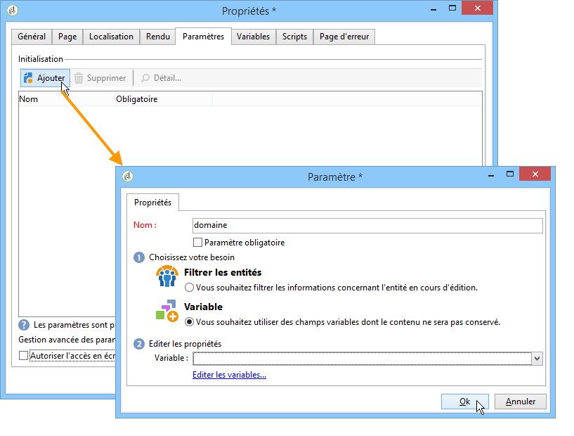
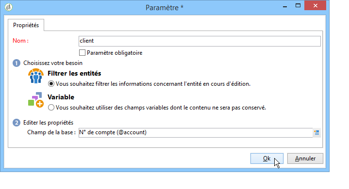
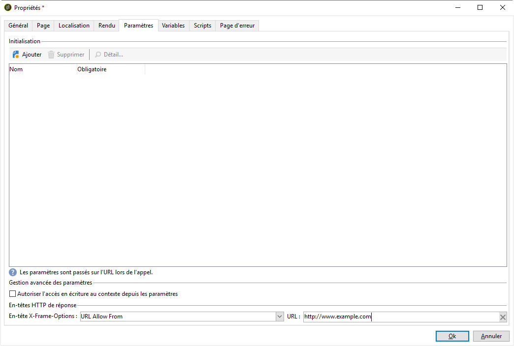
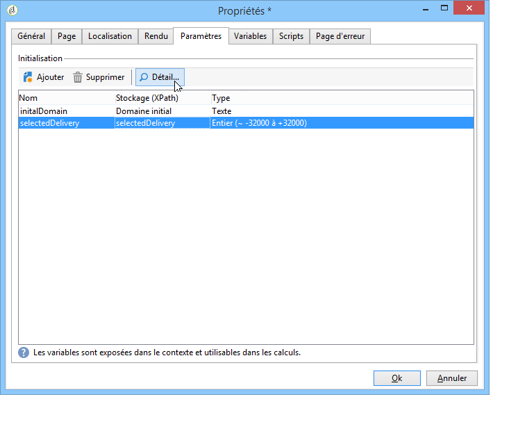

# Fonctionnalités avancées{#advanced-functionalities}


En tant qu&#39;utilisateur technique, en plus des [propriétés générales](../../reporting/using/properties-of-the-report.md), vous pouvez tirer parti de fonctionnalités avancées pour configurer vos rapports, telles que :

* Créer des requêtes complexes pour traiter les données dans une activité **Script**. [En savoir plus](#script-activity)

* Ajouter un script externe à exécuter côté serveur ou côté client. [En savoir plus](#external-script)

* Appeler un rapport avec une activité **Saut**. [En savoir plus](#calling-up-another-report)

* Ajouter un paramètre d&#39;URL à un rapport pour le rendre plus accessible. [En savoir plus](#calling-up-another-report)

* Ajouter les variables à utiliser dans le contexte du rapport. [En savoir plus](#adding-variables)

## Utilisation de scripts {#adding-a-script}

### Scripts externes de référence {#external-script}

Vous pouvez référencer des codes JavaScript qui seront exécutés côté client et/ou côté serveur lors de l&#39;appel de la page du rapport.

Pour cela :

1. Éditez les [propriétés du rapport](../../reporting/using/properties-of-the-report.md) et cliquez sur l&#39;onglet **[!UICONTROL Scripts]**.
1. Cliquez sur **[!UICONTROL Ajouter]** et sélectionnez le script à référencer.
1. Choisissez ensuite le mode d&#39;exécution.

   Si vous ajoutez plusieurs scripts, utilisez les flèches de la barre d&#39;outils pour définir leur ordre d&#39;exécution.

   

Les scripts référencés doivent être rédigés en Javascript et être compatibles avec les navigateurs courants afin d&#39;assurer leur bonne exécution côté client. Pour plus d’informations, consultez [cette section](../../web/using/web-forms-answers.md).

### Ajout d&#39;une activité Script {#script-activity}

Lors de la [conception de votre rapport](../../reporting/using/creating-a-new-report.md#modelizing-the-chart), utilisez l&#39;activité **[!UICONTROL Script]** pour traiter les données et créer facilement des requêtes complexes qui n&#39;activent pas le langage SQL. Vous pouvez saisir directement votre requête dans la fenêtre de script.

L’onglet **[!UICONTROL Textes]** vous permet de définir des chaînes de texte. Elles peuvent ensuite être utilisées avec la syntaxe suivante : **$(Identifiant)**. Pour plus d’informations sur l’utilisation de textes, voir [Ajouter un en-tête et un pied de page](../../reporting/using/element-layout.md#adding-a-header-and-a-footer).

>[!CAUTION]
>
>Il est FORTEMENT déconseillé d&#39;utiliser du code Javascript pour créer des agrégats.

Si vous souhaitez créer un historique de votre rapport, vous devez rajouter la ligne suivante à votre requête JavaScript, afin de conserver vos données historisées :

```
if( ctx.@_historyId.toString().length == 0 )
```

Dans le cas contraire, seules les données en cours seront affichées.

## Ajout d&#39;un paramètre d&#39;URL {#defining-additional-settings}

L&#39;onglet **[!UICONTROL Paramètres]** des [propriétés du rapport](../../reporting/using/properties-of-the-report.md) permet de définir des paramètres supplémentaires pour le rapport : ils seront passés sur l&#39;URL lors de l&#39;appel.

>[!CAUTION]
>
>Pour des questions de sécurité, ces paramètres doivent être utilisés avec précaution.

Pour créer un nouveau paramètre :

1. Cliquez sur le bouton **[!UICONTROL Ajouter]** et saisissez le nom du paramètre.

   

1. Au besoin, indiquez si ce paramètre doit être obligatoire.

1. Choisissez le type de paramètre à créer : **[!UICONTROL Filtre]** ou **[!UICONTROL Variable]**.

   L&#39;option **[!UICONTROL Filtrer les entités]** permet d&#39;utiliser un champ de la base comme paramètre.

   

   Les données sont directement récupérées au niveau de l&#39;entité : **ctx/recipient/@account**.

   L&#39;option **[!UICONTROL Variable]** permet de créer ou sélectionner une variable qui sera passée en paramètre de l&#39;URL et pourra être utilisée au niveau des filtres.

Les **[!UICONTROL En-têtes HTTP de réponse]** permettent d’empêcher le détournement de clics (clickjacking) si la page du rapport est incorporée dans une page HTML à l’aide d’iframe. Pour éviter le détournement de clics, vous pouvez choisir le comportement de l’**[!UICONTROL En-tête X-Frame-Options]** :

* **[!UICONTROL Aucun]** : le rapport ne comporte pas d’**[!UICONTROL En-tête X-Frame-Options]**.
* **[!UICONTROL Même origine]** : défini par défaut pour les nouveaux rapports et les rapports republiés. Le nom d’hôte sera identique à l’URL du rapport.
* **[!UICONTROL Refuser]** : le rapport ne peut pas être incorporé dans une page HTML à l’aide d’iframe.



## Ajouter des variables {#adding-variables}

L&#39;onglet **[!UICONTROL Variables]** contient la liste des variables paramétrées dans le rapport. Ces variables sont exposées dans le contexte du rapport et utilisables dans les calculs.

Cliquez sur le bouton **[!UICONTROL Ajouter]** pour créer une nouvelle variable.

Pour consulter la définition d&#39;une variable, sélectionnez-la et cliquez sur le bouton **[!UICONTROL Détail...]**.



## Cas pratique : utilisation de variables et de paramètres dans un rapport

Dans l&#39;exemple vidéo ci-dessous, vous apprendrez comment ajouter un paramètre &quot;_type&quot; pour créer différentes vues d&#39;un rapport, en fonction de la valeur de cet attribut.

<!--
 [Discover this feature in video](https://helpx.adobe.com/campaign/classic/how-to/add-url-parameter-in-acv6.html?playlist=/ccx/v1/collection/product/campaign/classic/segment/business-practitioners/explevel/intermediate/applaunch/how-to-4/collection.ccx.js&ref=helpx.adobe.com)-->


## Appel d&#39;un autre rapport {#calling-up-another-report}

Une activité **Saut** est comme une transition sans flèche : elle permet de passer d&#39;une activité à une autre ou d&#39;accéder à un autre rapport.
