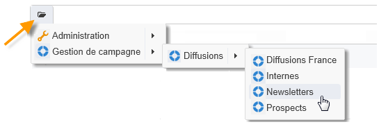

# Collecte des données à analyser{#collecting-data-to-analyze}

Les données qui vont être utilisées pour construire le rapport peuvent être sélectionnées directement au niveau de la page du rapport (voir à ce propos la section [Utiliser le contexte](../../reporting/using/using-the-context.md)) ou collectées via une ou plusieurs requêtes.

Dans cette activité, trois méthodes distinctes sont proposées :

1. Construire une requête sur les données de la base.
1. Exploiter les données contenues dans une liste.
1. Utiliser les données d&#39;un Cube existant.

Le choix de l&#39;une ou l&#39;autre des méthodes dépend du type de calcul à réaliser, du volume des données à manipuler, de leur pérennité, etc. Tous ces paramètres doivent être étudiés avec précision afin de ne pas surcharger la base Adobe Campaign et d&#39;optimiser la génération et la manipulation des rapports créés. Reportez-vous à ce propos à [cette page](../../reporting/using/best-practices.md#optimizing-report-creation).

Dans tous les cas, les données sont collectées au travers d&#39;une activité de type **[!UICONTROL Requête]**.

Ce mode de sélection des données est pertinent lorsque les données du rapport doivent être collectées, ou construites, à partir des données de la base. Dans certains cas, il est également possible de sélectionner directement les données au niveau des éléments utilisés dans le rapport, par exemple lorsque vous insérez un graphique, vous pouvez sélectionner directement les données source. Voir à ce sujet la section [Utiliser le contexte](../../reporting/using/using-the-context.md).

## Utilisation des données provenant dʼun schéma {#using-the-data-from-a-schema}

Pour utiliser directement les données associées à un schéma de la base, sélectionnez l&#39;option correspondante dans le requêteur puis paramétrez la requête à appliquer.

L&#39;exemple suivant permet de collecter le nombre de destinataires de chaque pays, parmi les profils de la base. Ils pourront ensuite être affichés dans un rapport sous la forme d&#39;un tableau.

## Utilisation dʼune liste importée {#using-an-imported-list}

Pour créer un rapport, vous pouvez utiliser les données d&#39;une liste de données importées.

Pour cela, sélectionnez l&#39;option **[!UICONTROL Utiliser une liste importée]** dans la boîte de requête puis sélectionnez la liste concernée.

Cliquez sur le lien **[!UICONTROL Editer la requête...]** pour définir les données à collecter parmi les éléments de cette liste, pour la construction du rapport.

## Utilisation dʼun cube {#using-a-cube}

Vous pouvez sélectionner un cube afin de définir la requête.

Les cubes permettent d&#39;étendre les capacités d&#39;exploration et d&#39;analyse des données de la base, tout en simplifiant le paramétrage des rapports et tables pour les utilisateurs finaux : il suffit de sélectionner un cube existant, entièrement paramétré, pour en exploiter les calculs, mesures et statistiques. Pour plus d&#39;informations sur la création de cubes, consultez [cette section](../../reporting/using/ac-cubes.md).

Cliquez sur le lien **[!UICONTROL Editer la requête...]** et sélectionnez les indicateurs que vous souhaitez afficher ou exploiter dans votre rapport.

## Options de fitrage dans les requêtes {#filtering-options-in-the-queries}

Les données doivent être filtrées afin de ne pas exécuter de requêtes sur l&#39;ensemble de la base de données.

### Filtrage simplifié {#simplified-filter}

Vous pouvez sélectionner l&#39;option **[!UICONTROL Filtrer automatiquement avec le contexte]** pour rendre le rapport accessible depuis un noeud spécifique de l&#39;arborescence comme une liste, un destinataire, une diffusion.

L&#39;option **[!UICONTROL Filtrer avec le dossier]** permet de spécifier un dossier précis pour ne prendre en compte que les éléments du dossier spécifié. Ainsi, vous pourrez filtrer les données du rapport pour n&#39;afficher que celles d&#39;un des dossiers de l&#39;arborescence, comme ci-dessous :

### Limitation de la taille des données collectées {#limiting-the-amount-of-data-collected}

Paramétrez le nombre d&#39;enregistrements à extraire via la requête à l&#39;aide des options de limitation de résultat :

* **[!UICONTROL Limiter au premier enregistrement]** pour extraire un seul résultat,
* **[!UICONTROL Taille]** pour extraire un nombre d&#39;enregistrements précis.
