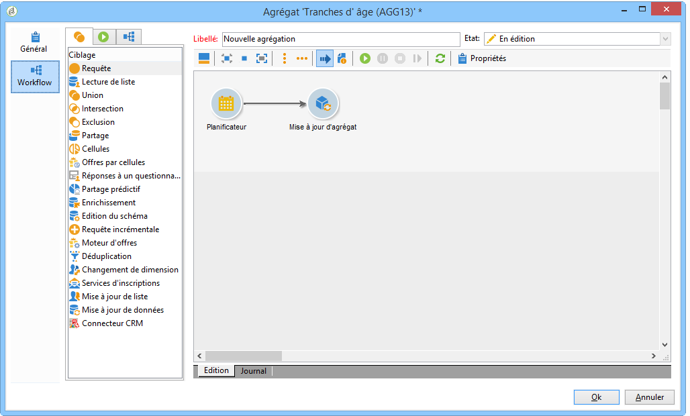
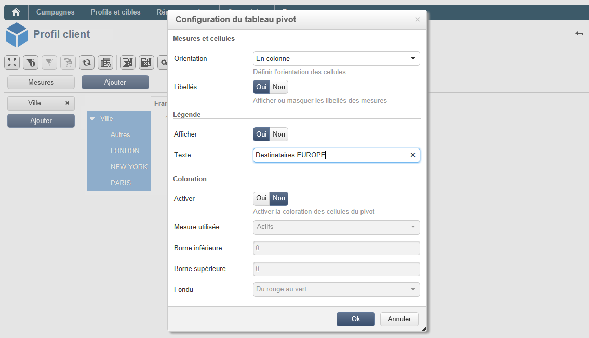

# Meilleures pratiques pour les cubes{#concepts-and-methodology}

## Mise en classe des données {#data-binning}

La mise en classe permet de simplifier l&#39;affichage des données en regroupant les valeurs sur critères. Selon les informations dont vous disposez, vous pouvez ainsi définir des tranches d&#39;âges, grouper des domaines d&#39;email, restreindre à une énumération de valeurs, restreindre explicitement les données à afficher et regrouper toutes les autres dans une colonne ou une ligne dédiée, etc.

Globalement, trois types de mise en classe sont possibles :

1. Utilisation de plages de valeurs définies manuellement. Par exemple, âge, panier d&#39;achat moyen, nombre de livraisons ouvertes, etc.). For more on this, refer to [Defining each bin](#defining-each-bin).
1. Dynamiquement, selon les valeurs d’une énumération : affiche uniquement les valeurs contenues dans l’énumération, toutes les autres valeurs sont regroupées dans &quot;Autres&quot;. Pour plus d’informations, reportez-vous à la section Gestion [dynamique des bacs](#dynamically-managing-bins).
1. En utilisant des plages de valeurs, toutes les autres sont regroupées. Par exemple, les 18 à 25 ans, les 26 à 59 ans, et les autres. For more on this, refer to [Creating value ranges](#creating-value-ranges).

Pour activer la mise en classe, cochez l&#39;option correspondante lors de la création de la dimension.

Vous pouvez créer chaque classe manuellement ou les lier à une énumération existante.

Pour générer automatiquement les classes, Adobe Campaign propose également un assistant : les valeurs peuvent être réparties en N groupes, ou regroupées selon les plus représentées dans la base.

### Définir chaque classe {#defining-each-bin}

To create each bin individually, select the **[!UICONTROL Define each bin]** option and use the table to create the various bins.

Click the **[!UICONTROL Add]** button to create a new bin and list the values which will be grouped into the bin.

Dans l&#39;exemple ci-dessous, les langues seront réparties dans trois groupes : Anglais-Allemand-Néerlandais, Français-Italien-Espagnol et Autres.

Vous pouvez utiliser un masque SQL pour combiner plusieurs valeurs dans un filtre. Pour ce faire, vérifiez **[!UICONTROL Yes]** la **[!UICONTROL Use an SQL mask]** colonne et entrez le filtre SQL à appliquer dans la **[!UICONTROL Value or expression]** colonne.

Dans l&#39;exemple ci-dessous, tous les domaines d&#39;email commençant par **yahoo** (yahoo.fr, yahoo.com, yahoo.be, etc.), ou par **ymail** (ymail.com, ymail.eu, etc.) seront regoupés sous le libellé **YAHOO!**, ainsi que les adresses du domaine **rocketmail.com**.

### Gérer dynamiquement les classes {#dynamically-managing-bins}

Les valeurs peuvent être gérées dynamiquement via les énumérations. Ainsi, seules les valeurs contenues dans l&#39;énumération seront affichées. Lorsque les valeurs de l&#39;énumération sont modifiées, le contenu du cube est adapté automatiquement.

Pour créer ce type de mise en classe des valeurs, les étapes sont les suivantes :

1. Créez une nouvelle dimension et activez la mise en classe.
1. Sélectionnez l’ **[!UICONTROL Dynamically link the values to an enumeration]** option et sélectionnez l’énumération correspondante.

   

   Lorsque les valeurs de l&#39;énumération sont mises à jour, les classes sont automatiquement adaptées, sans aucune action côté utilisateur.

### Créer des plages de valeurs {#creating-value-ranges}

Vous pouvez regrouper les valeurs dans des plages selon l&#39;intervalle souhaité.

Pour définir manuellement des plages, cliquez sur le **[!UICONTROL Add]** bouton et sélectionnez **[!UICONTROL Define a range]** :

Indiquez ensuite les bornes inférieures et supérieures et cliquez sur **[!UICONTROL Ok]** pour valider.

### Générer automatiquement les classes {#generating-bins-automatically}

Il est également possible de générer des chutiers automatiquement. To do this, click the **[!UICONTROL Generate bins...]** link.

Vous pouvez, au choix :

* Récupérer les valeurs les plus représentées

   Dans l&#39;exemple ci-dessus, les 4 valeurs les plus représentées seront affichées, les autres seront comptabilisées et regroupées sous le libellé &#39;Autres&#39;.

* Générer les classes sous forme de plages

   Dans l&#39;exemple ci-dessus, Adobe Campaign crée automatiquement 4 plages de valeurs de même taille pour afficher les valeurs de la base.

Dans ce cas, le filtre sélectionné au niveau du schéma des faits est ignoré.

### Enumérations {#enumerations}

Afin d&#39;augmenter la lisibilité et la pertinence des rapports, Adobe Campaign vous permet de créer des énumérations spécifiques pour regrouper différentes valeurs dans une même classe. Ces énumérations, réservées à la mise en classe, sont référencés dans les cubes puis affichées dans les rapports.

Adobe Campaign propose ainsi une énumération sur les domaines qui permet d&#39;afficher la liste des domaines des emails de tous les contacts en base, regroupés par FAI, comme dans l&#39;exemple ci-dessous :

Elle est construite selon le modèle suivant :

Pour créer un rapport à l’aide de cette énumération, créez un cube utilisant la **[!UICONTROL Email domain]** dimension. Choisissez ensuite l’ **[!UICONTROL Enable binning]** option **[!UICONTROL Dynamically link the values to an enumeration]**. Sélectionnez ensuite l’énumération **Domaines** comme illustré ci-dessus. Toutes les valeurs sans alias spécifié seront regroupées sous le libellé **Autres** .

Créez ensuite un rapport basé sur ce Cube pour afficher les valeurs.

Il suffira de modifier l&#39;énumération pour mettre à jour le rapport associé. Par exemple, créez la valeur **Adobe** et ajoutez l&#39;alias **adobe.com**, au niveau de l&#39;énumération : le rapport est automatiquement mis à jour avec la valeur Adobe.

L’ **[!UICONTROL Domains]** énumération permet de générer des rapports intégrés qui affichent la liste des domaines. Pour adapter le contenu de ces rapports, vous pouvez modifier cette liste.

Vous pouvez créer d&#39;autres énumérations réservées à la mise en classe et les utiliser dans d&#39;autres Cubes : toutes les valeurs d&#39;alias seront regroupées dans les classes définies dans le premier onglet de l&#39;énumération.

## Calcul et utilisation d&#39;agrégats {#calculating-and-using-aggregates}

Vous pouvez précalculer les données les plus volumineuses dans des agrégats.

Les agrégats sont pertinents lorsque vous manipulez un gros volume de données. Ils sont mis à jour automatiquement selon les paramètres définis dans la boîte de workflow dédiée, afin d&#39;intégrer les dernières données collectées dans les indicateurs.

Les agrégats sont définis au niveau du cube, dans l&#39;onglet correspondant.

>[!NOTE]
>
>Le workflow de mise à jour des calculs de l&#39;agrégat peut être paramétré dans l&#39;agrégat lui-même, mais l&#39;agrégat peut également être mis à jour au travers d&#39;un workflow externe dans lequel est référencé le cube correspondant.

Pour créer un nouvel agrégat, les étapes sont les suivantes :

1. Click the **[!UICONTROL Aggregates]** tab of the cube, then click the **[!UICONTROL Add]** button.

   

1. Saisissez le libellé de l&#39;agrégat, puis ajoutez les dimensions à calculer.

   

1. Sélectionnez la dimension et le niveau. Recommencez l&#39;opération pour chaque dimension et chaque niveau à calculer.
1. Cliquez sur l&#39;onglet **[!UICONTROL Workflow]** pour créer le workflow d&#39;agrégation.

   

   * The **[!UICONTROL Scheduler]** activity lets you define the frequency of calculation updates. Le planificateur est détaillé dans [cette section](../../workflow/using/scheduler.md).
   * The **[!UICONTROL Aggregate update]** activity lets you select the update mode which you want to apply: full or partial.

      Par défaut, une mise à jour complète est réalisée à chaque calcul. Pour permettre une mise à jour partielle des données, sélectionnez l&#39;option correspondante puis définissez les conditions de mise à jour.

      

## Définition des mesures {#defining-measures}

Les types de mesures sont définis dans l’ **[!UICONTROL Measures]** onglet du cube. Vous pouvez calculer des sommes, des moyennes, des écarts, etc.

Vous pouvez créer autant de mesures que nécessaire : sélectionnez ensuite la mesure à afficher ou masquer dans le tableau. Voir à ce propos [Affichage des mesures](#displaying-measures).

Pour définir une nouvelle mesure, les étapes sont les suivantes :

1. Click the **[!UICONTROL Add]** button above the list of measures and select the type of measure and the formula to be calculated.

   

1. Au besoin, selon l&#39;opérateur sélectionné, choisissez l&#39;expression sur laquelle porte l&#39;opération.

   Le **[!UICONTROL Advanced selection]** bouton permet de créer des formules de calcul complexes. Voir à ce propos [cette section](../../platform/using/about-queries-in-campaign.md).

   

1. The **[!UICONTROL Filter the measure data...]** link lets you restrict the calculation field and only apply it to specific data in the database.

   

1. Enter the label of the measure and add a description, then click **[!UICONTROL Finish]** to create it.

## Affichage des mesures {#displaying-measures}

Vous pouvez paramétrer l&#39;affichage des mesures dans le tableau selon vos besoins. Vous pouvez ainsi choisir :

* the display sequence of measures (refer to [Display sequence](#display-sequence)),
* the information to show/hide in the report (refer to [Configuring the display](#configuring-the-display))
* quelles mesures afficher: pourcentage, total, nombre de décimales, etc. (voir [Modification du type de mesure affiché](#changing-the-type-of-measure-displayed)).

### Ordre d&#39;affichage {#display-sequence}

The measures calculated in the cube are configured via the **[!UICONTROL Measures]** button.

Vous pouvez changer l&#39;ordre d&#39;affichage en déplaçant les lignes. Dans l&#39;exemple suivant, les données de la France sont déplacées en bas de la liste : elles seront alors affichées dans la dernière colonne.

### Configuration de l&#39;affichage {#configuring-the-display}

Le paramétrage des mesures, lignes et colonnes affichées peut être réalisé unitairement pour chaque mesure ou au niveau général. Une icône spécifique permet d&#39;accéder à la fenêtre de sélection des modes d&#39;affichage.

* Cliquez sur l’ **[!UICONTROL Edit the configuration of the pivot table]** icône pour accéder à la fenêtre de configuration.

   Vous pouvez choisir d&#39;afficher ou non les libellés des mesures ainsi que leur localisation (en ligne ou en colonne).

Les options de coloration permet d&#39;identifier visuellement les valeurs les plus importantes afin d&#39;optimiser la lisibilité des informations.

### Changement du type de mesure affichée {#changing-the-type-of-measure-displayed}

Au niveau de chaque mesure, vous pouvez définir l&#39;unité et le formatage à appliquer.

## Partager un rapport {#sharing-a-report}

Une fois le rapport paramétré, vous pouvez choisir de le conserver et de le partager avec d&#39;autres opérateurs.

Pour ce faire, cliquez sur l’ **[!UICONTROL Show the report properties]** icône et activez l’ **[!UICONTROL Share this report]** option.

Indiquez la catégorie à laquelle ce rapport appartient et sa pertinence. Voir à ce propos les sections **Ordre d&#39;affichage** et **Définir les options de filtrage** de [cette page](../../reporting/using/configuring-access-to-the-report.md#report-display-context).

Pour valider ces modifications, vous devez enregistrer le rapport.

## Création de filtres {#creating-filters}

Vous pouvez créer des filtres afin de n&#39;afficher qu&#39;une partie des données.

Pour cela :

1. Cliquez sur l’ **[!UICONTROL Add a filter]** icône .

   

1. Sélectionnez la dimension sur laquelle porte le filtrage.

   

1. Sélectionnez le type de filtre à appliquer et indiquez sa précision.

   

1. Une fois créé, le filtre apparaît au-dessus du rapport.

   

   Cliquez sur le filtre pour l&#39;éditer.

   Cliquez sur la croix pour supprimer le filtre.

   Vous pouvez combiner autant de filtres que nécessaire : ils seront tous affichés dans cette zone.

   

A chaque modification (ajout, modification, suppression de filtres), cliquez sur la flèche pour relancer le calcul du rapport.

Les filtres peuvent également être créés en fonction d’une sélection. Pour ce faire, sélectionnez vos cellules, lignes et colonnes source, puis cliquez sur l’ **[!UICONTROL Add a filter]** icône .

Pour sélectionner une ligne, une colonne ou une cellule, cliquez dessus avec le bouton gauche de la souris. Pour la dé-sélectionner, cliquez une seconde fois.

Le filtre est automatiquement appliqué et ajouté dans la zone des filtres, au-dessus du rapport.

