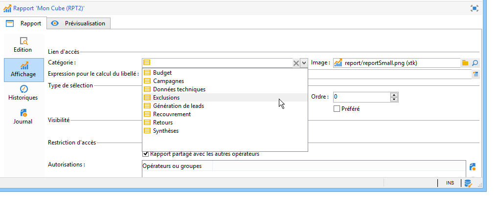

# Configuration de l’accès au rapport{#configuring-access-to-the-report}

## Contexte d&#39;affichage des rapports {#report-display-context}

Définissez le contexte d&#39;affichage du rapport dans la plateforme Adobe Campaign à partir de l&#39;onglet **[!UICONTROL Affichage]**. L&#39;accès à un rapport dépend de son type de sélection, de ses conditions d&#39;affichage et des autorisations d&#39;accès.

### Type de sélection {#selection-type}

L&#39;accès au rapport peut être limité à un contexte, ou emplacement, spécifique, par exemple une diffusion, un destinataire, une sélection de destinataires, etc. Cet accès est paramétré dans la section **[!UICONTROL Type de sélection]** de l&#39;onglet **[!UICONTROL Affichage]**.

* **[!UICONTROL Mono-sélection]** : le rapport n&#39;est accessible que lorsqu&#39;on sélectionne une entité particulière.
* **[!UICONTROL Multi-sélection]** : le rapport est accessible lorsque plusieurs entités sont sélectionnées.
* **[!UICONTROL Global]** : le rapport est accessible depuis la liste des rapports disponibles de l’onglet **[!UICONTROL Rapports]**.

### Ordre d&#39;affichage {#display-sequence}

Le champ **[!UICONTROL Ordre]** permet de saisir une valeur numérique qui spécifie l&#39;ordre d&#39;affichage du rapport dans la liste.

Par défaut, les rapports sont affichés par pertinence : la valeur saisie dans ce champ permet de trier les rapports, du plus pertinent (valeur la plus grande), au moins pertinent (valeur la plus petite).

Vous pouvez choisir librement l&#39;échelle à utiliser, selon vos besoins. Par exemple de 1 à 10, de 0 à 100, de -10 à 10, etc.

### Conditions d&#39;affichage {#display-conditions}

Vous pouvez également conditionner l&#39;affichage du rapport à l&#39;aide d&#39;une requête.

Dans l&#39;exemple ci-dessous la condition d&#39;affichage est que le canal principal de l&#39;opération soit l&#39;email.

Donc si le canal principal de l&#39;opération est le canal courrier, le rapport ne sera pas proposé parmi les rapports de l&#39;opération.

### Autorisation d&#39;accès {#access-authorization}

Le rapport peut être partagé ou non avec d&#39;autres opérateurs.

Pour rendre le rapport accessible, sélectionnez l&#39;option **[!UICONTROL Rapport partagé avec les autres opérateurs]**. Si cette option n&#39;est pas sélectionnée, seul l&#39;opérateur qui a créé le rapport peut accéder au rapport.

Le rapport peut également être partagé avec des opérateurs ou des groupes d&#39;opérateurs spécifiques qui sont ajoutés dans la fenêtre des autorisations.

### Définition des options de filtrage {#defining-the-filtering-options}

L’onglet **[!UICONTROL Rapports]** affiche tous les rapports disponibles dans la plateforme, et pour lesquels l’opérateur connecté a un droit d’accès.

Par défaut, ils sont triés par pertinence mais vous pouvez appliquer d&#39;autres types de filtres : alphabétique, par ancienneté, etc.

Vous pouvez également filtrer l&#39;affichage selon la catégorie du rapport :

Pour définir la catégorie d&#39;un rapport, sélectionnez-la à partir de l&#39;onglet **[!UICONTROL Affichage]**, comme dans l&#39;exemple ci-dessous :

Vous pouvez y saisir une nouvelle catégorie pour l&#39;ajouter dans la liste des catégories disponibles. L&#39;énumération correspondante est alors automatiquement mise à jour.

## Création dʼun lien vers un rapport {#creating-a-link-to-a-report-}

Vous pouvez faire en sorte qu&#39;un rapport soit accessible depuis un noeud spécifique de l&#39;arborescence comme une liste, un destinataire, une diffusion etc. Pour cela, il suffit de créer un lien vers le rapport concerné et de spécifier l&#39;entité dans laquelle il doit être disponible.

A titre d&#39;exemple, nous allons créer un lien vers un rapport afin qu&#39;il soit accessible depuis une liste de destinataires.

1. Cliquez sur **[!UICONTROL Nouveau]** et choisissez **[!UICONTROL Créer un lien vers un rapport existant]** dans l&#39;assistant de création de rapport.

   

1. Sélectionnez le rapport vers lequel vous souhaitez créer un lien à l&#39;aide de la liste déroulante. Dans notre exemple nous sélectionnons le rapport **Répartition par pays**.

   

1. Précisez un libellé et choisissez le schéma. Dans notre exemple nous choisissons la table des listes de destinataires.

   

   Cela signifie que ce rapport sera accessible depuis n&#39;importe quelle liste de destinataires et que les statistiques seront effectuées sur les destinataires contenus dans la liste sélectionnée.

1. Enregistrez et affichez votre rapport.
1. Renseignez la clé de liaison. Dans notre exemple il s&#39;agit de la Clé étrangère du lien &#39;Dossier&#39;.

   

1. Publiez votre rapport.
1. Positionnez-vous dans une de vos listes de destinataires et cliquez sur le lien **[!UICONTROL Rapports]** : le rapport que vous venez de créer est alors accessible.

   

## Aperçu du rapport {#preview-of-the-report}

Avant de publier votre rapport, vérifiez qu&#39;il s&#39;affiche correctement dans l&#39;onglet **[!UICONTROL Prévisualisation]**.

Pour afficher l&#39;aperçu du rapport, sélectionnez l&#39;option **[!UICONTROL Global]** ou **[!UICONTROL Sélection]**.

Vous devrez choisir entre ses deux options en fonction des paramètres d&#39;affichage du rapport. Si le paramètre d&#39;affichage choisi est **[!UICONTROL Global]**, vous devrez sélectionner l&#39;option d&#39;aperçu **[!UICONTROL Global]**. Si les paramètres d&#39;affichage sont **[!UICONTROL Mono-sélection]** ou **[!UICONTROL Multi-sélection]**, l&#39;option d&#39;aperçu **[!UICONTROL Sélection]** doit être sélectionné.

Voir à ce sujet la section [Contexte d&#39;affichage des rapports](#report-display-context).

Vous disposez également de paramètres qui vous permettent de contrôler les erreurs. Le paramètre **_uuid** est présent dans l&#39;URL du rapport. Vous pouvez lui adjoindre les paramètres **&amp;_preview** ou **&amp;_debug**.

Pour plus d&#39;informations sur ces paramètres, consultez la section **Définir les propriétés d&#39;un formulaire web** du chapitre [Formulaires Web](../../web/using/about-web-forms.md).

## Publication du rapport {#publishing-the-report}

La publication du rapport est obligatoire pour le partager avec d’autres opérateurs et l’afficher dans la liste des rapports disponibles (consultez également la section [Contexte d&#39;affichage des rapports](#report-display-context)). Cette opération doit être exécutée à nouveau chaque fois que le rapport est modifié.

1. Ouvrez l&#39;assistant de publication en cliquant sur **[!UICONTROL Publier]** dans la barre d&#39;outils.

   

1. Cliquez sur **[!UICONTROL Démarrer]** pour lancer la publication.

   

1. Le rapport est alors disponible pour dans l&#39;univers **[!UICONTROL Rapports]**.
