# Création d’un graphique{#creating-a-chart}

Les données de la base peuvent également être collectées et affichées dans un graphique.Adobe Campaign fournit un ensemble de représentations graphiques.Leur configuration est présentée ci-dessous.

Comme les tableaux, les graphiques sont insérés directement dans une page de rapport, à partir du menu contextuel ou de la barre d&#39;outils.

## Étapes de création {#creation-steps}

Pour créer un graphique dans un rapport, les étapes sont les suivantes :

1. Editez la page où vous souhaitez afficher le graphique et sélectionnez le type de graphique dans la barre d&#39;outils de la page.

   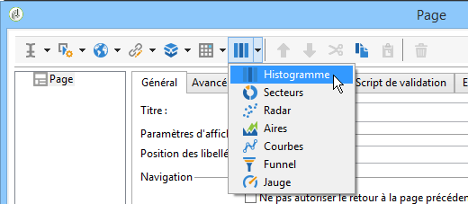

1. Saisissez un nom et une légende.Au besoin, vous pouvez modifier la position de la légende, à partir de la liste déroulante correspondante.

   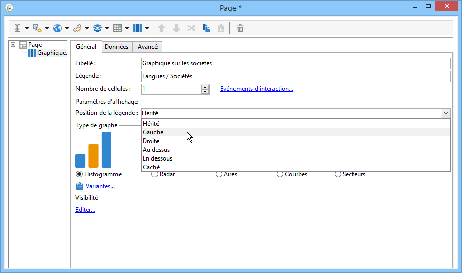

1. Cliquez sur l&#39;onglet **[!UICONTROL Données]** pour définir la source des données et les séries à calculer.

   Les statistiques à afficher dans le graphique peuvent être calculées à partir d&#39;une requête ou à partir des données du contexte, c&#39;est-à-dire celles véhiculées par la transition entrante de la page en cours (voir à ce propos la section [Utiliser les données du contexte](../../reporting/using/using-the-context.md#using-context-data)).

   * Cliquez sur le lien **[!UICONTROL Filtrer les données...]** pour définir les critères de filtrage sur les données de la base.

     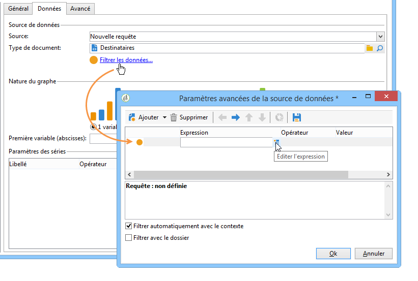

   * Pour utiliser les données contextuelles, sélectionnez **[!UICONTROL Données contextuelles]** dans la liste déroulante **[!UICONTROL Source]** et cliquez sur le lien **[!UICONTROL Paramètres avancés...]**. Sélectionnez ensuite les données sur lesquelles porteront les statistiques.

     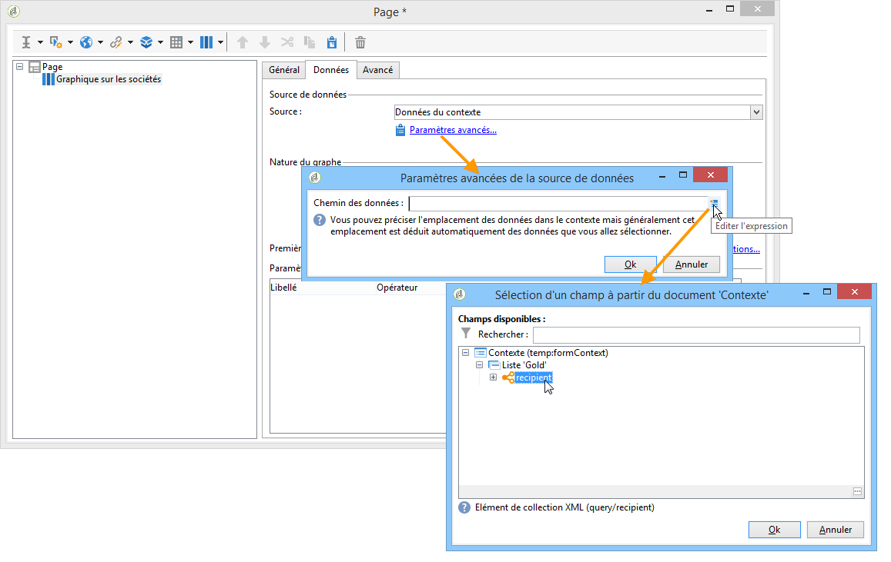

     Vous aurez ensuite accès aux données du contexte pour définir les valeurs à afficher dans le graphique :

     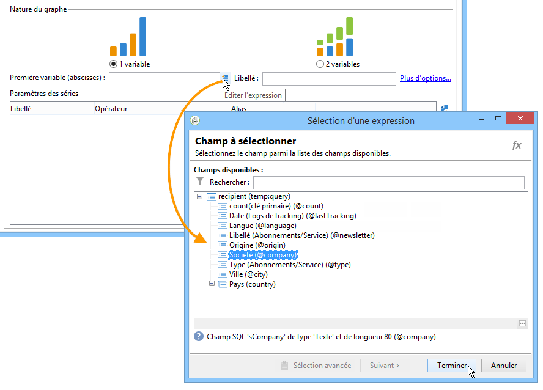

## Types de graphiques et leurs variantes {#chart-types-and-variants}

Adobe Campaign propose différents types de représentations graphiques.Elles sont détaillées ci-dessous.

Le type de graphique est sélectionné lors de son insertion dans la page.

Il peut également être modifié à partir de la section **[!UICONTROL Type de graphe]** de l&#39;onglet **[!UICONTROL Général]** du graphique.

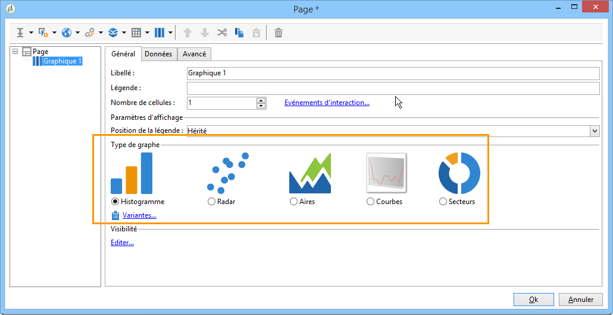

Les variantes dépendent du type de graphique sélectionné. Elles sont sélectionnées à partir du lien **[!UICONTROL Variantes...]**.

### Répartition : les secteurs {#breakdown--pie-charts}

Ce type de représentation graphique permet d&#39;afficher une vue d&#39;ensemble des parts des éléments mesurés.

Les secteurs ne permettent d&#39;analyser qu&#39;une seule variable.

Le lien **[!UICONTROL Variantes...]** permet de personnaliser le rendu général du graphique.

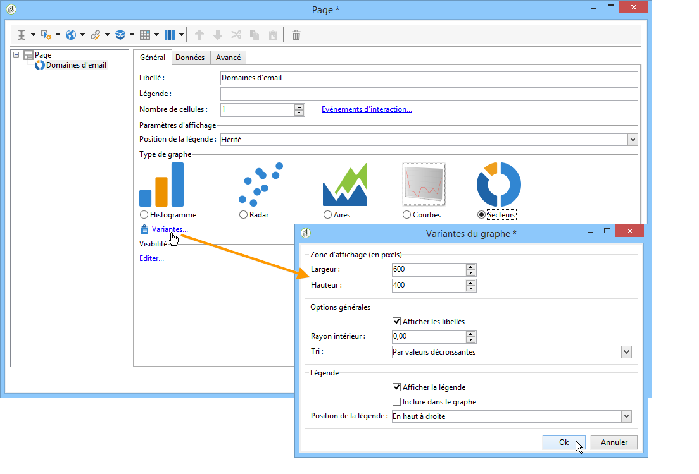

Pour une représentation en secteurs, vous pouvez définir la valeur du rayon intérieur dans le champ correspondant.

Par exemple :

Une valeur de 0,00 trace un cercle plein.

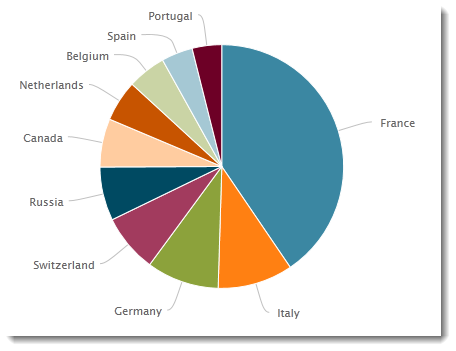

Une valeur de 0,40 trace un cercle avec un rayon de 40%.

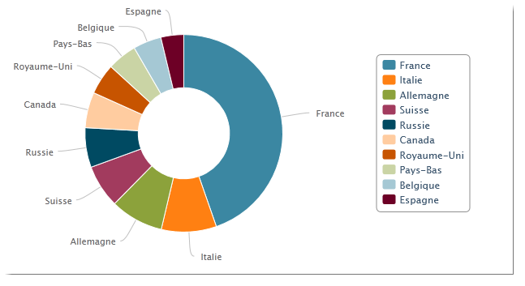

Une valeur de 1,00 ne trace que les extrémités du cercle.

### Évolution : les courbes et les aires {#evolution--curves-and-areas}

Ce type de représentation graphique permet de comprendre l&#39;évolution d&#39;une ou plusieurs mesures dans le temps.

### Comparaison : les histogrammes {#comparison--histograms}

Les histogrammes permettent de comparer différentes valeurs d&#39;une ou deux variables.

Pour ces types de graphes, les options suivantes sont proposées dans la fenêtre **[!UICONTROL Variantes]** :

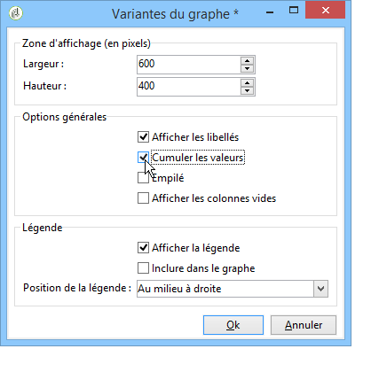

Cochez l&#39;option **[!UICONTROL Afficher la légende]** pour qu&#39;elle apparaisse avec le graphique. Vous pourrez ainsi en définir la position :

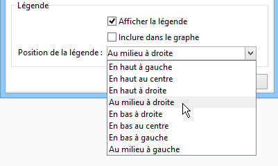

Lorsque les valeurs s&#39;y prêtent, vous pouvez les empiler.

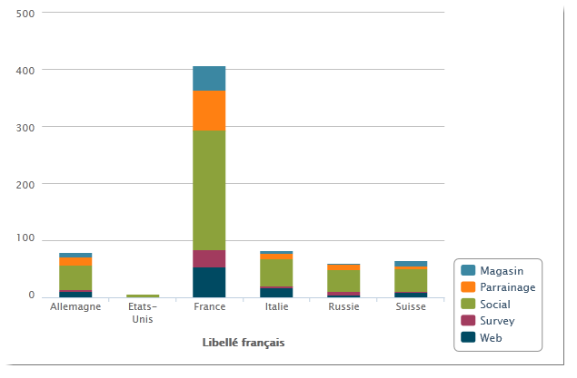

Au besoin, vous pouvez inverser l&#39;ordre d&#39;affichage des valeurs. Pour cela, sélectionnez l&#39;option **[!UICONTROL Empilement inversé]**.

### Conversion : le funnel {#conversion--funnel}

Ce type de graphique permet de suivre le taux de conversion des éléments mesurés.

## Interaction avec le graphique {#interaction-with-the-chart}

Vous pouvez définir une action lorsque l&#39;utilisateur clique sur le graphique. Ouvrez la fenêtre **[!UICONTROL Evénements d&#39;interaction]** et choisissez l&#39;action à effectuer.

Les types d&#39;interactions possibles et leurs paramétrages sont présentés dans [cette section](../../web/using/static-elements-in-a-web-form.md#inserting-html-content).

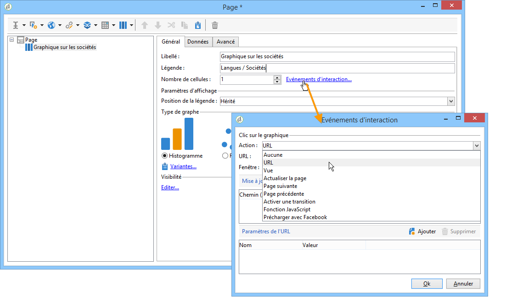

## Calcul des statistiques {#calculating-statistics}

Dans les graphiques, vous pouvez afficher des statistiques sur les données collectées.

Ces statistiques sont définies à partir de la section **[!UICONTROL Paramètres des séries]** de l&#39;onglet **[!UICONTROL Données]**.

Pour créer une statistique, cliquez sur l’icône **[!UICONTROL Ajouter]** et paramétrez la fenêtre correspondante.Les types de calcul disponibles sont détaillés ci-dessous.

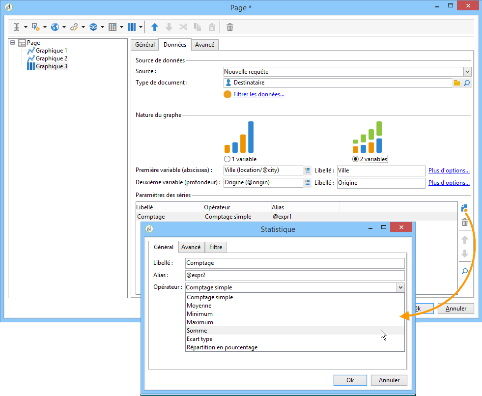

Voir à ce propos [cette section](../../reporting/using/using-the-descriptive-analysis-wizard.md#statistics-calculation).
