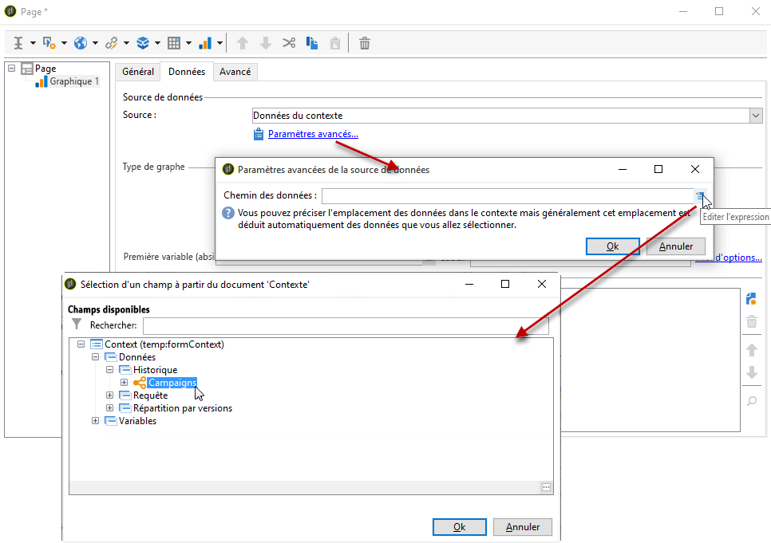
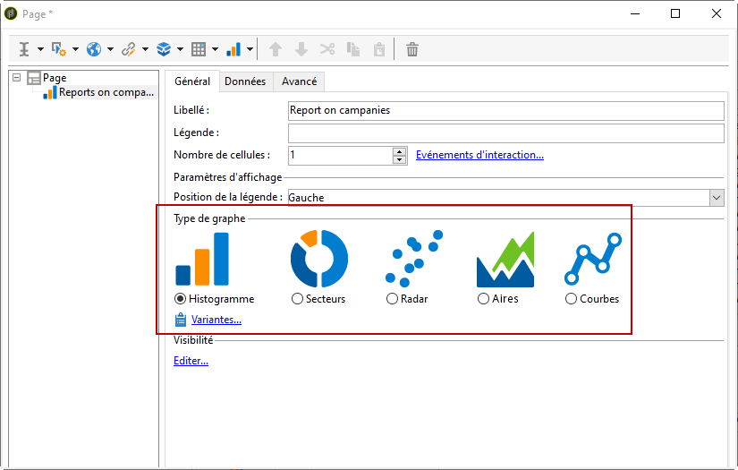
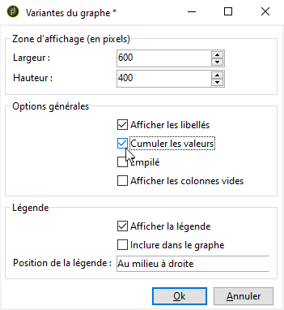
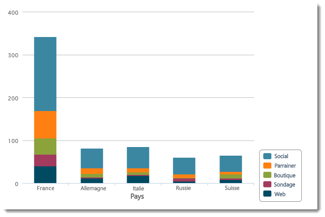
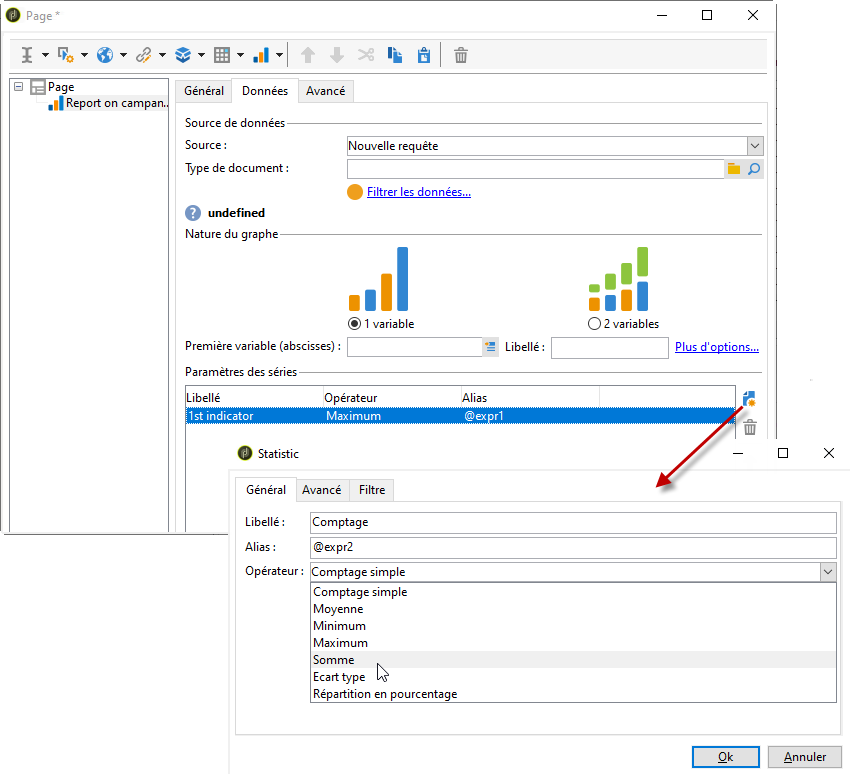

# Créer un graphique{#creating-a-chart}

Les données de la base peuvent également être collectées et affichées dans un graphique. Adobe Campaign vous propose un ensemble de représentations graphiques possibles dont le paramétrage général est présenté ci-après.

Comme les tableaux, les graphiques sont insérés directement dans une page de rapport, à partir du menu contextuel ou de la barre d&#39;outils.

## Etapes de création {#creation-steps}

Pour créer un graphique dans un rapport, les étapes sont les suivantes :

1. Editez la page où vous souhaitez afficher le graphique et sélectionnez le type de graphique dans la barre d&#39;outils de la page.

   

1. Saisissez le nom du graphique et la légende associée. Au besoin, vous pouvez modifier la position de la légende, à partir de la liste déroulante correspondante.

   

1. Click the **[!UICONTROL Data]** tab to define the data source and the series to be calculated.

   The statistics to be displayed in the chart can be calculated based on a query or on the context data, i.e. the data provided by the inbound transition of the current page (for more on this, refer to [Using context data](../../reporting/using/using-the-context.md#using-context-data)).

   * Click the **[!UICONTROL Filter data...]** link to define filtering criteria for the data in the database.

      

   * Pour utiliser des données contextuelles, sélectionnez cette option et cliquez sur le **[!UICONTROL Advanced settings...]** lien. Sélectionnez ensuite les données qui seront concernées par les statistiques.

      

      Vous aurez ensuite accès aux données du contexte pour définir les valeurs à afficher dans le graphique :

      

## Types de graphiques et leurs variantes {#chart-types-and-variants}

Adobe Campaign propose différents types de représentations graphiques. Ils sont présentés ci-après.

Le type de graphique est sélectionné lors de son insertion dans la page.

It can also be altered via the **[!UICONTROL Chart type]** section of the **[!UICONTROL General]** tab in the chart.

Les variantes dépendent du type de graphique sélectionné. Ils sont sélectionnés via le **[!UICONTROL Variants...]** lien.

### Répartition : les secteurs {#breakdown--pie-charts}

Ce type de représentation graphique permet d&#39;afficher une vue d&#39;ensemble des parts des éléments mesurés.

Les secteurs ne permettent d&#39;analyser qu&#39;une seule variable.

The **[!UICONTROL Variants]** link lets you personalize the overall rendering of the chart.

Pour une représentation en secteurs, vous pouvez définir la valeur du rayon intérieur dans le champ correspondant.

Par exemple :

Une valeur de 0,00 trace un cercle plein.

Une valeur de 0,40 trace un cercle avec un rayon de 40%.

Une valeur de 1,00 ne trace que les extrémités du cercle.

### Evolution : les courbes et les aires {#evolution--curves-and-areas}

Ce type de représentation graphique permet de comprendre l&#39;évolution d&#39;une ou plusieurs mesures dans le temps.

### Comparaison : les histogrammes {#comparison--histograms}

Les histogrammes permettent de comparer différentes valeurs d&#39;une ou deux variables.

For these types of charts, the following options are offered in the **[!UICONTROL Variants]** window:

Check the **[!UICONTROL Display caption]** option to show the caption with the chart and choose its position:

Lorsque les valeurs s&#39;y prêtent, vous pouvez les empiler.

Si nécessaire, vous pouvez inverser la séquence d’affichage des valeurs. To do this, select the **[!UICONTROL Reverse stacking]** option.

### Conversion : le funnel {#conversion--funnel}

Ce type de graphique permet de suivre le taux de conversion des éléments mesurés.

### Progression : la jauge {#progress--gauge}

Ce type de graphique permet d&#39;afficher la progression d&#39;une valeur par rapport à un objectif défini. Dans l&#39;exemple ci-dessous, la flèche noire représente le nombre de diffusions envoyées avec succès (76) sur un objectif de 100 diffusions. La jauge est divisée en trois plages de valeurs qui correspondent à un statut défini dans le paramétrage.

Ces éléments sont définis lors du paramétrage du graphique.

* Le **[!UICONTROL Value]** champ est représenté par un cadran noir dans le graphique. Il représente l’élément dont vous souhaitez calculer la progression. La valeur à représenter doit avoir déjà été enregistrée pour être utilisée.
* The **[!UICONTROL Goal]** field represents the maximum value to achieve.
* Using the **[!UICONTROL Other mark]** field you can add a second indicator to the chart.
* The **[!UICONTROL Display range]** fields let you specify the values between which the report is calculated.
* The **[!UICONTROL Value ranges]** field lets you attribute statuses (None, Bad, Acceptable, Good) to a set of values to better illustrate the progress.

In the **[!UICONTROL Display settings]** section, the **[!UICONTROL Change appearance...]** lets you configure the way the chart is displayed.

L’ **[!UICONTROL Display the value below the gauge]** option vous permet d’afficher la progression de la valeur sous le graphique.

Le **[!UICONTROL Aperture ratio]** champ, qui doit être compris entre 0 et 1, vous permet de modifier l&#39;ouverture du rapport dans un cercle plus ou moins complet. Dans l’exemple ci-dessus, la valeur 0,50 correspond à un demi-cercle.

The **[!UICONTROL Width]** field lets you edit the chart size.

## Interaction avec le graphique {#interaction-with-the-chart}

Vous pouvez définir une action lorsque l’utilisateur clique sur le graphique. Ouvrez la **[!UICONTROL Interaction events]** fenêtre et sélectionnez l’action à exécuter.

Les types d&#39;interactions possibles et leurs paramétrages sont présentés dans [cette section](../../web/using/static-elements-in-a-web-form.md#inserting-html-content).

## Calculer des statistiques {#calculating-statistics}

Dans les graphiques, vous pouvez afficher des statistiques sur les données collectées.

These statistics are defined via the **[!UICONTROL Series parameters]** section of the **[!UICONTROL Data]** tab.

Pour créer une statistique, cliquez sur l’ **[!UICONTROL Add]** icône et configurez la fenêtre appropriée. Les types de calcul disponibles sont détaillés ci-dessous.

Voir à ce propos [cette section](../../reporting/using/using-the-descriptive-analysis-wizard.md#statistics-calculation).
