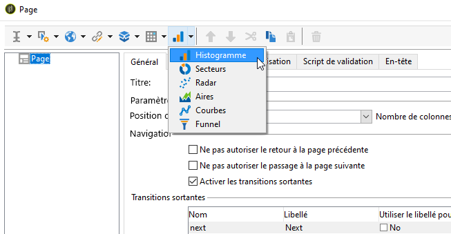
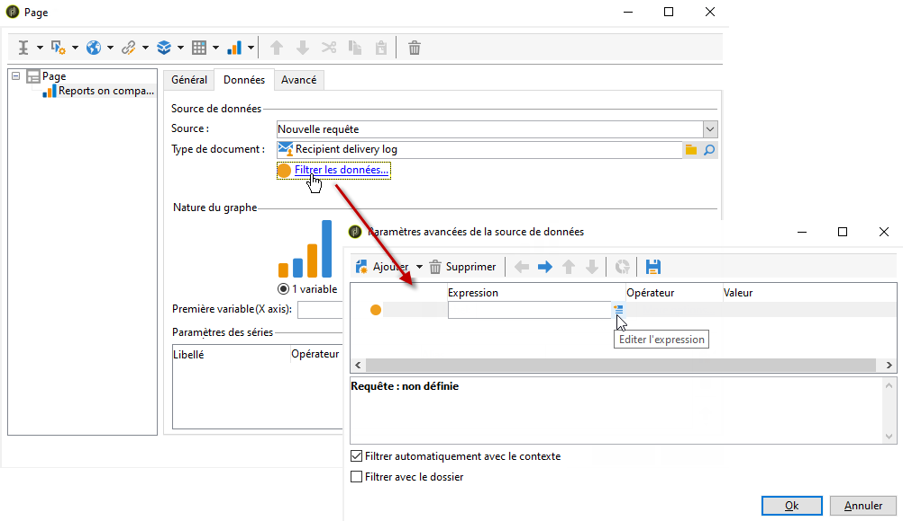
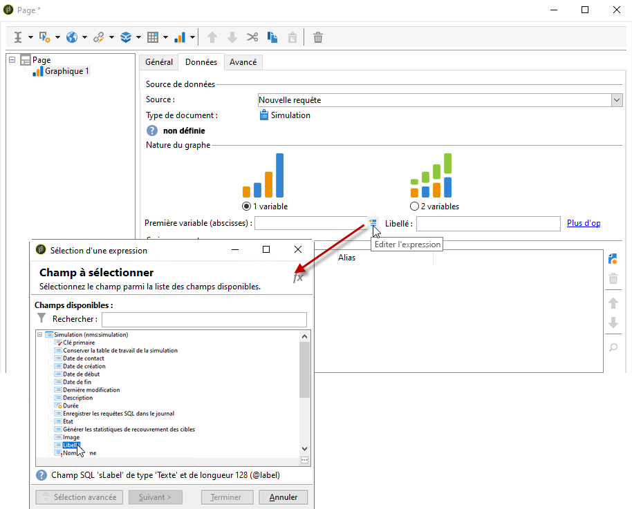
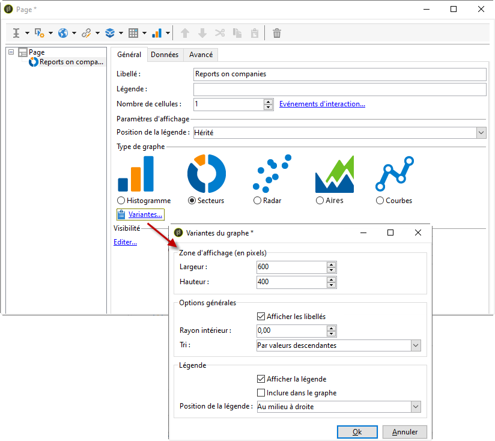
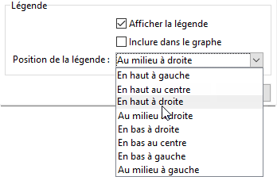
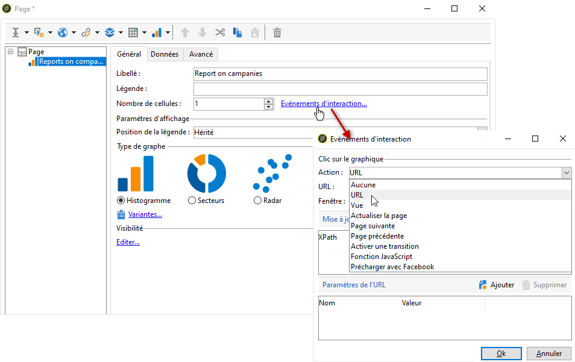

# Créer un graphique{#creating-a-chart}

Les données de la base peuvent également être collectées et affichées dans un graphique. Adobe Campaign vous propose un ensemble de représentations graphiques possibles dont le paramétrage général est présenté ci-après.

Comme les tableaux, les graphiques sont insérés directement dans une page de rapport, à partir du menu contextuel ou de la barre d&#39;outils.

## Etapes de création {#creation-steps}

Pour créer un graphique dans un rapport, les étapes sont les suivantes :

1. Editez la page où vous souhaitez afficher le graphique et sélectionnez le type de graphique dans la barre d&#39;outils de la page.

   

1. Saisissez le nom du graphique et la légende associée. Au besoin, vous pouvez modifier la position de la légende, à partir de la liste déroulante correspondante.

   

1. Cliquez sur l&#39;onglet **[!UICONTROL Données]** pour définir la source des données et les séries à calculer.

   Les statistiques à afficher dans le graphique peuvent être calculées à partir d&#39;une requête ou à partir des données du contexte, c&#39;est-à-dire celles véhiculées par la transition entrante de la page en cours (voir à ce propos la section [Utiliser les données du contexte](../../reporting/using/using-the-context.md#using-context-data)).

   * Cliquez sur le lien **[!UICONTROL Filtrer les données...]** pour définir les critères de filtrage sur les données de la base.

      

   * Pour utiliser les données du contexte, sélectionnez cette option et cliquez sur le lien **[!UICONTROL Paramètres avancés...]**. Sélectionnez ensuite les données sur lesquelles porteront les statistiques.

      

      Vous aurez ensuite accès aux données du contexte pour définir les valeurs à afficher dans le graphique :

      

## Types de graphiques et leurs variantes {#chart-types-and-variants}

Adobe Campaign propose différents types de représentations graphiques. Ils sont présentés ci-après.

Le type de graphique est sélectionné lors de son insertion dans la page.

Il peut également être modifié à partir de la section **[!UICONTROL Type de graphe]** de l&#39;onglet **[!UICONTROL Général]** du graphique.

Les variantes dépendent du type de graphique sélectionné. Elles sont sélectionnées à partir du lien **[!UICONTROL Variantes...]**.

### Répartition : les secteurs {#breakdown--pie-charts}

Ce type de représentation graphique permet d&#39;afficher une vue d&#39;ensemble des parts des éléments mesurés.

Les secteurs ne permettent d&#39;analyser qu&#39;une seule variable.

Le lien **[!UICONTROL Variantes...]** permet de personnaliser le rendu général du graphique.

Pour une représentation en secteurs, vous pouvez définir la valeur du rayon intérieur dans le champ correspondant.

Par exemple :

Une valeur de 0,00 trace un cercle plein.

Une valeur de 0,40 trace un cercle avec un rayon de 40%.

Une valeur de 1,00 ne trace que les extrémités du cercle.

### Evolution : les courbes et les aires {#evolution--curves-and-areas}

Ce type de représentation graphique permet de comprendre l&#39;évolution d&#39;une ou plusieurs mesures dans le temps.

### Comparaison : les histogrammes {#comparison--histograms}

Les histogrammes permettent de comparer différentes valeurs d&#39;une ou deux variables.

Pour ces types de graphes, les options suivantes sont proposées dans la fenêtre **[!UICONTROL Variantes]** :

Cochez l&#39;option **[!UICONTROL Afficher la légende]** pour qu&#39;elle apparaisse avec le graphique. Vous pourrez ainsi en définir la position :

Lorsque les valeurs s&#39;y prêtent, vous pouvez les empiler.

Au besoin, vous pouvez inverser l&#39;ordre d&#39;affichage des valeurs. Pour cela, sélectionnez l&#39;option **[!UICONTROL Empilement inversé]**.

### Conversion : le funnel {#conversion--funnel}

Ce type de graphique permet de suivre le taux de conversion des éléments mesurés.

### Progression : la jauge {#progress--gauge}

Ce type de graphique permet d&#39;afficher la progression d&#39;une valeur par rapport à un objectif défini. Dans l&#39;exemple ci-dessous, la flèche noire représente le nombre de diffusions envoyées avec succès (76) sur un objectif de 100 diffusions. La jauge est divisée en trois plages de valeurs qui correspondent à un statut défini dans le paramétrage.

Ces éléments sont définis lors du paramétrage du graphique.

* Le champ **[!UICONTROL Valeur]** est représenté par une flèche noire sur le graphique. Il définit l&#39;élément dont vous voulez calculer la progression. La valeur à définir doit être pré-enregistrée pour pouvoir être utilisée.
* Le champ **[!UICONTROL Objectif]** représente la valeur maximale à atteindre.
* Avec le champ **[!UICONTROL Autre marque]**, vous pouvez ajouter un deuxième indicateur sur le graphique.
* Les champs **[!UICONTROL Plage d&#39;affichage]** permettent de définir les valeurs entre lesquelles le rapport est calculé.
* Les **[!UICONTROL Plages de valeurs]** vous permettent d&#39;attribuer un statut (Aucun, Médiocre, Satisfaisant, Bon) à un ensemble de valeurs sur le graphique, pour mieux illustrer la progression.

Dans la section **[!UICONTROL Paramètres d&#39;affichage]**, le lien **[!UICONTROL Modifier l&#39;apparence...]** vous permet de paramétrer l&#39;affichage du graphique.

L&#39;option **[!UICONTROL Afficher la valeur sous la jauge]** permet d&#39;indiquer la progression de la valeur sous le graphique.

Le champ **[!UICONTROL Ratio d&#39;ouverture]**, qui doit être défini entre 0 et 1, permet de modifier l&#39;affichage du rapport en un cercle plus ou moins complet. Dans l&#39;exemple ci-dessus, la valeur 0,50 correspond à un demi-cercle.

Le champ **[!UICONTROL Largeur]** permet de modifier la taille du graphique.

## Interaction avec le graphique {#interaction-with-the-chart}

Vous pouvez définir une action lorsque l&#39;utilisateur clique sur le graphique. Ouvrez la fenêtre **[!UICONTROL Evénements d&#39;interaction]** et choisissez l&#39;action à effectuer.

Les types d&#39;interactions possibles et leurs paramétrages sont présentés dans [cette section](../../web/using/static-elements-in-a-web-form.md#inserting-html-content).

## Calculer des statistiques {#calculating-statistics}

Dans les graphiques, vous pouvez afficher des statistiques sur les données collectées.

Ces statistiques sont définies à partir de la section **[!UICONTROL Paramètres des séries]** de l&#39;onglet **[!UICONTROL Données]**.

Pour créer une nouvelle statistique, cliquez sur l&#39;icône **[!UICONTROL Ajouter]** et paramétrez la fenêtre correspondante. Les types de calculs possibles sont présentés ci-après.

Voir à ce propos [cette section](../../reporting/using/using-the-descriptive-analysis-wizard.md#statistics-calculation).
