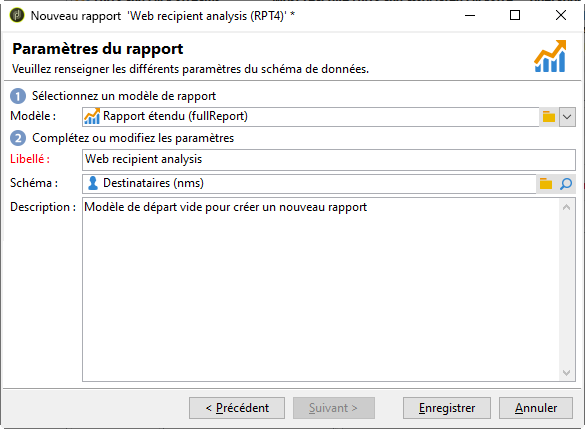
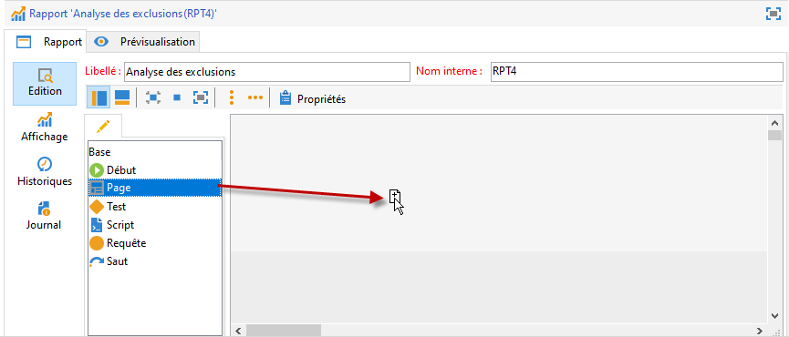
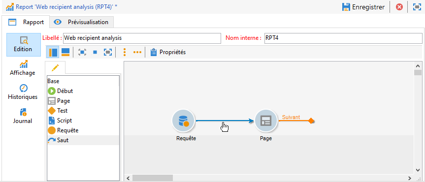
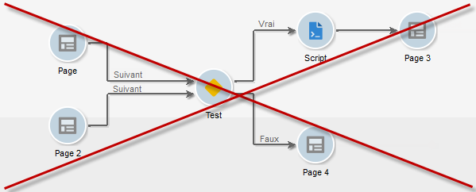
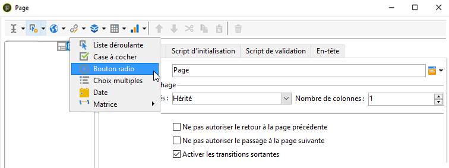

# Créer un nouveau rapport{#creating-a-new-report}

Pour créer un rapport, les étapes sont les suivantes :

1. Ouvrez l&#39;Explorateur Adobe Campaign et, depuis le nœud **[!UICONTROL Administration > Paramétrage]**, sélectionnez le dossier **[!UICONTROL Rapports]**.
1. Cliquez sur le bouton **[!UICONTROL Nouveau]** situé au-dessus de la liste des rapports.
1. Choisissez **[!UICONTROL Créer un nouveau rapport depuis un modèle]** et cliquez sur **[!UICONTROL Suivant]**.

   

1. Choisissez le modèle de rapport dans la liste déroulante.

   * Le modèle **[!UICONTROL Rapport étendu]** permet de créer un rapport paramétré à l&#39;aide d&#39;un diagramme.
   * Le rapport **[!UICONTROL Distribution qualitative]** permet de faire des statistiques sur tous types de données (ex. nom d&#39;une société, domaine d&#39;email, etc.).
   * Le rapport **[!UICONTROL Distribution quantitative]** permet de faire des statistiques sur des données qui peuvent être mesurées ou comptées (ex. montant d&#39;une facture, âge d&#39;un destinataire).

   Pour plus d&#39;informations sur ces modèles de rapport, consultez [cette section](../../reporting/using/about-descriptive-analysis.md).

1. Saisissez le nom du rapport et sa description dans les champs correspondants. Indiquez le **[!UICONTROL schéma]** sur lequel s&#39;appliquera le rapport.

   

1. Enregistrez ce rapport.

## Modéliser le diagramme {#modelizing-the-chart}

Après avoir enregistré votre rapport, ce dernier s&#39;affiche. Vous pouvez désormais construire le diagramme de votre rapport.

Le diagramme de construction du rapport est constitué d&#39;un enchaînement linéaire d&#39;activités.

Les activités sont reliées les unes aux autres par des transitions, représentées par des flèches.

Pour construire votre rapport, selon sa nature et son contexte d&#39;utilisation, vous devez identifier les éléments utiles et modéliser leur enchaînement logique.

1. Use the **[!UICONTROL Start]** activity to materialize the first process to be carried out to build the report. You can only use one of these activities per report.

   Elle est obligatoire lorsque le diagramme contient une boucle.

1. Add one or more **[!UICONTROL Query]** activities to collect data that is useful for building the report. Data can be collected either directly via a query on a schema of the database, or via an imported list or an existing Cube.

   Voir à ce sujet la section [Collecter les données à analyser](../../reporting/using/collecting-data-to-analyze.md).

   Ces données seront affichées ou non dans le rapport, selon le paramétrage des pages.

1. Place one or more **[!UICONTROL Page]** activities to define the graphical representation of the collected data. You can insert tables, charts, input fields, and condition the display of one or more pages, or elements of the page. The displayed content is fully configurable.

   Voir à ce sujet la section [Eléments statiques](#static-elements).

1. Use a **[!UICONTROL Test]** activity to define the conditions for displaying or accessing data.

   Voir à ce sujet la section [Conditionner l&#39;affichage d&#39;une page](../../reporting/using/defining-a-conditional-content.md#conditioning-page-display).

1. If necessary, add personalized scripts via the **[!UICONTROL Script]** activity, for instance to calculate the name of a report, to filter the display of the result within a specific context, etc.

   Voir à ce sujet la section [Activité Script](../../reporting/using/advanced-functionalities.md#script-activity).

1. Finally, you for easier reading of complex reports, you can insert one or more **[!UICONTROL Jump]** type activities. This lets you go from one activity to another without materializing the transition on the report. L&#39;activité **[!UICONTROL de redirection]** peut également être utilisée pour afficher un autre rapport.

   Voir à ce sujet la section [Activité Saut](../../reporting/using/advanced-functionalities.md#jump-activity).

Le mode d&#39;exécution d&#39;un rapport n&#39;est pas celui d&#39;un workflow. Typiquement, vous ne pouvez pas exécuter plusieurs branches en parallèle. Ainsi, un rapport construit comme suit ne sera pas opérationnel :

Par contre, il est possible de positionner plusieurs branches. Une seule d&#39;entre elles sera exécutée :

## Créer une page {#creating-a-page}

Le contenu est paramétré au travers des activités positionnées dans le diagramme. Voir à ce sujet la section [Modéliser le diagramme](#modelizing-the-chart).

Pour paramétrer chaque activité, double-cliquez sur son icône.

Le contenu affiché est défini dans les activités de type **Page**.

Un rapport peut contenir une ou plusieurs pages. Les pages sont créées à travers un éditeur dédié qui permet d&#39;y insérer, dans une arborescence, des zones de saisie, des champs de sélection, des éléments statiques, des graphiques ou des tableaux. La mise en page de ces éléments est réalisée au travers de conteneurs. Voir à ce sujet la section [Mettre en page des éléments](../../reporting/using/element-layout.md).

Pour ajouter un composant dans la page, utilisez les icônes situées dans la section gauche de la barre d&#39;outils.

Vous pouvez également cliquer avec le bouton droit sur le noeud dans lequel vous souhaitez l&#39;insérer et le choisir parmi ceux disponibles.

>[!CAUTION]
>
>Si le rapport est destiné à être exporté au format Excel, il est recommandé de ne pas utiliser de formatage complexe en HTML. Voir à ce sujet la section [Exporter un rapport](../../reporting/using/actions-on-reports.md#exporting-a-report).

Une **[!UICONTROL Page]** peut contenir les éléments suivants :

* Des **[!UICONTROL Graphiques]** de type Histogramme, Secteurs, Courbes, etc.
* Des **[!UICONTROL Tableaux]** de type Tableau croisé dynamique, Liste avec groupement ou Distribution.
* Des **[!UICONTROL Contrôles de saisie]** de type Texte ou Nombre.
* Des **[!UICONTROL Contrôles de sélection]** de type Liste déroulante, Case à cocher, Bouton radio, Choix multiples, Dates ou Matrice.
* Des **[!UICONTROL Contrôles avancés]** de type Editeur de lien, Constante, Choix de dossier.
* Des **[!UICONTROL Eléments statiques]** de type Valeur, Lien, HTML, Image, etc.
* Des **[!UICONTROL Conteneur]** pour assurer la mise en page des composants.

Le mode de paramétrage d&#39;une page et de ses composants est présenté dans [cette section](../../web/using/about-web-forms.md).

La barre d&#39;outils vous permet d&#39;ajouter ou supprimer les contrôles et d&#39;organiser l&#39;ordre dans lequel ils doivent apparaître dans la ou les pages de votre rapport.

### Eléments statiques {#static-elements}

Les éléments statiques vous permettent d&#39;afficher des informations dans le rapport, des éléments graphiques ou des scripts, avec lequel l&#39;utilisateur n&#39;aura pas d&#39;interaction. Pour plus d&#39;informations, consultez [cette section](../../web/using/static-elements-in-a-web-form.md#inserting-html-content).

### Filtrage des informations dans un rapport {#filtering-information-in-a-report}

Les contrôles de saisie et de sélection permettent de filtrer les informations affichées dans le rapport. Pour plus d&#39;informations sur la mise en œuvre de ce type de filtrage, consultez [Options de filtrage dans les requêtes](../../reporting/using/collecting-data-to-analyze.md#filtering-options-in-the-queries).

Pour plus d&#39;informations sur la création et le paramétrage des champs de saisie et des champs de sélection, consultez [cette section](../../web/using/about-web-forms.md).

Vous pouvez intégrer un ou plusieurs contrôles de saisie dans vos rapports. Ce type de contrôle vous permet par exemple de filtrer les informations affichées en fonction d&#39;une valeur saisie.

Vous pouvez intégrer un ou plusieurs contrôles de sélection dans vos rapports. Ce type de contrôle vous permet de filtrer les informations contenues dans le rapport selon la ou les valeurs sélectionnées, par exemple :

* via des boutons radio ou des cases à cocher :

   

* via une liste déroulante :

   

* via un calendrier :

   

Enfin, vous pouvez intégrer un ou plusieurs contrôles avancés dans vos rapports. Ce type de contrôle offre la possibilité d&#39;insérer un lien, une constante ou de sélectionner un dossier.

Ici, vous pouvez filtrer les données du rapport pour n&#39;afficher que celles d&#39;un des dossiers de l&#39;arborescence :

