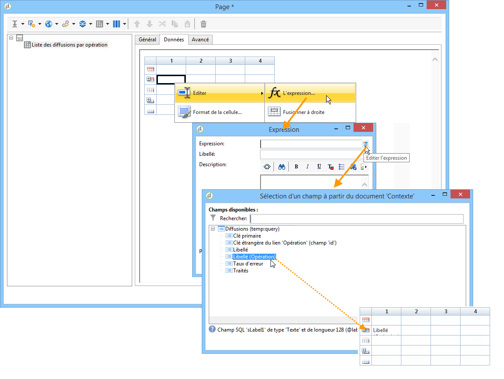
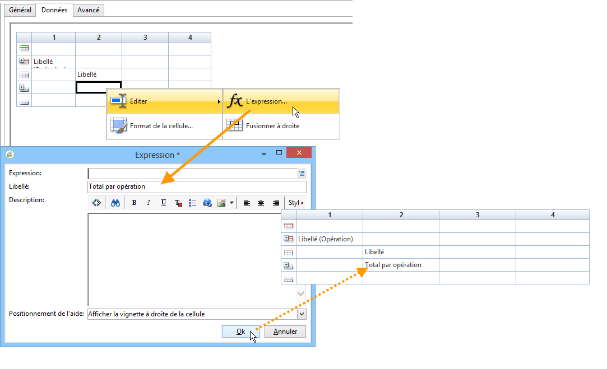

# Création d’un tableau{#creating-a-table}


Vous pouvez ajouter un tableau dans un rapport afin dʼafficher les données. Il peut sʼagir dʼun tableau croisé dynamique, créé à travers les mesures dʼun cube, dʼune liste avec groupement ou dʼun tableau de répartition des valeurs.


## Création dʼune liste avec groupement {#creating-a-list-with-group}

Un tableau de type **[!UICONTROL Liste avec groupement]** vous permet de regrouper certaines de vos données dans le tableau et de produire des statistiques sur les données qu&#39;il contient. Vous pouvez par exemple créer des totaux et des sous-totaux sur les données. Chaque groupement contient une ligne d&#39;en-tête, de détail et de pied.

>[!CAUTION]
>
>L&#39;activité **[!UICONTROL Page]** qui contient le tableau doit être précédée d&#39;une activité **[!UICONTROL Requête]** ou **[!UICONTROL Script]** afin de collecter les données qui seront analysées dans le rapport. Pour en savoir plus à ce sujet, consultez les sections [Collecte des données à analyser](../../reporting/using/collecting-data-to-analyze.md) et [Activité Script](../../reporting/using/advanced-functionalities.md#script-activity).

### Principe de fonctionnement {#operating-principle}

Il se peut que vous ayez besoin d&#39;analyser plusieurs catégories de données à la fois. Une liste avec groupement vous permet de rassembler certaines données et de faire des statistiques sur différents groupes de données dans le même tableau. Pour ce faire, vous pouvez créer un groupement dans le tableau.

Dans l&#39;exemple ci-dessous, le groupement fait apparaître l&#39;ensemble des opérations de votre base, les diffusions et le nombre de messages envoyés par diffusion et par opération.

Il permet de répertorier la liste des opérations (**[!UICONTROL Libellé (Opération)]**), la liste des diffusions (**[!UICONTROL Libellé]**) rattachées à l&#39;opération et de comptabiliser le nombre de messages envoyés pour chaque diffusion (**[!UICONTROL Traités]**), puis de les additionner pour chaque opération (**[!UICONTROL Sum(@processed)]** ).


### Étapes dʼimplémentation {#implementation-steps}

Un exemple complet de mise en œuvre est proposé ici : [Cas pratique : créer un rapport avec une liste avec groupement](#use-case--create-a-report-with-a-group-list).

Toutefois, notez que les étapes de création d&#39;un tableau de type &#39;Liste avec groupement&#39; sont les suivantes :

1. Dans le diagramme d&#39;un rapport, positionnez une activité **[!UICONTROL Requête]**. Consultez la section [Collecte des données à analyser](../../reporting/using/collecting-data-to-analyze.md).
1. Renseigner la table source et sélectionner les champs de la table sur lesquels porteront les statistiques.
1. Positionnez une activité **[!UICONTROL Page]** dans le diagramme. Voir à ce sujet la section [Eléments statiques](../../reporting/using/creating-a-new-report.md#static-elements).
1. Insérer un tableau de type **[!UICONTROL Liste avec groupement]** dans la page.
1. Indiquer le chemin des données, soit la table choisie comme source de données dans la requête.

   Cette étape est indispensable pour retrouver les champs de la table source et les insérer par la suite dans les cellules du tableau.

1. Créer le tableau et son contenu.
1. Affichez le rapport finalisé dans l&#39;onglet **[!UICONTROL Prévisualisation]**. Vous pouvez ensuite publier le rapport et l&#39;exporter vers un autre format. Pour plus dʼinformations, consultez la section [Exportation dʼun rapport](../../reporting/using/actions-on-reports.md#exporting-a-report).

### Ajout de lignes et de colonnes {#adding-lines-and-columns}

Un tableau de type **[!UICONTROL Liste avec groupement]** est composé par défaut d&#39;une ligne d&#39;en-tête, d&#39;une ligne de détail et d&#39;une ligne de pied.

Un groupement contient lui-même une ligne d&#39;en-tête, de détail et de pied.

* **Ligne d&#39;en-tête** : elle permet de donner un titre aux colonnes du tableau.

   

* **Ligne de détail**: elle contient les valeurs des statistiques.

   

* **Ligne de pied** : permet d&#39;afficher les totaux des statistiques.

   

Vous pouvez ajouter des colonnes et des lignes selon vos besoins.

Le groupement peut être positionné dans n&#39;importe quelle ligne du tableau et est lui-même composé d&#39;une ligne d&#39;en-tête, de détail et de pied.


**Ligne et colonne** : pour ajouter ou supprimer une ligne ou une colonne, positionnez-vous sur une ligne ou une colonne existante et utilisez les menus contextuels.


La nature de la ligne que vous ajoutez dépend de l&#39;emplacement du curseur : par exemple, pour ajouter une ligne d&#39;en-tête, vous devez positionner la souris sur un en-tête puis cliquer sur **[!UICONTROL Ajouter > Une ligne au-dessus/dessous]**.


La largeur des colonnes peut être modifiée à partir de l&#39;entrée **[!UICONTROL Format de la colonne]**.

**Groupement** : de même, pour ajouter un groupement, positionnez-vous sur une ligne et sélectionnez l&#39;entrée correspondante dans le menu contextuel.


### Définition du contenu des cellules {#defining-cell-content}

Pour éditer une cellule du tableau et définir son contenu et son format, cliquez dans la cellule et utilisez le menu contextuel.

Utilisez l&#39;entrée de menu **[!UICONTROL Expression]** pour sélectionner les valeurs à afficher.


* Si vous souhaitez insérer les valeurs à analyser directement dans le tableau, sélectionnez-les parmi les champs disponibles.

   La liste des champs disponibles correspond au contenu de la requête précédant le tableau dans le diagramme de construction du rapport.

   

* Saisir un libellé dans une cellule, par exemple dans une cellule d&#39;en-tête.

   Pour cela, procédez comme pour insérer un champ de la base mais ne sélectionnez aucune expression. Saisissez le libellé dans le champ **[!UICONTROL Libellé]** : il sera affiché tel quel.

* Calculer un agrégat (une moyenne, une somme, etc.) et l&#39;afficher dans une cellule.

   Pour cela, utilisez l&#39;entrée de menu **[!UICONTROL Agrégats]** et sélectionnez l&#39;opération voulue.

   

### Définition du format des cellules {#defining-cell-format}


Pour définir le format de cellule, le menu **[!UICONTROL Format de la cellule...]** permet d&#39;accéder à toutes les options de formatage disponibles pour la cellule sélectionnée.

Ces options permettent de personnaliser le rendu final du rapport et en optimiser la lisibilité des informations.

Utilisez le champ **[!UICONTROL Retour à la ligne]** dans le cadre d&#39;un export des données vers Excel : choisissez la valeur **[!UICONTROL Oui]** pour forcer le retour à la ligne. Cette valeur sera conservée lors de l&#39;export. Pour plus dʼinformations, consultez la section [Exportation dʼun rapport](../../reporting/using/actions-on-reports.md#exporting-a-report).

La fenêtre **[!UICONTROL Format de la cellule]**, vous permet d&#39;accéder aux onglets suivants :

* l&#39;onglet **[!UICONTROL Valeur]**,
* l&#39;onglet **[!UICONTROL Bordures]**,
* l&#39;onglet **[!UICONTROL Clic]**,
* l&#39;onglet **[!UICONTROL Plus]**.

L&#39;onglet **[!UICONTROL Valeur]** permet de modifier la police et les différents attributs des valeurs ou leur définir un format selon leur nature.


Le format modifie l&#39;affichage des données : par exemple, les formats **[!UICONTROL Nombre]**, **[!UICONTROL Monétaire]** et **[!UICONTROL Pourcentage]** permettent d&#39;aligner les chiffres à droite et de faire apparaître des décimales.

Exemple de paramétrage d&#39;un format monétaire : vous pouvez indiquer la monnaie dans laquelle sont exprimées les valeurs, utiliser ou non le séparateur de milliers et afficher en rouge les valeurs négatives. La position du symbole monétaire dépend de la langue de l&#39;opérateur, telle qu&#39;elle a été définie dans son profil.


Exemple de paramétrage pour les dates : vous pouvez choisir d&#39;afficher l&#39;heure ou non.


L&#39;onglet **Bordures** permet de d&#39;ajouter des bordures aux lignes et colonnes du tableau. L&#39;ajout de bordures au niveau des cellules peut provoquer des problèmes de performance lors de l&#39;export des rapports les plus volumineux sous Excel.


Au besoin, vous pouvez définir les bordures au niveau du modèle du tableau (**[!UICONTROL Administration > Paramétrage > Rendus des formulaires]** ).

La syntaxe sera alors du type :

dans l&#39;onglet Web :

```
 .tabular td {
 border: solid 1px #000000;
 }
```

dans l&#39;onglet Excel :

```
 <style name="odd" fillColor="#fdfdfd">
  <border>
   <borderTop value="solid 0.05pt #000000" />
   <borderBottom value="solid 0.05pt #000000" />
   <borderLeft value="solid 0.05pt #000000" />
   <borderRight value="solid 0.05pt #000000" />
  </border>
 </style> 
 
 <style name="even" fillColor="#f7f8fa">
  <border>
   <borderTop value="solid 0.05pt #000000" />
   <borderBottom value="solid 0.05pt #000000" />
   <borderLeft value="solid 0.05pt #000000" />
   <borderRight value="solid 0.05pt #000000" />
  </border>
 </style> 
```

L&#39;onglet **[!UICONTROL Clic]** permet de définir une action lorsque l&#39;utilisateur clique sur le contenu d&#39;une cellule du tableau.

Dans l&#39;exemple ci-dessous, cliquer sur la valeur dans la cellule vous permet d&#39;afficher à la deuxième page du rapport : elle contiendra les informations relatives à la diffusion contenue dans la cellule.


L&#39;onglet **Plus** permet d&#39;associer un visuel sur vos données une pastille de couleur ou une barre de valeur. La pastille de couleur est utilisée lorsque le tableau est affiché comme légende d&#39;un graphique. Voir à ce propos l&#39;exemple de mise en œuvre : [Etape 5- Créez la seconde page](#step-5---create-the-second-page)


## Cas pratique : créer un rapport avec une liste avec groupement {#use-case--create-a-report-with-a-group-list}

Dans cet exemple, vous allez créer un rapport de deux pages : la première page contiendra la liste et le total des diffusions par opération, ainsi que le nombre de messages envoyés. L&#39;intitulé des diffusions sera sous forme de lien cliquable et permettra de passer à la deuxième page du rapport pour visualiser la répartition des envois par domaine d&#39;email pour la diffusion choisie avec un tableau et un graphique. Dans la seconde page, le tableau servira de légende au graphique.


### Etape 1 - Créer un rapport {#step-1---create-a-report}

Créez un nouveau rapport qui porte sur le schéma des opérations : **[!UICONTROL Opérations (nms)]**.


Cliquez sur **[!UICONTROL Enregistrer]** pour créer le rapport.

Positionnez dans le diagramme les premiers composants qui vont être utilisés pour concevoir le contenu du rapport : une première requête et une première page.


### Etape 2 - Créer la première requête {#step-2---create-the-first-query}

La première requête permet de collecter les diffusions associées à chaque opération. L&#39;objectif est d&#39;afficher un rapport sur les différentes diffusions de la base Adobe Campaign qui sont liées à chaque opération.

Double-cliquez sur la première requête pour l&#39;éditer, puis respectez les étapes suivantes pour la paramétrer :

1. Modifiez d&#39;abord le schéma sur lequel la source de la requête porte : choisissez le schéma **[!UICONTROL Diffusions (nms)]**.
1. Cliquez sur le lien **[!UICONTROL Editez la requête]**, affichez les champs avancés.

   

1. Sélectionnez les champs suivants :

   * le libellé de la diffusion,
   * la clé primaire de la diffusion,
   * le libellé de l&#39;opération,
   * l&#39;indicateur des diffusions traitées,
   * la clé étrangère du lien Opération,
   * l&#39;indicateur du taux d&#39;erreur.

   

   Associez un alias à chaque champ : cette opération est recommandée afin de faciliter la sélection des données du tableau qui sera ajouté dans la première page du rapport.

   Dans cet exemple, nous utiliserons les alias suivants :

   * Libellé : **@label**
   * Clé primaire : **@deliveryId**
   * Libellé (Opération) : **@label1**
   * Traités : **@processed**
   * Clé étrangère du lien &#39;Opération&#39; (champ&#39;id&#39;) : **@operationId**
   * Taux d&#39;erreur : **@errorRatio**


1. Cliquez deux fois sur le bouton **[!UICONTROL Suivant]**, jusqu&#39;à l&#39;étape **[!UICONTROL Filtrage des données]**.

   Ajoutez une condition de filtrage afin de ne collecter que les diffusions rattachées à une opération.

   La syntaxe de ce filtre est la suivante : &quot;Clé étrangère du lien &#39;Opération&#39; supérieur à 0&quot;.

   

1. Cliquez sur **[!UICONTROL Terminer]** pour enregistrer ces conditions puis sur **[!UICONTROL Ok]** pour fermer le requêteur.

### Etape 3 - Créez la première page {#step-3--create-the-first-page}

Dans cette étape, nous allons paramétrer la première page du rapport. Pour la configurer, les étapes sont les suivantes :

1. Ouvrez l&#39;activité **[!UICONTROL Page]** et saisissez son titre, par exemple ici : **Diffusions**.

   

1. Insérez une liste avec groupement à partir de la barre d&#39;outils et saisissez son libellé, par exemple ici : Liste des diffusions par opération.

   

1. Cliquez sur le lien **[!UICONTROL Chemin des données du tableau]** et sélectionnez le lien des diffusions, soit `[query/delivery]`

   

1. Cliquez sur l&#39;onglet **[!UICONTROL Données]** et modifiez l&#39;aspect du tableau : ajoutez trois colonnes à droite.

   

1. Ajoutez un groupement.

   

   Ce groupement va vous permettre de regrouper les opérations et les diffusions qui y sont rattachées.

1. Dans la fenêtre du groupement, référencez la **Clé étrangère du lien &#39;Opération&#39;** puis fermez la fenêtre.

   

1. Editez la première cellule de l&#39;en-tête de groupement et insérez le champ **[!UICONTROL Libellé]** des opérations comme expression.

   

1. Editez la 2e cellule de la ligne de détails et choisissez le champ **[!UICONTROL Libellé]** des diffusions.

   

1. Editez le format de cette cellule et ouvrez l&#39;onglet **[!UICONTROL Clic]**. Paramétrez les options adéquates pour que lorsque l&#39;utilisateur clique dans le nom d&#39;une diffusion, elle s&#39;ouvre dans la même fenêtre.

   

   Pour cela, sélectionnez une action de type **[!UICONTROL Page suivante]** avec l&#39;option d&#39;ouverture **[!UICONTROL Dans la même fenêtre]**.

   

1. Dans la section inférieure de la fenêtre, cliquez sur **[!UICONTROL Ajouter]** et indiquez le chemin **`/vars/selectedDelivery`** et l&#39;expression **[!UICONTROL @deliveryId]**, qui correspond à l&#39;alias de la clé primaire de la diffusion, tel que défini dans la requête créée précédemment. Cette formule permet d&#39;accéder à la diffusion sélectionnée.

   

1. Editez la 2e cellule de la ligne de pied du groupement et saisissez le libellé **[!UICONTROL Total par opération]**.

   

1. Editez la 3e cellule de la ligne d&#39;en-tête du groupement et saisissez le libellé **[!UICONTROL Nombre de messages envoyés]**.

   

   Cette information correspond au titre de la colonne.

1. Editez la 3e cellule de la ligne de détail et sélectionnez l&#39;indicateur des messages traités comme expression.

   

1. Editez la 3e cellule de la ligne de pied du groupement, sélectionnez l&#39;indicateur des diffusions traitées et appliquez-lui l&#39;agrégat **[!UICONTROL Somme]**.

   

1. Editez la 4e cellule de la ligne de détail et sélectionnez l&#39;expression **Taux d&#39;erreur des diffusions**.

   

1. Sélectionnez cette cellule pour afficher une barre de valeur pour représenter le taux d&#39;erreur des diffusions.

   Pour cela, accédez au format de la cellule puis à l&#39;onglet **[!UICONTROL Plus]**. Choisissez ensuite l&#39;entrée **[!UICONTROL Barre de valeur]** dans la liste déroulante et sélectionnez l&#39;option **[!UICONTROL Cacher la valeur de la cellule]**.

   

   Vous pouvez dès à présent visualiser le rendu de ce rapport. Cliquez sur l&#39;onglet **[!UICONTROL Prévisualisation]** et sélectionnez l&#39;option **[!UICONTROL Global]** : vous affichez ainsi la liste de toutes les diffusions de la base Adobe Campaign qui sont liées à une opération.

   

   Il est conseillé d&#39;utiliser l&#39;onglet **[!UICONTROL Aperçu]** pour vérifier que vous avez sélectionné et correctement paramétré les données de votre tableau. Cette vérification faite, vous pouvez passer au formatage de votre tableau.

1. Appliquez le style **[!UICONTROL Gras]** aux cellules contenant le total par opération et la somme des messages traités.

   

1. Cliquez sur la 1ère cellule de la ligne d&#39;en-tête du groupement, celle qui affiche le nom de l&#39;opération, et choisissez **[!UICONTROL Editer > Fusionner à droite]**.

   

   En fusionnant les deux premières cellules de la ligne d&#39;en-tête du groupement, vous allez diminuer le décalage entre le titre de l&#39;opération et la liste des diffusions qui y sont rattachées.

   

   >[!CAUTION]
   >
   >Il est vivement recommandé de ne fusionner des cellules que lorsque votre rapport est déjà construit, car cette opération ne peut pas être annulée.

### Etape 4 - Créez la seconde requête {#step-4---create-the-second-query}

Nous allons ajouter une seconde requête et une seconde page afin d&#39;afficher le détail d&#39;une diffusion lorsque l&#39;utilisateur du rapport clique dessus. Avant d&#39;ajouter la requête, éditez la page que vous avez créée et activez la transition sortante afin de pouvoir la relier à la requête.

1. Ajoutez une nouvelle requête à la suite de l&#39;activité **[!UICONTROL Page]** et modifiez le schéma sur lequel elle porte : choisissez le schéma **[!UICONTROL Logs de diffusion des destinataires]**.

   

1. Editez la requête et définissez les colonnes de sortie. Afin d&#39;afficher le nombre de diffusions par domaine d&#39;email, vous devez :

   * calculer la somme des clés primaires, afin de compter le nombre de logs de diffusion :

      

   * collecter les domaines des emails des destinataires et regrouper les informations sur ce champ : pour cela, sélectionnez l&#39;option **[!UICONTROL Grouper]** sur la colonne du nom de domaine.

   

   Associez les alias suivants aux champs :

   * count(clé primaire) : **@count**
   * Domaine de l&#39;email (Destinataire) : **@domain**

      


1. Cliquez deux fois sur le bouton **[!UICONTROL Suivant]**, jusqu&#39;à l&#39;étape **[!UICONTROL Filtrage des données]**.

   Ajoutez une condition de filtrage afin de ne collecter que les informations liées à la diffusion sélectionnée.

   La syntaxe est la suivante : Clé étrangère du lien &#39;Diffusion&#39; égale à la valeur du paramètre `$([vars/selectedDelivery])`

   

1. Fermez la fenêtre de paramétrage de la requête et ajoutez une page dans le diagramme, à la suite de cette deuxième requête.

### Etape 5- Créez la seconde page {#step-5---create-the-second-page}

1. Editez la page et saisissez son libellé, ici : **Domaines d&#39;email**.
1. Décochez l&#39;option **[!UICONTROL Activer les transitions sortantes]** : cette page est la dernière du rapport et ne sera suivie d&#39;aucune activité supplémentaire.

   

1. Ajoutez une nouvelle liste avec groupement à l&#39;aide du menu contextuel et nommez-la **Domaines d&#39;email par destinataires**.
1. Cliquez sur le lien **[!UICONTROL Chemin des données du tableau]** et sélectionnez le lien **[!UICONTROL Logs de diffusion des destinataires]**.

   

1. Dans l&#39;onglet **[!UICONTROL Données]**, adaptez le tableau comme suit :

   * Ajoutez deux colonnes supplémentaires à droite.
   * Dans la 1ère cellule de la ligne de détail, ajoutez l&#39;expression **[!UICONTROL rowNum()-1]** afin de compter le nombre de lignes. Puis modifiez le format de cellule : dans l&#39;onglet **[!UICONTROL Plus]**, sélectionnez **[!UICONTROL Pastille de couleur]** et cliquez sur **[!UICONTROL Ok]**.

      

      Ce paramétrage va vous permettre d&#39;utiliser le tableau comme légende pour le graphique.

   * Dans la 2e cellule de la ligne de détail, ajoutez l&#39;expression **[!UICONTROL Domaine de l&#39;email(Destinataire)]**.
   * Dans la 3e cellule de la ligne de détail, ajoutez l&#39;expression **[!UICONTROL count(clé primaire)]**.

   

1. Ajoutez un graphique en secteurs dans la page à l&#39;aide du menu contextuel et attribuez-lui le libellé **Domaines d&#39;email**. Voir à ce sujet la section [Types de graphiques et leurs variantes](../../reporting/using/creating-a-chart.md#chart-types-and-variants).
1. Cliquez sur le lien **[!UICONTROL Variantes]** et déselectionnez les options **[!UICONTROL Afficher les libellés]** et **[!UICONTROL Afficher la légende]**.
1. Vérifiez qu&#39;aucun tri de valeurs n&#39;est paramétré. Reportez-vous à [cette section](../../reporting/using/processing-a-report.md#configuring-the-layout-of-a-descriptive-analysis-report) pour plus d&#39;informations sur ce sujet.

   

1. Dans l&#39;onglet **[!UICONTROL Données]**, modifiez la source de données : choisissez **[!UICONTROL Données du contexte]** dans la liste déroulante.

   

1. Puis cliquez sur **[!UICONTROL Paramètres avancés]** et choisissez le lien des logs de diffusion des destinataires.

   

1. Dans la partie **[!UICONTROL Nature du graphe]**, sélectionnez la variable **[!UICONTROL Domaine de l&#39;email]**.
1. Ajoutez ensuite le calcul à effectuer : choisissez la somme comme opérateur.

   

1. Cliquez sur le bouton **[!UICONTROL Détail]** pour choisir le champ sur lequel va porter le comptage, puis fermez la fenêtre de configuration de la page.

   

1. Enregistrez le rapport.

   Votre page est à présent paramétrée.

### Étape 6 : visualisation du rapport {#step-6---viewing-the-report}

Pour visualiser le résultat de ce paramétrage, cliquez sur l&#39;onglet **[!UICONTROL Prévisualisation]** puis sélectionnez l&#39;option **[!UICONTROL Global]**.

La première page de votre rapport présente la liste de toutes les diffusions contenues dans la base de données.


Si vous cliquez sur le lien d&#39;une des diffusions, le graphique représentant la répartition par domaine d&#39;email pour cette diffusion s&#39;affiche. Vous êtes sur la deuxième page de votre rapport et avez la possibilité de revenir à la page précédente en cliquant sur le bouton approprié.


## Création dʼun tableau de répartition ou croisé dynamique {#creating-a-breakdown-or-pivot-table}

Ce type de tableau vous permet d&#39;afficher des statistiques calculées sur les données de la base.

Les paramètres de création de ce type de rapport sont similaires à ceux utilisés pour l&#39;assistant d&#39;analyse descriptive. Voir à ce propos [cette page](../../reporting/using/using-the-descriptive-analysis-wizard.md#configuring-the-quantitative-distribution-template).

La création d&#39;un tableau croisé dynamique est présentée dans [cette section](../../reporting/using/ac-cubes.md).
