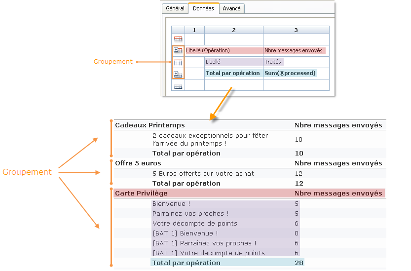
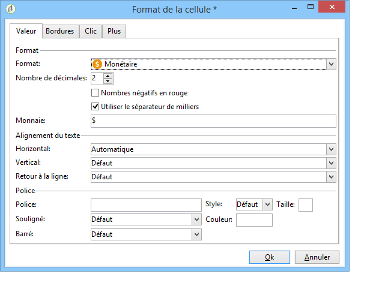
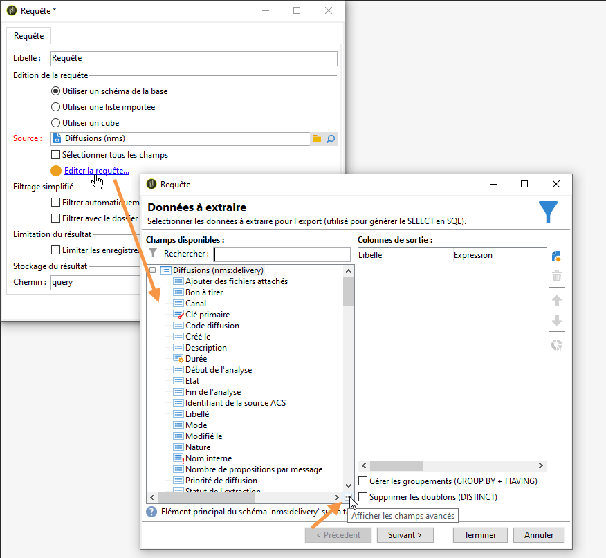
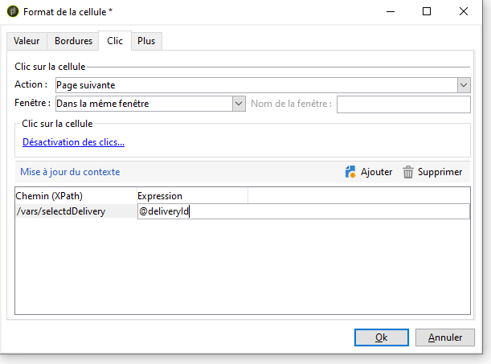

# Créer un tableau{#creating-a-table}

Vous pouvez ajouter un tableau dans un rapport afin d&#39;afficher les données. Il peut s&#39;agir d&#39;un tableau croisé dynamique, créé à travers les mesures d&#39;un cube, d&#39;une liste avec groupement ou d&#39;un tableau de distribution des valeurs.


## Créer une liste avec groupement {#creating-a-list-with-group}

Un tableau de **[!UICONTROL List with group]** type vous permet de regrouper des données dans le tableau et d’en produire des statistiques. Par exemple, vous pouvez créer des totaux et des sous-totaux pour les données. Chaque groupe possède sa propre ligne d’en-tête, de détail et de pied de page.

>[!CAUTION]
>
>L’ **[!UICONTROL Page]** activité contenant le tableau doit être précédée d’une **[!UICONTROL Query]** activité ou **[!UICONTROL Script]** activité pour collecter les données à analyser dans le rapport. Pour plus d’informations sur ces activités, reportez-vous à la section [Collecte de données pour analyser](../../reporting/using/collecting-data-to-analyze.md) l’activité [de](../../reporting/using/advanced-functionalities.md#script-activity)script.

### Principe de fonctionnement {#operating-principle}

Il se peut que vous ayez besoin d&#39;analyser plusieurs catégories de données à la fois. Une liste avec groupement vous permet de rassembler certaines données et de faire des statistiques sur différents groupes de données dans le même tableau. Pour ce faire, vous pouvez créer un groupement dans le tableau.

Dans l&#39;exemple ci-dessous, le groupement fait apparaître l&#39;ensemble des opérations de votre base, les diffusions et le nombre de messages envoyés par diffusion et par opération.

It lets you list the campaigns (**[!UICONTROL Label (Campaign)]**, the list of deliveries (**[!UICONTROL Label]** ) linked to the campaign, and lets you count the number of messages sent per delivery (**[!UICONTROL Processed)]**, before adding them up for each campaign (**[!UICONTROL Sum(@processed)]** ).



### Etapes de mise en oeuvre {#implementation-steps}

Un exemple complet de mise en oeuvre est fourni ici : Cas [d’utilisation : Créez un rapport avec une liste](#use-case--create-a-report-with-a-group-list)de groupes.

Toutefois, notez que les étapes de création d&#39;un tableau de type &#39;Liste avec groupement&#39; sont les suivantes :

1. Accédez au graphique du rapport et importez une **[!UICONTROL Query]** activité. Reportez-vous à la section [Collecte de données à analyser](../../reporting/using/collecting-data-to-analyze.md).
1. Renseigner la table source et sélectionner les champs de la table sur lesquels porteront les statistiques.
1. Placez une **[!UICONTROL Page]** activité dans le graphique. Voir à ce sujet la section [Eléments statiques](../../reporting/using/creating-a-new-report.md#static-elements).
1. Insérez un tableau de **[!UICONTROL List with group]** type dans la page.
1. Indiquer le chemin des données, soit la table choisie comme source de données dans la requête.

   Cette étape est indispensable pour retrouver les champs de la table source et les insérer par la suite dans les cellules du tableau.

1. Créer le tableau et son contenu.
1. Affichez le rapport finalisé dans l’ **[!UICONTROL Preview]** onglet. Vous pouvez ensuite publier le rapport et l’exporter dans un autre format, si nécessaire. Voir à ce sujet la section [Exporter un rapport](../../reporting/using/actions-on-reports.md#exporting-a-report).

### Ajouter des lignes et des colonnes {#adding-lines-and-columns}

By default, a **[!UICONTROL List with group]** type table includes a header, a detail line, and a footer line.

Un groupement contient lui-même une ligne d&#39;en-tête, de détail et de pied.

* **Ligne d&#39;en-tête** : elle permet de donner un titre aux colonnes du tableau.

   

* **Ligne de détail**: elle contient les valeurs des statistiques.

   

* **Ligne de pied** : permet d&#39;afficher les totaux des statistiques.

   

Vous pouvez ajouter des colonnes et des lignes selon vos besoins.

Le groupement peut être positionné dans n&#39;importe quelle ligne du tableau et est lui-même composé d&#39;une ligne d&#39;en-tête, de détail et de pied.


**Ligne et colonne** : pour ajouter ou supprimer une ligne ou une colonne, positionnez-vous sur une ligne ou une colonne existante et utilisez les menus contextuels.


The nature of the line you add depends on the location of the cursor. For example, to add a header line, place your cursors on a header, then click **[!UICONTROL Add > A line above/below]**.


The width of the columns can be modified via the **[!UICONTROL Column format]** item.

**Groupement** : de même, pour ajouter un groupement, positionnez-vous sur une ligne et sélectionnez l&#39;entrée correspondante dans le menu contextuel.


### Définir le contenu des cellules {#defining-cell-content}

Pour éditer une cellule du tableau et définir son contenu et son format, cliquez dans la cellule et utilisez le menu contextuel.

Utilisez l&#39;entrée de menu **[!UICONTROL Expression]** pour sélectionner les valeurs à afficher.


* Si vous souhaitez insérer les valeurs à analyser directement dans le tableau, sélectionnez-les parmi les champs disponibles.

   La liste des champs disponibles correspond au contenu de la requête précédant le tableau dans le diagramme de construction du rapport.

   

* Saisir un libellé dans une cellule, par exemple dans une cellule d&#39;en-tête.

   Pour ce faire, appliquez le même processus que pour insérer un champ dans la base de données, mais ne sélectionnez pas d’expression. Entrez le libellé dans le **[!UICONTROL Label]** champ. Il s’affichera tel quel.

* Calculer un agrégat (une moyenne, une somme, etc.) et l&#39;afficher dans une cellule.

   To do this, use the **[!UICONTROL Aggregates]** menu entry and select the desired campaign.

   

### Définir le format des cellules {#defining-cell-format}


To define the cell format, the **[!UICONTROL Cell format...]** menu lets you access all formatting options available for the selected cell.

Ces options permettent de personnaliser le rendu final du rapport et en optimiser la lisibilité des informations.

Utilisez le **[!UICONTROL Carriage return]** champ lorsque vous exportez des données vers Excel : sélectionnez la **[!UICONTROL Yes]** valeur pour forcer le retour chariot. Cette valeur est conservée lors de l’exportation. Voir à ce sujet la section [Exporter un rapport](../../reporting/using/actions-on-reports.md#exporting-a-report).

The **[!UICONTROL Cell format]** window lets you access the following tab:

* L’ **[!UICONTROL Value]** onglet
* L’ **[!UICONTROL Borders]** onglet
* L’ **[!UICONTROL Click]** onglet
* L’ **[!UICONTROL Extra]** onglet

The **[!UICONTROL Value]** tab lets you change the font and the various value attributes or to define a format based on their nature.


The format changes data display: for example, the **[!UICONTROL Number]**, **[!UICONTROL Monetary]** and **[!UICONTROL Percentage]** formats allow you to align the figures on the right and display decimal points.

Exemple de paramétrage d&#39;un format monétaire : vous pouvez indiquer la monnaie dans laquelle sont exprimées les valeurs, utiliser ou non le séparateur de milliers et afficher en rouge les valeurs négatives. La position du symbole monétaire dépend de la langue de l&#39;opérateur, telle qu&#39;elle a été définie dans son profil.



Exemple de paramétrage pour les dates : vous pouvez choisir d&#39;afficher l&#39;heure ou non.


L&#39;onglet **Bordures** permet de d&#39;ajouter des bordures aux lignes et colonnes du tableau. L&#39;ajout de bordures au niveau des cellules peut provoquer des problèmes de performance lors de l&#39;export des rapports les plus volumineux sous Excel.


Si nécessaire, vous pouvez définir des bordures dans le modèle de tableau (**[!UICONTROL Administration > Configuration > Form rendering]** ).

La syntaxe sera alors du type :

dans l&#39;onglet Web :

```
 .tabular td {
 border: solid 1px #000000;
 }
```

dans l&#39;onglet Excel :

```
 <style name="odd" fillColor="#fdfdfd">
  <border>
   <borderTop value="solid 0.05pt #000000" />
   <borderBottom value="solid 0.05pt #000000" />
   <borderLeft value="solid 0.05pt #000000" />
   <borderRight value="solid 0.05pt #000000" />
  </border>
 </style> 
 
 <style name="even" fillColor="#f7f8fa">
  <border>
   <borderTop value="solid 0.05pt #000000" />
   <borderBottom value="solid 0.05pt #000000" />
   <borderLeft value="solid 0.05pt #000000" />
   <borderRight value="solid 0.05pt #000000" />
  </border>
 </style> 
```

The **[!UICONTROL Click]** tab lets you define an action when the user clicks the content of a cell or of the table.

Dans l&#39;exemple ci-dessous, cliquer sur la valeur dans la cellule vous permet d&#39;afficher à la deuxième page du rapport : elle contiendra les informations relatives à la diffusion contenue dans la cellule.


The **Extra** tab lets you link a visual to your data, such as a colored mark or a value bar. The colored mark is used when the table is shown as a legend in a chart. Pour plus d’informations, reportez-vous à l’exemple d’implémentation : [Étape 5 - Création de la deuxième page](#step-5---create-the-second-page)


## Cas pratique : créer un rapport avec une liste avec groupement {#use-case--create-a-report-with-a-group-list}

Dans cet exemple, vous allez créer un rapport de deux pages : la première page contiendra la liste et le total des diffusions par opération, ainsi que le nombre de messages envoyés. L&#39;intitulé des diffusions sera sous forme de lien cliquable et permettra de passer à la deuxième page du rapport pour visualiser la répartition des envois par domaine d&#39;email pour la diffusion choisie avec un tableau et un graphique. Dans la seconde page, le tableau servira de légende au graphique.


### Etape 1 - Créer un rapport {#step-1---create-a-report}

Create a new report that concerns the campaign schema, **[!UICONTROL Campaigns (nms)]**.


Click **[!UICONTROL Save]** to create the report.

Positionnez dans le diagramme les premiers composants qui vont être utilisés pour concevoir le contenu du rapport : une première requête et une première page.


### Etape 2 - Créer la première requête {#step-2---create-the-first-query}

La première requête permet de collecter les diffusions associées à chaque opération. L&#39;objectif est d&#39;afficher un rapport sur les différentes diffusions de la base Adobe Campaign qui sont liées à chaque opération.

Double-cliquez sur la première requête pour l&#39;éditer, puis respectez les étapes suivantes pour la paramétrer :

1. Start by changing the schema on which the query&#39;s source is applied: select the **[!UICONTROL Deliveries (nms)]** schema.
1. Click the **[!UICONTROL Edit query]** link and display the advanced fields.

   

1. Sélectionnez les champs suivants :

   * le libellé de la diffusion,
   * la clé primaire de la diffusion,
   * le libellé de l&#39;opération,
   * l&#39;indicateur des diffusions traitées,
   * la clé étrangère du lien Opération,
   * l&#39;indicateur du taux d&#39;erreur.
   

   Associez un alias à chaque champ : cette opération est recommandée afin de faciliter la sélection des données du tableau qui sera ajouté dans la première page du rapport.

   Dans cet exemple, nous utiliserons les alias suivants :

   * Libellé : **@label**
   * Clé primaire : **@deliveryId**
   * Libellé (Opération) : **@label1**
   * Traités : **@processed**
   * Clé étrangère du lien &#39;Opération&#39; (champ&#39;id&#39;) : **@operationId**
   * Taux d&#39;erreur : **@errorRatio**


1. Cliquez deux fois sur le **[!UICONTROL Next]** bouton pour accéder à l’ **[!UICONTROL Data filtering]** étape.

   Ajoutez une condition de filtrage afin de ne collecter que les diffusions rattachées à une opération.

   La syntaxe de ce filtre est la suivante : &quot;Clé étrangère du lien &#39;Opération&#39; supérieur à 0&quot;.

   

1. Click **[!UICONTROL Finish]** to save these conditions, then click **[!UICONTROL Ok]** to close the query editor.

### Etape 3 - Créez la première page {#step-3--create-the-first-page}

Dans cette étape, nous allons paramétrer la première page du rapport. Pour la configurer, les étapes sont les suivantes :

1. Ouvrez l&#39;activité **[!UICONTROL Page]** et saisissez son titre, par exemple ici : **Diffusions**.

   

1. Insérez une liste avec groupement à partir de la barre d&#39;outils et saisissez son libellé, par exemple ici : Liste des diffusions par opération.

   

1. Cliquez sur le **[!UICONTROL Table data XPath...]** lien et sélectionnez le lien de diffusion, c.-à-d. `[query/delivery]`.

   

1. Click the **[!UICONTROL Data]** tab and change layout of the table: add three columns on the right.

   

1. Ajoutez un groupement.

   

   Ce groupement va vous permettre de regrouper les opérations et les diffusions qui y sont rattachées.

1. Dans la fenêtre du groupement, référencez la **Clé étrangère du lien &#39;Opération&#39;** puis fermez la fenêtre.

   

1. Edit the first cell of the group header and insert the **[!UICONTROL Label]** field of the campaigns as an expression.

   

1. Edit the second cell of the details line and select the deliveries **[!UICONTROL Label]**.

   

1. Modifiez le format de cette cellule et ouvrez l’ **[!UICONTROL Click]** onglet. Configurez les options appropriées de sorte que lorsque l’utilisateur clique sur le nom d’une diffusion, celle-ci s’ouvre dans la même fenêtre.

   

   Pour ce faire, sélectionnez une action de **[!UICONTROL Next page]** type et sélectionnez **[!UICONTROL In the same window]** comme option d’ouverture.

   

1. In the lower section of the window, click **[!UICONTROL Add]** and specify the **`/vars/selectedDelivery`** path and the **[!UICONTROL @deliveryId]** expression that matches the alias of the primary key of the delivery, as defined in the query created previously. Cette formule vous permet d’accéder à la remise sélectionnée.

   

1. Edit the second cell of the footer line of the group and enter **[!UICONTROL Total per campaign]** as a label.

   

1. Edit the third cell of the header line of the group and enter **[!UICONTROL Number of messages sent]** as a label.

   

   Cette information correspond au titre de la colonne.

1. Editez la 3e cellule de la ligne de détail et sélectionnez l&#39;indicateur des messages traités comme expression.

   

1. Edit the third cell of the footer line of the group, select the processed delivery indicator and apply the **[!UICONTROL Sum]** aggregate to it.

   

1. Editez la 4e cellule de la ligne de détail et sélectionnez l&#39;expression **Taux d&#39;erreur des diffusions**.

   

1. Sélectionnez cette cellule pour afficher une barre de valeur pour représenter le taux d&#39;erreur des diffusions.

   Pour ce faire, accédez au format de cellule, puis accédez à l’ **[!UICONTROL More]** onglet. Sélectionnez l’ **[!UICONTROL Value bar]** entrée dans la liste déroulante et sélectionnez l’ **[!UICONTROL Hide the cell value]** option.

   

   Vous pouvez désormais afficher un rendu du rapport. Cliquez sur l’ **[!UICONTROL Preview]** onglet et sélectionnez l’ **[!UICONTROL Global]** option : affiche la liste de toutes les livraisons de la base de données Adobe Campaign liées à une campagne.

   

   Nous vous recommandons d’utiliser l’ **[!UICONTROL Preview]** onglet pour vous assurer que les données de votre tableau sont correctement sélectionnées et configurées. Une fois cette opération effectuée, vous pouvez mettre en forme votre tableau.

1. Apply the **[!UICONTROL Bold]** style to the cells that show the total per campaign and the total number of messages processed.

   

1. Click the 1st cell of the group header line, the one that displays the campaign name, and select **[!UICONTROL Edit > Merge to right]**.

   

   En fusionnant les deux premières cellules de la ligne d&#39;en-tête du groupement, vous allez diminuer le décalage entre le titre de l&#39;opération et la liste des diffusions qui y sont rattachées.

   

   >[!CAUTION]
   >
   >Il est vivement recommandé de ne fusionner des cellules que lorsque votre rapport est déjà construit, car cette opération ne peut pas être annulée.

### Etape 4 - Créez la seconde requête {#step-4---create-the-second-query}

Nous allons ajouter une seconde requête et une seconde page afin d&#39;afficher le détail d&#39;une diffusion lorsque l&#39;utilisateur du rapport clique dessus. Avant d&#39;ajouter la requête, éditez la page que vous avez créée et activez la transition sortante afin de pouvoir la relier à la requête.

1. Add a new query after the **[!UICONTROL Page]** activity and edit its schema: select the **[!UICONTROL Recipient delivery logs]** schema.

   

1. Editez la requête et définissez les colonnes de sortie. Afin d&#39;afficher le nombre de diffusions par domaine d&#39;email, vous devez :

   * calculer la somme des clés primaires, afin de compter le nombre de logs de diffusion :

      

   * collect recipient email domains and group information on this field: to do this, select the **[!UICONTROL Group]** option in the domain name column.
   

   Associez les alias suivants aux champs :

   * count(clé primaire) : **@count**
   * Domaine de l&#39;email (Destinataire) : **@domain**

      


1. Click the **[!UICONTROL Next]** button twice: this takes you to the **[!UICONTROL Data filtering]** step.

   Ajoutez une condition de filtrage afin de ne collecter que les informations liées à la diffusion sélectionnée.

   The syntax is as follows: Foreign key of the &#39;Delivery&#39; link equals the value of the setting `$([vars/selectedDelivery])`

   

1. Fermez la fenêtre de paramétrage de la requête et ajoutez une page dans le diagramme, à la suite de cette deuxième requête.

### Etape 5- Créez la seconde page {#step-5---create-the-second-page}

1. Editez la page et saisissez son libellé, ici : **Domaines d&#39;email**.
1. Uncheck the **[!UICONTROL Enable output transitions]** option: this is the last page of the report and will not be followed by another activity.

   

1. Ajoutez une nouvelle liste avec groupement à l&#39;aide du menu contextuel et nommez-la **Domaines d&#39;email par destinataires**.
1. Cliquez sur le **[!UICONTROL Table data XPath...]** lien et sélectionnez-le **[!UICONTROL Recipient delivery logs]** .

   

1. In the **[!UICONTROL Data]** tab, adapt the table as follows:

   * Ajoutez deux colonnes supplémentaires à droite.
   * Dans la première cellule de la ligne de détail, ajoutez l’ **[!UICONTROL rowNum()-1]** expression pour comptabiliser le nombre de lignes. Modifiez ensuite le format de la cellule : dans l’ **[!UICONTROL Extra]** onglet, sélectionnez **[!UICONTROL Color tab]** et cliquez sur **[!UICONTROL Ok]**.

      

      Ce paramétrage va vous permettre d&#39;utiliser le tableau comme légende pour le graphique.

   * In the second cell of the detail line, add the **[!UICONTROL Email domain(Recipient)]** expression.
   * In the third cell of the detail line, add the **[!UICONTROL count(primary key)]** expression.
   

1. Add a pie chart to the page using the right-click menu and assign the **Email domains** label to it. Pour plus d’informations, voir Types de [graphiques et variantes](../../reporting/using/creating-a-chart.md#chart-types-and-variants).
1. Cliquez sur le **[!UICONTROL Variants]** lien et désélectionnez les options **[!UICONTROL Display label]** et **[!UICONTROL Display caption]** .
1. Vérifiez qu&#39;aucun tri de valeurs n&#39;est paramétré. Reportez-vous à [cette section](../../reporting/using/processing-a-report.md#configuring-the-layout-of-a-descriptive-analysis-report) pour plus d&#39;informations sur ce sujet.

   

1. In the **[!UICONTROL Data]** tab, change the data source: select **[!UICONTROL Context data]** from the drop-down list.

   

1. Then click **[!UICONTROL Advanced settings]** and select the link to the recipient delivery logs.

   

1. Dans la **[!UICONTROL Chart type]** section, sélectionnez la **[!UICONTROL Email domain]** variable.
1. Ajoutez ensuite le calcul à effectuer : choisissez la somme comme opérateur.

   

1. Click the **[!UICONTROL Detail]** button to select the field which the count will concern, then close the configuration window.

   

1. Enregistrez le rapport.

   Votre page est à présent paramétrée.

### Etape 6 - Visualiser le rapport {#step-6---viewing-the-report}

To view the result of this configuration, click the **[!UICONTROL Preview]** tab and select the **[!UICONTROL Global]** option.

La première page de votre rapport présente la liste de toutes les diffusions contenues dans la base de données.


Si vous cliquez sur le lien d&#39;une des diffusions, le graphique représentant la répartition par domaine d&#39;email pour cette diffusion s&#39;affiche. Vous êtes sur la deuxième page de votre rapport et avez la possibilité de revenir à la page précédente en cliquant sur le bouton approprié.


## Créer un tableau de distribution ou croisé dynamique {#creating-a-breakdown-or-pivot-table}

Ce type de tableau vous permet d&#39;afficher des statistiques calculées sur les données de la base.

Les paramètres de création de ce type de rapport sont similaires à ceux utilisés pour l&#39;assistant d&#39;analyse descriptive. Voir à ce propos [cette page](../../reporting/using/using-the-descriptive-analysis-wizard.md#configuring-the-quantitative-distribution-template).

La création d&#39;un tableau croisé dynamique est présentée dans [cette section](../../reporting/using/using-cubes-to-explore-data.md).
