# Création d’indicateurs{#creating-indicators}

Pour qu&#39;un cube puisse être exploité, vous devez identifier les dimensions et les mesures utiles et les créer au niveau du cube.

Les étapes de création d&#39;un cube sont les suivantes :

1. Sélectionner la table de travail. Consultez la section [Sélection de la table de travail](#selecting-the-work-table).
1. Définissez des dimensions. Consultez la section [Définition des dimensions](#defining-dimensions).
1. Définissez des mesures. Consultez la section [Construction des indicateurs](#building-indicators).
1. Créez des agrégats (facultatif). Consultez la section [Calcul et utilisation dʼagrégats](../../reporting/using/concepts-and-methodology.md#calculating-and-using-aggregates).

L&#39;exemple ci-après permet de créer rapidement un cube simple et de l&#39;utiliser dans un rapport afin d&#39;en explorer les mesures.

Les étapes de réalisation sont présentées ci-après, les options et descriptions exhaustives sont présentées dans les autres sections de ce chapitre.

## Sélection de la table de travail {#selecting-the-work-table}

Pour créer un cube, cliquez sur le bouton **[!UICONTROL Nouveau]** situé au-dessus de la liste des cubes.

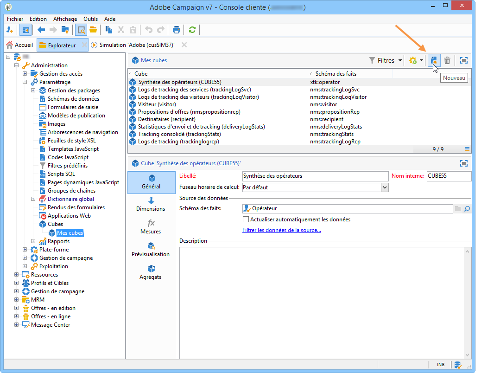

Sélectionnez le schéma des faits, c&#39;est-à-dire celui qui contient les éléments que vous souhaitez explorer. Dans notre exemple, nous allons sélectionner la table des **Destinataires**.

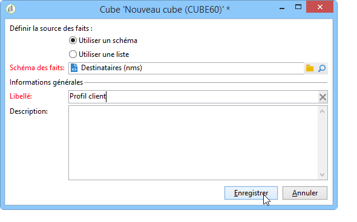

Cliquez sur **[!UICONTROL Enregistrer]** pour créer le cube : il apparaît alors dans la liste des cubes et peut être paramétré au travers de ses onglets.

Cliquez sur le lien **[!UICONTROL Filtrer les données de la source...]** si vous souhaitez n&#39;appliquer les calculs de ce cube qu&#39;à une sélection de données de la base.

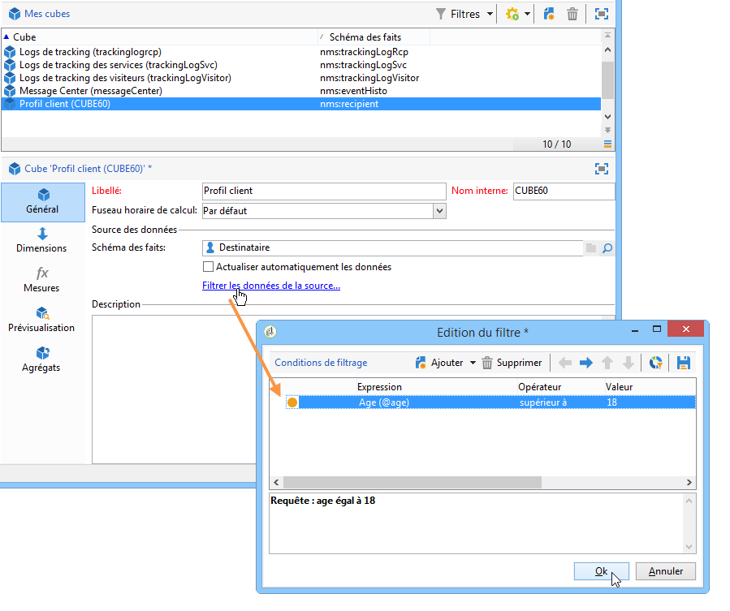

## Définition des dimensions {#defining-dimensions}

Les dimensions correspondent à des axes d&#39;analyse qui sont définis pour chaque cube selon le schéma des faits auquel il se rapporte. Ce sont les dimensions explorées dans l&#39;analyse, comme par exemple le temps (année, mois, jour, etc.), une nomenclature de produits ou contrats (famille, référence, etc.), un segment de population (par ville, tranche d&#39;âge, statut, etc.).

Ces axes d&#39;analyse sont définis dans l&#39;onglet **[!UICONTROL Dimensions]** du cube.

Cliquez sur le bouton **[!UICONTROL Ajouter]** pour créer une nouvelle dimension, puis, dans le champ **[!UICONTROL Expression]**, cliquez sur l&#39;icône **[!UICONTROL Editer l&#39;expression]** afin de sélectionner le champ qui contient les données concernées.

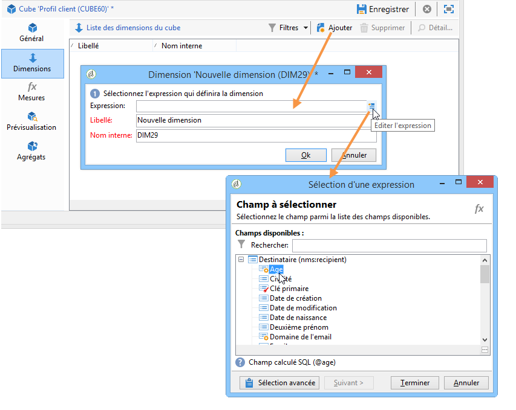

* Choisissez d&#39;abord l&#39;**Age** des destinataires. Pour ce champ, vous pouvez définir une mise en classe afin de regrouper les âges pour faciliter la lisibilité des informations. Il est recommandé de définir une mise en classe lorsque les valeurs distinctes peuvent être nombreuses.

  Pour cela, cochez l&#39;option **[!UICONTROL Activer la mise en classe.]** Les modes de mise en classe sont détaillés dans la section [Mise en classe des données](../../reporting/using/concepts-and-methodology.md#data-binning).

  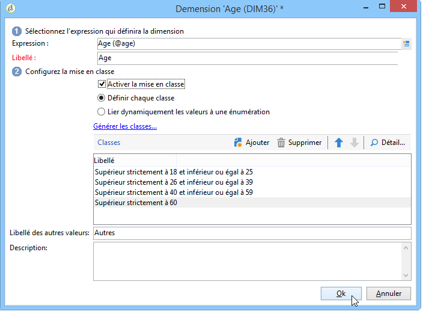

* Ajoutez une dimension de type **Date**. Ici, nous allons d&#39;afficher les dates de création des profils de destinataires.

  Pour cela, cliquez sur **[!UICONTROL Ajouter]** et choisissez le champ **[!UICONTROL Date de création]** dans la table des destinataires.

  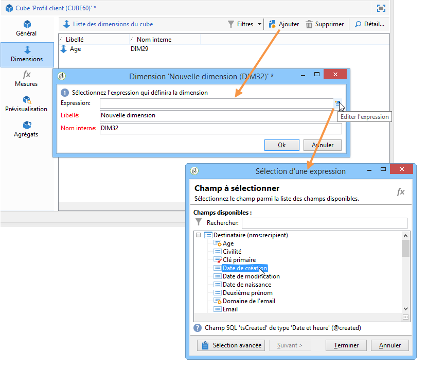

  Vous pouvez sélectionner le mode d&#39;affichage des dates. Pour cela, sélectionnez les niveaux à générer :

  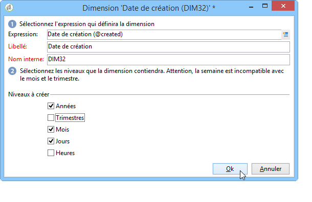

  Dans notre exemple, nous n&#39;afficherons que les années, mois et jours dans la mesure où il n&#39;est pas possible de travailler à la fois sur les semaines et les trimestres/mois : ces niveaux ne sont pas compatibles.

* Créez une autre dimension afin d&#39;analyser les données par rapport à la ville du destinataire.

  Pour cela, ajoutez une nouvelle dimension et sélectionnez la ville, sous le noeud **[!UICONTROL Localisation]** du schéma des destinataires.

  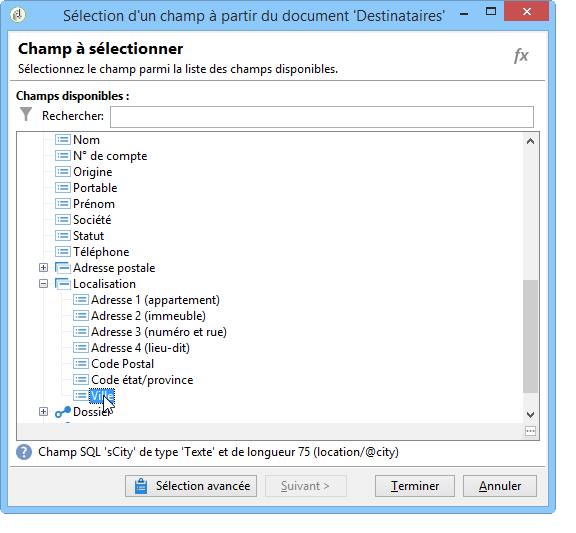

  Vous pouvez activer la mise en classe afin de simplifier la lecture des informations et lier les valeurs à une valeur d&#39;énumération.

  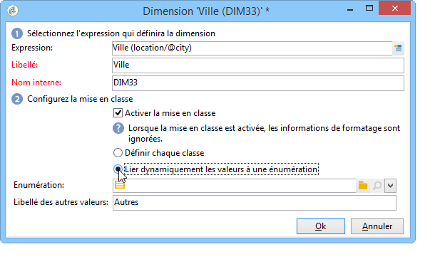

  Sélectionnez l&#39;énumération dans la liste déroulante.

  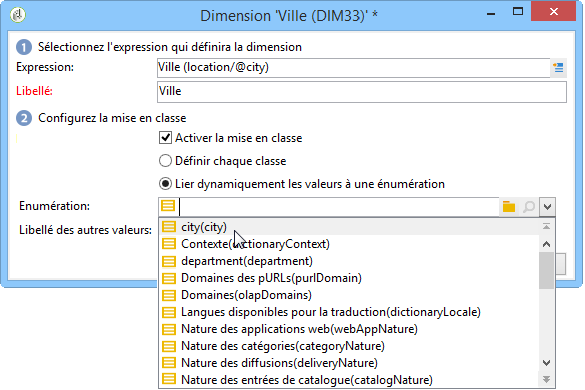

  Seules les valeurs présentes dans l&#39;énumération seront affichées. Toutes les autres seront regroupées sous le libellé défini dans le champ **[!UICONTROL Libellé des autres valeurs]**.

  Pour plus d&#39;informations, consultez la section [Gérer dynamiquement les classes](../../reporting/using/concepts-and-methodology.md#dynamically-managing-bins).

## Construction des indicateurs {#building-indicators}

Une fois les dimensions définies, vous devez spécifier le mode de calcul des valeurs qui seront affichées dans les cellules. Pour cela, créez les indicateurs correspondants dans l&#39;onglet **[!UICONTROL Mesures]** : créez autant de mesures que de colonnes à afficher au niveau du rapport qui utilisera le cube.

Pour cela, les étapes sont les suivantes :

1. Cliquez sur le bouton **[!UICONTROL Ajouter]**.
1. Sélectionnez le type de mesure et la formule à appliquer. Ici, nous allons compter le nombre de femmes parmi les destinataires.

   Notre mesure se base sur le schéma des faits et utilise l&#39;opérateur **[!UICONTROL Comptage]**.

   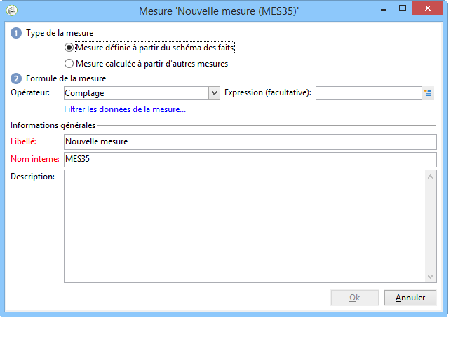

   Le lien **[!UICONTROL Filtrer les données de la mesure...]** permet de ne sélectionner que les femmes. Pour plus dʼinformations sur la définition des mesures et les options disponibles, consultez la section [Définition des mesures](../../reporting/using/concepts-and-methodology.md#defining-measures).

   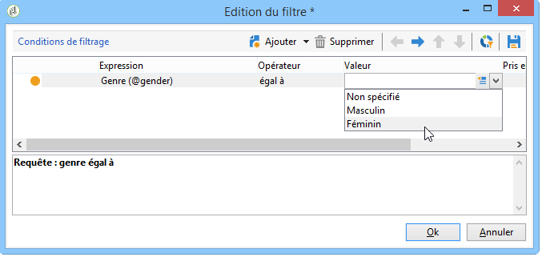

1. Saisissez le libellé de la mesure et enregistrez-la.

   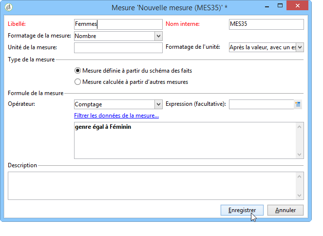

1. Enregistrez le cube.

## Création dʼun rapport basé sur un cube {#creating-a-report-based-on-a-cube}

Une fois le cube paramétré, il peut être utilisé comme modèle pour créer un nouveau rapport.

Pour cela :

1. Cliquez sur le bouton **[!UICONTROL Créer]** de l’onglet **[!UICONTROL Rapports]** et sélectionnez le cube que vous venez de créer.

   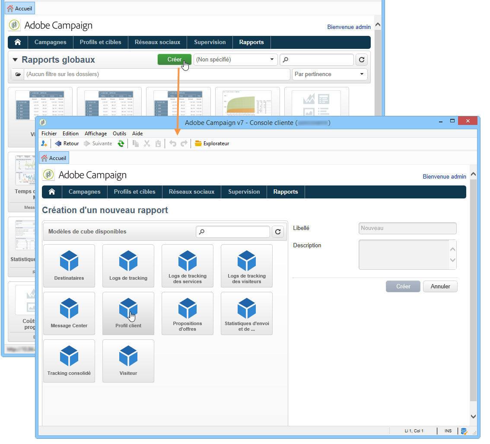

1. Cliquez sur le bouton **[!UICONTROL Créer]** pour valider : vous accédez alors à la page de configuration et de visualisation du rapport.

   Par défaut, les deux premières dimensions disponibles sont proposées en colonne et en ligne mais aucune valeur n&#39;est affichée dans le tableau. Pour générer le tableau, cliquez sur l&#39;icône centrale :

   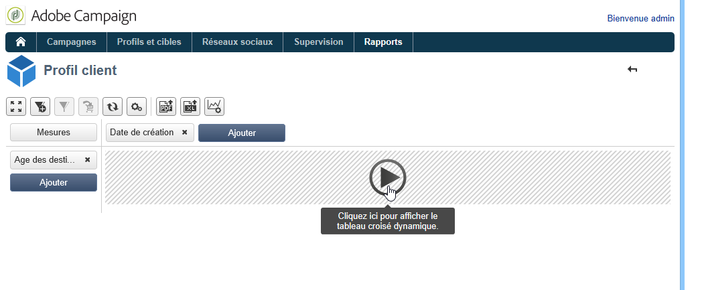

1. Vous pouvez déplacer les dimensions d&#39;un axe à l&#39;autre, les supprimer, ajouter de nouvelles mesures, etc. Les différentes opérations possibles sont présentées sur [cette page](../../reporting/using/using-cubes-to-explore-data.md).

   Pour cela, utilisez les icônes correspondantes.

   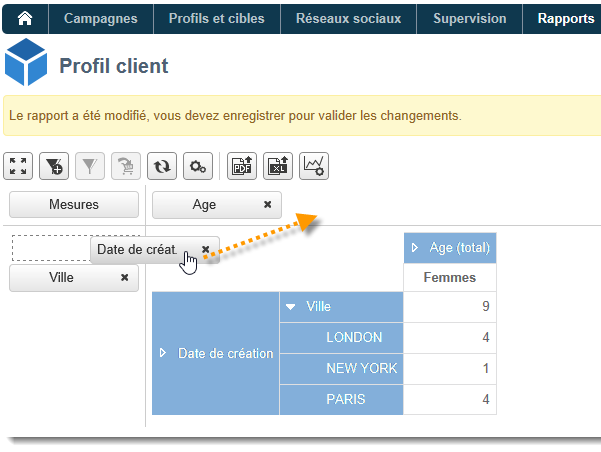
