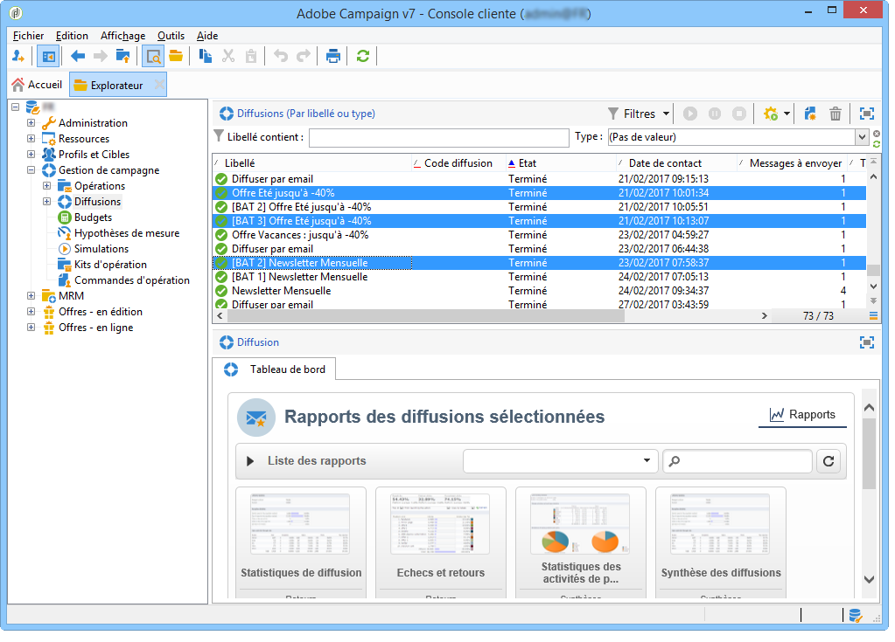
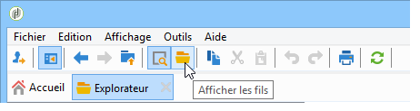

# Rapports cumulés {#cumulative-reports}

Vous pouvez afficher des rapports cumulés sur les diffusions. Pour cela, sélectionnez les diffusions à comparer pour obtenir la liste des rapports communs à ces diffusions.

Vous pouvez sélectionner des diffusions non consécutives dans la liste en maintenant la touche CTRL enfoncée pendant la sélection.

Pour sélectionner des diffusions enregistrées dans un dossier différent, cliquez sur l&#39;icône **[!UICONTROL Afficher les fils]** accessible depuis la barre d&#39;outils : elles seront alors affichées dans la même liste.

