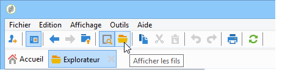

# Rapports cumulés {#cumulative-reports}

Vous pouvez afficher des rapports cumulés sur les diffusions.Pour cela, sélectionnez les diffusions à comparer pour obtenir la liste des rapports pour ces diffusions.

Vous pouvez sélectionner des diffusions non consécutives dans la liste en maintenant la touche CTRL enfoncée pendant la sélection.

Pour sélectionner des diffusions enregistrées dans un autre dossier, cliquez sur l’icône **[!UICONTROL Afficher les sous-niveaux]**, accessible dans la barre d’outils.Elles s’affichent alors dans la même liste.

