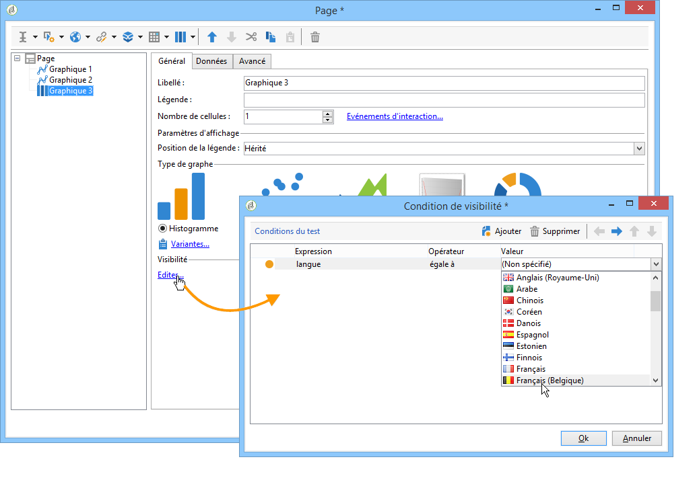
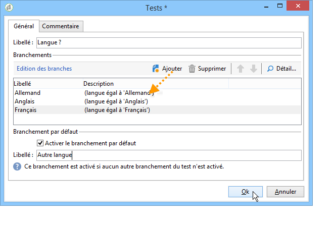
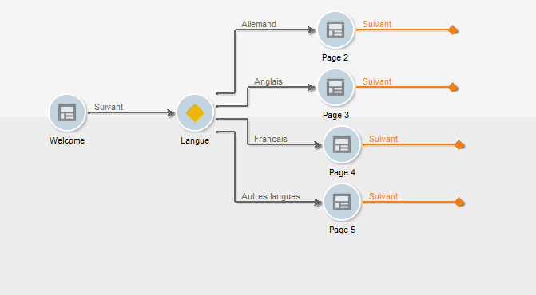

# Définition d’un contenu conditionnel{#defining-a-conditional-content}

Vous pouvez conditionner l&#39;affichage de certains éléments d&#39;un rapport ou d&#39;une ou plusieurs pages du rapport.

Pour rendre des éléments spécifiques conditionnels, adaptez leurs paramètres de visibilité. Pour plus dʼinformations, consultez la section [Conditionnement de l’affichage d’un élément](#conditioning-item-display).

Pour rendre l’affichage d’une ou de plusieurs pages conditionnel, utilisez une activité de type **[!UICONTROL Test]**. Pour plus dʼinformations, consultez la section [Conditionnement de lʼaffichage dʼune page](#conditioning-page-display).

## Conditionnement de lʼaffichage dʼun élément {#conditioning-item-display}

Pour rendre l&#39;affichage d&#39;une partie d&#39;un rapport conditionnel, vous devez définir ses conditions de visibilité : si ces conditions ne sont pas remplies, alors le ou les éléments ne seront pas affichés.

Les conditions de visibilité peuvent dépendre par exemple du statut de l&#39;opérateur ou des éléments qu&#39;il a sélectionnés ou renseignés dans la page du rapport.

Des exemples d&#39;affichages conditionnels des éléments d&#39;une page sont proposés dans [cette section](../../web/using/form-rendering.md#defining-fields-conditional-display).

Dans l&#39;exemple suivant, la condition d&#39;affichage dépend de la langue :

## Conditionnement de lʼaffichage dʼune page {#conditioning-page-display}

Dans le diagramme d&#39;un rapport, l&#39;activité **[!UICONTROL Test]** vous permet de modifier l&#39;enchaînement des pages du rapport en fonction d&#39;une ou plusieurs conditions.

Le principe de fonctionnement de cette activité est le suivant :

1. Positionnez un **[!UICONTROL Test]** dans le diagramme puis éditez-le.
1. Cliquez sur le bouton **[!UICONTROL Ajouter]** pour créer les différents cas possibles.

   

   Chaque cas ajoute une transition de sortie supplémentaires à l&#39;activité **[!UICONTROL Test]**.

   

1. Sélectionnez l&#39;option **[!UICONTROL Activer le branchement par défaut]** pour ajouter une transition, dans le cas où aucune des conditions paramétrées ne soit remplie.

   Pour plus d’informations, consultez [cette section](../../web/using/defining-web-forms-page-sequencing.md#conditional-page-display).

Une activité **[!UICONTROL Test]** peut être positionnée en début de diagramme afin de conditionner l&#39;affichage selon le contexte par exemple, ou le profil de l&#39;opérateur.
