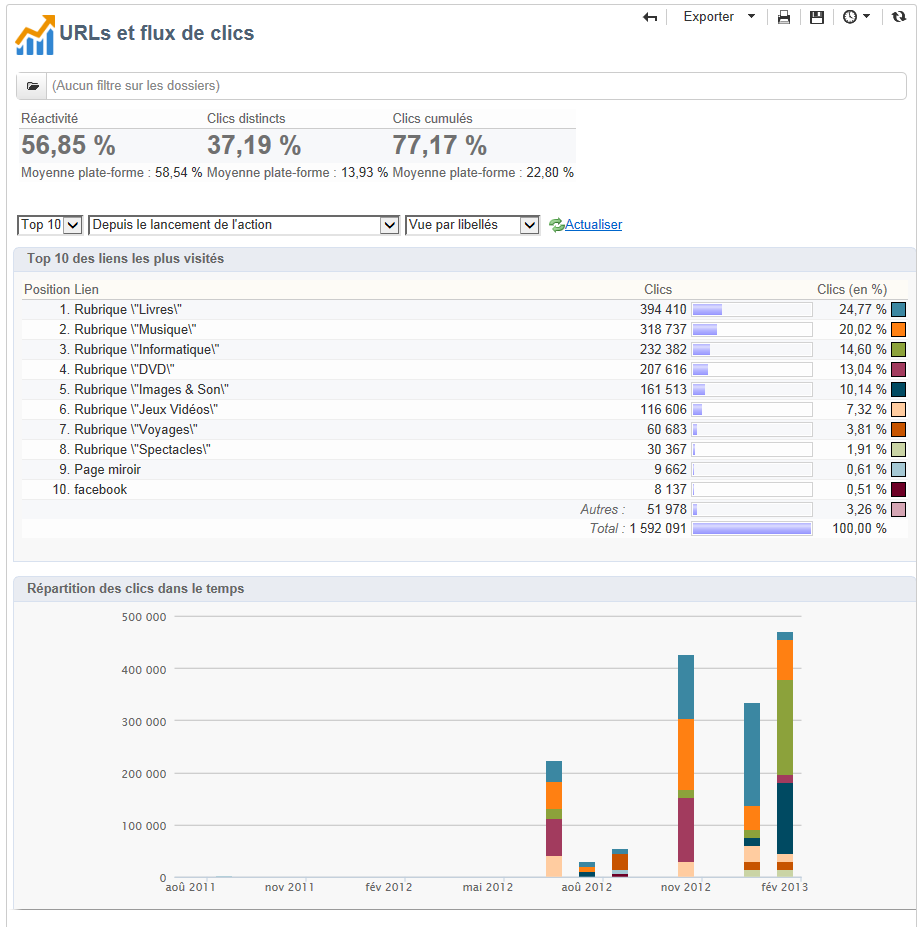

# Rapports sur les diffusions {#delivery-reports}

Vous pouvez suivre l&#39;exécution des diffusions à l&#39;aide de différents rapports, accessibles depuis la vue d&#39;ensemble des diffusions. Pour les afficher, respectez les étapes suivantes :

1. Go to the **[!UICONTROL Campaigns]** universe and click the **[!UICONTROL Delivery]** link to display the list of deliveries.
1. Cliquez sur le nom de la diffusion visée pour afficher son détail.

   

1. Select the **[!UICONTROL Summary]** tab and click the **[!UICONTROL Reports]** link to access the reports specific to the delivery.

   

   Par défaut, les rapports disponibles sont les suivants :

   * **[!UICONTROL Delivery throughput]** : reportez-vous à la section [Débit](../../reporting/using/global-reports.md#delivery-throughput)de livraison.
   * **[!UICONTROL Sharing to social networks]** : reportez-vous à [Partage sur les réseaux](../../reporting/using/global-reports.md#sharing-to-social-networks)sociaux.
   * **[!UICONTROL Statistics on sharing activities]** : voir [Statistiques sur les activités](../../reporting/using/global-reports.md#statistics-on-sharing-activities)de partage.
   * **[!UICONTROL Hot clicks]** : se référer aux [clics](#hot-clicks)à chaud.
   * **[!UICONTROL Tracking statistics]** : se reporter aux statistiques [de suivi](#tracking-statistics)
   * **[!UICONTROL URLs and click streams]** : se référer aux [URL et aux flux](#urls-and-click-streams)de clics.
   * **[!UICONTROL Tracking indicators]** : voir Indicateurs [de](#tracking-indicators)suivi.
   * **[!UICONTROL Non-deliverables and bounces]** : reportez-vous à la section [Non livrables et rebonds](../../reporting/using/global-reports.md#non-deliverables-and-bounces).
   * **[!UICONTROL User activities]** : reportez-vous aux activités utilisateur.
   * **[!UICONTROL Delivery summary]** : reportez-vous au résumé de la livraison.
   * **[!UICONTROL Subscription tracking]** : reportez-vous à la section Suivi [des](../../reporting/using/global-reports.md#subscription-tracking)abonnements.
   * **[!UICONTROL Delivery statistics]** : reportez-vous aux statistiques [de](../../reporting/using/global-reports.md#delivery-statistics)diffusion.
   * **[!UICONTROL Breakdown of opens]** : voir [Ventilation des ouvertures](../../reporting/using/global-reports.md#breakdown-of-opens).

## Indicateurs de tracking {#tracking-indicators}

Ce rapport regroupe les indicateurs clés qui permettent de suivre le comportement des destinataires à la réception de la diffusion. Il donne accès aux statistiques d&#39;envoi, de réception, aux taux d&#39;ouverture et de clic, aux flux de clics générés, au web tracking et aux partages vers les réseaux sociaux.

>[!NOTE]
>
>Les valeurs calculées sur la base des messages ouverts sont toujours des estimations, en raison de la marge d’erreur liée aux messages électroniques au format texte. Les **[!UICONTROL Distinct opens/Sum of opens for the population reached]** indicateurs tiennent compte de cette marge d&#39;erreur. For more information on tracking opens, refer to [Tracking opens](../../reporting/using/indicator-calculation.md#tracking-opens-).

**[!UICONTROL 1. Delivery statistics]**

* **[!UICONTROL Messages to deliver]** : Nombre total de messages à diffuser après l’analyse de la remise.
* **[!UICONTROL Success]** : Nombre de messages traités avec succès.

**[!UICONTROL 2. Reception statistics]**

>[!NOTE]
>
>Les pourcentages associés sont calculés par rapport au nombre de messages transmis avec succès.

* **[!UICONTROL Distinct opens for the population reached]** : Estimation du nombre de destinataires ciblés ayant ouvert un message au moins une fois. Les clics sur les liens de désabonnement et les pages miroir sont pris en compte.
* **[!UICONTROL Sum of opens for the population reached]** : Estimation du nombre total d’ouvertures par les destinataires ciblés.
* **[!UICONTROL Clicks on opt-out link]** : Nombre de clics sur le lien de désabonnement.
* **[!UICONTROL Clicks on the mirror page link]** : Nombre de clics sur le lien vers la page miroir. Pour être pris en compte, le lien doit être défini en tant que tel dans l’assistant de diffusion (URL suivies). Consultez à ce sujet cette [page](../../delivery/using/monitoring-a-delivery.md).
* **[!UICONTROL Estimation of forwards]** : Estimation du nombre de courriers électroniques transférés par les destinataires ciblés. Cette valeur est calculée en soustrayant le nombre de personnes distinctes et le nombre de destinataires distincts qui ont cliqué dans le courrier électronique.

   >[!NOTE]
   >
   >For more information on the difference between distinct people and targeted recipients, refer to [Targeted persons / recipients](../../reporting/using/indicator-calculation.md#targeted-persons---recipients).

**[!UICONTROL 3. Open and click-through rate]**

Ce tableau de valeurs présente la répartition, par domaine Internet, des envois, des ouvertures, des clics et de la réactivité brute. Les indicateurs utilisés sont les suivants :

* **[!UICONTROL Sent]** : Nombre total de messages envoyés sur ce domaine.
* **[!UICONTROL Complaints]** : Nombre de messages pour ce domaine qui ont été signalés comme indésirables par le destinataire. Le taux est calculé en fonction du nombre total de messages envoyés sur ce domaine.
* **[!UICONTROL Opens]** : Nombre de destinataires ciblés distincts pour ce domaine qui ont ouvert un message au moins une fois. Le taux est calculé en fonction du nombre total de messages envoyés sur ce domaine.
* **[!UICONTROL Clicks]** : Nombre de destinataires ciblés distincts qui ont cliqué dans la même remise au moins une fois. Le taux est calculé en fonction du nombre total de messages envoyés sur ce domaine.
* **[!UICONTROL Raw reactivity]** : Pourcentage du nombre de destinataires qui ont cliqué dans une remise au moins une fois par rapport au nombre de destinataires qui ont ouvert une remise au moins une fois.

>[!NOTE]
>
>Les noms de domaine affichés dans ce rapport sont définis dans la liste détaillée utilisée au niveau du cube. Pour modifier, ajouter ou supprimer des domaines par défaut, modifiez la liste **[!UICONTROL Domains]** détaillée et modifiez les valeurs et alias. Voir à ce propos [cette section](../../platform/using/managing-enumerations.md). La **[!UICONTROL Others]** catégorie comprend des noms de domaine qui n’appartiennent à aucune valeur de la liste détaillée.

**[!UICONTROL 4. Generated click streams]**

>[!NOTE]
>
>Les pourcentages associés sont calculés par rapport au nombre de messages transmis avec succès.

* **[!UICONTROL Distinct clicks for the population reached]** : Nombre de personnes distinctes ayant cliqué dans une remise au moins une fois.
* **[!UICONTROL Cumulated clicks]** : Nombre total de clics par les destinataires ciblés, à l’exclusion des liens de désabonnement et des pages miroir.
* **[!UICONTROL Recipient clicks]** : Nombre de destinataires ciblés distincts qui ont cliqué dans la même remise au moins une fois.
* **[!UICONTROL Estimated recipient reactivity]** : Ratio du nombre de destinataires ayant cliqué au moins une fois dans une remise par rapport au nombre estimé de destinataires ayant ouvert une remise au moins une fois. Les clics sur les liens d’exclusion et de page miroir ne sont pas pris en compte.

**[!UICONTROL 5. Web tracking]**

* **[!UICONTROL Visited pages]** : Nombre de pages Web visitées après réception du message.
* **[!UICONTROL Transactions]** : Nombre d&#39;achats suite à la réception d&#39;un message.
* **[!UICONTROL Total amount]** : Montant total des achats après réception du message.
* **[!UICONTROL Average transaction amount]** : Achat moyen effectué par des destinataires distincts.
* **[!UICONTROL Articles]** : Nombre d&#39;articles achetés par les destinataires de la diffusion.
* **[!UICONTROL Average count of articles per transaction]** : Nombre moyen d’éléments par achat effectués par des destinataires distincts.
* **[!UICONTROL Average amount per message]** : Montant moyen des achats générés par message.

   >[!NOTE]
   >
   >Pour qu&#39;une page visitée, une transaction, un montant ou un article soit comptabilisé, une balise de webtracking doit être insérée sur la page web correspondante. Le paramétrage du webtracking est présenté dans [cette section](../../configuration/using/about-web-tracking.md).

**[!UICONTROL 6. Sharing activities to email and social networks]**

Cette section indique le nombre de messages partagés sur chaque réseau social. Pour plus d&#39;informations, reportez-vous à la section [Partage sur les réseaux](../../reporting/using/global-reports.md#sharing-to-social-networks)sociaux.

## URL et flux de clics (URLs and click streams){#urls-and-click-streams}

Ce rapport présente le palmarès des pages visitées suite au lancement d&#39;une diffusion.

You can configure the contents of this report by selecting: the score chart to be displayed, the time filter (since the action launch, over the first 6 hours following launch, etc.) and the data display mode (by label, by URL, by category - for more on this, refer to [this page](../../delivery/using/monitoring-a-delivery.md)). Cliquez sur **[!UICONTROL Refresh]** pour confirmer votre sélection.

Dans la section supérieure du rapport, les taux suivants sont affichés :

* **[!UICONTROL Reactivity]** : Ratio du nombre de destinataires ciblés ayant cliqué dans une remise, par rapport au nombre estimé de destinataires ciblés ayant ouvert une remise. Les clics sur le lien d’exclusion et sur la page miroir ne sont pas pris en compte.

   >[!NOTE]
   >
   >For more information on tracking opens, refer to [Tracking opens](../../reporting/using/indicator-calculation.md#tracking-opens-).

* **[!UICONTROL Distinct clicks]** : Nombre de personnes distinctes ayant cliqué au moins une fois (à l’exclusion du lien de désabonnement et de la page miroir) dans une diffusion. Le taux affiché est calculé en fonction du nombre de messages remis avec succès.
* **[!UICONTROL Cumulated clicks]** : Nombre total de clics par les destinataires ciblés (à l’exclusion du lien de désabonnement et de la page miroir). Le taux affiché est calculé en fonction du nombre de messages transférés avec succès.

**[!UICONTROL Platform average]** : Ce taux moyen, affiché sous chaque taux (réactivité, clics distincts et clics cumulés), est calculé pour les livraisons envoyées au cours des six mois précédents. Seules les livraisons avec la même typologie et sur le même canal sont prises en compte. Les preuves sont exclues.

Le tableau central propose les informations suivantes :

* **[!UICONTROL Clicks]** : Nombre de clics cumulés, par lien.
* **[!UICONTROL Clicks (in %)]** : Ventilation du nombre de clics par lien, par rapport au nombre total de clics cumulés.

**[!UICONTROL Breakdown of clicks in time]**

Ce graphique présente la répartition des clics cumulés, par jour.

## Synthèse des diffusions (Delivery summary){#delivery-summary}

Ce rapport présente l&#39;ensemble des informations principales relatives à la diffusion.

**[!UICONTROL Target population]**

Cette section comporte deux indicateurs :

* **[!UICONTROL Initial population]** : Nombre total de destinataires auxquels la diffusion est destinée.
* **[!UICONTROL Messages rejected by the rule]** : Nombre d’adresses ignorées au cours de l’analyse lors de l’application de règles de typologie : adresse manquante, mise en quarantaine, mise sur liste noire, etc. For more information on typology rules, refer to this [page](../../delivery/using/steps-validating-the-delivery.md#validation-process-with-typologies).

**[!UICONTROL Causes of exclusion]**

Le graphique central présente la répartition, par règle, des messages rejetés lors de l&#39;analyse.

**[!UICONTROL Delivery statistics]**

Cette section comporte les indicateurs suivants :

* **[!UICONTROL Messages to be delivered]** : Nombre total de messages à diffuser après l’analyse de la remise.
* **[!UICONTROL Success]** : Nombre de messages traités avec succès. Le taux associé est le rapport avec le nombre de messages à diffuser.
* **[!UICONTROL Errors]** : Nombre total d&#39;erreurs cumulées pendant les livraisons et le traitement automatique des rebonds. Le taux associé est le rapport avec le nombre de messages à diffuser.
* **[!UICONTROL New quarantines]** : Nombre d&#39;adresses mises en quarantaine après un échec de remise (utilisateur inconnu, domaine non valide). Le taux associé est le rapport avec le nombre de messages à diffuser.

## Hot clicks {#hot-clicks}

Ce rapport présente le contenu du message (HTML et/ou texte) avec, sur chaque lien, le pourcentage de clics sur ce lien. Les liens situés dans les blocs de personnalisation, le lien de désinscription, le lien vers la page miroir et les liens des offres sont comptabilisés dans le total des clics cumulés mais ne sont pas affichés dans le rapport.

>[!NOTE]
>
>Si votre diffusion contient des offres (Interaction), un encadré apparaît dans la partie supérieure du rapport affichant le pourcentage de clics sur les offres.

## Statistiques de tracking {#tracking-statistics}

Ce rapport présente les statistiques sur les taux d&#39;ouverture, clics et transactions.

Il vous permet de suivre l’impact marketing de la diffusion. Vous pouvez configurer le mode d’affichage des valeurs en modifiant l’échelle de temps (affichage 1 heure, 3 heures ou 24 heures, etc.). Cliquez sur **[!UICONTROL Refresh]** pour confirmer votre sélection.

Ce rapport se présente sous la forme d&#39;un tableau de valeur et d&#39;un diagramme de Pareto permettant de mesurer le temps mis pour que la diffusion atteigne son efficacité maximum. Les indicateurs utilisés sont les suivants :

* **[!UICONTROL Opens]** : Estimation du temps nécessaire pour atteindre un pourcentage du nombre total de messages ouverts. Les courriels au format texte ne sont pas pris en compte. For more information on tracking opens, refer to [Tracking opens](../../reporting/using/indicator-calculation.md#tracking-opens-).
* **[!UICONTROL Clicks]** : Estimation du temps nécessaire pour atteindre un pourcentage du nombre total de clics enregistrés. Les clics sur le lien d’exclusion et sur la page miroir ne sont pas pris en compte.
* **[!UICONTROL Transactions]** : Temps nécessaire pour obtenir un pourcentage du nombre total de transactions après réception du message. Pour qu’une transaction soit prise en compte, une balise de suivi Web de type de transaction doit être insérée dans la page Web correspondante. La configuration du suivi Web est présentée dans [cette section](../../configuration/using/about-web-tracking.md).
