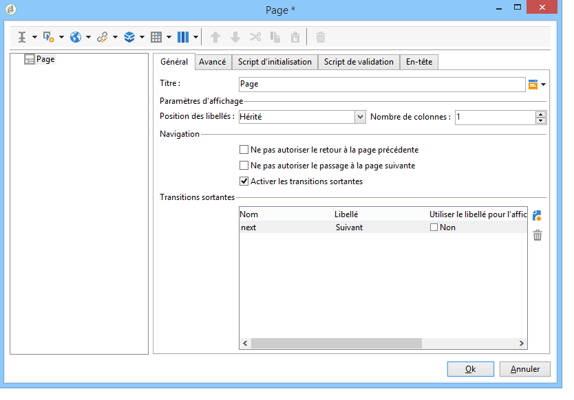
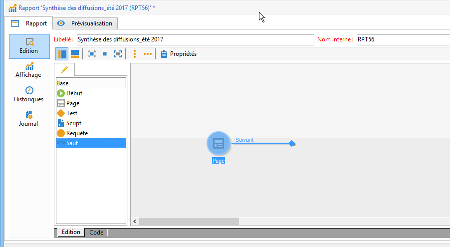
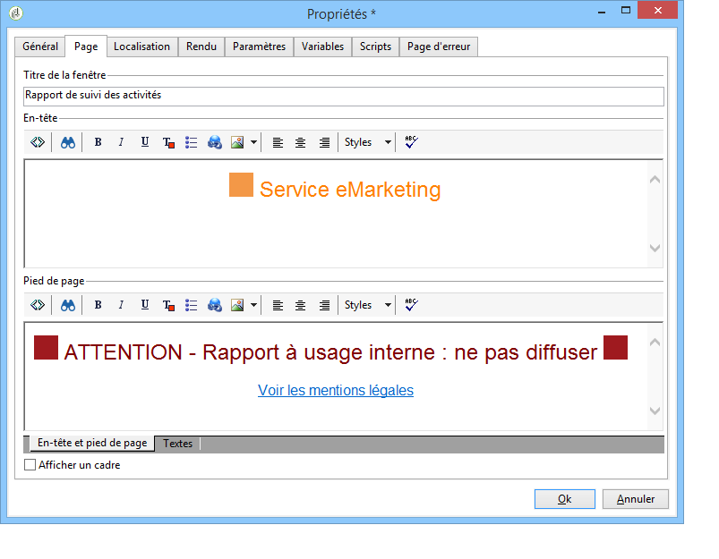
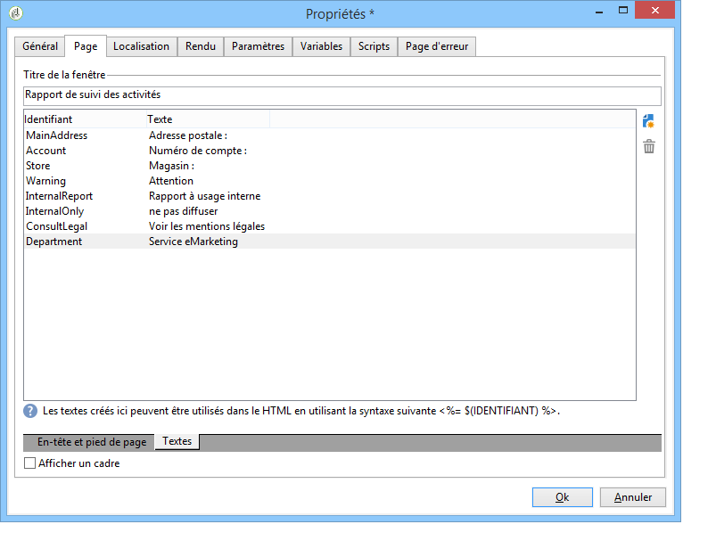
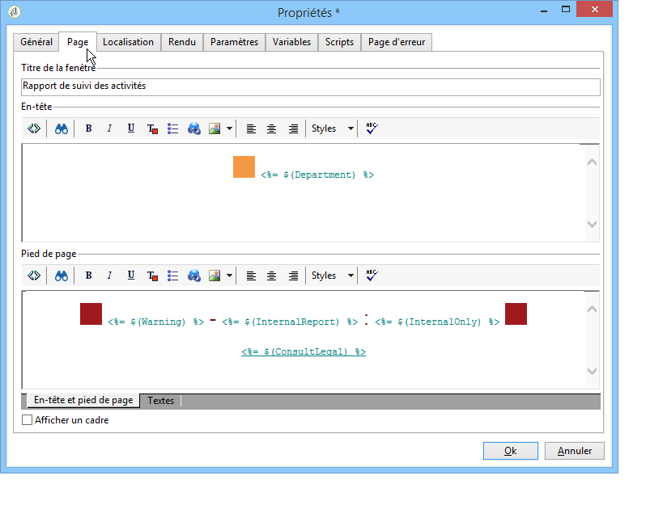

# Mettre en page les éléments{#element-layout}

En complément des variantes du graphique disponibles, [présentées ici](../../reporting/using/creating-a-chart.md#chart-types-and-variants), vous pouvez adapter lʼaffichage et ajouter des éléments dans la ou les pages du rapport.

Vous pouvez utiliser des conteneurs : ils permettent de lier plusieurs éléments d&#39;une page et de paramétrer leur mise en page en colonnes et/ou en cellules. Leur utilisation est présentée dans la section [cette section](../../web/using/defining-web-forms-layout.md#creating-containers).

Vous pouvez paramétrer la mise en page du rapport au niveau de la page (à la racine de l&#39;arborescence) et la surcharger pour chaque conteneur. Les pages sont organisées en colonnes. Les conteneurs sont également organisés en colonne. Seuls les éléments statiques et les graphiques sont organisés en cellule.

## Définition des options de chaque page {#defining-the-options-for-each-page}

Vous pouvez utiliser les options de chaque page du rapport.

L&#39;onglet **[!UICONTROL Général]**, vous permet de modifier le titre de la page, de choisir la position des légendes et de paramétrer la navigation entre les différentes pages du rapport.

La variable **[!UICONTROL Titre]** permet de personnaliser le libellé dans l&#39;en-tête de la page du rapport. Le titre de la fenêtre peut être paramétré à partir du **[!UICONTROL Propriétés]** du rapport. Pour plus d&#39;informations, voir la section [Ajouter un en-tête et un pied de page](#adding-a-header-and-a-footer).

La variable **[!UICONTROL Paramètres d’affichage]** Les options permettent de sélectionner la position de la légende du contrôle dans une page de rapport et de définir le nombre de colonnes de la page. Pour plus d’informations sur la mise en page, reportez-vous au **Mettre en page les éléments** section de [cette section](../../web/using/defining-web-forms-layout.md#positioning-the-fields-on-the-page).

Sélectionnez les différentes options de la **[!UICONTROL Parcourir]** pour autoriser la navigation d’une page de rapport à une autre. Si la variable **[!UICONTROL Désactiver la page suivante]** ou le **[!UICONTROL Désactiver la page précédente]** est sélectionnée, la variable **[!UICONTROL Suivant]** et **[!UICONTROL Précédent]** les boutons disparaissent de la page du rapport.

## Ajout dʼun en-tête et dʼun pied de page {#adding-a-header-and-a-footer}

La fenêtre des propriétés du rapport permet également de définir des éléments de mise en page, tels que : le titre de la fenêtre, le contenu HTML de la zone d&#39;en-tête et celui du pied de page.

Pour accéder à la fenêtre les propriétés, cliquez sur le bouton **[!UICONTROL Propriétés]** du rapport.

L&#39;onglet **[!UICONTROL Page]** permet de personnaliser l&#39;affichage.

Le contenu paramétré dans cet onglet sera visible sur toutes les pages du rapport.

Le sous-onglet **[!UICONTROL Textes]** permet de définir des contenus variables : ils seront pris en compte dans le cycle de traduction lorsque le rapport est destiné à être proposé dans plusieurs langues.

Vous pouvez ainsi créer une liste de fragments de textes et les associer à des identifiants :

Puis insérer ces identifiants dans les contenus HTML du rapport :

Ils seront remplacés automatiquement à l&#39;affichage du rapport par le contenu correspondant.

Ce mode de fonctionnement permet, comme pour les textes HTML, de centraliser les textes utilisés dans le rapport et d&#39;en gérer les traductions. En effet, les textes créés dans cet onglet sont collectés automatiquement dans l&#39;outil de traduction intégré d&#39;Adobe Campaign.
