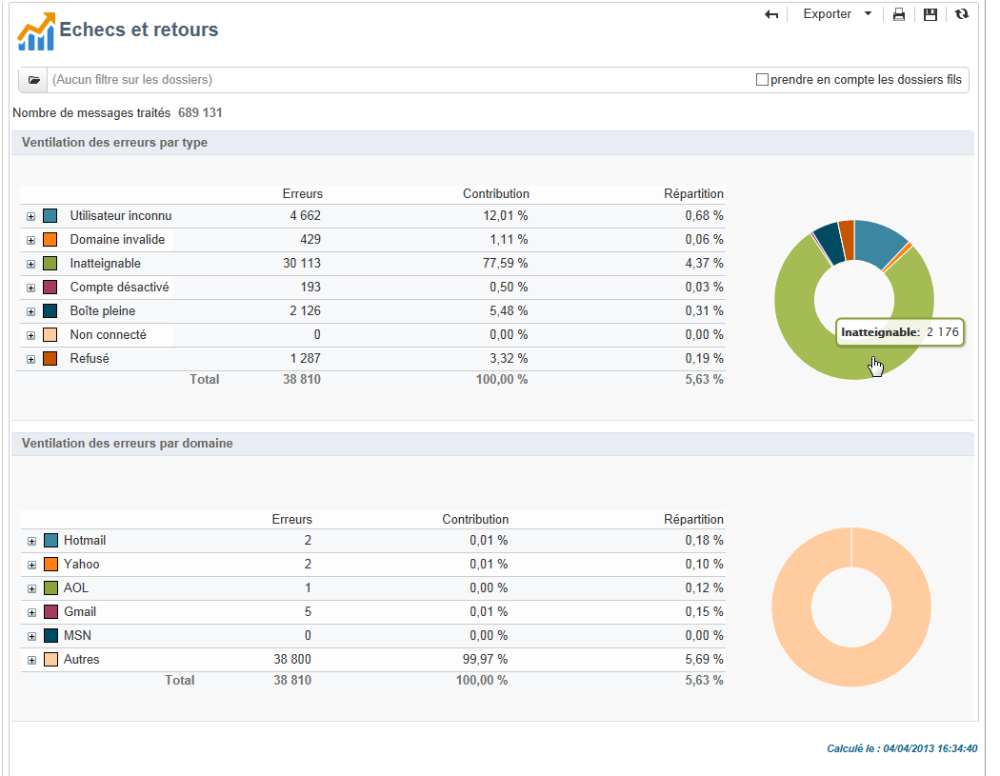
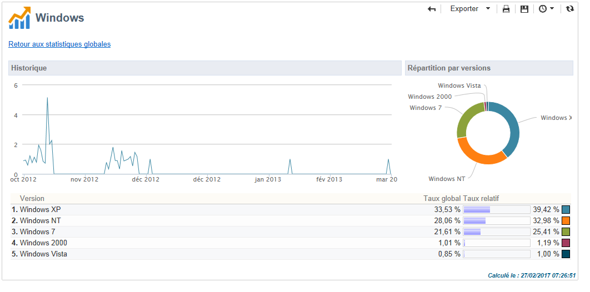

# Rapports globaux {#global-reports}

Ces rapports concernent l’activité des données dans l’ensemble de la base de données. Pour afficher le tableau de bord des rapports, accédez à l&#39; **[!UICONTROL Reports]** onglet.

Cliquez sur les noms des rapports pour les afficher. Par défaut, les rapports suivants sont disponibles :

>[!NOTE]
>
>Cette section présente uniquement les rapports liés aux diffusions.

* **[!UICONTROL Delivery throughput]** : reportez-vous à la section [Débit](#delivery-throughput)de livraison.
* **[!UICONTROL Browsers]** : voir [Navigateurs](#browsers).
* **[!UICONTROL Sharing to social networks]** : reportez-vous à [Partage sur les réseaux](#sharing-to-social-networks)sociaux.
* **[!UICONTROL Statistics on sharing activities]** : voir [Statistiques sur les activités](#statistics-on-sharing-activities)de partage.
* **[!UICONTROL Operating systems]** : voir Systèmes [d’](#operating-systems)exploitation.
* **[!UICONTROL URLs and click streams]** : se référer aux [URL et aux flux](../../reporting/using/delivery-reports.md#urls-and-click-streams)de clics.
* **[!UICONTROL Tracking indicators]** : voir Indicateurs [de](../../reporting/using/delivery-reports.md#tracking-indicators)suivi.
* **[!UICONTROL Non-deliverables and bounces]** : reportez-vous à la section [Non livrables et rebonds](#non-deliverables-and-bounces).
* **[!UICONTROL User activities]** : reportez-vous aux activités utilisateur.
* **[!UICONTROL Subscription tracking]** : reportez-vous à la section Suivi [des](#subscription-tracking)abonnements.
* **[!UICONTROL Delivery summary]** : reportez-vous au résumé de la livraison.
* **[!UICONTROL Delivery statistics]** : reportez-vous aux statistiques [de](#delivery-statistics)diffusion.
* **[!UICONTROL Breakdown of opens]** : voir [Ventilation des ouvertures](#breakdown-of-opens).

## Débit des diffusions (Delivery throughput){#delivery-throughput}

Ce rapport contient les informations relatives au débit de diffusion de l&#39;ensemble de la plate-forme sur une période donnée. Pour mesurer la vitesse de diffusion des messages, les critères sont le nombre de messages diffusés par heure et la taille des messages, en bits par seconde. Dans l&#39;exemple ci-dessous, le premier graphique indique, en bleu, les diffusions envoyées avec succès et, en orange, le nombre de messages en erreur.

Vous pouvez configurer les valeurs affichées en modifiant l’échelle de temps : Vue 1 heure, vue 3 heures, vue 24 heures, etc. Cliquez sur **[!UICONTROL Refresh]** pour confirmer votre sélection.

## Activités utilisateurs {#user-activities}

Ce rapport présente la répartition des ouvertures, clics et transactions, par demi-heure, par heure ou par jour, sous la forme d&#39;un graphique.

Les options disponibles sont les suivantes :

* **[!UICONTROL Opens]** : Nombre total de messages ouverts.  Les courriels au format texte ne sont pas pris en compte. For more information on tracking opens, refer to [Tracking opens](../../reporting/using/indicator-calculation.md#tracking-opens-).
* **[!UICONTROL Clicks]** : Nombre total de clics sur les liens dans les remises. Les clics sur les liens de désabonnement et les pages miroir ne sont pas pris en compte.
* **[!UICONTROL Transactions]** : Nombre total de transactions après réception d’un message. Pour qu’une transaction soit prise en compte, une balise de suivi Web de type de transaction doit être insérée dans la page Web correspondante. La configuration du suivi Web est présentée dans [cette section](../../configuration/using/about-web-tracking.md).

## Echecs et retours {#non-deliverables-and-bounces}

Ce rapport présente la répartition des messages en échec et la répartition des échecs par domaine Internet.

Le **[!UICONTROL Number of messages processed]** représente le nombre total de messages traités par le serveur de remise. Cette valeur est inférieure au nombre de messages à diffuser lorsque certaines livraisons ont été interrompues ou suspendues (avant d’être traitées par le serveur).

**[!UICONTROL Breakdown of errors by type]**

>[!NOTE]
>
>Les erreurs présentées dans ce rapport enclenchent le mécanisme de mise en quarantaine. Pour plus d&#39;information sur la gestion des quarantaines, consultez la section [Gestion des quarantaines](../../delivery/using/understanding-quarantine-management.md).

La première partie de ce rapport présente la répartition des messages en échec sous la forme d&#39;un tableau de valeurs et d&#39;un graphique.

A chaque type d&#39;erreur, est associé :

* le nombre de messages en erreur de ce type,
* le pourcentage du nombre de messages en erreur de ce type par rapport au nombre total de messages en erreur,
* le pourcentage du nombre de messages en erreur de ce type par rapport au nombre total de messages traités.

Les indicateurs utilisés sont les suivants :

* **[!UICONTROL User unknown]** : Type d’erreur généré pendant la remise pour indiquer que l’adresse électronique n’est pas valide.
* **[!UICONTROL Invalid domain]** : Type d’erreur généré lors de l’envoi d’une remise pour indiquer que le domaine de l’adresse électronique est incorrect ou n’existe pas.
* **[!UICONTROL Inbox full]** : Type d’erreur généré après cinq tentatives de remise pour indiquer que la boîte de réception des destinataires contient trop de messages.
* **[!UICONTROL Account disabled]** : Type d’erreur généré lors de l’envoi d’une remise pour indiquer que l’adresse n’existe plus.
* **[!UICONTROL Rejected]** : Type d’erreur généré lorsqu’une adresse est rejetée par l’IAP (fournisseur d’accès Internet), par exemple après l’application d’une règle de sécurité (logiciel anti-spam).
* **[!UICONTROL Unreachable]** : Type d’erreur qui se produit dans la chaîne de distribution de messages : incident sur le relais SMTP, domaine temporairement inaccessible, etc.
* **[!UICONTROL Not connected]** : Type d’erreur indiquant que le téléphone mobile des destinataires est éteint ou déconnecté du réseau au moment de l’envoi.

   >[!NOTE]
   >
   >Cet indicateur ne concerne que les diffusions sur les canaux mobiles. Voir à ce sujet [cette section](../../delivery/using/sms-channel.md).

   You can open up each line of the value table by clicking the `[+]` symbol. For each error type, you can show the breakdown of error messages by domain.

   

**[!UICONTROL Breakdown of errors per domain]**

La seconde partie de ce rapport présente la répartition des échecs par domaine Internet sous la forme d&#39;un tableau de valeurs et d&#39;un graphique.

A chaque nom de domaine, est associé :

* le nombre de messages en erreur sur ce domaine,
* le pourcentage du nombre de messages en erreur sur ce domaine par rapport au nombre total de messages traités sur ce domaine.
* le pourcentage du nombre de messages en erreur sur ce domaine par rapport au nombre total de messages en erreur,

You can open up each line of the value table by clicking the [+] symbol. For each domain type, you can show the breakdown of error messages by error type.

>[!NOTE]
>
>Les noms de domaine affichés dans ce rapport sont définis au niveau du cube. Pour modifier ces valeurs, modifiez le **[!UICONTROL Delivery logs (broadlogrcp)]** cube. Voir à ce propos [cette section](../../reporting/using/about-cubes.md). La **[!UICONTROL Others]** catégorie comprend des noms de domaine qui n’appartiennent pas à une classe spécifique.

## Navigateurs {#browsers}

Ce rapport présente la répartition entre les navigateurs internet utilisés par les destinataires des diffusions, pour la période sélectionnée.

>[!NOTE]
>
>Les valeurs affichées dans ce rapport sont des estimations. En effet, les destinataires des diffusions ne sont pas tous pris en compte. Seuls les destinataires ayant cliqué dans une diffusion sont comptabilisés.

**Statistiques globales**

Les statistiques globales d&#39;utilisation des navigateurs sont présentées sous la forme d&#39;un tableau de valeurs et d&#39;un graphique.

Les indicateurs utilisés sont les suivants :

* **[!UICONTROL Visitors]** : Nombre total de destinataires ciblés (par navigateur Internet) et ayant cliqué sur une diffusion au moins une fois.
* **[!UICONTROL Pages viewed]** : Nombre total de clics sur les liens dans une diffusion (par navigateur Internet) pour toutes les livraisons.
* **[!UICONTROL Usage rate]** : Ce taux représente la ventilation des visiteurs (par navigateur Internet) par rapport au nombre total de visiteurs.

**Statistiques par navigateur**

Dans le tableau de valeurs des statistiques globales, vous pouvez cliquer sur le nom de chaque navigateur afin de visualiser les statistiques d&#39;utilisation correspondantes.

Les statistiques sont présentées sous la forme d&#39;une courbe, d&#39;un graphique et d&#39;un tableau de valeurs.

La **[!UICONTROL History]** courbe représente le taux de fréquentation de ce navigateur par jour. Le taux est le ratio du nombre de visiteurs par jour (sur ce navigateur) par rapport au nombre de visiteurs mesuré le jour avec le taux de fréquentation le plus élevé.

The **[!UICONTROL Breakdown per version]** chart represents the breakdown of visitors per version compared to the total number of visitors (on this browser).

Le tableau de valeurs utilise les indicateurs suivants :

* **[!UICONTROL Global rate]** : Ce taux représente la ventilation des visiteurs par version par rapport au nombre total de visiteurs (sur tous les navigateurs).
* **[!UICONTROL Relative rate]** : Ce taux représente la ventilation des visiteurs par version par rapport au nombre total de visiteurs (sur ce navigateur).

### Partage vers les réseaux sociaux {#sharing-to-social-networks}

Le marketing viral permet aux destinataires de vos diffusions de partager l&#39;information avec leur réseau : ajouter le lien à leur profil (Facebook, Twitter, etc.), ou envoyer un message à un ami. Chaque partage et chaque accès à l&#39;information partagée fait l&#39;objet d&#39;un tracking au niveau de la diffusion. Pour plus d&#39;informations sur le marketing viral, reportez-vous à [cette section](../../delivery/using/viral-and-social-marketing.md).

Ce rapport présente la répartition du partage et de l&#39;ouverture des messages par réseau social (Facebook, Twitter, etc.) et/ou par email.

**[!UICONTROL Email delivery statistics]**

Dans les statistiques d&#39;envoi par mail, deux valeurs sont affichées :

* **[!UICONTROL Number of messages to be delivered]** : Nombre total de messages traités lors de l’analyse de la remise.
* **[!UICONTROL Number of successful deliveries]** : Nombre de messages traités avec succès.

**[!UICONTROL Sharing activities and mail open statistics]**

Le tableau central présente les statistiques de partage et d&#39;ouverture du mail.

In the **[!UICONTROL Shares]** column, we have the following indicators:

* **[!UICONTROL No. of sharing activities]** : Nombre total de messages partagés sur chaque réseau social. Cette valeur est égale au nombre total de clics sur l’icône du bloc de **[!UICONTROL Links for sharing to social networks]** personnalisation correspondant.
* **[!UICONTROL Breakdown]** : Ce taux représente la ventilation des partages par réseau social, par rapport au nombre total d’actions.
* **[!UICONTROL Sharing rate]** : Ce taux représente la ventilation des partages par réseau social, par rapport au nombre de messages à diffuser.

In the **[!UICONTROL Opens]** column, we have the following indicators:

* **[!UICONTROL No. of opens]** : Nombre total de messages ouverts par les personnes auxquelles le message a été transféré (via le bloc **[!UICONTROL Links for sharing to social networks]** de personnalisation). Cette valeur est égale au nombre d’affichages de la page miroir. Les ouvertures par les destinataires ne sont pas prises en compte.
* **[!UICONTROL Breakdown]** : Ce taux représente la ventilation des ouvertures par réseau social, par rapport au nombre total d’ouvertures.
* **[!UICONTROL Rate of opens]** : Ce taux représente la ventilation des ouvertures par réseau social, par rapport au nombre total de partages.

**[!UICONTROL Breakdown of sharing activities and opens]**

Cette section comporte deux graphiques représentant la répartition des partages et ouvertures, par réseau social.

## Statistiques des activités de partage {#statistics-on-sharing-activities}

Ce rapport présente l&#39;évolution dans le temps des activités de partage vers les réseaux sociaux (Facebook, Twitter, email, etc.).

Pour plus d&#39;informations sur le marketing viral, consultez [cette section](../../delivery/using/viral-and-social-marketing.md).

Les statistiques sont présentées sous la forme d&#39;un tableau de valeurs et d&#39;un graphique.

Les indicateurs utilisés sont les suivants :

* **[!UICONTROL New contacts]** : Nombre de nouveaux abonnements après la réception d’un message partagé par courrier électronique. Cette valeur correspond au nombre de personnes qui ont reçu un message partagé par courrier électronique, ont cliqué sur le lien **[!UICONTROL Subscription link]** et rempli le formulaire d’abonnement.
* **[!UICONTROL Opens]** : Nombre total de messages ouverts par les personnes auxquelles le message a été transféré (via le bloc **[!UICONTROL Link for sharing to social networks]** de personnalisation). Cette valeur est égale au nombre d’affichages de la page miroir. Les ouvertures par les destinataires ne sont pas prises en compte.
* **[!UICONTROL Sharing activities]** : Nombre total de messages partagés via les réseaux sociaux. Cette valeur correspond au nombre total de clics sur l’icône du bloc de **[!UICONTROL Links for sharing to social networks]** personnalisation.

## Systèmes d&#39;exploitation {#operating-systems}

Ce rapport présente la répartition entre les systèmes d&#39;exploitation utilisés par les destinataires des diffusions, pour la période sélectionnée.

>[!NOTE]
>
>Les valeurs affichées dans ce rapport sont des estimations. En effet, les destinataires des diffusions ne sont pas tous pris en compte. Seuls les destinataires ayant cliqué dans une diffusion sont comptabilisés.

**Statistiques globales**

Les statistiques globales d&#39;utilisation des systèmes d&#39;exploitation sont présentées sous la forme d&#39;un tableau de valeurs et d&#39;un graphique.

Les indicateurs utilisés sont les suivants :

* **[!UICONTROL Visitors]** : Moyenne quotidienne du nombre total de destinataires ciblés (par système d’exploitation) qui ont cliqué au moins une fois sur une diffusion.
* **[!UICONTROL Pages viewed]** : Moyenne quotidienne du nombre total de clics sur les liens de remise (par système d’exploitation) pour toutes les livraisons.
* **[!UICONTROL Rate of use]** : Ce taux représente la ventilation des visiteurs (par système d’exploitation) par rapport au nombre total de visiteurs.

**Statistiques par système d&#39;exploitation**

Dans le tableau de valeurs des statistiques globales, vous pouvez cliquer sur le nom de chaque système d&#39;exploitation afin de visualiser les statistiques d&#39;utilisation correspondantes.

Les statistiques sont présentées sous la forme d&#39;une courbe, d&#39;un graphique et d&#39;un tableau de valeurs.

La **[!UICONTROL History]** courbe représente le taux d&#39;utilisation de ce système d&#39;exploitation par jour. Ce taux est le ratio du nombre de visiteurs par jour (sur ce système d’exploitation) par rapport au nombre de visiteurs mesuré le jour où la fréquentation est la plus élevée.

The **[!UICONTROL Breakdown by version]** chart represents the breakdown of visitors per version in relation to the total number of visitors on this operating system.

Le tableau de valeurs utilise les indicateurs suivants :

* **[!UICONTROL Global rate]** : Ce taux représente la ventilation des visiteurs (par version) par rapport au nombre total de visiteurs sur l’ensemble des systèmes d’exploitation.
* **[!UICONTROL Relative rate]** : Ce taux représente la ventilation des visiteurs (par version) par rapport au nombre total de visiteurs pour ce système d’exploitation.

## Tracking des abonnements {#subscription-tracking}

Ce rapport permet d&#39;assurer le suivi des abonnements aux services d&#39;information. Il présente les inscriptions et désinscriptions.

Il peut être affiché pour un abonnement en cliquant sur le **[!UICONTROL Profiles and targets > Services and subscriptions]** noeud de la page d&#39;accueil ou de l&#39;explorateur. Sélectionnez un abonnement, puis cliquez sur l’ **[!UICONTROL Reports]** onglet. Le **[!UICONTROL Subscriptions tracking]** rapport est disponible par défaut. Il vous permet de visualiser les tendances des abonnements et des désabonnements ainsi que le taux de fidélité sur une période donnée. Vous pouvez configurer la représentation de ces données dans la liste déroulante. Cliquez sur **[!UICONTROL Refresh]** pour valider la configuration sélectionnée.

Voir à ce propos [cette page](../../delivery/using/managing-subscriptions.md).

Le **[!UICONTROL Number subscribed to date]** représente le nombre total de personnes actuellement abonnées.

**[!UICONTROL Overall evolution of subscriptions]**

Le tableau de valeurs utilise les indicateurs suivants :

* **[!UICONTROL Subscribers]** : Nombre total d&#39;abonnés pour la période concernée.
* **[!UICONTROL Subscriptions]** : Nombre d&#39;abonnements pour la période concernée.
* **[!UICONTROL Unsubscriptions]** : Nombre de désabonnements pour la période concernée.
* **[!UICONTROL Evolution]** : Nombre de désabonnements moins le nombre d’abonnements. Le taux est calculé en fonction du nombre total d’abonnés.
* **[!UICONTROL Loyalty]** : Taux de fidélité des abonnés pour la période concernée.

**[!UICONTROL Subscription evolution curves]**

Ce graphique représente l&#39;évolution dans le temps des inscriptions et désinscriptions, sur la période sélectionnée.

## Statistiques de diffusion {#delivery-statistics}

Ce rapport présente la répartition, par domaine Internet, des messages traités et envoyés, des erreurs hard et soft, des ouvertures, des clics et des désinscriptions.

Les indicateurs utilisés sont les suivants :

* **[!UICONTROL Emails processed]** : Nombre total de messages traités par le serveur de remise.
* **[!UICONTROL Delivered]** : pourcentage du nombre de messages traités avec succès par rapport au nombre total de messages traités.
* **[!UICONTROL Hard bounces]** : pourcentage du nombre de rebonds &quot;durs&quot; par rapport au nombre total de messages traités.
* **[!UICONTROL Soft bounces]** : pourcentage du nombre de rebonds &quot;doux&quot; par rapport au nombre total de messages traités.

   >[!NOTE]
   >
   >Pour plus d&#39;informations sur les hard et soft bounces, consultez la section [Gestion des quarantaines](../../delivery/using/understanding-quarantine-management.md).

* **[!UICONTROL Opens]** : pourcentage du nombre de destinataires ciblés qui ont ouvert un message au moins une fois par rapport au nombre de messages traités avec succès.
* **[!UICONTROL Clicks]** : pourcentage du nombre de personnes qui ont cliqué dans une remise au moins une fois par rapport au nombre de messages traités avec succès.
* **[!UICONTROL Unsubscription]** : pourcentage du nombre de clics sur un lien de désabonnement par rapport au nombre de messages traités avec succès.

## Répartition des ouvertures {#breakdown-of-opens}

Ce rapport affiche la répartition des ouvertures par système d&#39;exploitation, par appareil, et par navigateur, sur la période sélectionnée. Pour chaque catégorie, deux graphiques sont utilisés. Le premier affiche les statistiques d&#39;ouvertures sur ordinateur et mobile. Le second affiche uniquement les statistiques d&#39;ouvertures sur mobiles.

Le nombre d&#39;ouvertures correspond au nombre total de messages ouverts. Les courriers électroniques au format texte ne sont pas comptabilisés. Pour plus d&#39;informations sur le suivi des ouvertures, reportez-vous à la section [Suivi des ouvertures](../../reporting/using/indicator-calculation.md#tracking-opens-) .

>[!NOTE]
>
>Les noms des navigateurs et des systèmes d&#39;exploitation font partie des informations renvoyées par le user agent du navigateur sur lequel le mail a été ouvert. Le type d&#39;appareil est déduit par Adobe Campaign à partir de ces informations.