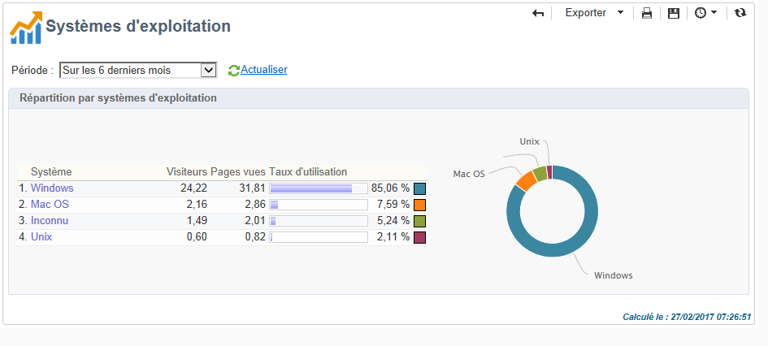
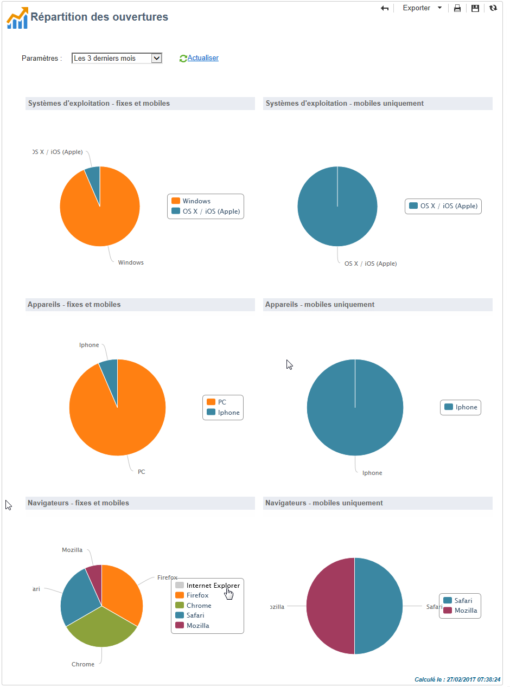

# Rapports globaux {#global-reports}

Ces rapports portent sur l&#39;activité de l&#39;ensemble des données de la base. Pour accéder au tableau de bord des rapports, positionnez-vous sur l&#39;onglet **[!UICONTROL Rapports]**.

Cliquez sur les noms des rapports pour les afficher. Par défaut, les rapports suivants sont disponibles :

>[!NOTE]
>
>Cette section présente uniquement les rapports liés aux diffusions.

* **[!UICONTROL Débit des diffusions]** : voir [Débit des diffusions](#delivery-throughput).
* **[!UICONTROL Navigateurs]** : voir [Navigateurs](#browsers).
* **[!UICONTROL Partage vers les réseaux sociaux]** : voir [Partage vers les réseaux sociaux](#sharing-to-social-networks).
* **[!UICONTROL Statistiques des activités de partage]** : voir [Statistiques des activités de partage](#statistics-on-sharing-activities).
* **[!UICONTROL Systèmes d&#39;exploitation]** : voir [Systèmes d’exploitation](#operating-systems).
* **[!UICONTROL URL et flux de clics]** : voir [URL et flux de clics](../../reporting/using/delivery-reports.md#urls-and-click-streams).
* **[!UICONTROL Indicateurs de tracking]** : voir [Indicateurs de tracking](../../reporting/using/delivery-reports.md#tracking-indicators).
* **[!UICONTROL Echecs et retours]** : [Echecs et retours](#non-deliverables-and-bounces).
* **[!UICONTROL Activités utilisateurs]** : voir [Activités utilisateurs](#user-activities).
* **[!UICONTROL Suivi des abonnements]** : voir [Suivi des abonnements](#subscription-tracking).
* **[!UICONTROL Synthèse des diffusions]** : voir [Synthèse des diffusions](../../reporting/using/delivery-reports.md#delivery-summary).
* **[!UICONTROL Statistiques de diffusion]**: voir [Statistiques de diffusion](#delivery-statistics).
* **[!UICONTROL Répartition des ouvertures]** : voir [Répartition des ouvertures](#breakdown-of-opens).

## Débit des diffusions {#delivery-throughput}

Ce rapport contient les informations relatives au débit de diffusion de l&#39;ensemble de la plateforme sur une période donnée. Pour mesurer la vitesse de diffusion des messages, les critères sont le nombre de messages diffusés par heure et la taille des messages, en bits par seconde. Dans l&#39;exemple ci-dessous, le premier graphique indique, en bleu, les diffusions envoyées avec succès et, en orange, le nombre de messages en erreur.

Vous pouvez paramétrer l&#39;affichage des valeurs en sélectionnant le périmètre de la vue : 1 heure, 3 heures, 24 heures, etc. Cliquez sur le lien **[!UICONTROL Actualiser]** pour valider votre choix.

>[!NOTE]
>
>Si votre instance est hébergée sur AWS, vous pouvez également surveiller le nombre de diffusions envoyées par heure à l’aide du [Panneau de contrôle](https://experienceleague.adobe.com/docs/control-panel/using/sftp-management/sftp-storage-management.html?lang=fr) Campaign Classic. Pour vérifier si votre instance est hébergée sur AWS, suivez les étapes présentées sur [cette page](https://experienceleague.adobe.com/docs/control-panel/using/faq.html?lang=fr).
>
>Le Panneau de contrôle est accessible à tous les utilisateurs administrateurs. Les étapes permettant d&#39;octroyer un accès administrateur à un utilisateur sont présentées sur [cette page](https://experienceleague.adobe.com/docs/control-panel/using/discover-control-panel/managing-permissions.html?lang=fr#discover-control-panel).
>
>Notez que votre instance doit être mise à niveau avec le dernier build [Gold Standard](../../rn/using/gold-standard.md) ou le dernier build [GA (21.1.3)](../../rn/using/latest-release.md). Découvrez comment vérifier votre version dans [cette section](../../platform/using/launching-adobe-campaign.md#getting-your-campaign-version).

## Activités utilisateurs {#user-activities}

Ce rapport présente la répartition des ouvertures, clics et transactions, par demi-heure, par heure ou par jour, sous la forme d&#39;un graphique.

Les options disponibles sont les suivantes :

* **[!UICONTROL Ouvertures]** : Nombre total de messages ouverts. Les emails au format texte ne sont pas pris en compte. Pour plus d&#39;informations sur le tracking des ouvertures, consultez la section [Tracking des ouvertures](../../reporting/using/indicator-calculation.md#tracking-opens-).
* **[!UICONTROL Clics]** : Nombre total de clics sur les liens des diffusions. Les clics sur les liens de désinscription et de page miroir ne sont pas pris en compte.
* **[!UICONTROL Transactions]** : nombre total de transactions suite à la réception d&#39;un message. Pour qu&#39;une transaction soit comptabilisée, une balise de webtracking de type transaction doit être insérée sur la page web correspondante. Le paramétrage du webtracking est présenté dans [cette section](../../configuration/using/about-web-tracking.md).

## Échecs et bounces {#non-deliverables-and-bounces}

Ce rapport présente la répartition des messages en échec et la répartition des échecs par domaine Internet.

Le **[!UICONTROL Nombre de messages traités]** représente le nombre total de messages traités par le serveur de diffusion. Cette valeur est inférieure au nombre de messages à diffuser lorsque certaines diffusions ont été stoppées ou mises en pause (avant d&#39;être traitées par le serveur).

**[!UICONTROL Répartition des erreurs par type]**

>[!NOTE]
>
>Les erreurs présentées dans ce rapport enclenchent le mécanisme de mise en quarantaine. Pour plus d&#39;information sur la gestion des quarantaines, consultez la section [Gestion des quarantaines](../../delivery/using/understanding-quarantine-management.md).

La première partie de ce rapport présente la répartition des messages en échec sous la forme d&#39;un tableau de valeurs et d&#39;un graphique.

A chaque type d&#39;erreur, est associé :

* le nombre de messages en erreur de ce type,
* le pourcentage du nombre de messages en erreur de ce type par rapport au nombre total de messages en erreur,
* le pourcentage du nombre de messages en erreur de ce type par rapport au nombre total de messages traités.

Les indicateurs utilisés sont les suivants :

* **[!UICONTROL Utilisateur inconnu]** : Type d&#39;erreur générée lors de l&#39;envoi d&#39;une diffusion indiquant que l&#39;adresse email est invalide.
* **[!UICONTROL Domaine invalide]** : Type d&#39;erreur générée lors de l&#39;envoi d&#39;une diffusion indiquant que le domaine de l&#39;adresse email est erroné ou n&#39;existe plus.
* **[!UICONTROL Boîte pleine]** : Type d&#39;erreur générée, après cinq tentatives d&#39;envoi d&#39;une diffusion, indiquant que la boîte de messagerie du destinataire contient trop de messages.
* **[!UICONTROL Compte désactivé]** : Type d&#39;erreur générée lors de l&#39;envoi d&#39;une diffusion indiquant que l&#39;adresse n&#39;existe plus.
* **[!UICONTROL Refusé]** : Type d&#39;erreur générée lorsqu&#39;une adresse est refusée par le FAI (Fournisseur d&#39;Accès Internet) suite, par exemple, à l&#39;application d&#39;une règle de sécurité (logiciel anti-spams).
* **[!UICONTROL Inatteignable]** : Type d&#39;erreur survenue dans la chaîne de distribution du message : incident sur le relais SMTP, domaine temporairement inatteignable, etc.
* **[!UICONTROL Non connecté]** : Type d&#39;erreur indiquant que le téléphone portable du destinataire est éteint ou n&#39;est pas connecté au réseau au moment de l&#39;envoi du message.

  >[!NOTE]
  >
  >Cet indicateur ne concerne que les diffusions sur les canaux mobiles. Voir à ce sujet [cette section](../../delivery/using/sms-channel.md).

  Vous pouvez déplier chaque ligne du tableau de valeurs en cliquant sur le symbole `[+]` correspondant. Cela permet d’afficher, pour chaque type d’erreur, la répartition des messages d’erreur, par domaine.

  

**[!UICONTROL Répartition des erreurs par domaine]**

La seconde partie de ce rapport présente la répartition des échecs par domaine Internet sous la forme d&#39;un tableau de valeurs et d&#39;un graphique.

A chaque nom de domaine, est associé :

* le nombre de messages en erreur sur ce domaine,
* le pourcentage du nombre de messages en erreur sur ce domaine par rapport au nombre total de messages traités sur ce domaine.
* le pourcentage du nombre de messages en erreur sur ce domaine par rapport au nombre total de messages en erreur,

Vous pouvez déplier chaque ligne du tableau de valeurs en cliquant sur le symbole [+] correspondant. Cela permet d&#39;afficher, pour chaque type d&#39;erreur, la répartition des messages d’erreur, par domaine.

>[!NOTE]
>
>Les noms de domaine qui apparaissent dans ce rapport sont définis au niveau des cubes. Vous pouvez modifier ces valeurs en éditant le cube **[!UICONTROL Logs de diffusion (broadlogrcp)]**. Voir à ce sujet [cette section](../../reporting/using/ac-cubes.md). La catégorie **[!UICONTROL Autres]** regroupe les noms de domaine qui n&#39;appartiennent à aucune classe.

## Navigateurs {#browsers}

Ce rapport présente la répartition entre les navigateurs internet utilisés par les destinataires des diffusions, pour la période sélectionnée.

>[!NOTE]
>
>Les valeurs affichées dans ce rapport sont des estimations. En effet, les destinataires des diffusions ne sont pas tous pris en compte. Seuls les destinataires ayant cliqué dans une diffusion sont comptabilisés.

**Statistiques globales**

Les statistiques globales d&#39;utilisation des navigateurs sont présentées sous la forme d&#39;un tableau de valeurs et d&#39;un graphique.

Les indicateurs utilisés sont les suivants :

* **[!UICONTROL Visiteurs]** : Nombre total de destinataires ciblés, par navigateur Internet, ayant cliqué au moins une fois dans une même diffusion.
* **[!UICONTROL Pages vues]** : Nombre total de clics sur les liens des diffusions, par navigateur Internet, dans l&#39;ensemble des diffusions.
* **[!UICONTROL Taux d&#39;utilisation]** : Ce taux représente la répartition des visiteurs, par navigateur Internet, par rapport au nombre total de visiteurs.

**Statistiques par navigateur**

Dans le tableau de valeurs des statistiques globales, vous pouvez cliquer sur le nom de chaque navigateur afin de visualiser les statistiques d&#39;utilisation correspondantes.

Les statistiques sont présentées sous la forme d&#39;une courbe, d&#39;un graphique et d&#39;un tableau de valeurs.

La courbe **[!UICONTROL Historique]** représente le taux de fréquentation, par jour, de ce navigateur. Ce taux est le ratio du nombre de visiteurs par jour, sur ce navigateur, par rapport au nombre de visiteurs mesuré le jour le plus fréquenté.

Le graphique **[!UICONTROL Répartition par version]** représente la répartition des visiteurs, par version, par rapport au nombre total de visiteurs sur ce navigateur.

Le tableau de valeurs utilise les indicateurs suivants :

* **[!UICONTROL Taux global]** : Ce taux représente la répartition des visiteurs, par version, par rapport au nombre total de visiteurs sur l&#39;ensemble des navigateurs.
* **[!UICONTROL Taux relatif]** : Ce taux représente la répartition des visiteurs, par version, par rapport au nombre total de visiteurs sur ce navigateur.

### Partage vers les réseaux sociaux {#sharing-to-social-networks}

Le marketing viral permet aux destinataires de vos diffusions de partager l&#39;information avec leur réseau de contacts : ils peuvent ajouter un lien vers leur profil (Facebook, X, anciennement connu sous le nom de Twitter, etc.) ou envoyer un message à un ami. Chaque partage et chaque accès aux informations partagées sont suivis dans la diffusion. Pour plus d&#39;informations sur le marketing viral, consultez [cette section](../../delivery/using/viral-and-social-marketing.md).

Ce rapport présente la répartition des messages partagés et ouverts par réseau social (Facebook, X, etc.) et/ou par email.

**[!UICONTROL Statistiques d&#39;envoi par mail]**

Dans les statistiques d&#39;envoi par mail, deux valeurs sont affichées :

* **[!UICONTROL Nombre de messages à diffuser]** : Nombre total de messages traités lors de l&#39;analyse de la diffusion.
* **[!UICONTROL Nombre d&#39;envois réussis]** : Nombre de messages traités avec succès.

**[!UICONTROL Statistiques des partages et ouvertures du mail]**

Le tableau central présente les statistiques de partage et d&#39;ouverture du mail.

Dans la colonne **[!UICONTROL Partages]**, les indicateurs sont les suivants :

* **[!UICONTROL Nb partages]** : Nombre total de messages partagés, sur chaque réseau social. Cette valeur correspond au nombre total de clics effectués sur l&#39;icône correspondante du bloc de personnalisation **[!UICONTROL Liens de partage vers réseaux sociaux]**.
* **[!UICONTROL Répartition]** : Taux représentant la répartition des partages, par réseau social, par rapport au nombre total de partages.
* **[!UICONTROL Taux de partage]** : Ce taux représente la répartition des partages, par réseau social, par rapport au nombre de messages à diffuser.

Dans la colonne **[!UICONTROL Ouvertures]**, les indicateurs sont les suivants :

* **[!UICONTROL Nb ouvertures]** : Nombre total de messages ouverts par les personnes à qui le message a été transféré (via le bloc de personnalisation **[!UICONTROL Liens de partage vers réseaux sociaux]**). Cette valeur correspond au nombre de fois où la page miroir a été affichée. Les messages ouverts par les destinataires cibles de la diffusion ne sont pas pris en compte dans cette valeur.
* **[!UICONTROL Répartition]** : Ce taux représente la répartition des ouvertures, par réseau social, par rapport au nombre total d&#39;ouvertures.
* **[!UICONTROL Taux d&#39;ouverture]** : Ce taux représente la répartition des ouvertures, par réseau social, par rapport au nombre total de partages.

**[!UICONTROL Répartition des partages et ouvertures]**

Cette section comporte deux graphiques représentant la répartition des partages et ouvertures, par réseau social.

## Statistiques des activités de partage {#statistics-on-sharing-activities}

Ce rapport présente l’évolution des partages vers les réseaux sociaux (Facebook, X, anciennement connu sous le nom de Twitter, email, etc.) dans le temps.

Pour plus d&#39;informations sur le marketing viral, consultez [cette section](../../delivery/using/viral-and-social-marketing.md).

Les statistiques sont présentées sous la forme d&#39;un tableau de valeurs et d&#39;un graphique.

Les indicateurs utilisés sont les suivants :

* **[!UICONTROL Nouveaux contacts]** : Nombre de nouvelles inscriptions suite à la réception d&#39;un message partagé par email. Cette valeur correspond au nombre de personnes qui ont reçu un message partagé par email, qui ont cliqué sur le **[!UICONTROL Lien d&#39;inscription]** et qui ont rempli le formulaire d&#39;inscription.
* **[!UICONTROL Ouvertures]** : Nombre total de messages ouverts par les personnes à qui le message a été transféré (via le bloc de personnalisation **[!UICONTROL Liens de partage vers réseaux sociaux]**). Cette valeur correspond au nombre de fois où la page miroir a été affichée. Les messages ouverts par les destinataires cibles de la diffusion ne sont pas pris en compte dans cette valeur.
* **[!UICONTROL Partages]** : Nombre total de messages partagés sur les réseaux sociaux. Cette valeur correspond au nombre total de clics effectués sur l&#39;icône correspondante du bloc de personnalisation **[!UICONTROL Liens de partage vers réseaux sociaux]**.

## Systèmes d’exploitation {#operating-systems}

Ce rapport présente la répartition entre les systèmes d&#39;exploitation utilisés par les destinataires des diffusions, pour la période sélectionnée.

>[!NOTE]
>
>Les valeurs affichées dans ce rapport sont des estimations. En effet, les destinataires des diffusions ne sont pas tous pris en compte. Seuls les destinataires ayant cliqué dans une diffusion sont comptabilisés.

**Statistiques globales**

Les statistiques globales d&#39;utilisation des systèmes d&#39;exploitation sont présentées sous la forme d&#39;un tableau de valeurs et d&#39;un graphique.

Les indicateurs utilisés sont les suivants :

* **[!UICONTROL Visiteurs]** : Moyenne par jour du nombre total de destinataires ciblés, par système d&#39;exploitation, ayant cliqué au moins une fois dans une même diffusion.
* **[!UICONTROL Pages vues]** : Moyenne par jour du nombre total de clics sur les liens des diffusions, par système d&#39;exploitation, dans l&#39;ensemble des diffusions.
* **[!UICONTROL Taux d&#39;utilisation]** : Ce taux représente la répartition des visiteurs, par système d&#39;exploitation, par rapport au nombre total de visiteurs.

**Statistiques par système d&#39;exploitation**

Dans le tableau de valeurs des statistiques globales, vous pouvez cliquer sur le nom de chaque système d&#39;exploitation afin de visualiser les statistiques d&#39;utilisation correspondantes.

Les statistiques sont présentées sous la forme d&#39;une courbe, d&#39;un graphique et d&#39;un tableau de valeurs.

La courbe **[!UICONTROL Historique]** représente le taux d&#39;utilisation, par jour, de ce système d&#39;exploitation. Ce taux est le ratio du nombre de visiteurs par jour, sur ce système d&#39;exploitation, par rapport au nombre de visiteurs mesuré le jour le plus fréquenté.

Le graphique **[!UICONTROL Répartition par version]** représente la répartition des visiteurs, par version, par rapport au nombre total de visiteurs sur ce système d&#39;exploitation.

Le tableau de valeurs utilise les indicateurs suivants :

* **[!UICONTROL Taux global]** : Ce taux représente la répartition des visiteurs, par version, par rapport au nombre total de visiteurs sur l&#39;ensemble des systèmes d&#39;exploitation.
* **[!UICONTROL Taux relatif]** : Ce taux représente la répartition des visiteurs, par version, par rapport au nombre total de visiteurs sur ce système d&#39;exploitation.

## Tracking des abonnements {#subscription-tracking}

Ce rapport permet d&#39;assurer le suivi des abonnements aux services d&#39;information. Il présente les inscriptions et désinscriptions.

Il peut être affiché pour un abonnement particulier en cliquant sur **[!UICONTROL Profils et Cibles > Services et Abonnements]** à partir de l&#39;écran d&#39;accueil ou de l&#39;explorateur. Sélectionnez l&#39;abonnement visé et cliquez sur l&#39;onglet **[!UICONTROL Rapports]**. Par défaut, le rapport **[!UICONTROL Tracking des abonnements]** est disponible. Il permet de consulter l&#39;évolution des inscriptions et désinscriptions ainsi que le taux de fidélité sur une période. La représentation de ces données peut être paramétrée à partir de la liste déroulante. Cliquez sur le bouton **[!UICONTROL Actualiser]** pour valider le paramétrage sélectionné.

Voir à ce propos [cette page](../../delivery/using/managing-subscriptions.md).

Le **[!UICONTROL Nombre d&#39;inscrits à ce jour]** représente le nombre total d&#39;abonnés à ce jour.

**[!UICONTROL Evolution globale des inscriptions]**

Le tableau de valeurs utilise les indicateurs suivants :

* **[!UICONTROL Inscrits]** : Nombre total d&#39;abonnés sur la période correspondante.
* **[!UICONTROL Inscriptions]** : Nombre d&#39;abonnements sur la période correspondante.
* **[!UICONTROL Désinscriptions]** : Nombre de désabonnements sur la période correspondante.
* **[!UICONTROL Evolution]** : Nombre de désabonnements soustrait au nombre d&#39;abonnements. Le taux associé est calculé par rapport au nombre total d&#39;abonnés.
* **[!UICONTROL Fidélité]** : Taux de fidélité des abonnés sur la période correspondante.

**[!UICONTROL Courbes d&#39;évolution des inscriptions]**

Ce graphique représente l&#39;évolution dans le temps des inscriptions et désinscriptions, sur la période sélectionnée.

## Statistiques de diffusion {#delivery-statistics}

Ce rapport présente la répartition, par domaine Internet, des messages traités et envoyés, des erreurs hard et soft, des ouvertures, des clics et des désinscriptions.

Les indicateurs utilisés sont les suivants :

* **[!UICONTROL Emails traités]** : Nombre total de messages traités par le serveur de diffusion.
* **[!UICONTROL Délivrés]** : Pourcentage du nombre de messages traités avec succès, par rapport au nombre total de messages traités.
* **[!UICONTROL Erreurs hard]** : Pourcentage du nombre d&#39;erreurs &quot;hard&quot;, par rapport au nombre total de messages traités.
* **[!UICONTROL Erreurs soft]** : Pourcentage du nombre d&#39;erreurs &quot;soft&quot;, par rapport au nombre total de messages traités.

  >[!NOTE]
  >
  >Pour plus d&#39;informations sur les hard et soft bounces, consultez la section [Gestion des quarantaines](../../delivery/using/understanding-quarantine-management.md).

* **[!UICONTROL Ouvertures]** : pourcentage du nombre de destinataires ciblés distincts ayant ouvert au moins une fois un même message, par rapport au nombre de messages traités avec succès.
* **[!UICONTROL Clics]** : Pourcentage du nombre de personnes distinctes ayant cliqué au moins une fois dans une même diffusion, par rapport au nombre de messages traités avec succès.
* **[!UICONTROL Désinscriptions]** : Pourcentage du nombre de clics effectués sur un lien de désinscription, par rapport au nombre de messages traités avec succès.

## Répartition des ouvertures {#breakdown-of-opens}

Ce rapport affiche la répartition des ouvertures par système d&#39;exploitation, par appareil, et par navigateur, sur la période sélectionnée. Pour chaque catégorie, deux graphiques sont utilisés. Le premier affiche les statistiques d&#39;ouvertures sur ordinateur et mobile. Le second affiche uniquement les statistiques d&#39;ouvertures sur mobiles.

Le nombre d&#39;ouvertures correspond au nombre total de messages ouverts. Les emails au format texte ne sont pas comptabilisés. Pour plus d&#39;informations sur le tracking des ouvertures, consultez la section [Tracking des ouvertures](../../reporting/using/indicator-calculation.md#tracking-opens-).

>[!NOTE]
>
>Les noms des navigateurs et des systèmes d&#39;exploitation font partie des informations envoyées par l&#39;agent utilisateur du navigateur vers lequel le message a été ouvert. Adobe Campaign détermine le type d&#39;appareil en utilisant ses informations sur l&#39;appareil.
