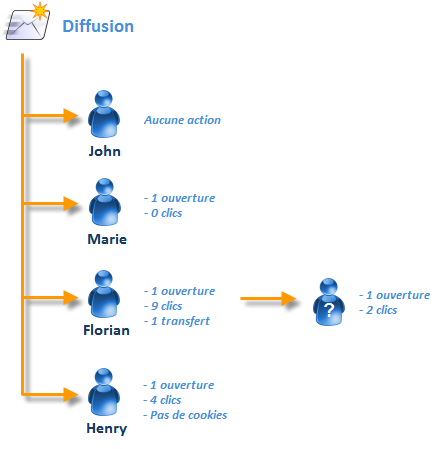

# Personnes et destinataires {#person-people-and-recipients}

Cet exemple va vous permettre de comprendre la différence entre une personne et un destinataire dans Adobe Campaign. Nous allons envoyer une diffusion à plusieurs personnes afin de mettre en évidence, au travers d&#39;un cas concret, la distinction entre les personnes et les destinataires. Cela va également nous permettre de voir plus en détails la méthode de calcul des indicateurs suivants :

* **[!UICONTROL Clics]**
* **[!UICONTROL Clics distincts sur la population atteinte]**
* **[!UICONTROL Ouvertures distinctes sur la population atteinte]**
* **[!UICONTROL Estimation des transferts]**
* **[!UICONTROL Réactivité brute]**

>[!NOTE]
>
>Ces indicateurs sont utilisés dans le rapport relatif aux **[!UICONTROL Indicateurs de tracking]**. Pour plus d&#39;informations, consultez la section [Indicateurs de tracking](../../reporting/using/delivery-reports.md#tracking-indicators).

Trois liens sont ajoutés dans une diffusion. Celle-ci est envoyée à 4 destinataires :

* **[!UICONTROL John Davis]** : ce destinataire n&#39;ouvre pas l&#39;email (il ne clique donc sur aucun lien).
* **[!UICONTROL Marie Stuart]** : elle ouvre l&#39;email mais ne clique sur aucun lien.
* **[!UICONTROL Florian David]** : il ouvre l&#39;email et clique à 9 reprises sur les liens. Il transfert également l&#39;email à une personne qui l&#39;ouvre et clique 2 fois.
* **[!UICONTROL Henry Macdonald]** : ce destinataire a configuré son navigateur internet pour qu&#39;il n&#39;accepte aucun cookie. Il ouvre l&#39;email et clique à 4 reprises sur les liens.

Les logs de tracking suivants sont remontés :

Pour mieux comprendre le mécanisme de comptabilisation des personnes et des destinataires, nous allons analyser successivement les logs correspondant à chaque profil.

## Etape 1 : John {#step-1--john}

**[!UICONTROL John Davis]** n&#39;ouvre pas l&#39;email (il ne clique donc sur aucun lien).

Comme John n&#39;a ni ouvert ni cliqué dans l&#39;email, il n&#39;apparaît pas dans les logs.

**Calcul intermédiaire :**

|  | Destinataires ayant cliqué | Personnes ayant cliqué | Destinataires ayant ouvert |
|---|---|---|---|
| John | - | - | - |
| Total intermédiaire | 0 | 0 | 0 |

## Etape 2 : Marie {#step-2--marie}

**[!UICONTROL Marie Stuart]** ouvre l&#39;email mais ne clique sur aucun lien.

L&#39;ouverture de Marie apparait dans le log suivant :

L&#39;ouverture est attribuée à un destinataire, Marie. Adobe Campaign comptabilise donc un nouveau destinataire.

**Calcul intermédiaire :**

|  | Destinataires ayant cliqué | Personnes ayant cliqué | Destinataires ayant ouvert |
|---|---|---|---|
| John | - | - | - |
| Marie | - | - | +1 |
| Total intermédiaire | 0 | 0 | 1 |

## Etape 3 : Florian {#step-3--florian}

**[!UICONTROL Florian David]** ouvre l&#39;email et clique à 9 reprises sur les liens. Il transfert également l&#39;email à une personne qui l&#39;ouvre et clique 2 fois.

Les actions effectuées par Florian (une ouverture et 9 clics) apparaissent dans les logs suivants :

**Destinataires :** L&#39;ouverture et les clics sont attribués au même destinataire (Florian). Comme ce destinataire est différent du précédent (Marie), Adobe Campaign comptabilise un nouveau destinataire.

Personnes : comme le navigateur de ce destinataire accepte les cookies, nous observons que le même identifiant (UUID) est affecté à tous les logs de clics : **`fe37a503 [...]`**. Adobe Campaign interprète donc bien ces clics comme étant effectués par la même personne. Une nouvelle personne est donc comptabilisée. Une nouvelle personne est ajoutée au décompte.

**Calcul intermédiaire :**

|  | Destinataires ayant cliqué | Personnes ayant cliqué | Destinataires ayant ouvert |
|---|---|---|---|
| John | - | - | - |
| Marie | - | - | +1 |
| Florian | +1 | +1 | +1 |
| Total intermédiaire | 1 | 1 | 2 |

Les logs suivants correspondent à l&#39;ouverture et les 2 clics effectués par la personne à qui Florian a transféré l&#39;email :

**Destinataires :** Son ouverture et ses clics sont attribués au destinataire ayant transféré l&#39;email (Florian). Comme ce destinataire a déjà été comptabilisé, le nombre de destinataires reste le même.

**Personnes** : en ce qui concerne les clics, nous constatons que le même identifiant (UUID) est affecté à tous les journaux : **`9ab648f9 [...]`**. Cet identifiant n&#39;a pas encore été comptabilisé. Une nouvelle personne est donc ajoutée au décompte.

**Calcul intermédiaire :**

|  | Destinataires ayant cliqué | Personnes ayant cliqué | Destinataires ayant ouvert |
|---|---|---|---|
| John | - | - | - |
| Marie | - | - | +1 |
| Florian | +1 | +1 | +1 |
| Personne inconnue | - | +1 | - |
| Total intermédiaire | 1 | 2 | 2 |

## Etape 4 : Henry {#step-4--henry}

**[!UICONTROL Henry Macdonald]** a configuré son navigateur internet pour qu&#39;il n&#39;accepte aucun cookie. Il ouvre l&#39;email et clique à 4 reprises sur les liens.

L&#39;ouverture et les 4 clics effectués par Henry apparaissent dans les logs suivants :

**Destinataires :** L&#39;ouverture et les clics sont attribués au même destinataire (Henry). Comme ce destinataire n&#39;a pas encore été comptabilisé, Adobe Campaign ajoute un destinataire.

**Personnes :** Comme le navigateur d&#39;Henry n&#39;accepte pas les cookies, un nouvel identifiant (UUID) est généré à chaque clic. Chacun de ses quatre clics est interprété comme étant effectué par une nouvelle personne. Ces identifiants n&#39;ayant pas encore été comptabilisés, quatre nouvelles personnes sont donc ajoutées.

**Calcul intermédiaire :**

|  | Destinataires ayant cliqué | Personnes ayant cliqué | Destinataires ayant ouvert |
|---|---|---|---|
| John | - | - | - |
| Marie | - | - | +1 |
| Florian | +1 | +1 | +1 |
| Personne inconnue | - | +1 | - |
| Henry | +1 | +4 | +1 |
| Total intermédiaire | 2 | 6 | 3 |

## Synthèse {#summary}

Au niveau de la diffusion, les résultats sont donc les suivants :

* **[!UICONTROL Clics]** (destinataires ayant cliqué) : 2
* **[!UICONTROL Clics distincts sur la population atteinte]** (personnes ayant cliqué) : 6
* **[!UICONTROL Ouvertures distinctes sur la population atteinte]** (destinataires ayant ouvert) : 3

La réactivité brute et l&#39;estimation des transferts sont calculées de la manière suivante :

* **[!UICONTROL Estimation des transferts]** = **B - A** (donc 6 - 2 = 4)
* **[!UICONTROL Réactivité brute]** = **A / C** (donc 2 / 3 = 66,67 %)

>[!NOTE]
>
>Dans les formules ci-dessus :
>
>* A représente l&#39;indicateur **[!UICONTROL Clics]** (destinataires ayant cliqués).
>* B représente l&#39;indicateur **[!UICONTROL Clics distincts sur la population atteinte]** (personnes ayant cliqué).
>* C représente l&#39;indicateur **[!UICONTROL Ouvertures distinctes sur la population atteinte]** (destinataires ayant ouvert).

