# Utilisation dʼun rapport dʼanalyse{#processing-a-report}

## Sauvegarder un rapport d&#39;analyse {#saving-an-analysis-report}

Si vous bénéficiez des droits adéquats, vous pouvez sauvegarder un rapport d&#39;analyse créé depuis un modèle ou l&#39;exporter au format Excel, PDF et OpenDocument.

Pour sauvegarder votre rapport, cliquez sur **[!UICONTROL Enregistrer]** et appliquez un libellé à votre rapport.

Sélectionnez **[!UICONTROL Enregistrer aussi les données]** si vous souhaitez créer un historique de votre rapport et retrouver les valeurs du rapport au moment où vous le sauvegardez. Pour plus dʼinformations, consultez la section [Archivage des rapports dʼanalyse](#archiving-analysis-reports).

L&#39;option **[!UICONTROL Partager ce rapport]** rend le rapport accessible à d&#39;autres opérateurs.

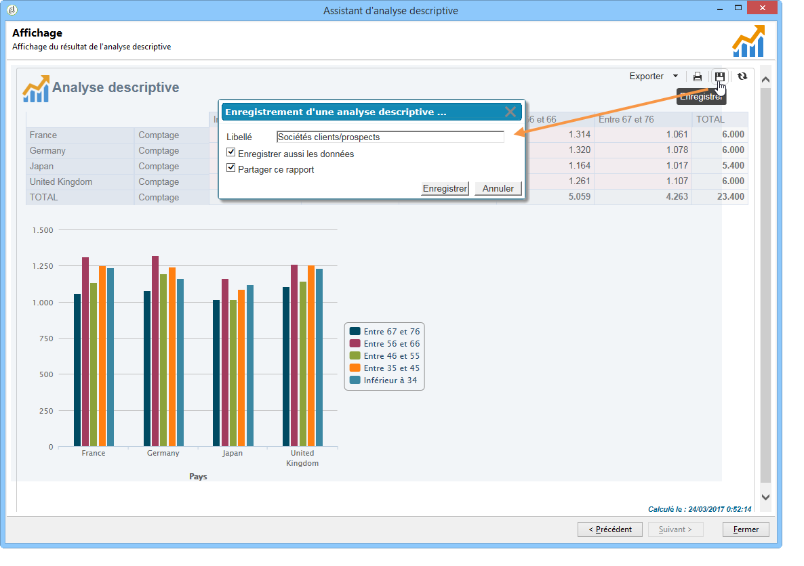

Une fois enregistré, ce rapport peut être réutilisé pour générer d&#39;autres rapports d&#39;analyse :

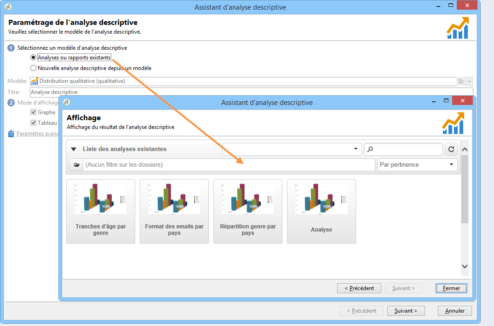

Pour modifier ce rapport, éditez le nœud **[!UICONTROL Administration > Paramétrage > Rapports]** de l’arborescence d’Adobe Campaign (ou le premier dossier de type « Rapports » sur lequel l’opérateur a des droits en écriture). Pour plus dʼinformations, consultez la section [Configuration de la mise en page dʼun rapport dʼanalyse descriptive](#configuring-the-layout-of-a-descriptive-analysis-report).

## Paramétrages additionnels d&#39;un rapport d&#39;analyse {#analysis-report-additional-settings}

Lorsqu&#39;un rapport d&#39;analyse descriptive a été enregistré, vous pouvez éditer ses propriétés et accéder à des options supplémentaires.

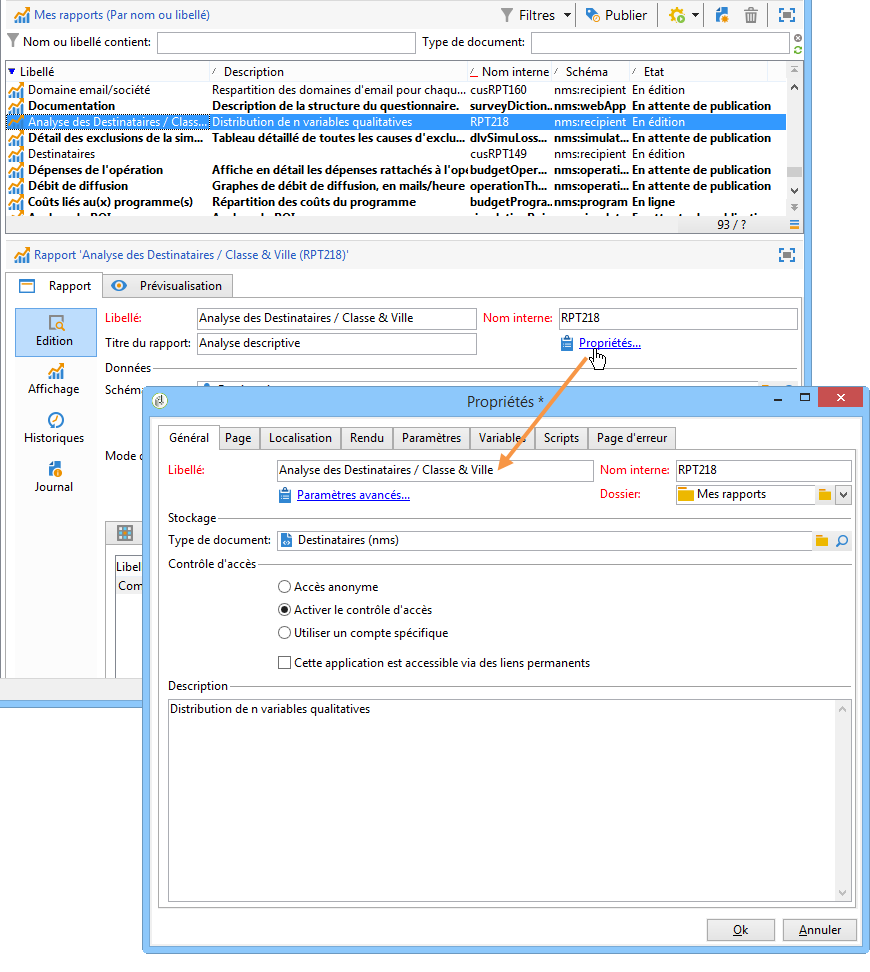

Ces options sont communes avec celles des rapports standards. Elles sont présentées dans [cette page](../../reporting/using/properties-of-the-report.md).

## Configuration de la mise en page dʼun rapport dʼanalyse descriptive {#configuring-the-layout-of-a-descriptive-analysis-report}

Vous pouvez personnaliser l&#39;affichage et la disposition de vos données dans les graphiques et les tableaux d&#39;analyse descriptive. Toutes les options sont disponibles depuis l&#39;arborescence d&#39;Adobe Campaign, dans l&#39;onglet **[!UICONTROL Edition]** de chaque rapport.

### Mode d&#39;affichage du rapport d&#39;analyse {#analysis-report-display-mode}

Lorsque vous créez un rapport selon le modèle de **[!UICONTROL distribution qualitative]**, les modes d&#39;affichage en tableau et en graphe sont sélectionnés par défaut. Si vous ne souhaitez travailler qu&#39;avec un seul mode d&#39;affichage, décochez la case correspondante. Dans ce cas, seul l&#39;onglet du mode d&#39;affichage conservé est disponible.

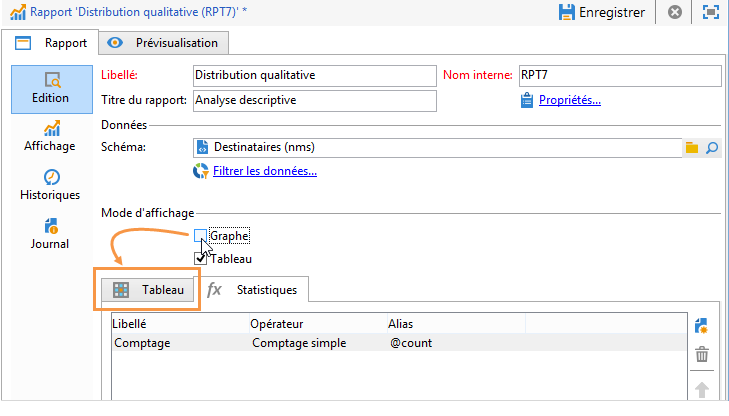

Si vous souhaitez modifier le schéma du rapport, cliquez sur **[!UICONTROL Choisir le lien]** et sélectionnez une autre table de la base de données.

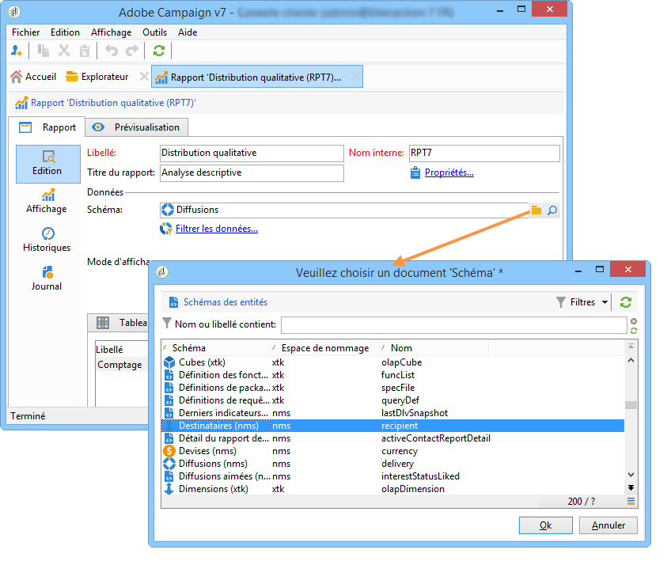

### Paramètres de l&#39;affichage du rapport d&#39;analyse {#analysis-report-display-settings}

Vous pouvez afficher ou masquer le nom des statistiques et sous-totaux, ainsi que choisir l&#39;orientation des statistiques.

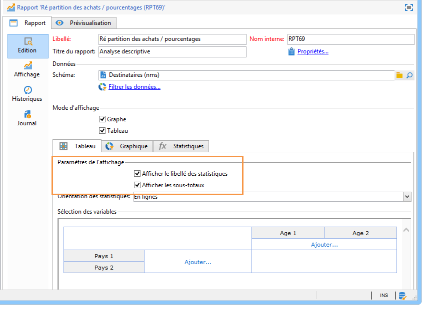

Lorsque vous créez des statistiques, vous avez la possibilité de personnaliser le libellé.

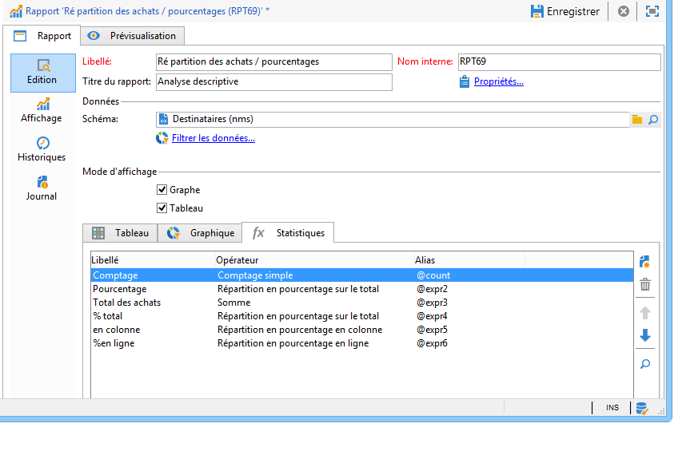

Le nom choisi apparaît dans le rapport.

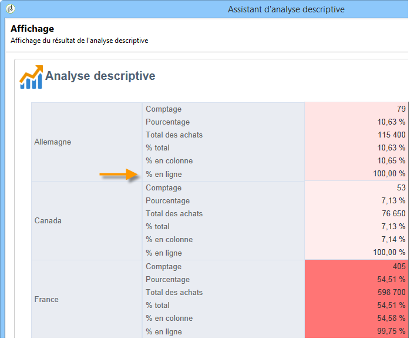

En revanche, si vous déselectionnez l&#39;option d&#39;affichage des libellés et des sous-totaux, ils n&#39;apparaîtront pas dans le rapport. Le nom apparaît toutefois dans une infobulle lorsque vous positionnez le curseur de la souris sur une cellule du tableau.

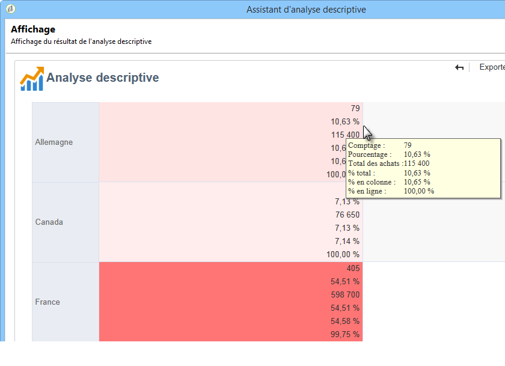

Par défaut les statistiques sont affichées en ligne. Pour modifier l&#39;orientation, sélectionnez l&#39;option adéquate dans la liste déroulante.

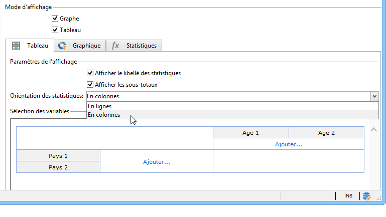

Dans l&#39;exemple ci-dessous, les statistiques sont affichées en colonnes :

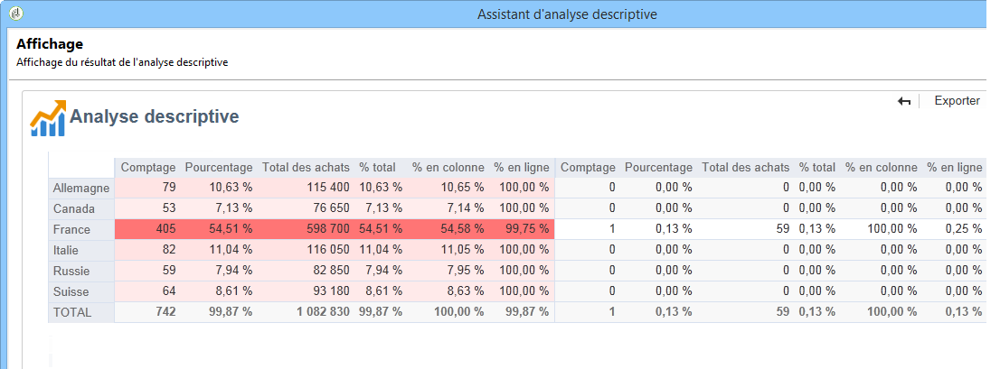

### Disposition des données dans un rapport d&#39;analyse {#analysis-report-data-layout}

Vous pouvez personnaliser la disposition des données directement dans les tableaux d&#39;analyse descriptive. Pour cela, cliquez avec le bouton droit de la souris sur la variable qui vous intéresse. Choisissez les options disponibles dans le menu contextuel :

* **[!UICONTROL Pivoter]** pour changer la variable sélectionnée d&#39;axe.
* **[!UICONTROL Monter]** / **[!UICONTROL Descendre]** pour intervertir les variables qui se trouvent en ligne.
* **[!UICONTROL Déplacer à droite]** / **[!UICONTROL Déplacer à gauche]** pour intervertir les variables qui se trouvent en colonne.
* **[!UICONTROL Tourner]** pour inverser les axes des variables.
* **[!UICONTROL Trier de A à Z]** pour trier les valeurs de la variable par ordre croissant.
* **[!UICONTROL Trier de Z à A]** pour trier les valeurs de la variable par ordre décroissant.

  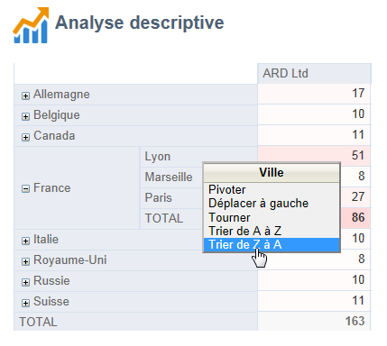

Pour revenir à l&#39;affichage initial, actualisez la vue.

### Options des graphiques des rapports d&#39;analyse {#analysis-report-chart-options}

Il est possible de personnaliser l&#39;affichage des données du graphique. Pour cela, cliquez sur le lien **[!UICONTROL Variables]** proposé à l&#39;étape de sélection du type de graphique.

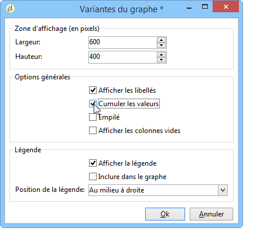

Les options disponibles sont les suivantes :

* La section supérieure de la fenêtre permet de modifier la zone d&#39;affichage du graphique.
* Par défaut, les libellés sont affichés dans le graphique. Vous pouvez les masquer en décochant l&#39;option **[!UICONTROL Afficher les valeurs]**.
* L&#39;option **[!UICONTROL Cumuler les valeurs]** permet d&#39;additionner les différentes valeurs retournées d&#39;une série à l&#39;autre.
* Vous pouvez choisir d&#39;afficher ou non la légende du graphe : pour ne pas afficher de légende, désélectionnez l&#39;option correspondante. Par défaut, la légende est affichée en haut à droite, à l&#39;extérieur du graphe.

  La légende peut également être affichée au-dessus du graphique afin d&#39;économiser de l&#39;espace. Pour cela, sélectionnez l&#39;option **[!UICONTROL Inclure dans le graphe]**

  Sélectionnez l&#39;alignement vertical et horizontal dans la liste déroulante **[!UICONTROL Position de la légende]**.

  

## Exportation dʼun rapport dʼanalyse {#exporting-an-analysis-report}

Pour exporter les données d&#39;un rapport d&#39;analyse, cliquez sur la liste déroulante et choisissez le format de sortie.

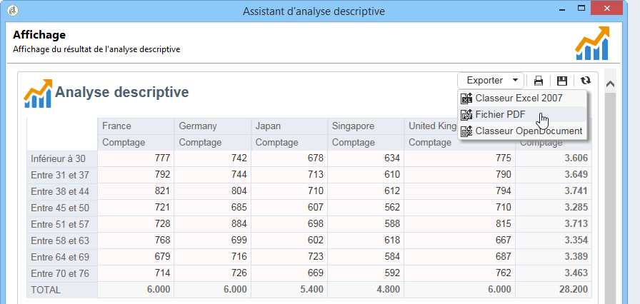

Voir à ce propos [cette page](../../reporting/using/actions-on-reports.md).

## Réutilisation des rapports et analyses existants {#re-using-existing-reports-and-analyses}

Vous pouvez créer des rapports d&#39;analyse descriptive sur les données à partir de rapports existants, déjà enregistrés dans Adobe Campaign. Ce mode d&#39;utilisation est possible lorsque des analyses ont été enregistrées ou lorsque des rapports ont été créés et paramétrés pour être accessibles depuis l&#39;assistant d&#39;analyse descriptive.

Pour découvrir comment enregistrer des analyses descriptives, consultez [Sauvegarder un rapport d’analyse](#saving-an-analysis-report).

Pour créer des rapports d&#39;analyse descriptive, l&#39;assistant d&#39;analyse descriptive doit être exécuté à partir d&#39;une transition de workflow ou depuis le menu **[!UICONTROL Outils > Analyse descriptive]**.

1. Sélectionnez **[!UICONTROL Analyses et rapports existants]** et cliquez sur **[!UICONTROL Suivant]**.
1. Vous accédez alors à la liste des rapports disponibles. Sélectionnez un rapport pour le générer.

   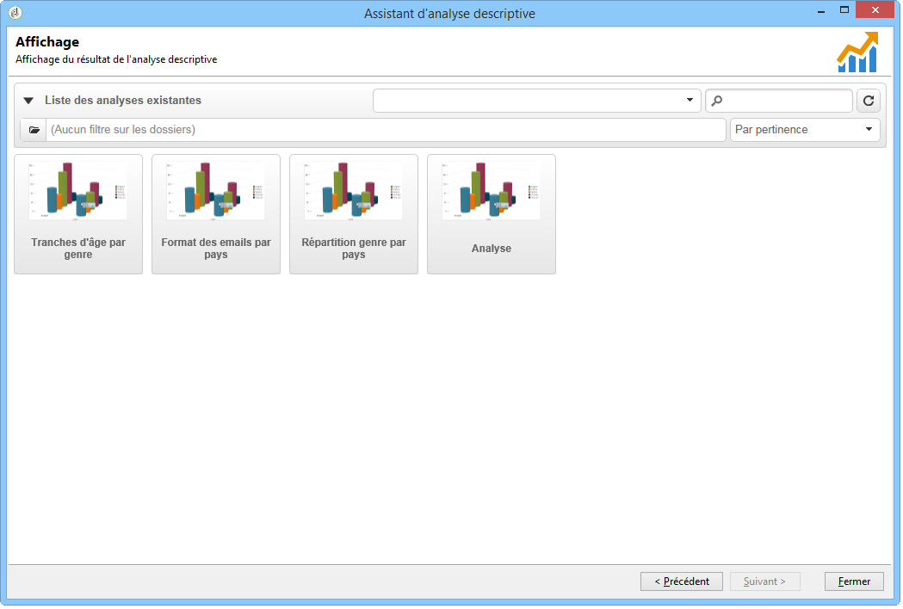

## Archivage des rapports d’analyse {#archiving-analysis-reports}

Lorsque vous créez une analyse descriptive à partir d&#39;une analyse existante, vous avez la possibilité de créer des historiques afin de sauvegarder les données d&#39;une analyse à l&#39;autre et comparer les résultats de vos rapports.

Pour créer un historique, les étapes sont les suivantes :

1. Ouvrez une analyse existante ou créez un nouveau rapport d&#39;analyse descriptive.
1. Dans la page d&#39;affichage du rapport, cliquez sur le bouton de création d&#39;un historique dans la barre d&#39;outils, et confirmer votre choix, comme dans l&#39;exemple ci-dessous :

   

1. Utilisez le bouton d&#39;accès aux historiques pour afficher les analyses antérieures.

   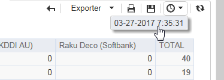
