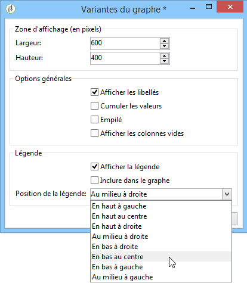
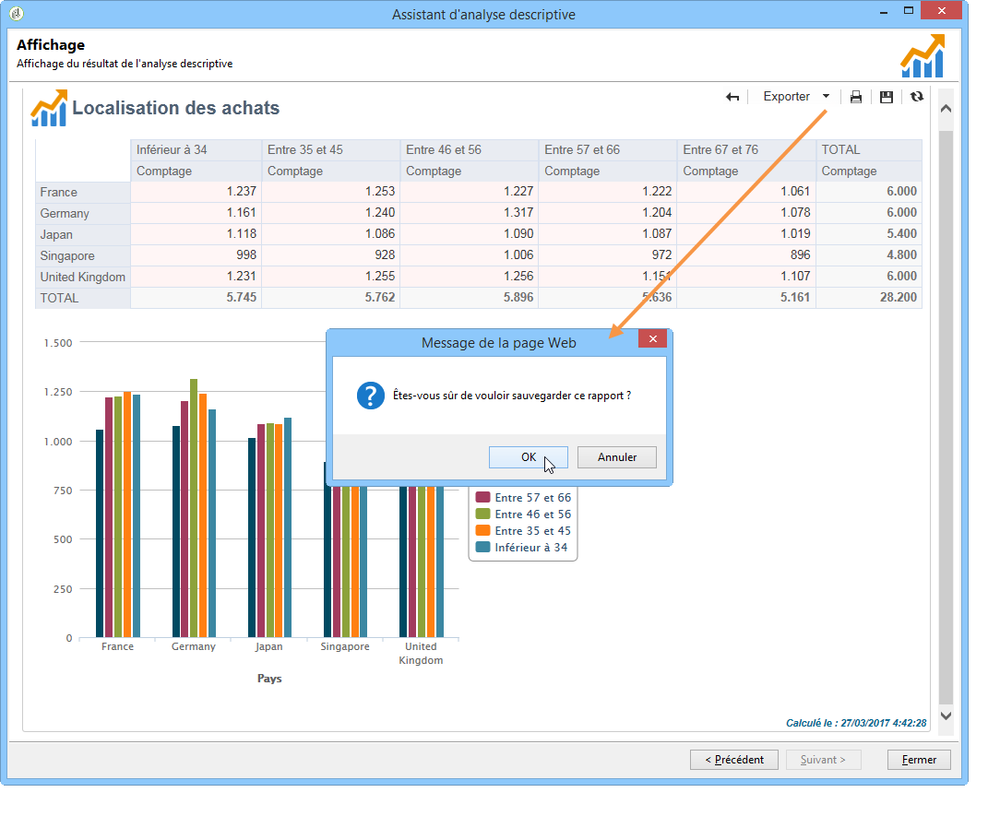

# Utilisation d’un rapport d’analyse{#processing-a-report}

## Sauvegarder un rapport d&#39;analyse {#saving-an-analysis-report}

Si vous bénéficiez des droits adéquats, vous pouvez sauvegarder un rapport d&#39;analyse créé depuis un modèle ou l&#39;exporter au format Excel, PDF et OpenDocument.

To save your report, click **[!UICONTROL Save]** and give your report a label.

Sélectionnez **[!UICONTROL Also save data]** si vous souhaitez créer un historique de votre rapport et voir les valeurs du rapport au moment de l&#39;enregistrement. For more on this, refer to [Archiving analysis reports](#archiving-analysis-reports).

Cette **[!UICONTROL Share this report]** option permet à d’autres opérateurs d’accéder au rapport.

Une fois enregistré, ce rapport peut être réutilisé pour générer d&#39;autres rapports d&#39;analyse :

Pour apporter des modifications à ce rapport, modifiez le **[!UICONTROL Administration > Configuration > Adobe Campaign tree reports]** noeud de l’arborescence Adobe Campaign (ou le premier dossier de type Rapports pour lequel l’opérateur dispose de droits de modification). Pour plus d’informations, reportez-vous à la section [Configuration de la mise en page d’un rapport](#configuring-the-layout-of-a-descriptive-analysis-report)d’analyse descriptive.

## Paramétrages additionnels d&#39;un rapport d&#39;analyse {#analysis-report-additional-settings}

Lorsqu&#39;un rapport d&#39;analyse descriptive a été enregistré, vous pouvez éditer ses propriétés et accéder à des options supplémentaires.

Ces options sont communes avec celles des rapports standards. Elles sont présentées dans [cette page](../../reporting/using/properties-of-the-report.md).

## Mettre en page un rapport d&#39;analyse descriptive {#configuring-the-layout-of-a-descriptive-analysis-report}

Vous pouvez personnaliser l’affichage et la disposition de vos données dans les graphiques et les tableaux de l’analyse descriptive. Toutes les options sont accessibles via l’arborescence Adobe Campaign, dans l’ **[!UICONTROL Edit]** onglet de chaque rapport.

### Mode d&#39;affichage du rapport d&#39;analyse {#analysis-report-display-mode}

Lorsque vous créez un rapport à l’aide du **[!UICONTROL qualitative distribution]** modèle, les modes d’affichage des tableaux et des graphiques sont sélectionnés par défaut. Si vous ne souhaitez qu’un seul mode d’affichage, décochez la case appropriée. Cela signifie que seul l’onglet du mode d’affichage coché sera disponible.

To change the schema of the report, click the **[!UICONTROL Select the link]** and select another table from the database.

### Paramètres de l&#39;affichage du rapport d&#39;analyse {#analysis-report-display-settings}

Vous pouvez afficher ou masquer le nom des statistiques et sous-totaux, ainsi que choisir l&#39;orientation des statistiques.

Lorsque vous créez des statistiques, vous avez la possibilité de personnaliser le libellé.

Le nom choisi apparaît dans le rapport.

En revanche, si vous déselectionnez l&#39;option d&#39;affichage des libellés et des sous-totaux, ils n&#39;apparaîtront pas dans le rapport. Le nom apparaît toutefois dans une infobulle lorsque vous positionnez le curseur de la souris sur une cellule du tableau.

Par défaut les statistiques sont affichées en ligne. Pour modifier l&#39;orientation, sélectionnez l&#39;option adéquate dans la liste déroulante.

Dans l&#39;exemple ci-dessous, les statistiques sont affichées en colonnes :

### Disposition des données dans un rapport d&#39;analyse {#analysis-report-data-layout}

Vous pouvez personnaliser la disposition des données directement dans les tableaux d&#39;analyse descriptive. Pour cela, cliquez avec le bouton droit de la souris sur la variable qui vous intéresse. Choisissez les options disponibles dans le menu contextuel :

* **[!UICONTROL Pivot]** pour modifier l’axe de la variable.
* **[!UICONTROL Up]** / **[!UICONTROL Down]** pour permuter les variables en lignes.
* **[!UICONTROL Move to the right]** / **[!UICONTROL Move to the left]** pour permuter les variables dans les colonnes.
* **[!UICONTROL Turn]** pour inverser les axes des variables.
* **[!UICONTROL Sort from A to Z]** pour trier les valeurs de variable de bas à haut.
* **[!UICONTROL Sort from Z to A]** pour trier les valeurs des variables de haut à bas.

   

Pour revenir à l&#39;affichage initial, actualisez la vue.

### Options des graphiques des rapports d&#39;analyse {#analysis-report-chart-options}

Il est possible de personnaliser l&#39;affichage des données dans le graphique. Pour ce faire, cliquez sur le **[!UICONTROL Variables...]** lien disponible pendant l’étape de sélection du type de graphique.

Les options disponibles sont les suivantes :

* La section supérieure de la fenêtre permet de modifier la zone d&#39;affichage du graphique.
* Par défaut, les libellés sont affichés dans le graphique. Vous pouvez les masquer en désactivant l’ **[!UICONTROL Show values]** option.
* The **[!UICONTROL Accumulate values]** option lets you add up values from one series to another.
* Vous pouvez choisir d&#39;afficher ou non la légende du graphe : pour ne pas afficher de légende, désélectionnez l&#39;option correspondante. Par défaut, la légende est affichée en haut à droite, à l&#39;extérieur du graphe.

   The legend can also be displayed on top of the chart in order to save on display space. To do this, select the option **[!UICONTROL Include in the chart]**

   Select the vertical and horizontal alignment in the **[!UICONTROL Caption position]** drop-down list.

   

## Exporter un rapport d&#39;analyse {#exporting-an-analysis-report}

Pour exporter les données d&#39;un rapport d&#39;analyse, cliquez sur la liste déroulante et choisissez le format de sortie.

Voir à ce propos [cette page](../../reporting/using/actions-on-reports.md).

## Ré-utiliser des analyses et rapports existants {#re-using-existing-reports-and-analyses}

Vous pouvez créer des rapports d&#39;analyse descriptive sur les données à partir de rapports existants, déjà enregistrés dans Adobe Campaign. Ce mode d&#39;utilisation est possible lorsque des analyses ont été enregistrées ou lorsque des rapports ont été créés et paramétrés pour être accessibles depuis l&#39;assistant d&#39;analyse descriptive.

Pour savoir comment enregistrer des analyses descriptives, consultez [Enregistrement d’un rapport](#saving-an-analysis-report)d’analyse.

To create descriptive analysis reports, the descriptive analysis wizard must be executed via a workflow transition or via the **[!UICONTROL Tools > Descriptive analysis]** menu.

1. Sélectionnez **[!UICONTROL Existing analyses and reports]** puis cliquez sur **[!UICONTROL Next]**.
1. Vous accédez alors à la liste des rapports disponibles. Sélectionnez un rapport pour le générer.

   

## Archiver les rapports d&#39;analyse {#archiving-analysis-reports}

Lorsque vous créez une analyse descriptive à partir d&#39;une analyse existante, vous avez la possibilité de créer des historiques afin de sauvegarder les données d&#39;une analyse à l&#39;autre et comparer les résultats de vos rapports.

Pour créer un historique, les étapes sont les suivantes :

1. Ouvrez une analyse existante ou créez un nouveau rapport d&#39;analyse descriptive.
1. Dans la page d&#39;affichage du rapport, cliquez sur le bouton de création d&#39;un historique dans la barre d&#39;outils, et confirmer votre choix, comme dans l&#39;exemple ci-dessous :

   

1. Utilisez le bouton d&#39;accès aux historiques pour afficher les analyses antérieures.

   

