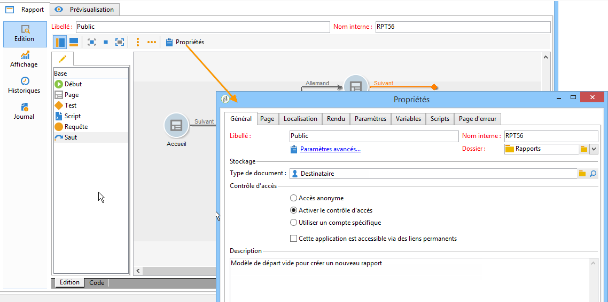
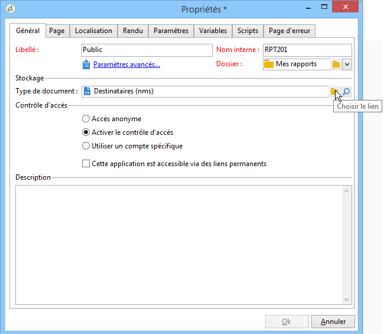
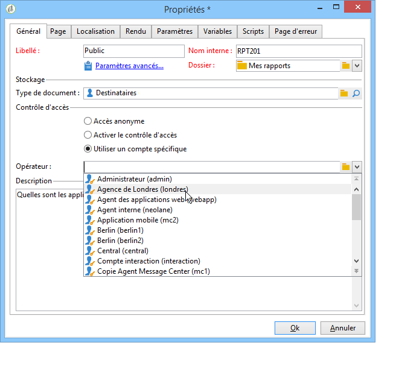
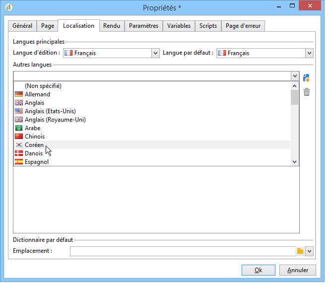
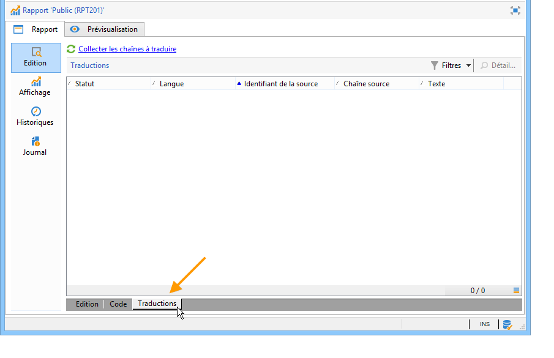
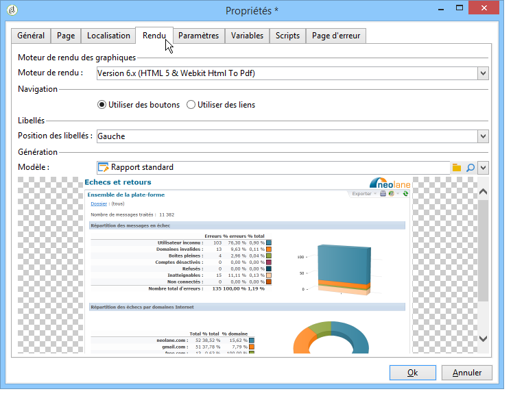
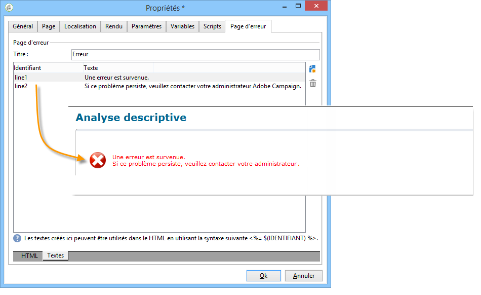

# Propriétés du rapport{#properties-of-the-report}

Vous pouvez entièrement personnaliser et configurer votre rapport en fonction de vos besoins. Pour ce faire, modifiez ses propriétés. Les propriétés du rapport sont accessibles via le bouton **[!UICONTROL Propriétés]** situé au-dessus du graphique de séquence d&#39;activités.

Les propriétés générales sont décrites ci-dessous. Les fonctionnalités avancées configurées dans les onglets **[!UICONTROL Paramètres]**, **[!UICONTROL Variables]** et **[!UICONTROL Scripts]** sont décrites [dans cette section.](../../reporting/using/advanced-functionalities.md)

## Propriétés générales {#overall-properties}

Dans l&#39;onglet **[!UICONTROL Général]** des propriétés du rapport, vous pouvez modifier les paramètres répertoriés ci-dessous :

* Le libellé et le nom interne du rapport. Le **[!UICONTROL nom interne]** est utilisé dans l&#39;URL finale du rapport. Il ne doit pas être modifié après la création du rapport.

* Le **dossier** du rapport est sélectionné lors de la création du rapport. Il est recommandé de créer un dossier dédié aux rapports personnalisés afin qu&#39;ils ne soient pas mélangés aux [rapports natifs](../../reporting/using/about-campaign-built-in-reports.md).

* L&#39;espace de **stockage** est sélectionné lors de la création du rapport. Pour modifier le tableau des données du rapport, cliquez sur l&#39;icône **[!UICONTROL Choisir le lien]** située à droite du champ **[!UICONTROL Type de document]**.

  

* Paramètres du **contrôle d&#39;accès**. Ces paramètres sont décrits ci-dessous.

## Contrôle de lʼaccès au rapport {#report-accessibility}

Il est possible d&#39;accéder à un rapport dans la console Adobe Campaign ou avec un navigateur web. Dans ce cas, il peut être nécessaire de configurer le contrôle d&#39;accès aux rapports comme illustré ci-dessous.

Les options possibles sont les suivantes :

* **[!UICONTROL Accès anonyme]** : cette option permet un accès illimité au rapport. Cependant, aucune manipulation n&#39;est possible.

  Les autorisations de l’opérateur technique « webapp » sont utilisées pour afficher les éléments du rapport. En savoir plus [dans cette section](../../platform/using/access-management-operators.md).

* **[!UICONTROL Contrôle d&#39;accès]** : cette option permet à un opérateur Adobe Campaign d&#39;y accéder, après connexion.
* **[!UICONTROL Compte spécifique]** : permet d&#39;exécuter le rapport avec les droits de l&#39;opérateur sélectionné dans le champ **[!UICONTROL Opérateur]**.

## Traduction de votre rapport {#report-localization}

Vous pouvez configurer les langues dans lesquelles vous souhaitez que le rapport soit traduit. Pour ce faire, cliquez sur le bouton **[!UICONTROL Localisation]** .

La langue d&#39;édition correspond à la langue dans laquelle vous rédigez. Lorsque vous ajoutez une langue, un sous-onglet apparaît dans la page d&#39;édition du rapport.

>[!NOTE]
>
>Pour en savoir plus sur la localisation des pages web dans Campaign, consultez [cette section](../../web/using/translating-a-web-form.md).

## Personnalisation du rendu HTML {#personalizing-html-rendering}

Dans l&#39;onglet **[!UICONTROL Rendu]**, vous pouvez personnaliser le mode d&#39;affichage des données dans la page. Ainsi, vous pouvez sélectionner :

* Le type de navigation dans le rapport : via des boutons ou des liens.
* La position par défaut des libellés des éléments du rapport. Cette position peut être surchargée au niveau de chaque élément.
* Le modèle, ou thème, utilisé pour la génération des pages du rapport.

## Personnaliser la page d&#39;erreur {#personalizing-the-error-page}

Dans l&#39;onglet **[!UICONTROL Page d&#39;erreur]**, vous pouvez paramétrer le message qui doit apparaître en cas d&#39;erreur lors de l&#39;affichage du rapport.

Vous pouvez définir des textes et les associer à des identifiants afin de gérer la localisation du rapport. Pour plus d&#39;informations, voir la section [Ajouter un en-tête et un pied de page](../../reporting/using/element-layout.md#adding-a-header-and-a-footer).

