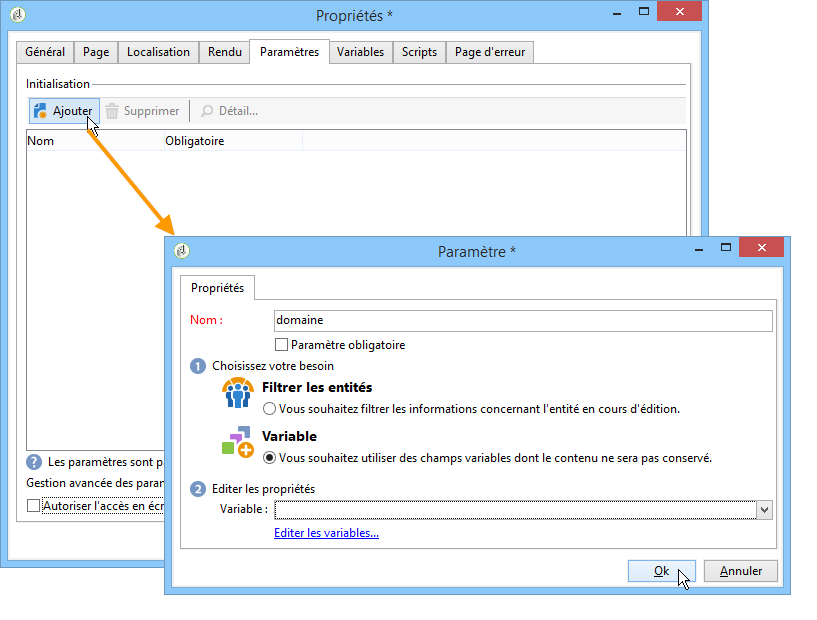
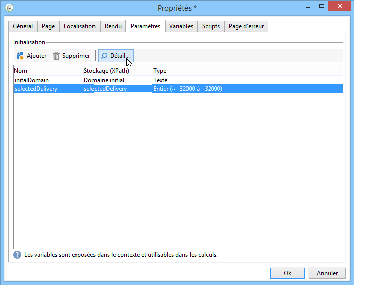

# Propriétés du rapport{#properties-of-the-report}

## Présentation {#overview}

Vous pouvez entièrement personnaliser et paramétrer votre rapport en fonction de vos besoins. Pour cela, éditez ses propriétés. Les propriétés des rapports sont accessibles à partir du bouton Propriété situé au-dessus du diagramme d&#39;enchaînement des activités.

## Propriétés générales {#overall-properties}

L&#39;onglet **[!UICONTROL Général]** vous permet de consulter ou modifier le libellé et le schéma sur lesquel porte le rapport. Ces éléments sont renseignés lors de la création du rapport.

Il est en revanche fortement déconseillé de modifier le **[!UICONTROL Nom interne]** : celui-ci est utilisé dans l&#39;URL d&#39;accès au rapport.

Le modèle de rapport est choisi lors de la création du rapport et ne peut pas être modifié par la suite.

Pour changer la table sur laquelle porte le rapport, cliquez sur l&#39;icône **[!UICONTROL Choisir le lien]** située à droite du champ **[!UICONTROL Type de document]**. Pour consulter les champs disponibles dans la table sélectionnée, cliquez sur l&#39;icône **[!UICONTROL Loupe]**.

## Accessibilité du rapport {#report-accessibility}

Un rapport peut être accessible en dehors de la console Adobe Campaign, par exemple depuis un navigateur Web. Dans ces cas, il peut être nécessaire de paramétrer le contrôle d&#39;accès au rapport comme illustré ci-dessous.

Le principe général est le suivant :

* L&#39;option **[!UICONTROL Accès anonyme]** permet à tout le monde d&#39;accéder au rapport. Toutefois, aucune manipulation n&#39;est possible.

   Ce sont les droits de l&#39;opérateur des rapports par défaut (&#39;webapp&#39;) qui sont utilisés pour afficher les éléments du rapport.

* L&#39;option **[!UICONTROL Contrôle d&#39;accès]** permet à un opérateur Adobe Campaign d&#39;y accéder, après connexion.
* L&#39;option **[!UICONTROL Compte spécifique]** permet d&#39;exécuter le rapport avec les droits de l&#39;opérateur sélectionné dans le champ **[!UICONTROL Opérateur]**.

Les propriétés d&#39;un formulaire web sont présentés dans [cette page](../../web/using/about-web-forms.md).

## Gérer la localisation du rapport {#managing-report-localization}

Vous pouvez paramétrer les langues dans lesquelles vous souhaitez que le rapport soit traduit. Pour cela, cliquez sur l&#39;onglet **[!UICONTROL Localisation]**.

La langue d&#39;édition correspond à la langue dans laquelle vous rédigez. Lorsque vous ajoutez une langue, un sous-onglet apparaît dans la page d&#39;édition du rapport.

>[!NOTE]
>
>Reportez-vous à la section correspondante de [cette section](../../web/using/translating-a-web-form.md) pour plus d&#39;informations.

## Personnaliser le rendu HTML {#personalizing-html-rendering}

Dans l&#39;onglet **[!UICONTROL Rendu]**, vous pouvez personnaliser le mode d&#39;affichage des données dans la page. Ainsi, vous pouvez sélectionner :

* Le moteur de rendu des graphiques : Adobe Campaign propose deux modes distincts pour générer le rendu des graphiques. Par défaut, le moteur de rendu est HTML 5. Au besoin, vous pouvez choisir un rendu Flash.
* Le type de navigation dans le rapport : via des boutons ou des liens.
* La position par défaut des libellés des éléments du rapport. Cette position peut être surchargée au niveau de chaque élément.
* Le modèle, ou thème, utilisé pour la génération des pages du rapport.

Les propriétés d&#39;un formulaire web sont présentés dans [cette page](../../web/using/about-web-forms.md).

## Définir des paramètres supplémentaires {#defining-additional-settings}

The **[!UICONTROL Parameters]** tab lets you create additional settings for the report: these settings will be passed into the URL during the call up.

Les propriétés d&#39;un formulaire web sont présentés dans [cette page](../../web/using/about-web-forms.md).

>[!CAUTION]
>
>Pour des questions de sécurité, ces paramètres doivent être utilisés avec précaution.

Pour créer un nouveau paramètre :

1. Cliquez sur le bouton **[!UICONTROL Ajouter]** et saisissez le nom du paramètre.

   

1. Au besoin, indiquez si ce paramètre doit être obligatoire.
1. Choisissez le type de paramètre à créer : **[!UICONTROL Filtre]** ou **[!UICONTROL Variable]**.

   L&#39;option **[!UICONTROL Filtrer les entités]** permet d&#39;utiliser un champ de la base comme paramètre.

   

   Les données sont directement récupérées au niveau de l&#39;entité : **ctx/recipient/@account**.

   L&#39;option **[!UICONTROL Variable]** permet de créer ou sélectionner une variable qui sera passée en paramètre de l&#39;URL et pourra être utilisée au niveau des filtres.

Les en-têtes **[!UICONTROL HTTP de]** réponse vous permettent d’empêcher les clics sur la page lorsque vous incluez votre rapport dans une page HTML à l’aide d’iframe. Pour éviter de cliquer sur le lien, vous pouvez choisir le comportement de l’en-tête **** X-Frame-options :

* **[!UICONTROL Aucun]**: Le rapport ne comporte aucun en-tête **** X-Frame-options.
* **[!UICONTROL Identique à l’origine]**: Défini par défaut pour les nouveaux rapports et les rapports republiés. Le nom d’hôte sera identique à l’URL du rapport.
* **[!UICONTROL Refuser]**: Le rapport ne peut pas être inclus dans une page HTML utilisant iframe.

## Ajouter des variables {#adding-variables}

L&#39;onglet **[!UICONTROL Variables]** contient la liste des variables paramétrées dans le rapport. Ces variables sont exposées dans le contexte du rapport et utilisables dans les calculs.

Cliquez sur le bouton **[!UICONTROL Ajouter]** pour créer une nouvelle variable.

Pour consulter la définition d&#39;une variable, sélectionnez-la et cliquez sur le bouton **[!UICONTROL Détail...]**.

## Référencer des scripts {#referencing-scripts}

L&#39;onglet **[!UICONTROL Scripts]** permet de référencer des codes JavaScript qui seront exécutés côté client et/ou côté serveur lors de l&#39;appel de la page du rapport.

Les scripts référencés doivent être rédigés en Javascript et compatibles avec la plupart des navigateurs afin d&#39;assurer leur bonne exécution côté client. Voir à ce propos [cette section](../../web/using/web-forms-answers.md).

## Personnaliser la page d&#39;erreur {#personalizing-the-error-page}

Dans l&#39;onglet **[!UICONTROL Page d&#39;erreur]**, vous pouvez paramétrer le message qui doit apparaître en cas d&#39;erreur lors de l&#39;affichage du rapport.

Vous pouvez définir des textes et les associer à des identifiants afin de gérer la localisation du rapport. Pour plus d’informations, voir [Ajout d’un en-tête et d’un pied de page](../../reporting/using/element-layout.md#adding-a-header-and-a-footer).

