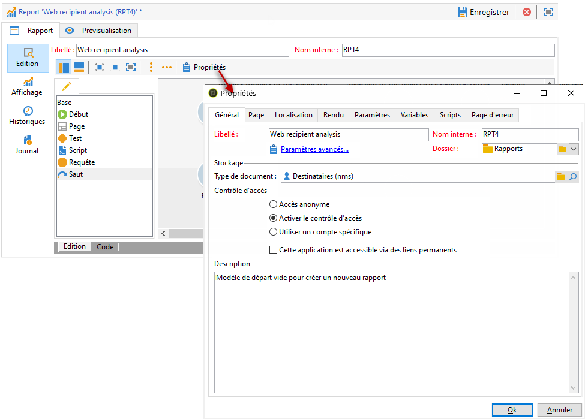
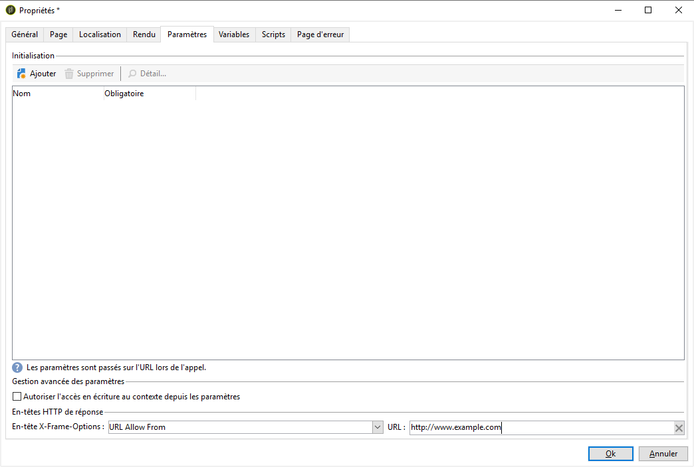

# Propriétés du rapport{#properties-of-the-report}

## Présentation {#overview}

Vous pouvez entièrement personnaliser et paramétrer votre rapport en fonction de vos besoins. Pour cela, éditez ses propriétés. Les propriétés des rapports sont accessibles à partir du bouton Propriété situé au-dessus du diagramme d&#39;enchaînement des activités.

## Propriétés générales {#overall-properties}

L’ **[!UICONTROL General]** onglet permet d’afficher ou de modifier l’étiquette et le schéma concernés par le rapport. Ces éléments sont entrés lors de la création du rapport.

We do not recommend changing the **[!UICONTROL Internal name]** : this is used in the report access URL.

Le modèle de rapport est choisi lors de la création du rapport et ne peut pas être modifié par la suite.

Pour modifier le tableau concerné par le rapport, cliquez sur l’ **[!UICONTROL Select link]** icône à droite du **[!UICONTROL Document type]** champ. Pour afficher les champs disponibles dans le tableau sélectionné, cliquez sur l’ **[!UICONTROL Magnifier]** icône .

## Accessibilité du rapport {#report-accessibility}

Un rapport peut être accessible en dehors de la console Adobe Campaign, par exemple depuis un navigateur Web. Dans ces cas, il peut être nécessaire de paramétrer le contrôle d&#39;accès au rapport comme illustré ci-dessous.

Le principe général est le suivant :

* Cette **[!UICONTROL Anonymous access]** option permet d’accéder sans restriction au rapport. Cependant, aucune manipulation n&#39;est possible.

   Ce sont les droits de l&#39;opérateur des rapports par défaut (&#39;webapp&#39;) qui sont utilisés pour afficher les éléments du rapport.

* The **[!UICONTROL Access control]** option enables Adobe Campaign operators to access it once they are logged on.
* The **[!UICONTROL Specific account]** option lets you execute the report with the rights of the operator selected in the **[!UICONTROL Operator]** field.

Les propriétés d&#39;un formulaire web sont présentés dans [cette page](../../web/using/about-web-forms.md).

## Gérer la localisation du rapport {#managing-report-localization}

Vous pouvez configurer les langues dans lesquelles le rapport doit être traduit. Pour cela, cliquez sur l&#39;onglet **[!UICONTROL Localization]**.

La langue d&#39;édition correspond à la langue dans laquelle vous rédigez. Lorsque vous ajoutez une langue, un sous-onglet apparaît dans la page d&#39;édition du rapport.

>[!NOTE]
>
>Reportez-vous à la section correspondante de [cette section](../../web/using/translating-a-web-form.md) pour plus d&#39;informations.

## Personnaliser le rendu HTML {#personalizing-html-rendering}

In the **[!UICONTROL Rendering]** tab, you can personalize the data display mode for the page. Vous pouvez sélectionner :

* Le moteur de rendu des graphiques : Adobe Campaign propose deux modes distincts pour générer le rendu des graphiques. Par défaut, le moteur de rendu est HTML 5. Au besoin, vous pouvez choisir un rendu Flash.
* Le type de navigation dans le rapport : via des boutons ou des liens.
* La position par défaut des libellés des éléments du rapport. Cette position peut être surchargée au niveau de chaque élément.
* Le modèle, ou thème, utilisé pour la génération des pages du rapport.

Les propriétés d&#39;un formulaire web sont présentés dans [cette page](../../web/using/about-web-forms.md).

## Définir des paramètres supplémentaires {#defining-additional-settings}

The **[!UICONTROL Parameters]** tab lets you create additional settings for the report: these settings will be passed into the URL during the call up.

Les propriétés d&#39;un formulaire web sont présentés dans [cette page](../../web/using/about-web-forms.md).

>[!CAUTION]
>
>Pour des questions de sécurité, ces paramètres doivent être utilisés avec précaution.

Pour créer un nouveau paramètre :

1. Click the **[!UICONTROL Add]** button and enter the name of the setting.

   

1. Au besoin, indiquez si ce paramètre doit être obligatoire.
1. Select the type of setting you want to create: **[!UICONTROL Filter]** or **[!UICONTROL Variable]**.

   The **[!UICONTROL Filter entities]** option lets you use a field of the database as a parameter.

   

   Les données sont directement récupérées au niveau de l&#39;entité : **ctx/recipient/@account**.

   L&#39;option **[!UICONTROL Variable]** permet de créer ou sélectionner une variable qui sera passée en paramètre de l&#39;URL et pourra être utilisée au niveau des filtres.

Cette **[!UICONTROL Response HTTP headers]** option vous permet d’éviter le cliquetis lorsque vous incluez la page de votre rapport dans une page HTML utilisant iframe. Pour éviter de cliquer dessus, vous pouvez choisir le **[!UICONTROL X-Frame-options header]** comportement :

* **[!UICONTROL None]**: Le rapport n&#39;aura pas **[!UICONTROL X-Frame-options header]**.
* **[!UICONTROL Same as origin]**: Défini par défaut pour les nouveaux rapports et les rapports republiés. Le nom d’hôte sera identique à l’URL du rapport.
* **[!UICONTROL Deny]**: Le rapport ne peut pas être inclus dans une page HTML utilisant iframe.

## Ajouter des variables {#adding-variables}

L&#39; **[!UICONTROL Variables]** onglet contient la liste des variables configurées dans le rapport. Ces variables sont exposées dans le contexte du rapport et peuvent être utilisées dans les calculs.

Click the **[!UICONTROL Add]** button to create a new variable.

To view the definition of a variable, select it and click the **[!UICONTROL Detail...]** button.

## Référencer des scripts {#referencing-scripts}

L&#39;onglet **[!UICONTROL Scripts]** permet de référencer des codes JavaScript qui seront exécutés côté client et/ou côté serveur lors de l&#39;appel de la page du rapport.

Les scripts référencés doivent être rédigés en Javascript et compatibles avec la plupart des navigateurs afin d&#39;assurer leur bonne exécution côté client. Voir à ce propos [cette section](../../web/using/web-forms-answers.md).

## Personnaliser la page d&#39;erreur {#personalizing-the-error-page}

The **[!UICONTROL Error page]** tab lets you configure the message that will come up in case of an error in the report display.

Vous pouvez définir des textes et les associer à des identifiants afin de gérer la localisation du rapport. Pour plus d’informations, voir [Ajout d’un en-tête et d’un pied de page](../../reporting/using/element-layout.md#adding-a-header-and-a-footer).

